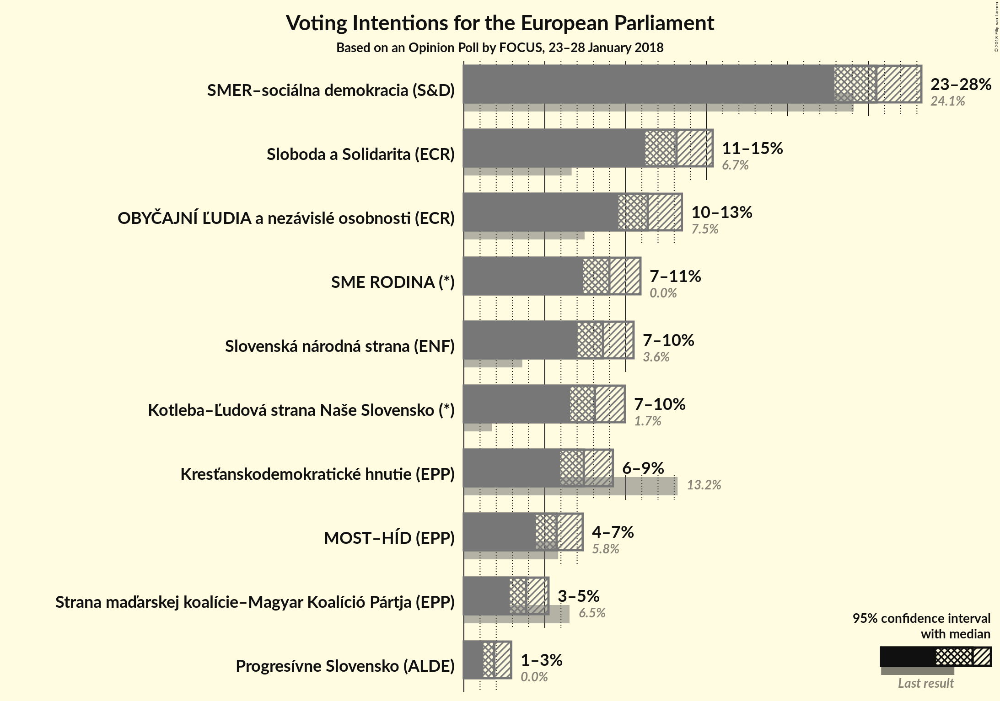
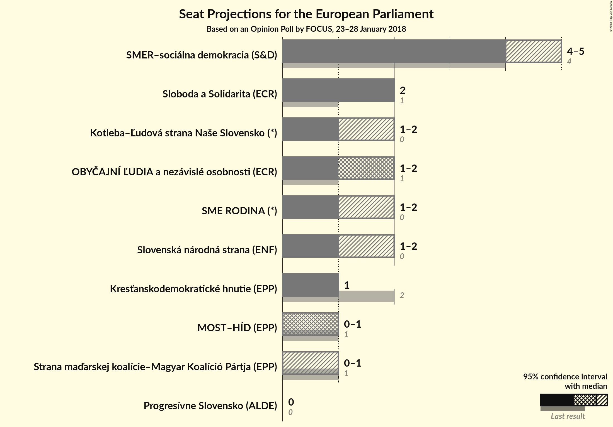
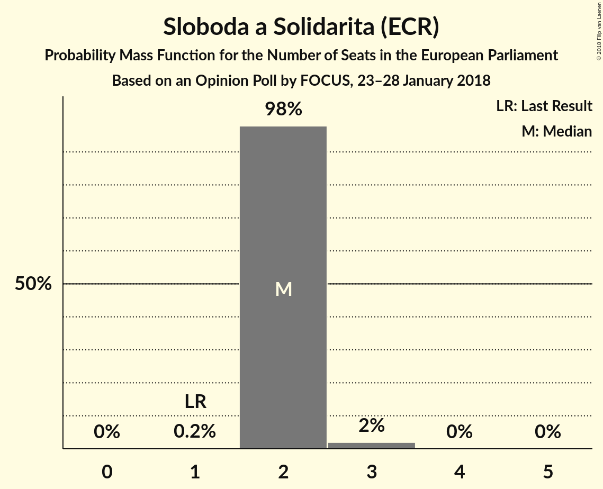
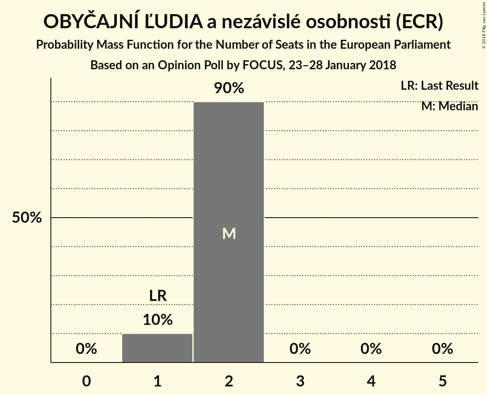
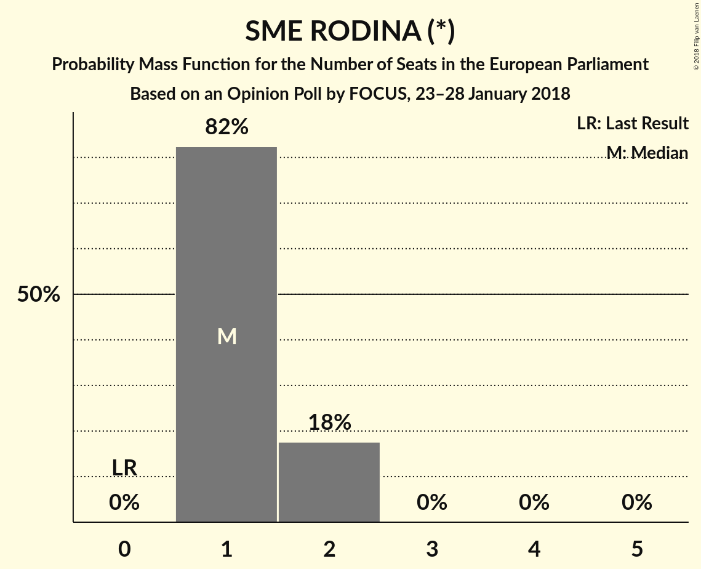
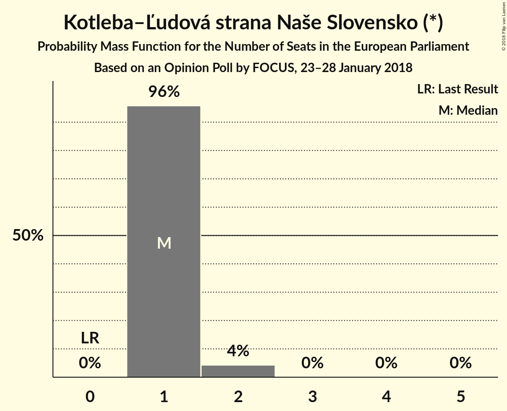
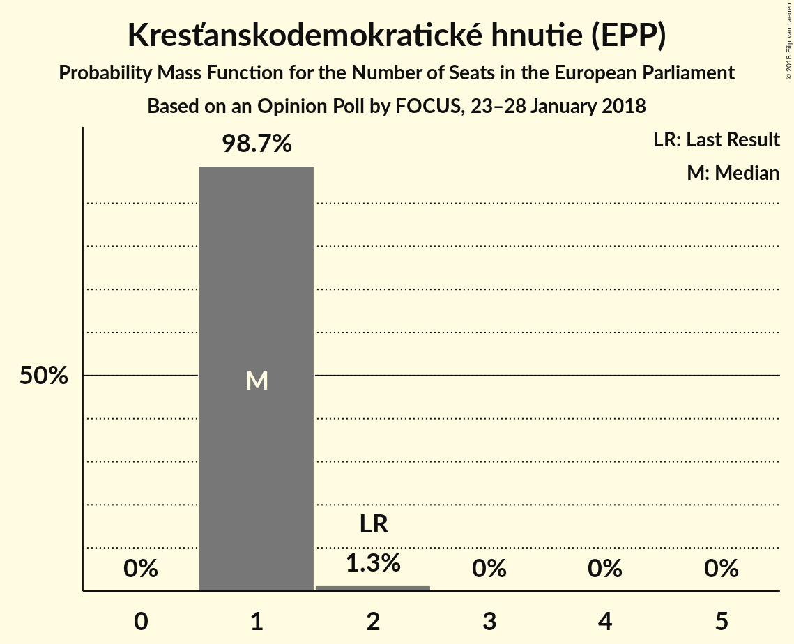
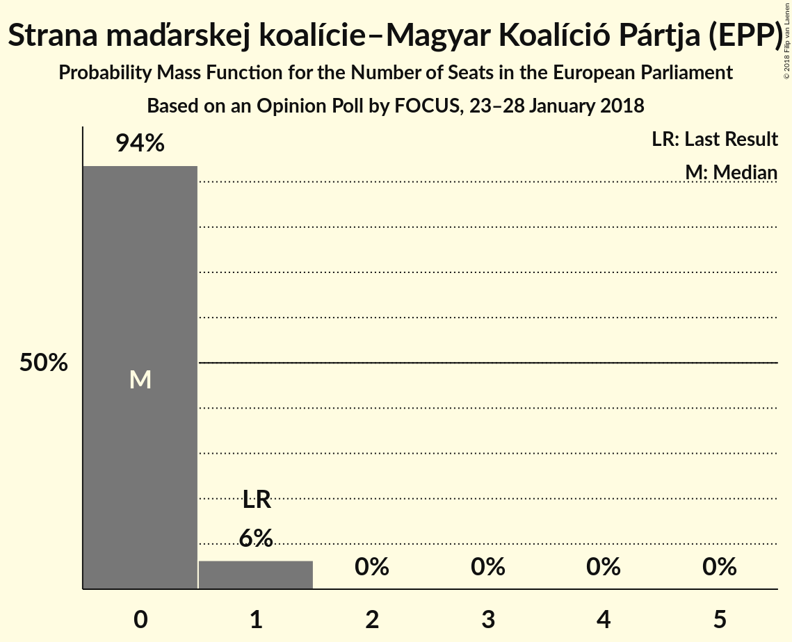

# Opinion Poll by FOCUS, 23–28 January 2018

<a href="#voting-intentions">Voting Intentions</a> | <a href="#seats">Seats</a> | <a href="#coalitions">Coalitions</a> | <a href="#technical-information">Technical Information</a>

## Voting Intentions

### Confidence Intervals

| Party | Last Result | Poll Result | 80% Confidence Interval | 90% Confidence Interval | 95% Confidence Interval | 99% Confidence Interval |
|:-----:|:-----------:|:-----------:|:-----------------------:|:-----------------------:|:-----------------------:|:-----------------------:|
| SMER–sociálna demokracia (S&D) | 24.1% | 25.5% | 23.8–27.3% |23.3–27.8% |22.9–28.3% |22.1–29.2% |
| Sloboda a Solidarita (ECR) | 6.7% | 13.1% | 11.9–14.6% |11.5–15.0% |11.2–15.4% |10.6–16.1% |
| OBYČAJNÍ ĽUDIA a nezávislé osobnosti (ECR) | 7.5% | 11.4% | 10.2–12.7% |9.8–13.1% |9.6–13.5% |9.0–14.2% |
| SME RODINA (*) | 0.0% | 9.0% | 7.9–10.3% |7.6–10.6% |7.4–10.9% |6.9–11.6% |
| Slovenská národná strana (ENF) | 3.6% | 8.6% | 7.6–9.8% |7.3–10.2% |7.0–10.5% |6.6–11.1% |
| Kotleba–Ľudová strana Naše Slovensko (*) | 1.7% | 8.1% | 7.1–9.3% |6.8–9.6% |6.6–10.0% |6.1–10.6% |
| Kresťanskodemokratické hnutie (EPP) | 13.2% | 7.4% | 6.4–8.6% |6.2–8.9% |5.9–9.2% |5.5–9.8% |
| MOST–HÍD (EPP) | 5.8% | 5.7% | 4.9–6.8% |4.6–7.1% |4.5–7.3% |4.1–7.9% |
| Strana maďarskej koalície–Magyar Koalíció Pártja (EPP) | 6.5% | 3.9% | 3.2–4.8% |3.0–5.0% |2.8–5.2% |2.5–5.7% |
| Progresívne Slovensko (ALDE) | 0.0% | 1.9% | 1.4–2.6% |1.3–2.7% |1.2–2.9% |1.0–3.3% |

*Note:* The poll result column reflects the actual value used in the calculations. Published results may vary slightly, and in addition be rounded to fewer digits.

## Seats

### Confidence Intervals

| Party | Last Result | Median | 80% Confidence Interval | 90% Confidence Interval | 95% Confidence Interval | 99% Confidence Interval |
|:-----:|:-----------:|:------:|:-----------------------:|:-----------------------:|:-----------------------:|:-----------------------:|
| <a href="#smer–sociálna-demokracia-(s&d)">SMER–sociálna demokracia (S&D)</a> | 4 | 4 | 4 |4–5 |4–5 |3–5 |
| <a href="#sloboda-a-solidarita-(ecr)">Sloboda a Solidarita (ECR)</a> | 1 | 2 | 2 |2 |2 |2–3 |
| <a href="#obyčajní-ľudia-a-nezávislé-osobnosti-(ecr)">OBYČAJNÍ ĽUDIA a nezávislé osobnosti (ECR)</a> | 1 | 2 | 1–2 |1–2 |1–2 |1–2 |
| <a href="#sme-rodina-(*)">SME RODINA (*)</a> | 0 | 1 | 1–2 |1–2 |1–2 |1–2 |
| <a href="#slovenská-národná-strana-(enf)">Slovenská národná strana (ENF)</a> | 0 | 1 | 1–2 |1–2 |1–2 |1–2 |
| <a href="#kotleba–ľudová-strana-naše-slovensko-(*)">Kotleba–Ľudová strana Naše Slovensko (*)</a> | 0 | 1 | 1 |1 |1–2 |1–2 |
| <a href="#kresťanskodemokratické-hnutie-(epp)">Kresťanskodemokratické hnutie (EPP)</a> | 2 | 1 | 1 |1 |1 |1–2 |
| <a href="#most–híd-(epp)">MOST–HÍD (EPP)</a> | 1 | 1 | 0–1 |0–1 |0–1 |0–1 |
| <a href="#strana-maďarskej-koalície–magyar-koalíció-pártja-(epp)">Strana maďarskej koalície–Magyar Koalíció Pártja (EPP)</a> | 1 | 0 | 0 |0–1 |0–1 |0–1 |
| <a href="#progresívne-slovensko-(alde)">Progresívne Slovensko (ALDE)</a> | 0 | 0 | 0 |0 |0 |0 |

### SMER–sociálna demokracia (S&D)

*For a full overview of the results for this party, see the [SMER–sociálna demokracia (S&D)](party-smer–sociálnademokraciasd.html) page.*

| Number of Seats | Probability | Accumulated | Special Marks |
|:---------------:|:-----------:|:-----------:|:-------------:|
| 3 | 2% | 100% |  |
| 4 | 93% | 98% | Last Result, Median |
| 5 | 5% | 5% |  |
| 6 | 0% | 0% |  |

### Sloboda a Solidarita (ECR)

*For a full overview of the results for this party, see the [Sloboda a Solidarita (ECR)](party-slobodaasolidaritaecr.html) page.*

| Number of Seats | Probability | Accumulated | Special Marks |
|:---------------:|:-----------:|:-----------:|:-------------:|
| 1 | 0.2% | 100% | Last Result |
| 2 | 98% | 99.8% | Median |
| 3 | 2% | 2% |  |
| 4 | 0% | 0% |  |

### OBYČAJNÍ ĽUDIA a nezávislé osobnosti (ECR)

*For a full overview of the results for this party, see the [OBYČAJNÍ ĽUDIA a nezávislé osobnosti (ECR)](party-obyčajníľudiaanezávisléosobnostiecr.html) page.*

| Number of Seats | Probability | Accumulated | Special Marks |
|:---------------:|:-----------:|:-----------:|:-------------:|
| 1 | 10% | 100% | Last Result |
| 2 | 90% | 90% | Median |
| 3 | 0% | 0% |  |

### SME RODINA (*)

*For a full overview of the results for this party, see the [SME RODINA (*)](party-smerodina.html) page.*

| Number of Seats | Probability | Accumulated | Special Marks |
|:---------------:|:-----------:|:-----------:|:-------------:|
| 0 | 0% | 100% | Last Result |
| 1 | 82% | 100% | Median |
| 2 | 18% | 18% |  |
| 3 | 0% | 0% |  |

### Slovenská národná strana (ENF)

*For a full overview of the results for this party, see the [Slovenská národná strana (ENF)](party-slovenskánárodnástranaenf.html) page.*

| Number of Seats | Probability | Accumulated | Special Marks |
|:---------------:|:-----------:|:-----------:|:-------------:|
| 0 | 0% | 100% | Last Result |
| 1 | 86% | 100% | Median |
| 2 | 14% | 14% |  |
| 3 | 0% | 0% |  |

### Kotleba–Ľudová strana Naše Slovensko (*)

*For a full overview of the results for this party, see the [Kotleba–Ľudová strana Naše Slovensko (*)](party-kotleba–ľudovástrananašeslovensko.html) page.*

| Number of Seats | Probability | Accumulated | Special Marks |
|:---------------:|:-----------:|:-----------:|:-------------:|
| 0 | 0% | 100% | Last Result |
| 1 | 96% | 100% | Median |
| 2 | 4% | 4% |  |
| 3 | 0% | 0% |  |

### Kresťanskodemokratické hnutie (EPP)

*For a full overview of the results for this party, see the [Kresťanskodemokratické hnutie (EPP)](party-kresťanskodemokratickéhnutieepp.html) page.*

| Number of Seats | Probability | Accumulated | Special Marks |
|:---------------:|:-----------:|:-----------:|:-------------:|
| 1 | 98.7% | 100% | Median |
| 2 | 1.3% | 1.3% | Last Result |
| 3 | 0% | 0% |  |

### MOST–HÍD (EPP)

*For a full overview of the results for this party, see the [MOST–HÍD (EPP)](party-most–hídepp.html) page.*

| Number of Seats | Probability | Accumulated | Special Marks |
|:---------------:|:-----------:|:-----------:|:-------------:|
| 0 | 13% | 100% |  |
| 1 | 87% | 87% | Last Result, Median |
| 2 | 0% | 0% |  |

### Strana maďarskej koalície–Magyar Koalíció Pártja (EPP)

*For a full overview of the results for this party, see the [Strana maďarskej koalície–Magyar Koalíció Pártja (EPP)](party-stranamaďarskejkoalície–magyarkoalíciópártjaepp.html) page.*

| Number of Seats | Probability | Accumulated | Special Marks |
|:---------------:|:-----------:|:-----------:|:-------------:|
| 0 | 94% | 100% | Median |
| 1 | 6% | 6% | Last Result |
| 2 | 0% | 0% |  |

### Progresívne Slovensko (ALDE)

*For a full overview of the results for this party, see the [Progresívne Slovensko (ALDE)](party-progresívneslovenskoalde.html) page.*

| Number of Seats | Probability | Accumulated | Special Marks |
|:---------------:|:-----------:|:-----------:|:-------------:|
| 0 | 100% | 100% | Last Result, Median |

## Coalitions

### Confidence Intervals

| Coalition | Last Result | Median | Majority? | 80% Confidence Interval | 90% Confidence Interval | 95% Confidence Interval | 99% Confidence Interval |
|:---------:|:-----------:|:------:|:---------:|:-----------------------:|:-----------------------:|:-----------------------:|:-----------------------:|
| SMER–sociálna demokracia (S&D) | 4 | 4 | 0% | 4 | 4–5 | 4–5 | 3–5 |
| Kresťanskodemokratické hnutie (EPP) – MOST–HÍD (EPP) – Strana maďarskej koalície–Magyar Koalíció Pártja (EPP) | 4 | 2 | 0% | 1–2 | 1–3 | 1–3 | 1–3 |
| Slovenská národná strana (ENF) | 0 | 1 | 0% | 1–2 | 1–2 | 1–2 | 1–2 |
| Progresívne Slovensko (ALDE) | 0 | 0 | 0% | 0 | 0 | 0 | 0 |

### SMER–sociálna demokracia (S&D)

| Number of Seats | Probability | Accumulated | Special Marks |
|:---------------:|:-----------:|:-----------:|:-------------:|
| 3 | 2% | 100% |  |
| 4 | 93% | 98% | Last Result, Median |
| 5 | 5% | 5% |  |
| 6 | 0% | 0% |  |

### Kresťanskodemokratické hnutie (EPP) – MOST–HÍD (EPP) – Strana maďarskej koalície–Magyar Koalíció Pártja (EPP)

| Number of Seats | Probability | Accumulated | Special Marks |
|:---------------:|:-----------:|:-----------:|:-------------:|
| 1 | 12% | 100% |  |
| 2 | 81% | 88% | Median |
| 3 | 7% | 7% |  |
| 4 | 0% | 0% | Last Result |

### Slovenská národná strana (ENF)

| Number of Seats | Probability | Accumulated | Special Marks |
|:---------------:|:-----------:|:-----------:|:-------------:|
| 0 | 0% | 100% | Last Result |
| 1 | 86% | 100% | Median |
| 2 | 14% | 14% |  |
| 3 | 0% | 0% |  |

### Progresívne Slovensko (ALDE)

| Number of Seats | Probability | Accumulated | Special Marks |
|:---------------:|:-----------:|:-----------:|:-------------:|
| 0 | 100% | 100% | Last Result, Median |

## Technical Information

### Opinion Poll

+ **Polling firm:** FOCUS
+ **Commissioner(s):** —
+ **Fieldwork period:** 23–28 January 2018

### Calculations

+ **Sample size:** 1012
+ **Simulations done:** 1,048,576
+ **Error estimate:** 2.12%

