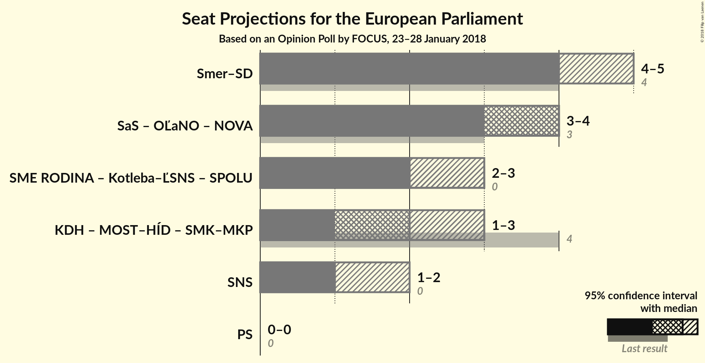

# Opinion Poll by FOCUS, 23–28 January 2018

<a href="#voting-intentions">Voting Intentions</a> | <a href="#seats">Seats</a> | <a href="#coalitions">Coalitions</a> | <a href="#technical-information">Technical Information</a>

## Voting Intentions

### Confidence Intervals

| Party | Last Result | Poll Result | 80% Confidence Interval | 90% Confidence Interval | 95% Confidence Interval | 99% Confidence Interval |
|:-----:|:-----------:|:-----------:|:-----------------------:|:-----------------------:|:-----------------------:|:-----------------------:|
| SMER–sociálna demokracia (S&D) | 24.1% | 25.5% | N/A |N/A |N/A |N/A |
| Sloboda a Solidarita (ALDE) | 6.7% | 13.1% | N/A |N/A |N/A |N/A |
| OBYČAJNÍ ĽUDIA a nezávislé osobnosti (ECR) | 7.5% | 11.4% | N/A |N/A |N/A |N/A |
| SME RODINA (—) | 0.0% | 9.0% | N/A |N/A |N/A |N/A |
| Slovenská národná strana (EFDD) | 3.6% | 8.6% | N/A |N/A |N/A |N/A |
| Kotleba–Ľudová strana Naše Slovensko (—) | 1.7% | 8.1% | N/A |N/A |N/A |N/A |
| Kresťanskodemokratické hnutie (EPP) | 13.2% | 7.4% | N/A |N/A |N/A |N/A |
| MOST–HÍD (EPP) | 5.8% | 5.7% | N/A |N/A |N/A |N/A |
| Strana maďarskej koalície–Magyar Koalíció Pártja (EPP) | 6.5% | 3.9% | N/A |N/A |N/A |N/A |
| Progresívne Slovensko (—) | 0.0% | 1.9% | N/A |N/A |N/A |N/A |

*Note:* The poll result column reflects the actual value used in the calculations. Published results may vary slightly, and in addition be rounded to fewer digits.

## Seats

### Confidence Intervals

| Party | Last Result | Median | 80% Confidence Interval | 90% Confidence Interval | 95% Confidence Interval | 99% Confidence Interval |
|:-----:|:-----------:|:------:|:-----------------------:|:-----------------------:|:-----------------------:|:-----------------------:|
| <a href="#smer–sociálna-demokracia-(s&d)">SMER–sociálna demokracia (S&D)</a> | 4 | N/A | N/A |N/A |N/A |N/A |
| <a href="#sloboda-a-solidarita-(alde)">Sloboda a Solidarita (ALDE)</a> | 1 | N/A | N/A |N/A |N/A |N/A |
| <a href="#obyČajnÍ-Ľudia-a-nezávislé-osobnosti-(ecr)">OBYČAJNÍ ĽUDIA a nezávislé osobnosti (ECR)</a> | 1 | N/A | N/A |N/A |N/A |N/A |
| <a href="#sme-rodina-(—)">SME RODINA (—)</a> | 0 | N/A | N/A |N/A |N/A |N/A |
| <a href="#slovenská-národná-strana-(efdd)">Slovenská národná strana (EFDD)</a> | 0 | N/A | N/A |N/A |N/A |N/A |
| <a href="#kotleba–Ľudová-strana-naše-slovensko-(—)">Kotleba–Ľudová strana Naše Slovensko (—)</a> | 0 | N/A | N/A |N/A |N/A |N/A |
| <a href="#kresťanskodemokratické-hnutie-(epp)">Kresťanskodemokratické hnutie (EPP)</a> | 2 | N/A | N/A |N/A |N/A |N/A |
| <a href="#most–hÍd-(epp)">MOST–HÍD (EPP)</a> | 1 | N/A | N/A |N/A |N/A |N/A |
| <a href="#strana-maďarskej-koalície–magyar-koalíció-pártja-(epp)">Strana maďarskej koalície–Magyar Koalíció Pártja (EPP)</a> | 1 | N/A | N/A |N/A |N/A |N/A |
| <a href="#progresívne-slovensko-(—)">Progresívne Slovensko (—)</a> | 0 | N/A | N/A |N/A |N/A |N/A |

## Coalitions

## Technical Information

### Opinion Poll

+ **Polling firm:** FOCUS
+ **Commissioner(s):** —
+ **Fieldwork period:** 23–28 January 2018

### Calculations

+ **Sample size:** 1012
+ **Simulations done:** 0
+ **Error estimate:** 100.00%

