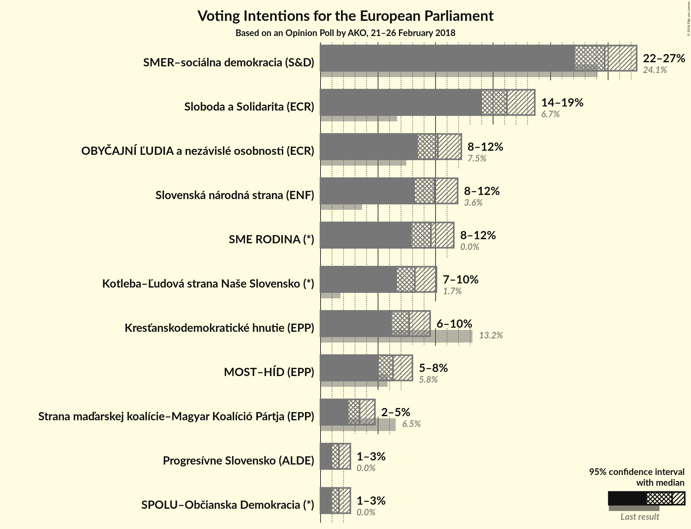
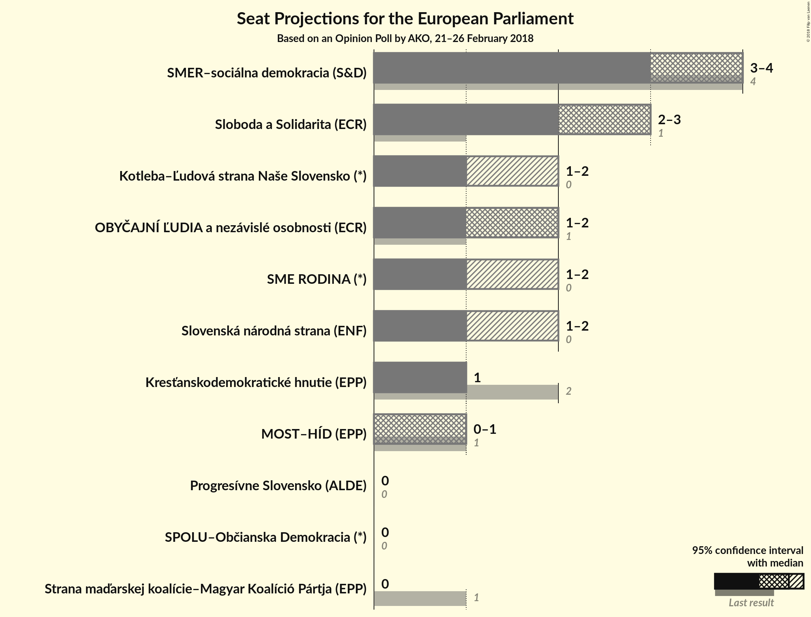
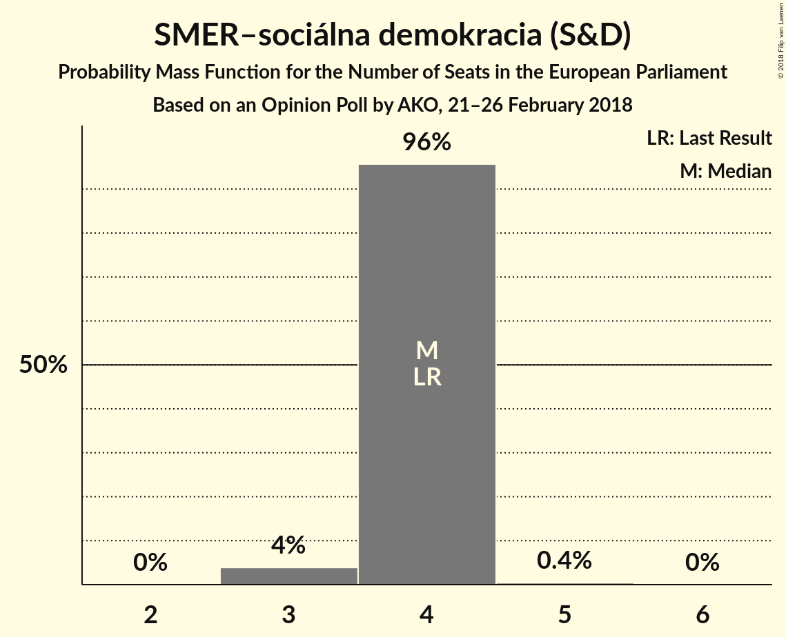
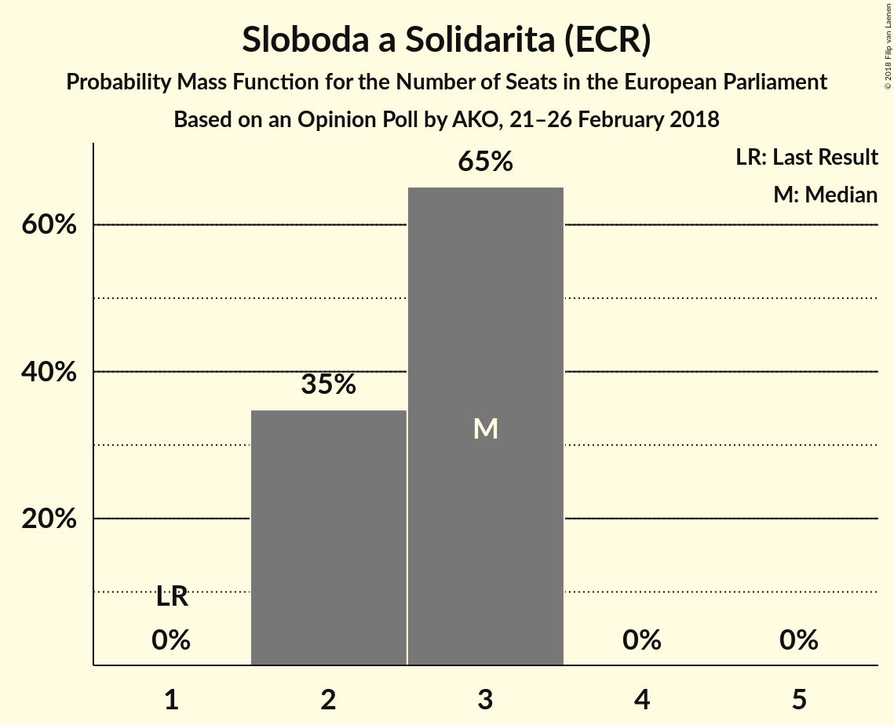
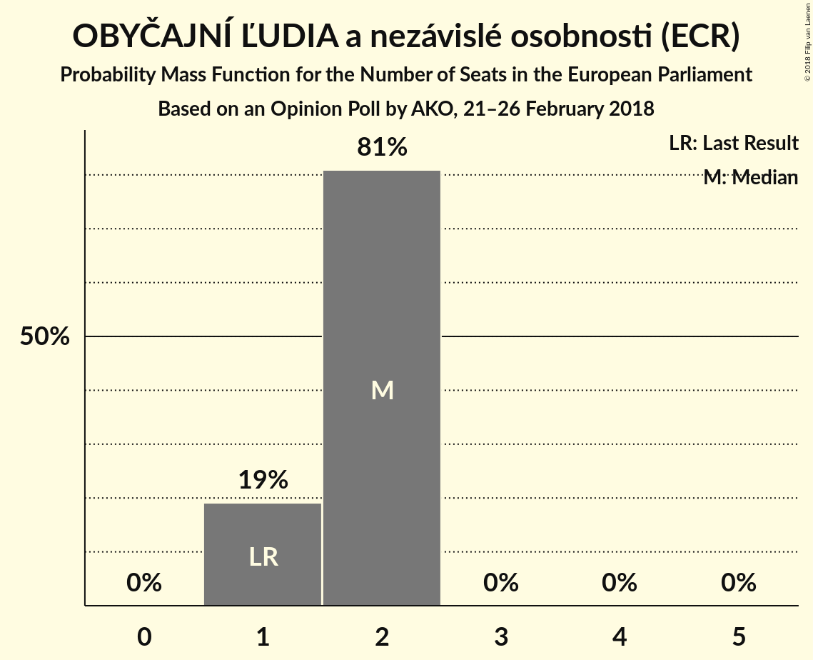
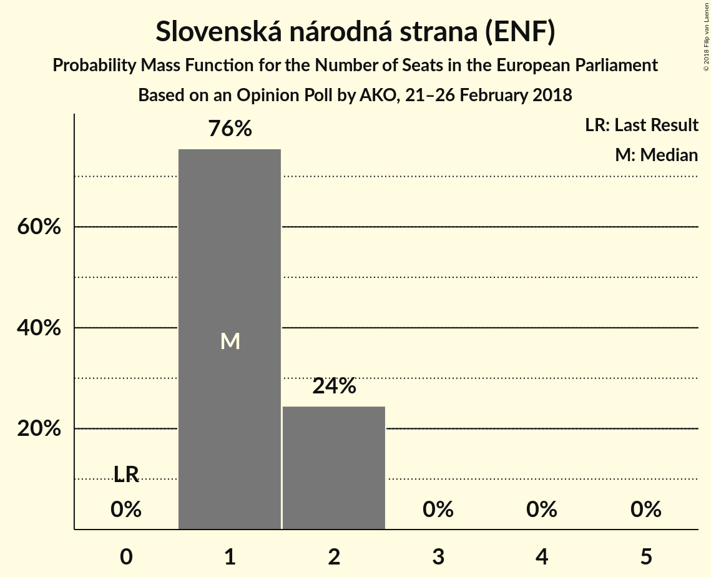
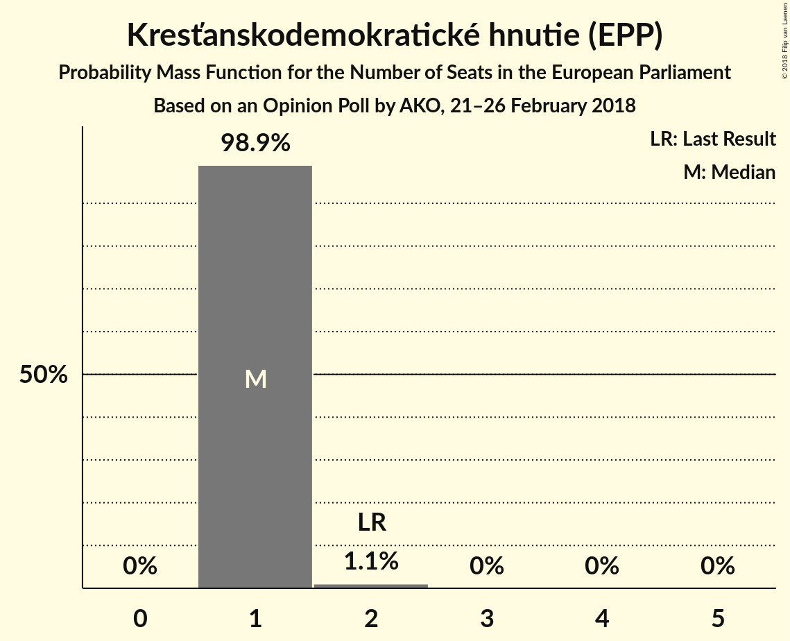
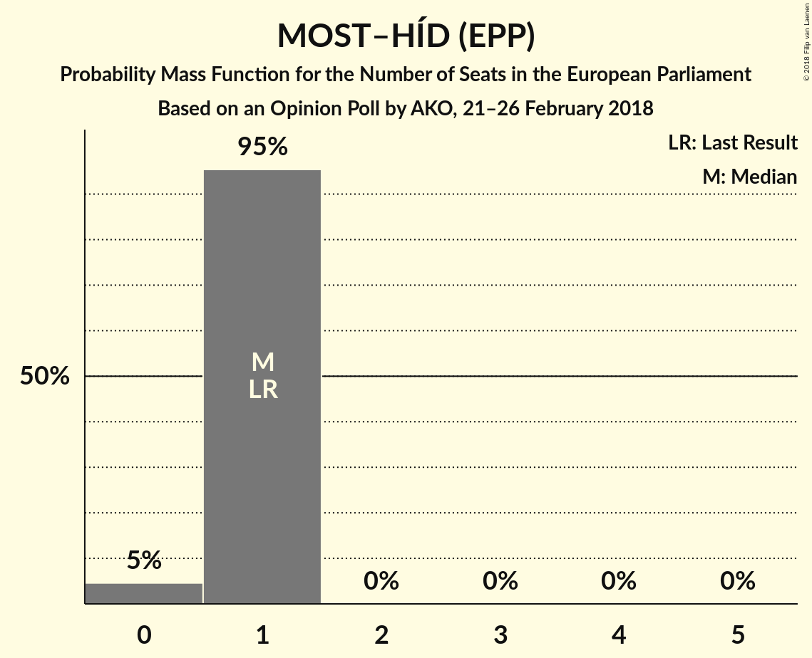
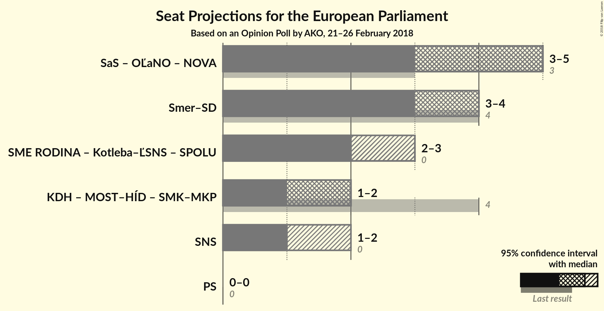

# Opinion Poll by AKO, 21–26 February 2018

<a href="#voting-intentions">Voting Intentions</a> | <a href="#seats">Seats</a> | <a href="#coalitions">Coalitions</a> | <a href="#technical-information">Technical Information</a>

## Voting Intentions

### Confidence Intervals

| Party | Last Result | Poll Result | 80% Confidence Interval | 90% Confidence Interval | 95% Confidence Interval | 99% Confidence Interval |
|:-----:|:-----------:|:-----------:|:-----------------------:|:-----------------------:|:-----------------------:|:-----------------------:|
| SMER–sociálna demokracia (S&D) | 24.1% | 24.7% | 23.0–26.5% |22.5–27.0% |22.1–27.5% |21.3–28.3% |
| Sloboda a Solidarita (ECR) | 6.7% | 16.2% | 14.8–17.8% |14.4–18.2% |14.0–18.6% |13.4–19.4% |
| OBYČAJNÍ ĽUDIA a nezávislé osobnosti (ECR) | 7.5% | 10.2% | 9.1–11.5% |8.7–11.9% |8.5–12.2% |8.0–12.9% |
| Slovenská národná strana (ENF) | 3.6% | 9.9% | 8.8–11.2% |8.5–11.6% |8.2–11.9% |7.7–12.6% |
| SME RODINA (*) | 0.0% | 9.6% | 8.5–10.9% |8.2–11.3% |7.9–11.6% |7.4–12.2% |
| Kotleba–Ľudová strana Naše Slovensko (*) | 1.7% | 8.2% | 7.2–9.4% |6.9–9.8% |6.6–10.1% |6.2–10.7% |
| Kresťanskodemokratické hnutie (EPP) | 13.2% | 7.7% | 6.7–8.9% |6.4–9.2% |6.2–9.5% |5.8–10.1% |
| MOST–HÍD (EPP) | 5.8% | 6.3% | 5.4–7.4% |5.2–7.7% |5.0–8.0% |4.6–8.5% |
| Strana maďarskej koalície–Magyar Koalíció Pártja (EPP) | 6.5% | 3.4% | 2.8–4.3% |2.6–4.5% |2.4–4.7% |2.2–5.2% |
| Progresívne Slovensko (ALDE) | 0.0% | 1.6% | 1.2–2.2% |1.1–2.4% |1.0–2.6% |0.8–2.9% |
| SPOLU–Občianska Demokracia (*) | 0.0% | 1.6% | N/A |N/A |N/A |N/A |

*Note:* The poll result column reflects the actual value used in the calculations. Published results may vary slightly, and in addition be rounded to fewer digits.

## Seats

### Confidence Intervals

| Party | Last Result | Median | 80% Confidence Interval | 90% Confidence Interval | 95% Confidence Interval | 99% Confidence Interval |
|:-----:|:-----------:|:------:|:-----------------------:|:-----------------------:|:-----------------------:|:-----------------------:|
| <a href="#smer–sociálna-demokracia-(s&d)">SMER–sociálna demokracia (S&D)</a> | 4 | 4 | 4 |3–4 |3–4 |3–5 |
| <a href="#sloboda-a-solidarita-(ecr)">Sloboda a Solidarita (ECR)</a> | 1 | 2 | 2–3 |2–3 |2–3 |2–3 |
| <a href="#obyČajnÍ-Ľudia-a-nezávislé-osobnosti-(ecr)">OBYČAJNÍ ĽUDIA a nezávislé osobnosti (ECR)</a> | 1 | 2 | 1–2 |1–2 |1–2 |1–2 |
| <a href="#slovenská-národná-strana-(enf)">Slovenská národná strana (ENF)</a> | 0 | 1 | 1–2 |1–2 |1–2 |1–2 |
| <a href="#sme-rodina-(*)">SME RODINA (*)</a> | 0 | 1 | 1–2 |1–2 |1–2 |1–2 |
| <a href="#kotleba–Ľudová-strana-naše-slovensko-(*)">Kotleba–Ľudová strana Naše Slovensko (*)</a> | 0 | 1 | 1 |1–2 |1–2 |1–2 |
| <a href="#kresťanskodemokratické-hnutie-(epp)">Kresťanskodemokratické hnutie (EPP)</a> | 2 | 1 | 1 |1 |1 |1–2 |
| <a href="#most–hÍd-(epp)">MOST–HÍD (EPP)</a> | 1 | 1 | 1 |1 |0–1 |0–1 |
| <a href="#strana-maďarskej-koalície–magyar-koalíció-pártja-(epp)">Strana maďarskej koalície–Magyar Koalíció Pártja (EPP)</a> | 1 | 0 | 0 |0 |0 |0 |
| <a href="#progresívne-slovensko-(alde)">Progresívne Slovensko (ALDE)</a> | 0 | 0 | 0 |0 |0 |0 |
| <a href="#spolu–občianska-demokracia-(*)">SPOLU–Občianska Demokracia (*)</a> | 0 | N/A | N/A |N/A |N/A |N/A |

### SMER–sociálna demokracia (S&D)

*For a full overview of the results for this party, see the [SMER–sociálna demokracia (S&D)](party-smer–sociálnademokraciasd.html) page.*

| Number of Seats | Probability | Accumulated | Special Marks |
|:---------------:|:-----------:|:-----------:|:-------------:|
| 3 | 6% | 100% |  |
| 4 | 93% | 94% | Last Result, Median |
| 5 | 0.5% | 0.5% |  |
| 6 | 0% | 0% |  |

### Sloboda a Solidarita (ECR)

*For a full overview of the results for this party, see the [Sloboda a Solidarita (ECR)](party-slobodaasolidaritaecr.html) page.*

| Number of Seats | Probability | Accumulated | Special Marks |
|:---------------:|:-----------:|:-----------:|:-------------:|
| 1 | 0% | 100% | Last Result |
| 2 | 57% | 100% | Median |
| 3 | 43% | 43% |  |
| 4 | 0% | 0% |  |

### OBYČAJNÍ ĽUDIA a nezávislé osobnosti (ECR)

*For a full overview of the results for this party, see the [OBYČAJNÍ ĽUDIA a nezávislé osobnosti (ECR)](party-obyČajnÍĽudiaanezávisléosobnostiecr.html) page.*

| Number of Seats | Probability | Accumulated | Special Marks |
|:---------------:|:-----------:|:-----------:|:-------------:|
| 1 | 33% | 100% | Last Result |
| 2 | 67% | 67% | Median |
| 3 | 0% | 0% |  |

### Slovenská národná strana (ENF)

*For a full overview of the results for this party, see the [Slovenská národná strana (ENF)](party-slovenskánárodnástranaenf.html) page.*

| Number of Seats | Probability | Accumulated | Special Marks |
|:---------------:|:-----------:|:-----------:|:-------------:|
| 0 | 0% | 100% | Last Result |
| 1 | 52% | 100% | Median |
| 2 | 48% | 48% |  |
| 3 | 0% | 0% |  |

### SME RODINA (*)

*For a full overview of the results for this party, see the [SME RODINA (*)](party-smerodina.html) page.*

| Number of Seats | Probability | Accumulated | Special Marks |
|:---------------:|:-----------:|:-----------:|:-------------:|
| 0 | 0% | 100% | Last Result |
| 1 | 55% | 100% | Median |
| 2 | 45% | 45% |  |
| 3 | 0% | 0% |  |

### Kotleba–Ľudová strana Naše Slovensko (*)

*For a full overview of the results for this party, see the [Kotleba–Ľudová strana Naše Slovensko (*)](party-kotleba–Ľudovástrananašeslovensko.html) page.*

| Number of Seats | Probability | Accumulated | Special Marks |
|:---------------:|:-----------:|:-----------:|:-------------:|
| 0 | 0% | 100% | Last Result |
| 1 | 94% | 100% | Median |
| 2 | 6% | 6% |  |
| 3 | 0% | 0% |  |

### Kresťanskodemokratické hnutie (EPP)

*For a full overview of the results for this party, see the [Kresťanskodemokratické hnutie (EPP)](party-kresťanskodemokratickéhnutieepp.html) page.*

| Number of Seats | Probability | Accumulated | Special Marks |
|:---------------:|:-----------:|:-----------:|:-------------:|
| 1 | 98.8% | 100% | Median |
| 2 | 1.1% | 1.1% | Last Result |
| 3 | 0% | 0% |  |

### MOST–HÍD (EPP)

*For a full overview of the results for this party, see the [MOST–HÍD (EPP)](party-most–hÍdepp.html) page.*

| Number of Seats | Probability | Accumulated | Special Marks |
|:---------------:|:-----------:|:-----------:|:-------------:|
| 0 | 4% | 100% |  |
| 1 | 96% | 96% | Last Result, Median |
| 2 | 0% | 0% |  |

### Strana maďarskej koalície–Magyar Koalíció Pártja (EPP)

*For a full overview of the results for this party, see the [Strana maďarskej koalície–Magyar Koalíció Pártja (EPP)](party-stranamaďarskejkoalície–magyarkoalíciópártjaepp.html) page.*

| Number of Seats | Probability | Accumulated | Special Marks |
|:---------------:|:-----------:|:-----------:|:-------------:|
| 0 | 99.7% | 100% | Median |
| 1 | 0.3% | 0.3% | Last Result |
| 2 | 0% | 0% |  |

### Progresívne Slovensko (ALDE)

*For a full overview of the results for this party, see the [Progresívne Slovensko (ALDE)](party-progresívneslovenskoalde.html) page.*

| Number of Seats | Probability | Accumulated | Special Marks |
|:---------------:|:-----------:|:-----------:|:-------------:|
| 0 | 100% | 100% | Last Result, Median |

## Coalitions

### Confidence Intervals

| Coalition | Last Result | Median | Majority? | 80% Confidence Interval | 90% Confidence Interval | 95% Confidence Interval | 99% Confidence Interval |
|:---------:|:-----------:|:------:|:---------:|:-----------------------:|:-----------------------:|:-----------------------:|:-----------------------:|
| SMER–sociálna demokracia (S&D) | 4 | 4 | 0% | 4 | 3–4 | 3–4 | 3–5 |
| SME RODINA (*) – Kotleba–Ľudová strana Naše Slovensko (*) | 0 | 2 | 0% | 2–3 | 2–3 | 2–3 | 2–4 |
| Kresťanskodemokratické hnutie (EPP) – MOST–HÍD (EPP) – Strana maďarskej koalície–Magyar Koalíció Pártja (EPP) | 4 | 2 | 0% | 2 | 2 | 1–2 | 1–3 |
| Slovenská národná strana (ENF) | 0 | 1 | 0% | 1–2 | 1–2 | 1–2 | 1–2 |
| Progresívne Slovensko (ALDE) | 0 | 0 | 0% | 0 | 0 | 0 | 0 |

### SMER–sociálna demokracia (S&D)

| Number of Seats | Probability | Accumulated | Special Marks |
|:---------------:|:-----------:|:-----------:|:-------------:|
| 3 | 6% | 100% |  |
| 4 | 93% | 94% | Last Result, Median |
| 5 | 0.5% | 0.5% |  |
| 6 | 0% | 0% |  |

### SME RODINA (*) – Kotleba–Ľudová strana Naše Slovensko (*)

| Number of Seats | Probability | Accumulated | Special Marks |
|:---------------:|:-----------:|:-----------:|:-------------:|
| 0 | 0% | 100% | Last Result |
| 1 | 0% | 100% |  |
| 2 | 52% | 100% | Median |
| 3 | 46% | 48% |  |
| 4 | 2% | 2% |  |
| 5 | 0% | 0% |  |

### Kresťanskodemokratické hnutie (EPP) – MOST–HÍD (EPP) – Strana maďarskej koalície–Magyar Koalíció Pártja (EPP)

| Number of Seats | Probability | Accumulated | Special Marks |
|:---------------:|:-----------:|:-----------:|:-------------:|
| 1 | 4% | 100% |  |
| 2 | 95% | 96% | Median |
| 3 | 1.4% | 1.4% |  |
| 4 | 0% | 0% | Last Result |

### Slovenská národná strana (ENF)

| Number of Seats | Probability | Accumulated | Special Marks |
|:---------------:|:-----------:|:-----------:|:-------------:|
| 0 | 0% | 100% | Last Result |
| 1 | 52% | 100% | Median |
| 2 | 48% | 48% |  |
| 3 | 0% | 0% |  |

### Progresívne Slovensko (ALDE)

| Number of Seats | Probability | Accumulated | Special Marks |
|:---------------:|:-----------:|:-----------:|:-------------:|
| 0 | 100% | 100% | Last Result, Median |

## Technical Information

### Opinion Poll

+ **Polling firm:** AKO
+ **Commissioner(s):** —
+ **Fieldwork period:** 21–26 February 2018

### Calculations

+ **Sample size:** 1000
+ **Simulations done:** 0
+ **Error estimate:** 100.00%

