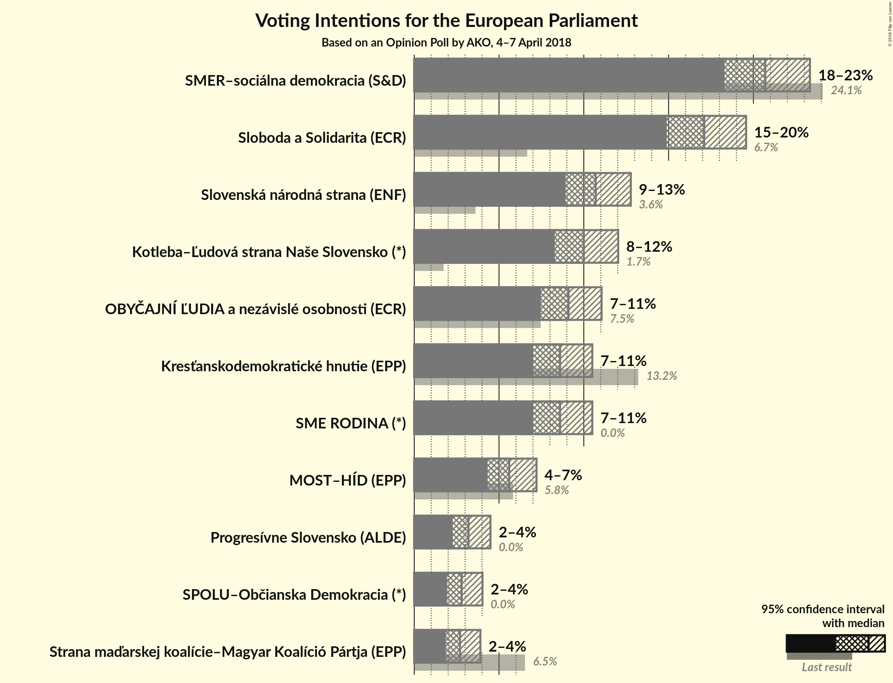
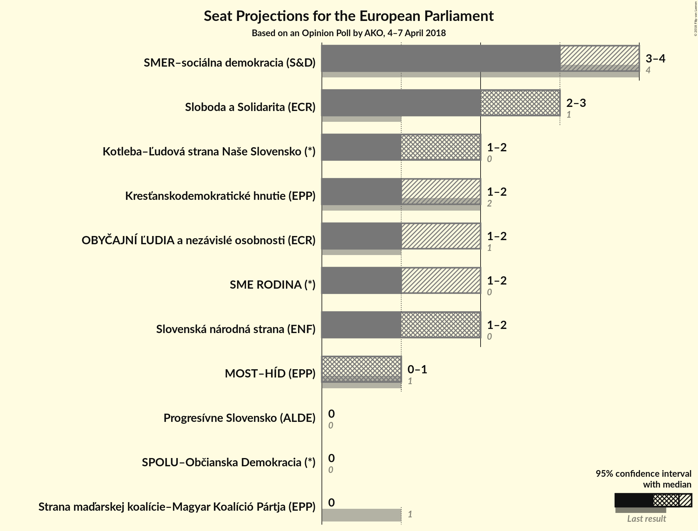
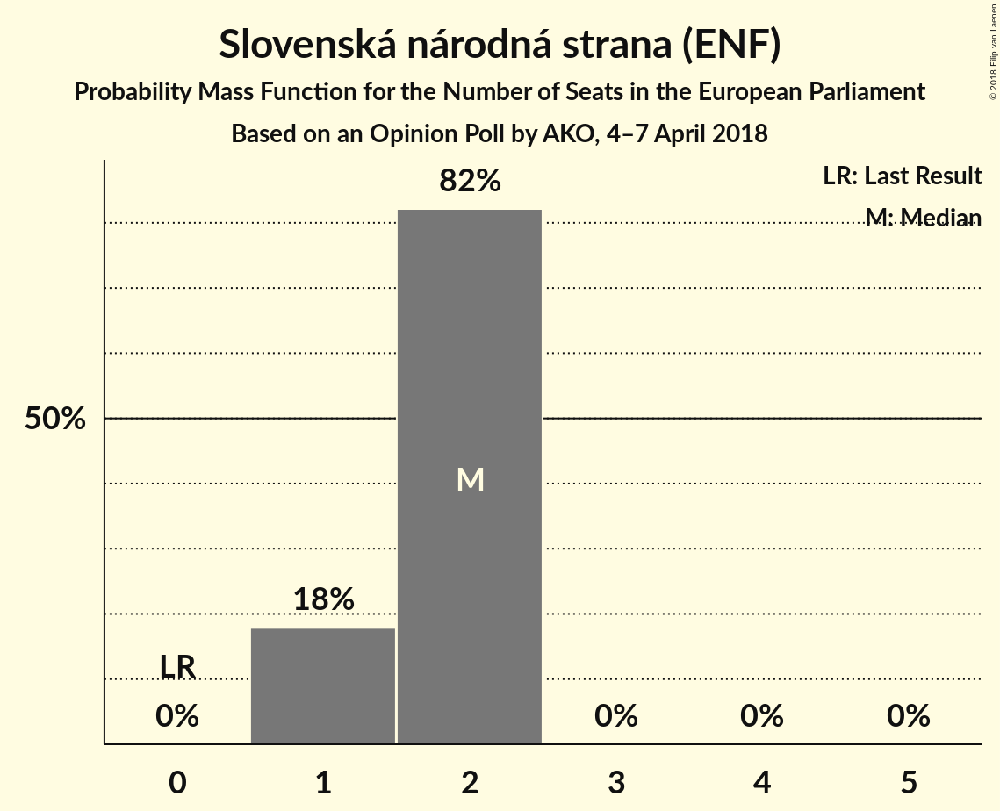
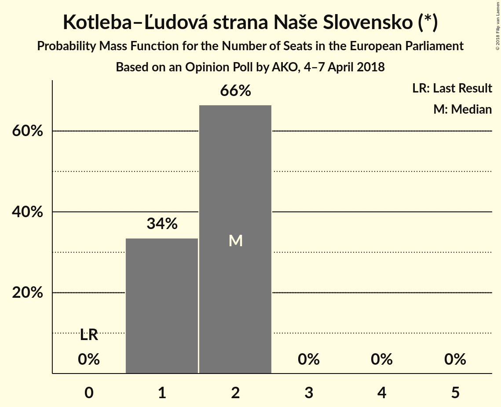
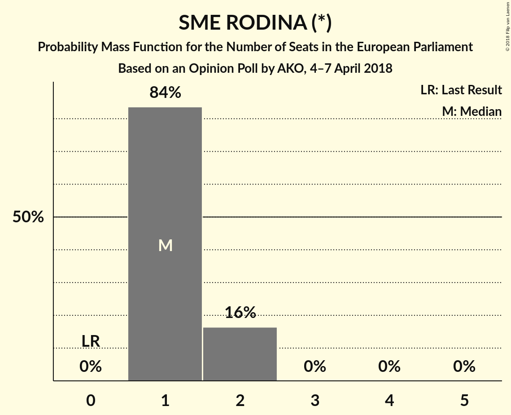
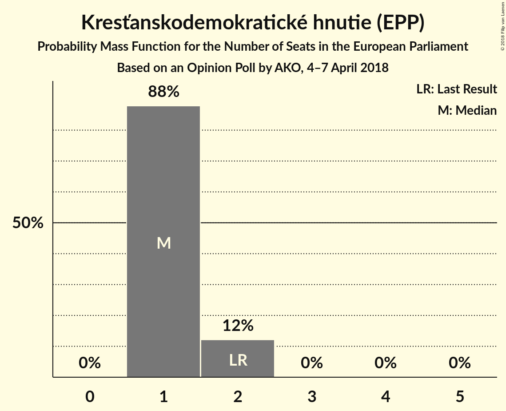

# Opinion Poll by AKO, 4–7 April 2018

<a href="#voting-intentions">Voting Intentions</a> | <a href="#seats">Seats</a> | <a href="#coalitions">Coalitions</a> | <a href="#technical-information">Technical Information</a>

## Voting Intentions

### Confidence Intervals

| Party | Last Result | Poll Result | 80% Confidence Interval | 90% Confidence Interval | 95% Confidence Interval | 99% Confidence Interval |
|:-----:|:-----------:|:-----------:|:-----------------------:|:-----------------------:|:-----------------------:|:-----------------------:|
| SMER–sociálna demokracia (S&D) | 24.1% | 20.7% | 19.1–22.4% |18.7–22.9% |18.3–23.3% |17.6–24.2% |
| Sloboda a Solidarita (ECR) | 6.7% | 17.1% | 15.7–18.7% |15.2–19.2% |14.9–19.6% |14.2–20.4% |
| Slovenská národná strana (ENF) | 3.6% | 10.7% | 9.5–12.1% |9.2–12.4% |8.9–12.8% |8.4–13.4% |
| Kotleba–Ľudová strana Naše Slovensko (*) | 1.7% | 10.0% | 8.9–11.3% |8.6–11.7% |8.3–12.0% |7.8–12.7% |
| OBYČAJNÍ ĽUDIA a nezávislé osobnosti (ECR) | 7.5% | 9.1% | 8.0–10.4% |7.7–10.7% |7.5–11.1% |7.0–11.7% |
| SME RODINA (*) | 0.0% | 8.6% | 7.6–9.8% |7.3–10.2% |7.0–10.5% |6.5–11.1% |
| Kresťanskodemokratické hnutie (EPP) | 13.2% | 8.6% | 7.6–9.8% |7.3–10.2% |7.0–10.5% |6.5–11.1% |
| MOST–HÍD (EPP) | 5.8% | 5.6% | 4.8–6.6% |4.5–7.0% |4.3–7.2% |4.0–7.7% |
| Progresívne Slovensko (ALDE) | 0.0% | 3.2% | 2.6–4.0% |2.4–4.3% |2.3–4.5% |2.0–4.9% |
| Strana maďarskej koalície–Magyar Koalíció Pártja (EPP) | 6.5% | 2.7% | 2.1–3.5% |2.0–3.7% |1.9–3.9% |1.6–4.3% |

*Note:* The poll result column reflects the actual value used in the calculations. Published results may vary slightly, and in addition be rounded to fewer digits.

## Seats

### Confidence Intervals

| Party | Last Result | Median | 80% Confidence Interval | 90% Confidence Interval | 95% Confidence Interval | 99% Confidence Interval |
|:-----:|:-----------:|:------:|:-----------------------:|:-----------------------:|:-----------------------:|:-----------------------:|
| <a href="#smer–sociálna-demokracia-(s&d)">SMER–sociálna demokracia (S&D)</a> | 4 | 3 | 3–4 |3–4 |3–4 |3–4 |
| <a href="#sloboda-a-solidarita-(ecr)">Sloboda a Solidarita (ECR)</a> | 1 | 3 | 2–3 |2–3 |2–3 |2–3 |
| <a href="#slovenská-národná-strana-(enf)">Slovenská národná strana (ENF)</a> | 0 | 2 | 2 |2 |1–2 |1–2 |
| <a href="#kotleba–Ľudová-strana-naše-slovensko-(*)">Kotleba–Ľudová strana Naše Slovensko (*)</a> | 0 | 2 | 1–2 |1–2 |1–2 |1–2 |
| <a href="#obyČajnÍ-Ľudia-a-nezávislé-osobnosti-(ecr)">OBYČAJNÍ ĽUDIA a nezávislé osobnosti (ECR)</a> | 1 | 1 | 1–2 |1–2 |1–2 |1–2 |
| <a href="#sme-rodina-(*)">SME RODINA (*)</a> | 0 | 1 | 1–2 |1–2 |1–2 |1–2 |
| <a href="#kresťanskodemokratické-hnutie-(epp)">Kresťanskodemokratické hnutie (EPP)</a> | 2 | 1 | 1 |1–2 |1–2 |1–2 |
| <a href="#most–hÍd-(epp)">MOST–HÍD (EPP)</a> | 1 | 1 | 0–1 |0–1 |0–1 |0–1 |
| <a href="#progresívne-slovensko-(alde)">Progresívne Slovensko (ALDE)</a> | 0 | 0 | 0 |0 |0 |0 |
| <a href="#strana-maďarskej-koalície–magyar-koalíció-pártja-(epp)">Strana maďarskej koalície–Magyar Koalíció Pártja (EPP)</a> | 1 | 0 | 0 |0 |0 |0 |

### SMER–sociálna demokracia (S&D)

*For a full overview of the results for this party, see the [SMER–sociálna demokracia (S&D)](party-smer–sociálnademokraciasd.html) page.*

| Number of Seats | Probability | Accumulated | Special Marks |
|:---------------:|:-----------:|:-----------:|:-------------:|
| 3 | 75% | 100% | Median |
| 4 | 25% | 25% | Last Result |
| 5 | 0% | 0% |  |

### Sloboda a Solidarita (ECR)

*For a full overview of the results for this party, see the [Sloboda a Solidarita (ECR)](party-slobodaasolidaritaecr.html) page.*

| Number of Seats | Probability | Accumulated | Special Marks |
|:---------------:|:-----------:|:-----------:|:-------------:|
| 1 | 0% | 100% | Last Result |
| 2 | 16% | 100% |  |
| 3 | 84% | 84% | Median |
| 4 | 0% | 0% |  |

### Slovenská národná strana (ENF)

*For a full overview of the results for this party, see the [Slovenská národná strana (ENF)](party-slovenskánárodnástranaenf.html) page.*

| Number of Seats | Probability | Accumulated | Special Marks |
|:---------------:|:-----------:|:-----------:|:-------------:|
| 0 | 0% | 100% | Last Result |
| 1 | 5% | 100% |  |
| 2 | 95% | 95% | Median |
| 3 | 0% | 0% |  |

### Kotleba–Ľudová strana Naše Slovensko (*)

*For a full overview of the results for this party, see the [Kotleba–Ľudová strana Naše Slovensko (*)](party-kotleba–Ľudovástrananašeslovensko.html) page.*

| Number of Seats | Probability | Accumulated | Special Marks |
|:---------------:|:-----------:|:-----------:|:-------------:|
| 0 | 0% | 100% | Last Result |
| 1 | 42% | 100% |  |
| 2 | 58% | 58% | Median |
| 3 | 0% | 0% |  |

### OBYČAJNÍ ĽUDIA a nezávislé osobnosti (ECR)

*For a full overview of the results for this party, see the [OBYČAJNÍ ĽUDIA a nezávislé osobnosti (ECR)](party-obyČajnÍĽudiaanezávisléosobnostiecr.html) page.*

| Number of Seats | Probability | Accumulated | Special Marks |
|:---------------:|:-----------:|:-----------:|:-------------:|
| 1 | 66% | 100% | Last Result, Median |
| 2 | 34% | 34% |  |
| 3 | 0% | 0% |  |

### SME RODINA (*)

*For a full overview of the results for this party, see the [SME RODINA (*)](party-smerodina.html) page.*

| Number of Seats | Probability | Accumulated | Special Marks |
|:---------------:|:-----------:|:-----------:|:-------------:|
| 0 | 0% | 100% | Last Result |
| 1 | 79% | 100% | Median |
| 2 | 21% | 21% |  |
| 3 | 0% | 0% |  |

### Kresťanskodemokratické hnutie (EPP)

*For a full overview of the results for this party, see the [Kresťanskodemokratické hnutie (EPP)](party-kresťanskodemokratickéhnutieepp.html) page.*

| Number of Seats | Probability | Accumulated | Special Marks |
|:---------------:|:-----------:|:-----------:|:-------------:|
| 1 | 93% | 100% | Median |
| 2 | 7% | 7% | Last Result |
| 3 | 0% | 0% |  |

### MOST–HÍD (EPP)

*For a full overview of the results for this party, see the [MOST–HÍD (EPP)](party-most–hÍdepp.html) page.*

| Number of Seats | Probability | Accumulated | Special Marks |
|:---------------:|:-----------:|:-----------:|:-------------:|
| 0 | 25% | 100% |  |
| 1 | 75% | 75% | Last Result, Median |
| 2 | 0% | 0% |  |

### Progresívne Slovensko (ALDE)

*For a full overview of the results for this party, see the [Progresívne Slovensko (ALDE)](party-progresívneslovenskoalde.html) page.*

| Number of Seats | Probability | Accumulated | Special Marks |
|:---------------:|:-----------:|:-----------:|:-------------:|
| 0 | 99.8% | 100% | Last Result, Median |
| 1 | 0.2% | 0.2% |  |
| 2 | 0% | 0% |  |

### Strana maďarskej koalície–Magyar Koalíció Pártja (EPP)

*For a full overview of the results for this party, see the [Strana maďarskej koalície–Magyar Koalíció Pártja (EPP)](party-stranamaďarskejkoalície–magyarkoalíciópártjaepp.html) page.*

| Number of Seats | Probability | Accumulated | Special Marks |
|:---------------:|:-----------:|:-----------:|:-------------:|
| 0 | 100% | 100% | Median |
| 1 | 0% | 0% | Last Result |

## Coalitions

### Confidence Intervals

| Coalition | Last Result | Median | Majority? | 80% Confidence Interval | 90% Confidence Interval | 95% Confidence Interval | 99% Confidence Interval |
|:---------:|:-----------:|:------:|:---------:|:-----------------------:|:-----------------------:|:-----------------------:|:-----------------------:|
| SMER–sociálna demokracia (S&D) | 4 | 3 | 0% | 3–4 | 3–4 | 3–4 | 3–4 |
| Kotleba–Ľudová strana Naše Slovensko (*) – SME RODINA (*) | 0 | 3 | 0% | 2–3 | 2–4 | 2–4 | 2–4 |
| Kresťanskodemokratické hnutie (EPP) – MOST–HÍD (EPP) – Strana maďarskej koalície–Magyar Koalíció Pártja (EPP) | 4 | 2 | 0% | 1–2 | 1–2 | 1–3 | 1–3 |
| Slovenská národná strana (ENF) | 0 | 2 | 0% | 2 | 2 | 1–2 | 1–2 |
| Progresívne Slovensko (ALDE) | 0 | 0 | 0% | 0 | 0 | 0 | 0 |

### SMER–sociálna demokracia (S&D)

| Number of Seats | Probability | Accumulated | Special Marks |
|:---------------:|:-----------:|:-----------:|:-------------:|
| 3 | 75% | 100% | Median |
| 4 | 25% | 25% | Last Result |
| 5 | 0% | 0% |  |

### Kotleba–Ľudová strana Naše Slovensko (*) – SME RODINA (*)

| Number of Seats | Probability | Accumulated | Special Marks |
|:---------------:|:-----------:|:-----------:|:-------------:|
| 0 | 0% | 100% | Last Result |
| 1 | 0% | 100% |  |
| 2 | 30% | 100% |  |
| 3 | 61% | 70% | Median |
| 4 | 9% | 9% |  |
| 5 | 0% | 0% |  |

### Kresťanskodemokratické hnutie (EPP) – MOST–HÍD (EPP) – Strana maďarskej koalície–Magyar Koalíció Pártja (EPP)

| Number of Seats | Probability | Accumulated | Special Marks |
|:---------------:|:-----------:|:-----------:|:-------------:|
| 1 | 21% | 100% |  |
| 2 | 75% | 79% | Median |
| 3 | 3% | 3% |  |
| 4 | 0% | 0% | Last Result |

### Slovenská národná strana (ENF)

| Number of Seats | Probability | Accumulated | Special Marks |
|:---------------:|:-----------:|:-----------:|:-------------:|
| 0 | 0% | 100% | Last Result |
| 1 | 5% | 100% |  |
| 2 | 95% | 95% | Median |
| 3 | 0% | 0% |  |

### Progresívne Slovensko (ALDE)

| Number of Seats | Probability | Accumulated | Special Marks |
|:---------------:|:-----------:|:-----------:|:-------------:|
| 0 | 99.8% | 100% | Last Result, Median |
| 1 | 0.2% | 0.2% |  |
| 2 | 0% | 0% |  |

## Technical Information

### Opinion Poll

+ **Polling firm:** AKO
+ **Commissioner(s):** —
+ **Fieldwork period:** 4–7 April 2018

### Calculations

+ **Sample size:** 1000
+ **Simulations done:** 131,072
+ **Error estimate:** 1.55%

