# Opinion Poll by Polis, 11–18 June 2019

<a href="#voting-intentions">Voting Intentions</a> | <a href="#seats">Seats</a> | <a href="#coalitions">Coalitions</a> | <a href="#technical-information">Technical Information</a>

## Voting Intentions

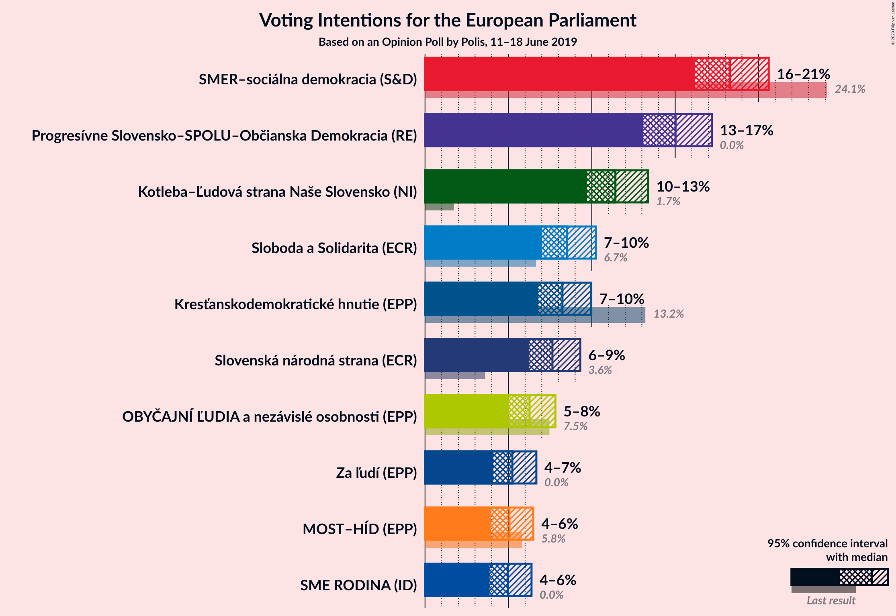

### Confidence Intervals

| Party | Last Result | Poll Result | 80% Confidence Interval | 90% Confidence Interval | 95% Confidence Interval | 99% Confidence Interval |
|:-----:|:-----------:|:-----------:|:-----------------------:|:-----------------------:|:-----------------------:|:-----------------------:|
| SMER–sociálna demokracia (S&D) | 24.1% | 18.3% | 16.9–19.8% |16.5–20.2% |16.2–20.6% |15.5–21.4% |
| Progresívne Slovensko–SPOLU–Občianska Demokracia (RE) | 0.0% | 15.0% | 13.7–16.4% |13.4–16.8% |13.1–17.2% |12.5–17.9% |
| Kotleba–Ľudová strana Naše Slovensko (NI) | 1.7% | 11.4% | 10.3–12.7% |10.0–13.1% |9.7–13.4% |9.2–14.0% |
| Sloboda a Solidarita (ECR) | 6.7% | 8.5% | 7.5–9.6% |7.3–10.0% |7.0–10.2% |6.6–10.8% |
| Kresťanskodemokratické hnutie (EPP) | 13.2% | 8.2% | 7.3–9.4% |7.0–9.7% |6.8–10.0% |6.4–10.5% |
| Slovenská národná strana (ECR) | 3.6% | 7.6% | 6.7–8.7% |6.5–9.0% |6.2–9.3% |5.8–9.9% |
| OBYČAJNÍ ĽUDIA a nezávislé osobnosti (ECR) | 7.5% | 6.3% | 5.4–7.3% |5.2–7.6% |5.0–7.8% |4.6–8.3% |
| Za ľudí (*) | 0.0% | 5.2% | 4.5–6.2% |4.3–6.4% |4.1–6.7% |3.8–7.1% |
| MOST–HÍD (EPP) | 5.8% | 5.1% | 4.3–6.0% |4.1–6.2% |3.9–6.5% |3.6–7.0% |
| SME RODINA (ID) | 0.0% | 5.0% | 4.3–5.9% |4.0–6.2% |3.9–6.4% |3.5–6.9% |

*Note:* The poll result column reflects the actual value used in the calculations. Published results may vary slightly, and in addition be rounded to fewer digits.

## Seats

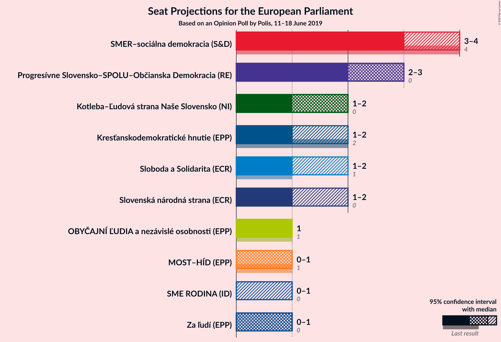

### Confidence Intervals

| Party | Last Result | Median | 80% Confidence Interval | 90% Confidence Interval | 95% Confidence Interval | 99% Confidence Interval |
|:-----:|:-----------:|:------:|:-----------------------:|:-----------------------:|:-----------------------:|:-----------------------:|
| <a href="#smer–sociálna-demokracia-(s&d)">SMER–sociálna demokracia (S&D)</a> | 4 | 3 | 2–3 |2–3 |2–3 |2–3 |
| <a href="#progresívne-slovensko–spolu–občianska-demokracia-(re)">Progresívne Slovensko–SPOLU–Občianska Demokracia (RE)</a> | 0 | 2 | 2 |2 |2–3 |2–3 |
| <a href="#kotleba–ľudová-strana-naše-slovensko-(ni)">Kotleba–Ľudová strana Naše Slovensko (NI)</a> | 0 | 2 | 1–2 |1–2 |1–2 |1–2 |
| <a href="#sloboda-a-solidarita-(ecr)">Sloboda a Solidarita (ECR)</a> | 1 | 1 | 1 |1 |1 |1–2 |
| <a href="#kresťanskodemokratické-hnutie-(epp)">Kresťanskodemokratické hnutie (EPP)</a> | 2 | 1 | 1 |1 |1 |1–2 |
| <a href="#slovenská-národná-strana-(ecr)">Slovenská národná strana (ECR)</a> | 0 | 1 | 1 |1 |1 |1 |
| <a href="#obyčajní-ľudia-a-nezávislé-osobnosti-(ecr)">OBYČAJNÍ ĽUDIA a nezávislé osobnosti (ECR)</a> | 1 | 1 | 1 |1 |0–1 |0–1 |
| <a href="#za-ľudí-(*)">Za ľudí (*)</a> | 0 | 1 | 0–1 |0–1 |0–1 |0–1 |
| <a href="#most–híd-(epp)">MOST–HÍD (EPP)</a> | 1 | 1 | 0–1 |0–1 |0–1 |0–1 |
| <a href="#sme-rodina-(id)">SME RODINA (ID)</a> | 0 | 0 | 0–1 |0–1 |0–1 |0–1 |

### SMER–sociálna demokracia (S&D)

*For a full overview of the results for this party, see the [SMER–sociálna demokracia (S&D)](party-smer–sociálnademokraciasd.html) page.*

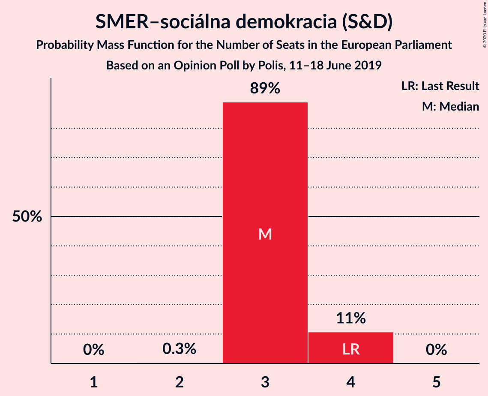

| Number of Seats | Probability | Accumulated | Special Marks |
|:---------------:|:-----------:|:-----------:|:-------------:|
| 2 | 45% | 100% |  |
| 3 | 55% | 55% | Median |
| 4 | 0% | 0% | Last Result |

### Progresívne Slovensko–SPOLU–Občianska Demokracia (RE)

*For a full overview of the results for this party, see the [Progresívne Slovensko–SPOLU–Občianska Demokracia (RE)](party-progresívneslovensko–spolu–občianskademokraciare.html) page.*

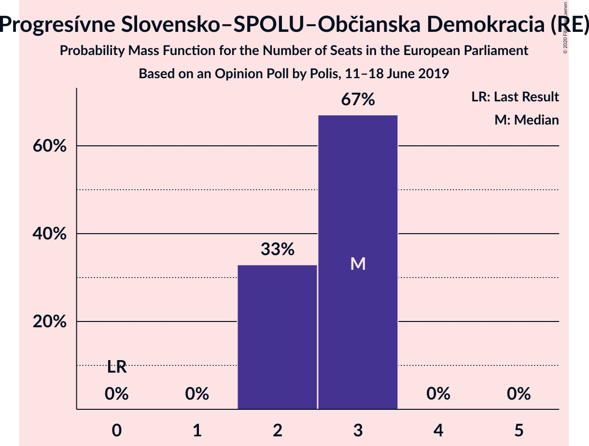

| Number of Seats | Probability | Accumulated | Special Marks |
|:---------------:|:-----------:|:-----------:|:-------------:|
| 0 | 0% | 100% | Last Result |
| 1 | 0.5% | 100% |  |
| 2 | 96% | 99.5% | Median |
| 3 | 3% | 3% |  |
| 4 | 0% | 0% |  |

### Kotleba–Ľudová strana Naše Slovensko (NI)

*For a full overview of the results for this party, see the [Kotleba–Ľudová strana Naše Slovensko (NI)](party-kotleba–ľudovástrananašeslovenskoni.html) page.*

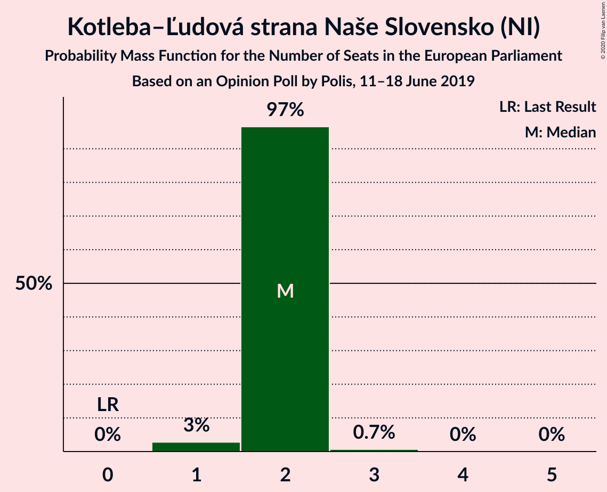

| Number of Seats | Probability | Accumulated | Special Marks |
|:---------------:|:-----------:|:-----------:|:-------------:|
| 0 | 0% | 100% | Last Result |
| 1 | 32% | 100% |  |
| 2 | 68% | 68% | Median |
| 3 | 0% | 0% |  |

### Sloboda a Solidarita (ECR)

*For a full overview of the results for this party, see the [Sloboda a Solidarita (ECR)](party-slobodaasolidaritaecr.html) page.*

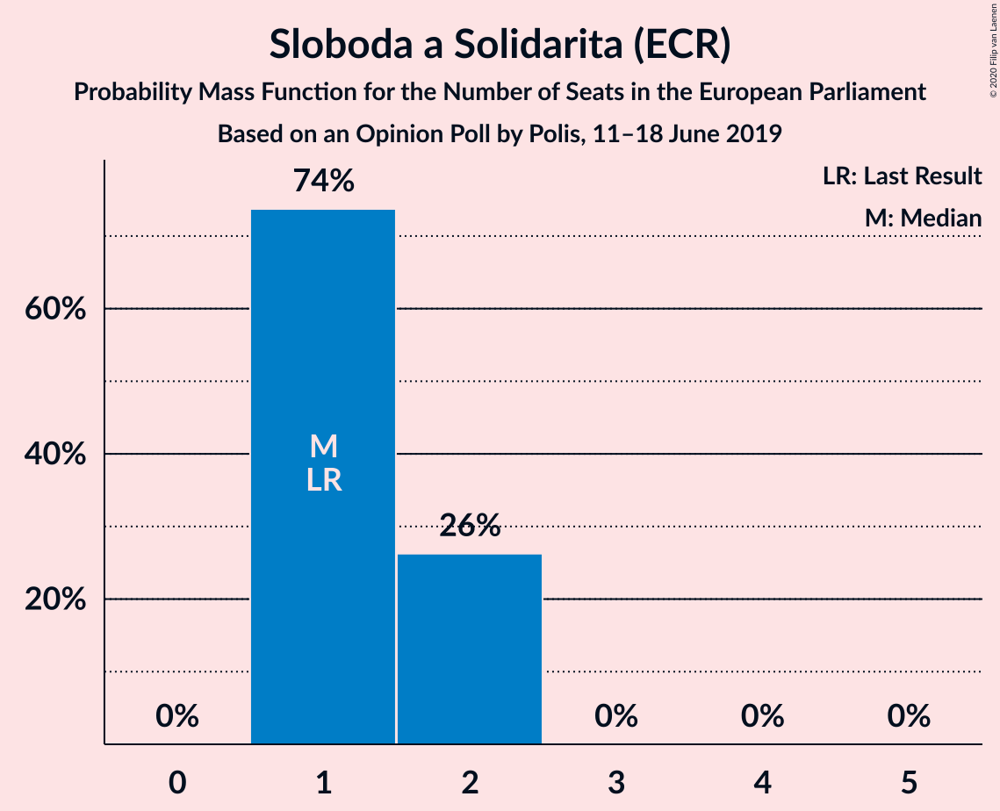

| Number of Seats | Probability | Accumulated | Special Marks |
|:---------------:|:-----------:|:-----------:|:-------------:|
| 1 | 98% | 100% | Last Result, Median |
| 2 | 2% | 2% |  |
| 3 | 0% | 0% |  |

### Kresťanskodemokratické hnutie (EPP)

*For a full overview of the results for this party, see the [Kresťanskodemokratické hnutie (EPP)](party-kresťanskodemokratickéhnutieepp.html) page.*

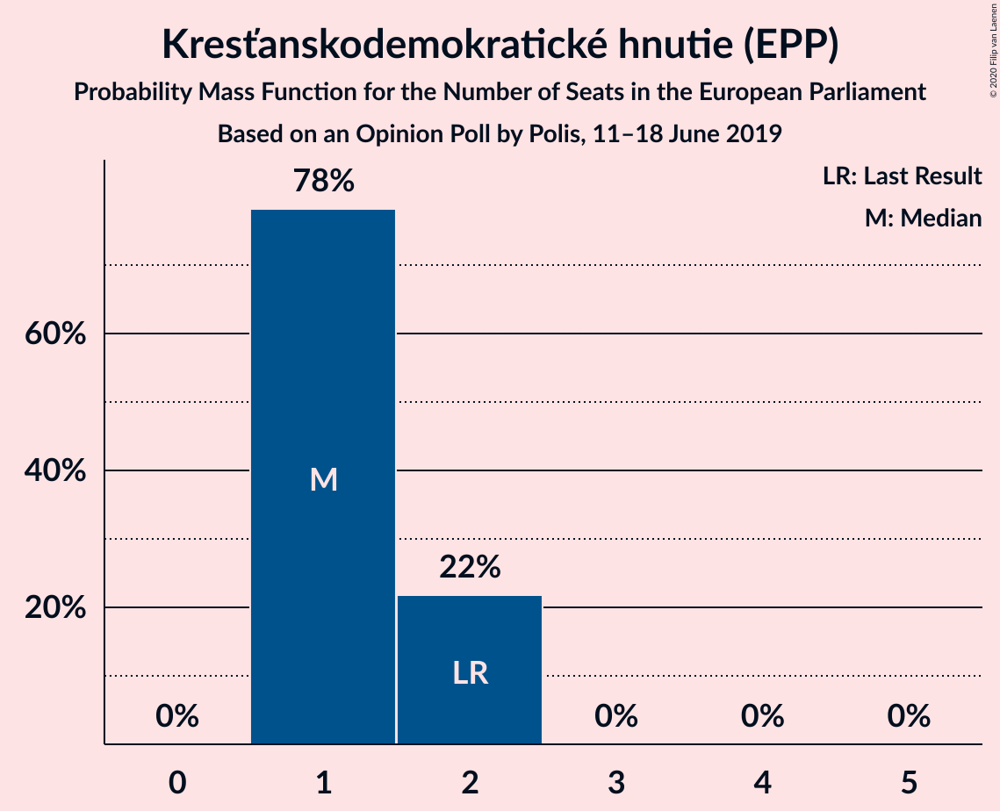

| Number of Seats | Probability | Accumulated | Special Marks |
|:---------------:|:-----------:|:-----------:|:-------------:|
| 1 | 99.1% | 100% | Median |
| 2 | 0.9% | 0.9% | Last Result |
| 3 | 0% | 0% |  |

### Slovenská národná strana (ECR)

*For a full overview of the results for this party, see the [Slovenská národná strana (ECR)](party-slovenskánárodnástranaecr.html) page.*

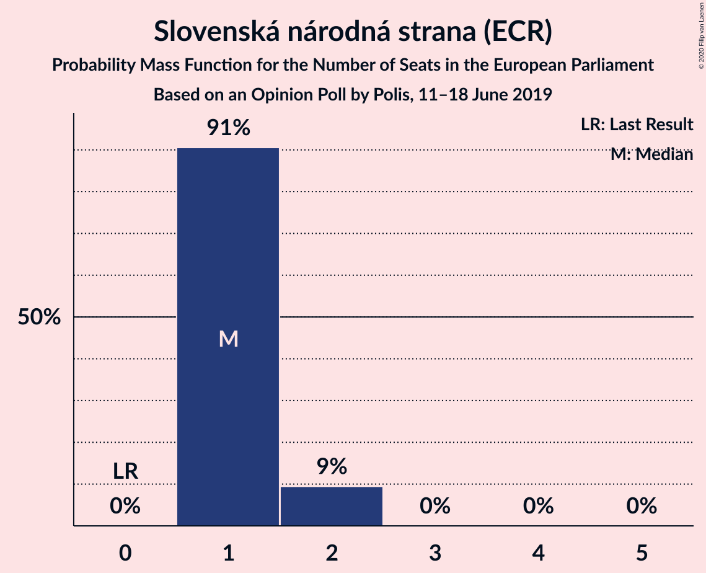

| Number of Seats | Probability | Accumulated | Special Marks |
|:---------------:|:-----------:|:-----------:|:-------------:|
| 0 | 0% | 100% | Last Result |
| 1 | 99.6% | 100% | Median |
| 2 | 0.4% | 0.4% |  |
| 3 | 0% | 0% |  |

### OBYČAJNÍ ĽUDIA a nezávislé osobnosti (ECR)

*For a full overview of the results for this party, see the [OBYČAJNÍ ĽUDIA a nezávislé osobnosti (ECR)](party-obyčajníľudiaanezávisléosobnostiecr.html) page.*

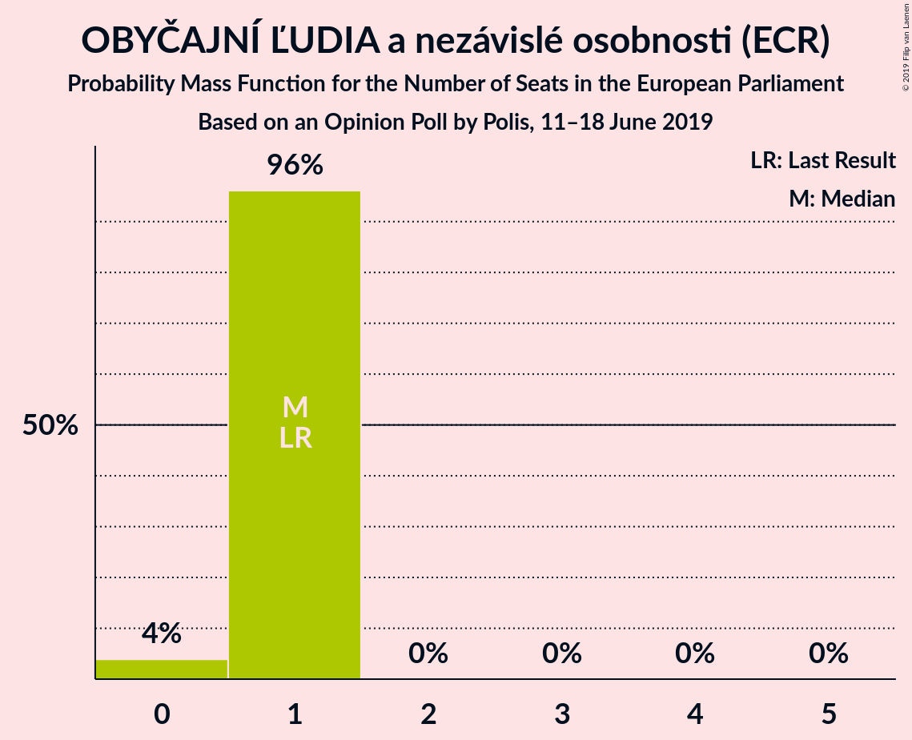

| Number of Seats | Probability | Accumulated | Special Marks |
|:---------------:|:-----------:|:-----------:|:-------------:|
| 0 | 4% | 100% |  |
| 1 | 96% | 96% | Last Result, Median |
| 2 | 0% | 0% |  |

### Za ľudí (*)

*For a full overview of the results for this party, see the [Za ľudí (*)](party-zaľudí.html) page.*

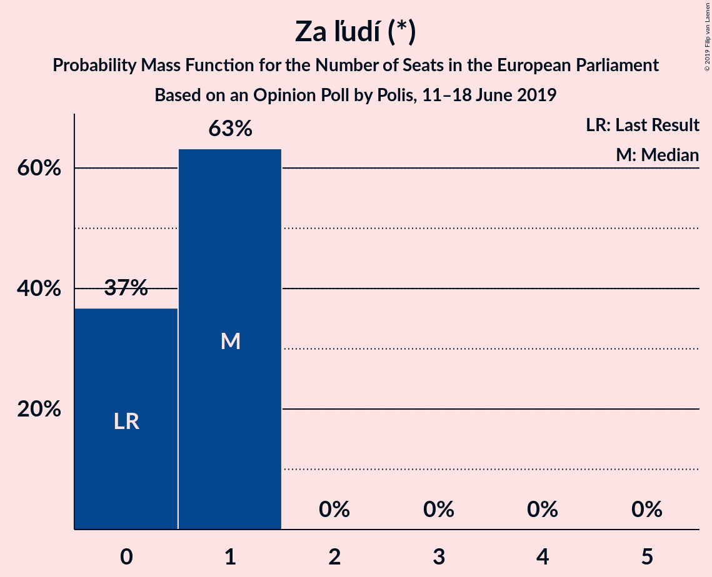

| Number of Seats | Probability | Accumulated | Special Marks |
|:---------------:|:-----------:|:-----------:|:-------------:|
| 0 | 37% | 100% | Last Result |
| 1 | 63% | 63% | Median |
| 2 | 0% | 0% |  |

### MOST–HÍD (EPP)

*For a full overview of the results for this party, see the [MOST–HÍD (EPP)](party-most–hídepp.html) page.*

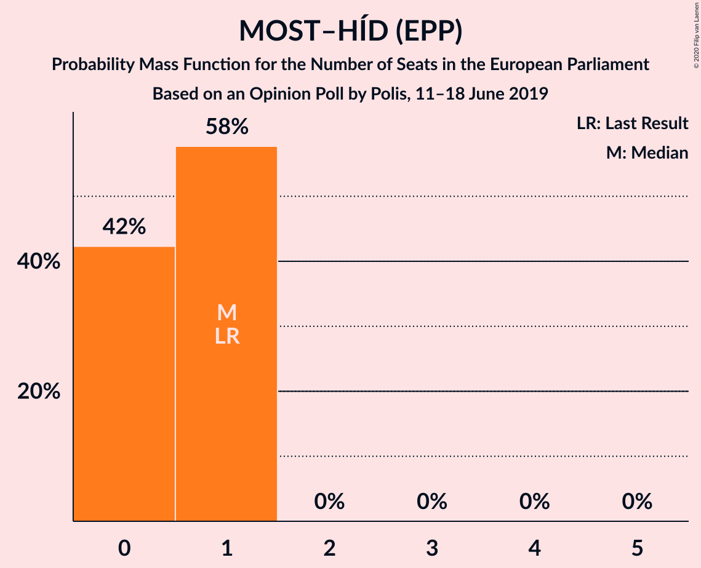

| Number of Seats | Probability | Accumulated | Special Marks |
|:---------------:|:-----------:|:-----------:|:-------------:|
| 0 | 44% | 100% |  |
| 1 | 56% | 56% | Last Result, Median |
| 2 | 0% | 0% |  |

### SME RODINA (ID)

*For a full overview of the results for this party, see the [SME RODINA (ID)](party-smerodinaid.html) page.*

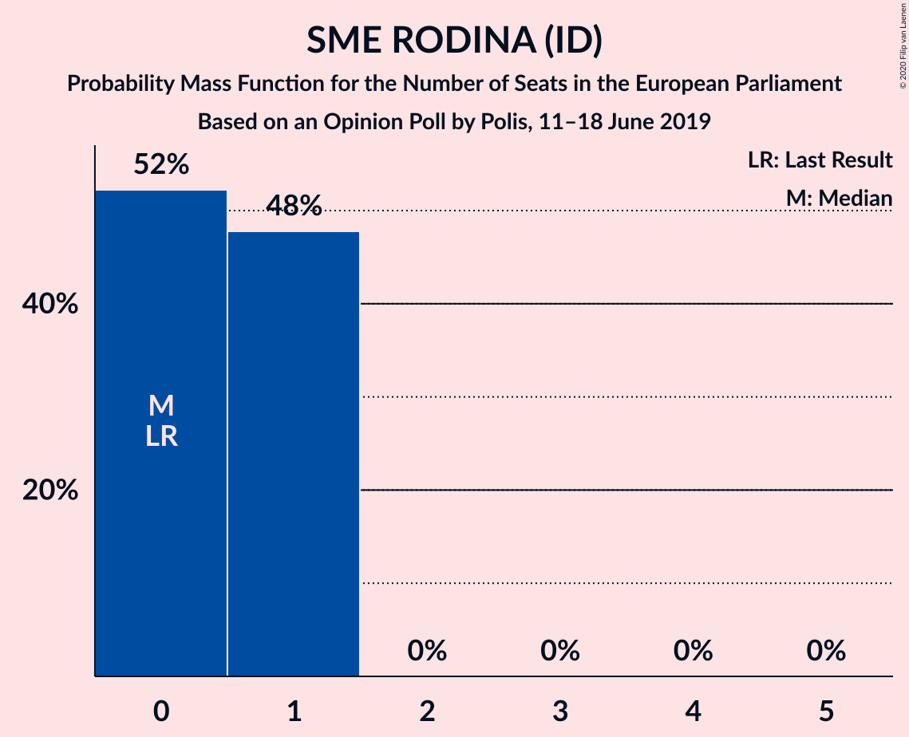

| Number of Seats | Probability | Accumulated | Special Marks |
|:---------------:|:-----------:|:-----------:|:-------------:|
| 0 | 55% | 100% | Last Result, Median |
| 1 | 45% | 45% |  |
| 2 | 0% | 0% |  |

## Coalitions

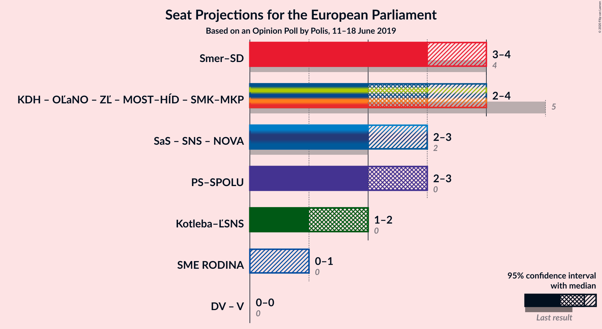

### Confidence Intervals

| Coalition | Last Result | Median | Majority? | 80% Confidence Interval | 90% Confidence Interval | 95% Confidence Interval | 99% Confidence Interval |
|:---------:|:-----------:|:------:|:---------:|:-----------------------:|:-----------------------:|:-----------------------:|:-----------------------:|
| Progresívne Slovensko–SPOLU–Občianska Demokracia (RE) | 0 | 2 | 0% | 2 | 2 | 2–3 | 2–3 |
| SMER–sociálna demokracia (S&D) | 4 | 3 | 0% | 2–3 | 2–3 | 2–3 | 2–3 |
| Kotleba–Ľudová strana Naše Slovensko (NI) | 0 | 2 | 0% | 1–2 | 1–2 | 1–2 | 1–2 |
| SME RODINA (ID) | 0 | 0 | 0% | 0–1 | 0–1 | 0–1 | 0–1 |
| Za ľudí (*) | 0 | 1 | 0% | 0–1 | 0–1 | 0–1 | 0–1 |

### Progresívne Slovensko–SPOLU–Občianska Demokracia (RE)

| Number of Seats | Probability | Accumulated | Special Marks |
|:---------------:|:-----------:|:-----------:|:-------------:|
| 0 | 0% | 100% | Last Result |
| 1 | 0.5% | 100% |  |
| 2 | 96% | 99.5% | Median |
| 3 | 3% | 3% |  |
| 4 | 0% | 0% |  |

### SMER–sociálna demokracia (S&D)

| Number of Seats | Probability | Accumulated | Special Marks |
|:---------------:|:-----------:|:-----------:|:-------------:|
| 2 | 45% | 100% |  |
| 3 | 55% | 55% | Median |
| 4 | 0% | 0% | Last Result |

### Kotleba–Ľudová strana Naše Slovensko (NI)

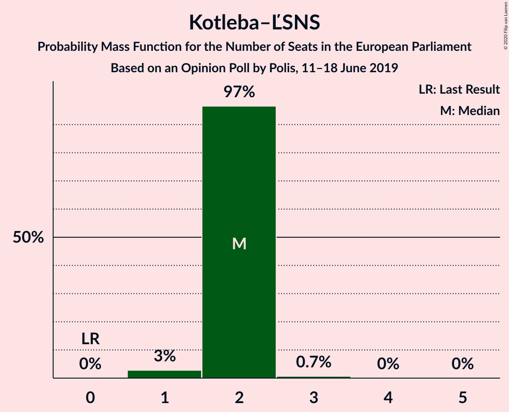

| Number of Seats | Probability | Accumulated | Special Marks |
|:---------------:|:-----------:|:-----------:|:-------------:|
| 0 | 0% | 100% | Last Result |
| 1 | 32% | 100% |  |
| 2 | 68% | 68% | Median |
| 3 | 0% | 0% |  |

### SME RODINA (ID)

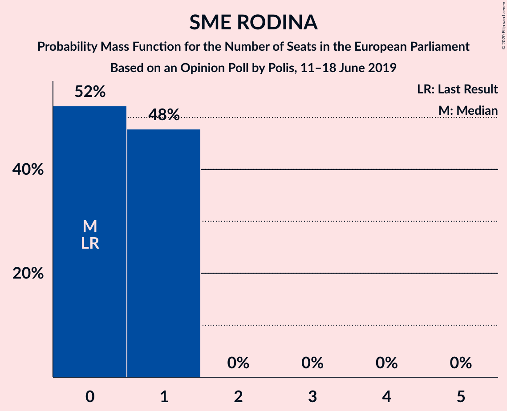

| Number of Seats | Probability | Accumulated | Special Marks |
|:---------------:|:-----------:|:-----------:|:-------------:|
| 0 | 55% | 100% | Last Result, Median |
| 1 | 45% | 45% |  |
| 2 | 0% | 0% |  |

### Za ľudí (*)

| Number of Seats | Probability | Accumulated | Special Marks |
|:---------------:|:-----------:|:-----------:|:-------------:|
| 0 | 37% | 100% | Last Result |
| 1 | 63% | 63% | Median |
| 2 | 0% | 0% |  |

## Technical Information

### Opinion Poll

+ **Polling firm:** Polis
+ **Commissioner(s):** —
+ **Fieldwork period:** 11–18 June 2019

### Calculations

+ **Sample size:** 1165
+ **Simulations done:** 1,048,576
+ **Error estimate:** 1.08%

