# Poll Average

<a href="#voting-intentions">Voting Intentions</a> | <a href="#seats">Seats</a> | <a href="#coalitions">Coalitions</a> | <a href="#technical-information">Technical Information</a>

## Summary

The table below lists the polls on which the average is based. They are the most recent polls (less than 90 days old) registered and analyzed so far.

| Period     | Polling firm/Commissioner(s) | Smer–SD | KDH | OĽaNO | NOVA | SaS | SMK–MKP | MOST–HÍD | SNS | Kotleba–ĽSNS | PS | SME RODINA | SPOLU | PS–SPOLU |
|:----------:|:----------------------------:|:--:|:--:|:--:|:--:|:--:|:--:|:--:|:--:|:--:|:--:|:--:|:--:|:--:|
| 24 May 2014 | General Election | 24.1%   4 | 13.2%   2 | 7.5%   1 | 6.8%   1 | 6.7%   1 | 6.5%   1 | 5.8%   1 | 3.6%   0 | 1.7%   0 | 0.0%   0 | 0.0%   0 | 0.0%   0 | 0.0%   0 |
| N/A | Poll Average | 17–22%   2–3 | 6–9%   1 | 7–11%   1–2 | N/A   N/A | 9–15%   1–2 | 2–5%   0–1 | 4–6%   0–1 | 6–10%   1 | 9–13%   1–2 | N/A   N/A | 8–12%   1–2 | N/A   N/A | 11–16%   1–2 |
| [8–14 April 2019](2019-04-14-FOCUS.html) | FOCUS | 17–22%   2–3 | 6–9%   1 | 7–11%   1–2 | N/A   N/A | 8–12%   1–2 | 3–5%   0–1 | 4–6%   0–1 | 6–10%   1 | 9–13%   1–2 | N/A   N/A | 7–11%   1–2 | N/A   N/A | 11–15%   1–2 |
| [1–2 April 2019](2019-04-02-AKO.html) | AKO | 17–22%   2–3 | 5–9%   1 | 7–11%   1 | N/A   N/A | 11–15%   1–2 | 2–4%   0 | 4–7%   0–1 | 6–9%   1 | 10–14%   1–2 | N/A   N/A | 9–13%   1–2 | N/A   N/A | 12–17%   2 |
| 24 May 2014 | General Election | 24.1%   4 | 13.2%   2 | 7.5%   1 | 6.8%   1 | 6.7%   1 | 6.5%   1 | 5.8%   1 | 3.6%   0 | 1.7%   0 | 0.0%   0 | 0.0%   0 | 0.0%   0 | 0.0%   0 |

Only polls for which at least the sample size has been published are included in the table above.

**Legend:**
+ **Top half of each row:** Voting intentions (95% confidence interval)
+ **Bottom half of each row:** Seat projections for the European Parliament (95% confidence interval)
+ **Smer–SD:** SMER–sociálna demokracia (S&D)
+ **KDH:** Kresťanskodemokratické hnutie (EPP)
+ **OĽaNO:** OBYČAJNÍ ĽUDIA a nezávislé osobnosti (ECR)
+ **NOVA:** NOVA (ECR)
+ **SaS:** Sloboda a Solidarita (ECR)
+ **SMK–MKP:** Strana maďarskej koalície–Magyar Koalíció Pártja (EPP)
+ **MOST–HÍD:** MOST–HÍD (EPP)
+ **SNS:** Slovenská národná strana (EAPN)
+ **Kotleba–ĽSNS:** Kotleba–Ľudová strana Naše Slovensko (NI)
+ **PS:** Progresívne Slovensko (ALDE)
+ **SME RODINA:** SME RODINA (EAPN)
+ **SPOLU:** SPOLU–Občianska Demokracia (EPP)
+ **PS–SPOLU:** Progresívne Slovensko–SPOLU–Občianska Demokracia (ALDE)
+ **N/A (single party):** Party not included the published results
+ **N/A (entire row):** Calculation for this opinion poll not started yet

## Voting Intentions

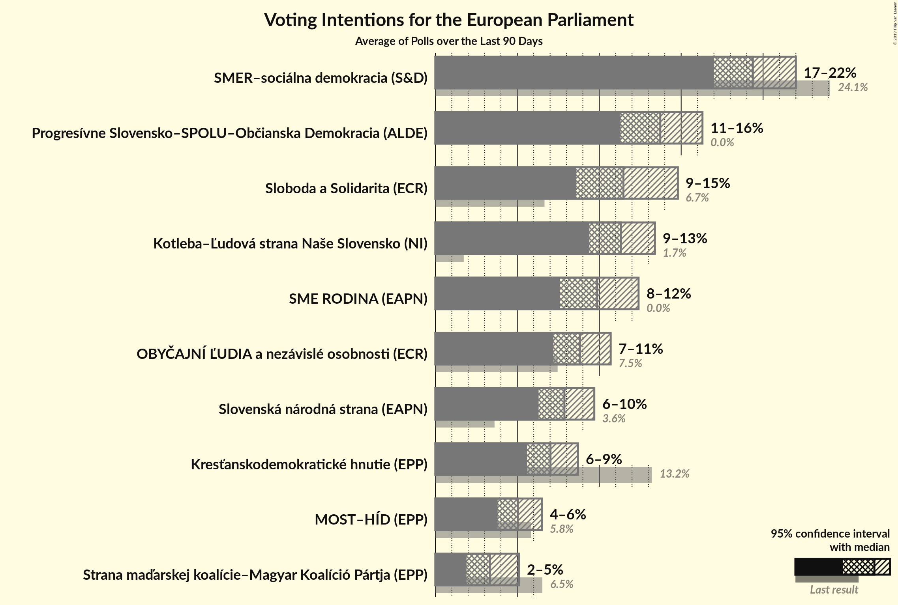

### Confidence Intervals

| Party | Last Result | Median | 80% Confidence Interval | 90% Confidence Interval | 95% Confidence Interval | 99% Confidence Interval |
|:-----:|:-----------:|:------:|:-----------------------:|:-----------------------:|:-----------------------:|:-----------------------:|
| <a href="#smer–sociálna-demokracia-(s&d)">SMER–sociálna demokracia (S&D)</a> | 24.1% | 19.4% | 17.8–21.1% |17.3–21.6% | 17.0–22.0% | 16.2–22.9% |
| <a href="#kresťanskodemokratické-hnutie-(epp)">Kresťanskodemokratické hnutie (EPP)</a> | 13.2% | 7.0% | 6.0–8.1% |5.8–8.4% | 5.6–8.7% | 5.1–9.3% |
| <a href="#obyčajní-ľudia-a-nezávislé-osobnosti-(ecr)">OBYČAJNÍ ĽUDIA a nezávislé osobnosti (ECR)</a> | 7.5% | 8.8% | 7.7–10.1% |7.4–10.4% | 7.2–10.7% | 6.7–11.3% |
| <a href="#nova-(ecr)">NOVA (ECR)</a> | 6.8% | N/A | N/A |N/A | N/A | N/A |
| <a href="#sloboda-a-solidarita-(ecr)">Sloboda a Solidarita (ECR)</a> | 6.7% | 11.5% | 9.3–13.9% |8.9–14.3% | 8.6–14.8% | 8.0–15.5% |
| <a href="#strana-maďarskej-koalície–magyar-koalíció-pártja-(epp)">Strana maďarskej koalície–Magyar Koalíció Pártja (EPP)</a> | 6.5% | 3.3% | 2.3–4.6% |2.1–4.9% | 1.9–5.1% | 1.7–5.6% |
| <a href="#most–híd-(epp)">MOST–HÍD (EPP)</a> | 5.8% | 5.0% | 4.2–6.0% |4.0–6.3% | 3.8–6.5% | 3.5–7.0% |
| <a href="#slovenská-národná-strana-(eapn)">Slovenská národná strana (EAPN)</a> | 3.6% | 7.9% | 6.8–9.0% |6.5–9.4% | 6.3–9.7% | 5.8–10.3% |
| <a href="#kotleba–ľudová-strana-naše-slovensko-(ni)">Kotleba–Ľudová strana Naše Slovensko (NI)</a> | 1.7% | 11.3% | 10.0–12.7% |9.7–13.1% | 9.4–13.4% | 8.9–14.1% |
| <a href="#progresívne-slovensko-(alde)">Progresívne Slovensko (ALDE)</a> | 0.0% | N/A | N/A |N/A | N/A | N/A |
| <a href="#sme-rodina-(eapn)">SME RODINA (EAPN)</a> | 0.0% | 9.9% | 8.3–11.6% |7.9–12.0% | 7.6–12.4% | 7.1–13.2% |
| <a href="#spolu–občianska-demokracia-(epp)">SPOLU–Občianska Demokracia (EPP)</a> | 0.0% | N/A | N/A |N/A | N/A | N/A |
| <a href="#progresívne-slovensko–spolu–občianska-demokracia-(alde)">Progresívne Slovensko–SPOLU–Občianska Demokracia (ALDE)</a> | 0.0% | 13.7% | 12.1–15.4% |11.7–15.9% | 11.3–16.3% | 10.7–17.2% |

### SMER–sociálna demokracia (S&D)

*For a full overview of the results for this party, see the [SMER–sociálna demokracia (S&D)](party-smer–sociálnademokraciasd.html) page.*

| Voting Intentions | Probability | Accumulated | Special Marks |
|:-----------------:|:-----------:|:-----------:|:-------------:|
| 13.5–14.5% | 0% | 100% |  |
| 14.5–15.5% | 0.1% | 100% |  |
| 15.5–16.5% | 1.0% | 99.9% |  |
| 16.5–17.5% | 6% | 98.9% |  |
| 17.5–18.5% | 18% | 93% |  |
| 18.5–19.5% | 30% | 75% | Median |
| 19.5–20.5% | 26% | 45% |  |
| 20.5–21.5% | 14% | 19% |  |
| 21.5–22.5% | 4% | 5% |  |
| 22.5–23.5% | 0.8% | 0.9% |  |
| 23.5–24.5% | 0.1% | 0.1% | Last Result |
| 24.5–25.5% | 0% | 0% |  |

### Kresťanskodemokratické hnutie (EPP)

*For a full overview of the results for this party, see the [Kresťanskodemokratické hnutie (EPP)](party-kresťanskodemokratickéhnutieepp.html) page.*

| Voting Intentions | Probability | Accumulated | Special Marks |
|:-----------------:|:-----------:|:-----------:|:-------------:|
| 3.5–4.5% | 0% | 100% |  |
| 4.5–5.5% | 2% | 100% |  |
| 5.5–6.5% | 25% | 98% |  |
| 6.5–7.5% | 46% | 72% | Median |
| 7.5–8.5% | 22% | 26% |  |
| 8.5–9.5% | 3% | 4% |  |
| 9.5–10.5% | 0.2% | 0.2% |  |
| 10.5–11.5% | 0% | 0% |  |
| 11.5–12.5% | 0% | 0% |  |
| 12.5–13.5% | 0% | 0% | Last Result |

### OBYČAJNÍ ĽUDIA a nezávislé osobnosti (ECR)

*For a full overview of the results for this party, see the [OBYČAJNÍ ĽUDIA a nezávislé osobnosti (ECR)](party-obyčajníľudiaanezávisléosobnostiecr.html) page.*

| Voting Intentions | Probability | Accumulated | Special Marks |
|:-----------------:|:-----------:|:-----------:|:-------------:|
| 4.5–5.5% | 0% | 100% |  |
| 5.5–6.5% | 0.3% | 100% |  |
| 6.5–7.5% | 7% | 99.7% | Last Result |
| 7.5–8.5% | 31% | 93% |  |
| 8.5–9.5% | 41% | 63% | Median |
| 9.5–10.5% | 18% | 22% |  |
| 10.5–11.5% | 3% | 4% |  |
| 11.5–12.5% | 0.3% | 0.3% |  |
| 12.5–13.5% | 0% | 0% |  |

### Sloboda a Solidarita (ECR)

*For a full overview of the results for this party, see the [Sloboda a Solidarita (ECR)](party-slobodaasolidaritaecr.html) page.*

| Voting Intentions | Probability | Accumulated | Special Marks |
|:-----------------:|:-----------:|:-----------:|:-------------:|
| 5.5–6.5% | 0% | 100% |  |
| 6.5–7.5% | 0.1% | 100% | Last Result |
| 7.5–8.5% | 2% | 99.9% |  |
| 8.5–9.5% | 12% | 98% |  |
| 9.5–10.5% | 21% | 86% |  |
| 10.5–11.5% | 16% | 65% | Median |
| 11.5–12.5% | 16% | 49% |  |
| 12.5–13.5% | 18% | 33% |  |
| 13.5–14.5% | 11% | 14% |  |
| 14.5–15.5% | 3% | 4% |  |
| 15.5–16.5% | 0.5% | 0.5% |  |
| 16.5–17.5% | 0% | 0% |  |

### Strana maďarskej koalície–Magyar Koalíció Pártja (EPP)

*For a full overview of the results for this party, see the [Strana maďarskej koalície–Magyar Koalíció Pártja (EPP)](party-stranamaďarskejkoalície–magyarkoalíciópártjaepp.html) page.*

| Voting Intentions | Probability | Accumulated | Special Marks |
|:-----------------:|:-----------:|:-----------:|:-------------:|
| 0.0–0.5% | 0% | 100% |  |
| 0.5–1.5% | 0.2% | 100% |  |
| 1.5–2.5% | 20% | 99.8% |  |
| 2.5–3.5% | 37% | 80% | Median |
| 3.5–4.5% | 32% | 43% |  |
| 4.5–5.5% | 10% | 11% |  |
| 5.5–6.5% | 0.7% | 0.7% |  |
| 6.5–7.5% | 0% | 0% | Last Result |

### MOST–HÍD (EPP)

*For a full overview of the results for this party, see the [MOST–HÍD (EPP)](party-most–hídepp.html) page.*

| Voting Intentions | Probability | Accumulated | Special Marks |
|:-----------------:|:-----------:|:-----------:|:-------------:|
| 1.5–2.5% | 0% | 100% |  |
| 2.5–3.5% | 0.8% | 100% |  |
| 3.5–4.5% | 22% | 99.2% |  |
| 4.5–5.5% | 53% | 77% | Median |
| 5.5–6.5% | 22% | 24% | Last Result |
| 6.5–7.5% | 2% | 2% |  |
| 7.5–8.5% | 0.1% | 0.1% |  |
| 8.5–9.5% | 0% | 0% |  |

### Slovenská národná strana (EAPN)

*For a full overview of the results for this party, see the [Slovenská národná strana (EAPN)](party-slovenskánárodnástranaeapn.html) page.*

| Voting Intentions | Probability | Accumulated | Special Marks |
|:-----------------:|:-----------:|:-----------:|:-------------:|
| 3.5–4.5% | 0% | 100% | Last Result |
| 4.5–5.5% | 0.2% | 100% |  |
| 5.5–6.5% | 6% | 99.8% |  |
| 6.5–7.5% | 30% | 94% |  |
| 7.5–8.5% | 42% | 64% | Median |
| 8.5–9.5% | 18% | 22% |  |
| 9.5–10.5% | 3% | 3% |  |
| 10.5–11.5% | 0.2% | 0.2% |  |
| 11.5–12.5% | 0% | 0% |  |

### Kotleba–Ľudová strana Naše Slovensko (NI)

*For a full overview of the results for this party, see the [Kotleba–Ľudová strana Naše Slovensko (NI)](party-kotleba–ľudovástrananašeslovenskoni.html) page.*

| Voting Intentions | Probability | Accumulated | Special Marks |
|:-----------------:|:-----------:|:-----------:|:-------------:|
| 1.5–2.5% | 0% | 100% | Last Result |
| 2.5–3.5% | 0% | 100% |  |
| 3.5–4.5% | 0% | 100% |  |
| 4.5–5.5% | 0% | 100% |  |
| 5.5–6.5% | 0% | 100% |  |
| 6.5–7.5% | 0% | 100% |  |
| 7.5–8.5% | 0.2% | 100% |  |
| 8.5–9.5% | 3% | 99.8% |  |
| 9.5–10.5% | 19% | 96% |  |
| 10.5–11.5% | 37% | 78% | Median |
| 11.5–12.5% | 28% | 40% |  |
| 12.5–13.5% | 10% | 12% |  |
| 13.5–14.5% | 2% | 2% |  |
| 14.5–15.5% | 0.2% | 0.2% |  |
| 15.5–16.5% | 0% | 0% |  |

### SME RODINA (EAPN)

*For a full overview of the results for this party, see the [SME RODINA (EAPN)](party-smerodinaeapn.html) page.*

| Voting Intentions | Probability | Accumulated | Special Marks |
|:-----------------:|:-----------:|:-----------:|:-------------:|
| 0.0–0.5% | 0% | 100% | Last Result |
| 0.5–1.5% | 0% | 100% |  |
| 1.5–2.5% | 0% | 100% |  |
| 2.5–3.5% | 0% | 100% |  |
| 3.5–4.5% | 0% | 100% |  |
| 4.5–5.5% | 0% | 100% |  |
| 5.5–6.5% | 0.1% | 100% |  |
| 6.5–7.5% | 2% | 99.9% |  |
| 7.5–8.5% | 13% | 98% |  |
| 8.5–9.5% | 26% | 85% |  |
| 9.5–10.5% | 27% | 59% | Median |
| 10.5–11.5% | 21% | 32% |  |
| 11.5–12.5% | 9% | 11% |  |
| 12.5–13.5% | 2% | 2% |  |
| 13.5–14.5% | 0.2% | 0.2% |  |
| 14.5–15.5% | 0% | 0% |  |

### Progresívne Slovensko–SPOLU–Občianska Demokracia (ALDE)

*For a full overview of the results for this party, see the [Progresívne Slovensko–SPOLU–Občianska Demokracia (ALDE)](party-progresívneslovensko–spolu–občianskademokraciaalde.html) page.*

| Voting Intentions | Probability | Accumulated | Special Marks |
|:-----------------:|:-----------:|:-----------:|:-------------:|
| 0.0–0.5% | 0% | 100% | Last Result |
| 0.5–1.5% | 0% | 100% |  |
| 1.5–2.5% | 0% | 100% |  |
| 2.5–3.5% | 0% | 100% |  |
| 3.5–4.5% | 0% | 100% |  |
| 4.5–5.5% | 0% | 100% |  |
| 5.5–6.5% | 0% | 100% |  |
| 6.5–7.5% | 0% | 100% |  |
| 7.5–8.5% | 0% | 100% |  |
| 8.5–9.5% | 0% | 100% |  |
| 9.5–10.5% | 0.3% | 100% |  |
| 10.5–11.5% | 4% | 99.7% |  |
| 11.5–12.5% | 14% | 96% |  |
| 12.5–13.5% | 27% | 82% |  |
| 13.5–14.5% | 28% | 55% | Median |
| 14.5–15.5% | 18% | 27% |  |
| 15.5–16.5% | 7% | 9% |  |
| 16.5–17.5% | 2% | 2% |  |
| 17.5–18.5% | 0.2% | 0.2% |  |
| 18.5–19.5% | 0% | 0% |  |

## Seats

### Confidence Intervals

| Party | Last Result | Median | 80% Confidence Interval | 90% Confidence Interval | 95% Confidence Interval | 99% Confidence Interval |
|:-----:|:-----------:|:------:|:-----------------------:|:-----------------------:|:-----------------------:|:-----------------------:|
| <a href="#smer–sociálna-demokracia-(s&d)">SMER–sociálna demokracia (S&D)</a> | 4 | 3 | 2–3 |2–3 | 2–3 | 2–3 |
| <a href="#kresťanskodemokratické-hnutie-(epp)">Kresťanskodemokratické hnutie (EPP)</a> | 2 | 1 | 1 |1 | 1 | 1 |
| <a href="#obyčajní-ľudia-a-nezávislé-osobnosti-(ecr)">OBYČAJNÍ ĽUDIA a nezávislé osobnosti (ECR)</a> | 1 | 1 | 1 |1 | 1–2 | 1–2 |
| <a href="#nova-(ecr)">NOVA (ECR)</a> | 1 | N/A | N/A |N/A | N/A | N/A |
| <a href="#sloboda-a-solidarita-(ecr)">Sloboda a Solidarita (ECR)</a> | 1 | 2 | 1–2 |1–2 | 1–2 | 1–2 |
| <a href="#strana-maďarskej-koalície–magyar-koalíció-pártja-(epp)">Strana maďarskej koalície–Magyar Koalíció Pártja (EPP)</a> | 1 | 0 | 0 |0 | 0–1 | 0–1 |
| <a href="#most–híd-(epp)">MOST–HÍD (EPP)</a> | 1 | 1 | 0–1 |0–1 | 0–1 | 0–1 |
| <a href="#slovenská-národná-strana-(eapn)">Slovenská národná strana (EAPN)</a> | 0 | 1 | 1 |1 | 1 | 1 |
| <a href="#kotleba–ľudová-strana-naše-slovensko-(ni)">Kotleba–Ľudová strana Naše Slovensko (NI)</a> | 0 | 2 | 1–2 |1–2 | 1–2 | 1–2 |
| <a href="#progresívne-slovensko-(alde)">Progresívne Slovensko (ALDE)</a> | 0 | N/A | N/A |N/A | N/A | N/A |
| <a href="#sme-rodina-(eapn)">SME RODINA (EAPN)</a> | 0 | 1 | 1–2 |1–2 | 1–2 | 1–2 |
| <a href="#spolu–občianska-demokracia-(epp)">SPOLU–Občianska Demokracia (EPP)</a> | 0 | N/A | N/A |N/A | N/A | N/A |
| <a href="#progresívne-slovensko–spolu–občianska-demokracia-(alde)">Progresívne Slovensko–SPOLU–Občianska Demokracia (ALDE)</a> | 0 | 2 | 2 |2 | 1–2 | 1–2 |

### SMER–sociálna demokracia (S&D)

*For a full overview of the results for this party, see the [SMER–sociálna demokracia (S&D)](party-smer–sociálnademokraciasd.html) page.*

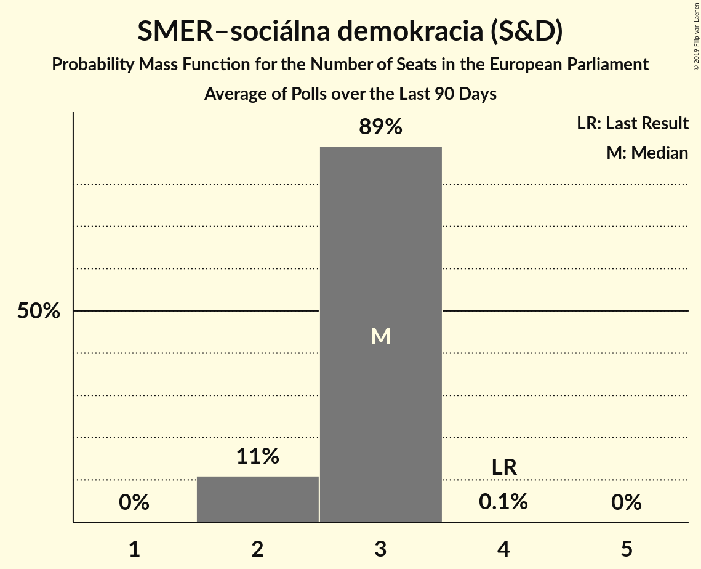

| Number of Seats | Probability | Accumulated | Special Marks |
|:---------------:|:-----------:|:-----------:|:-------------:|
| 2 | 11% | 100% |  |
| 3 | 89% | 89% | Median |
| 4 | 0.1% | 0.1% | Last Result |
| 5 | 0% | 0% |  |

### Kresťanskodemokratické hnutie (EPP)

*For a full overview of the results for this party, see the [Kresťanskodemokratické hnutie (EPP)](party-kresťanskodemokratickéhnutieepp.html) page.*

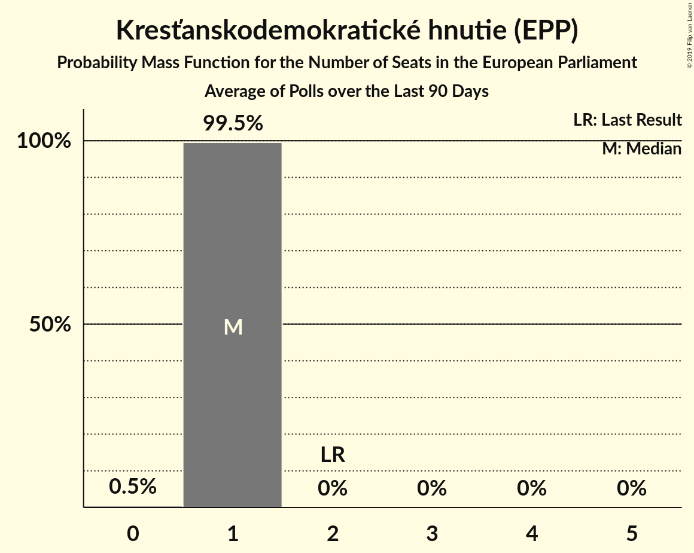

| Number of Seats | Probability | Accumulated | Special Marks |
|:---------------:|:-----------:|:-----------:|:-------------:|
| 0 | 0.5% | 100% |  |
| 1 | 99.5% | 99.5% | Median |
| 2 | 0% | 0% | Last Result |

### OBYČAJNÍ ĽUDIA a nezávislé osobnosti (ECR)

*For a full overview of the results for this party, see the [OBYČAJNÍ ĽUDIA a nezávislé osobnosti (ECR)](party-obyčajníľudiaanezávisléosobnostiecr.html) page.*

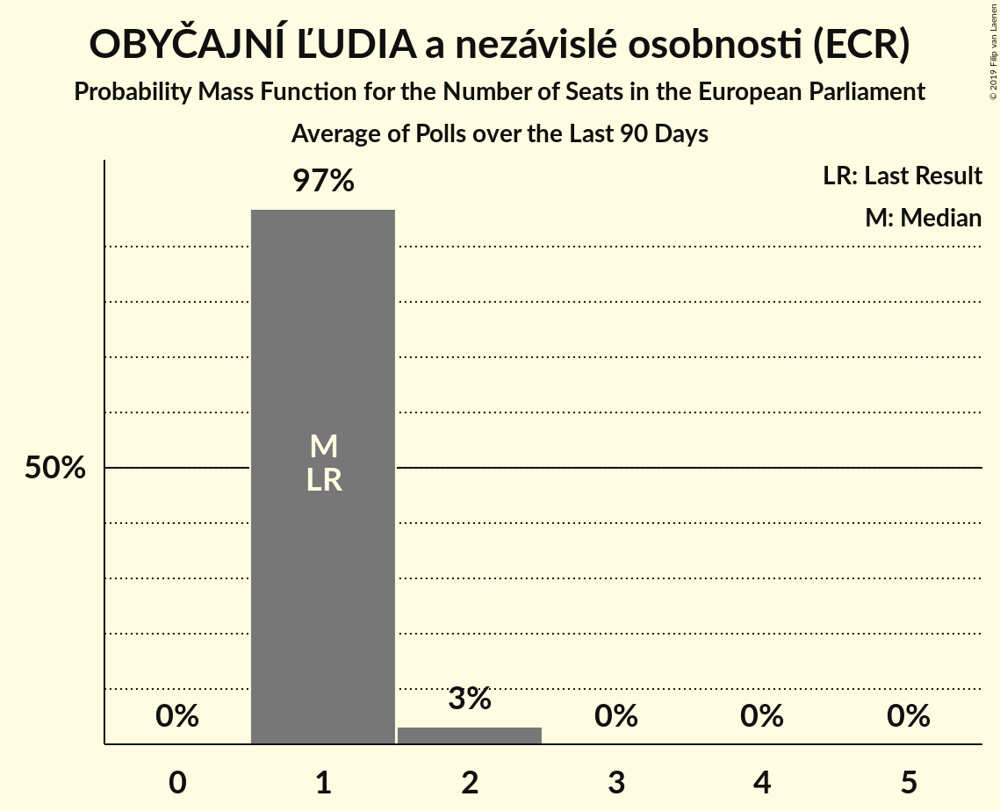

| Number of Seats | Probability | Accumulated | Special Marks |
|:---------------:|:-----------:|:-----------:|:-------------:|
| 1 | 97% | 100% | Last Result, Median |
| 2 | 3% | 3% |  |
| 3 | 0% | 0% |  |

### Sloboda a Solidarita (ECR)

*For a full overview of the results for this party, see the [Sloboda a Solidarita (ECR)](party-slobodaasolidaritaecr.html) page.*

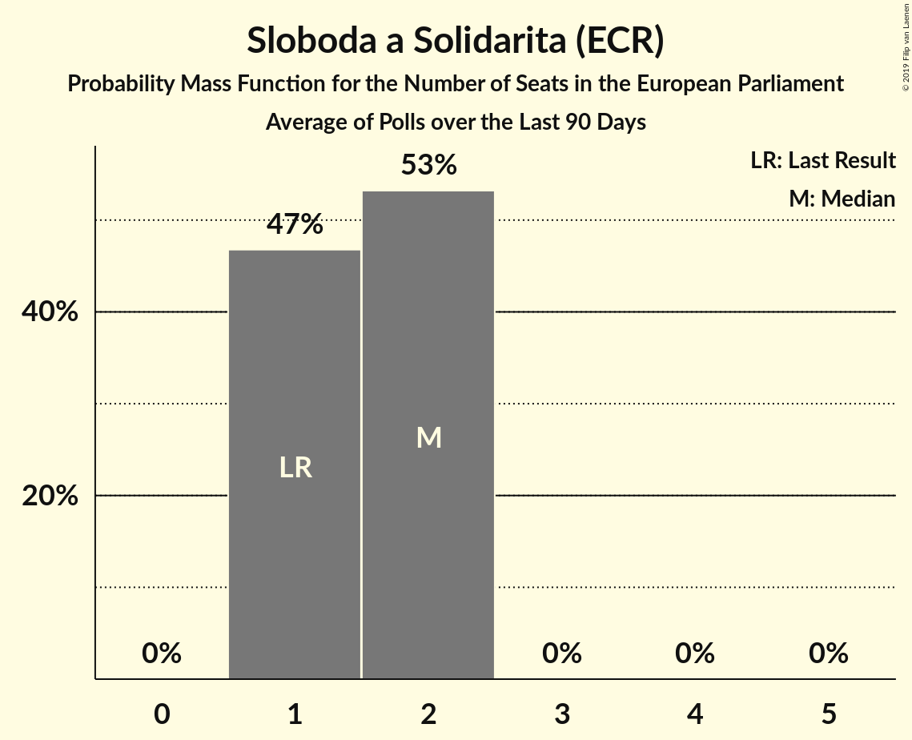

| Number of Seats | Probability | Accumulated | Special Marks |
|:---------------:|:-----------:|:-----------:|:-------------:|
| 1 | 47% | 100% | Last Result |
| 2 | 53% | 53% | Median |
| 3 | 0% | 0% |  |

### Strana maďarskej koalície–Magyar Koalíció Pártja (EPP)

*For a full overview of the results for this party, see the [Strana maďarskej koalície–Magyar Koalíció Pártja (EPP)](party-stranamaďarskejkoalície–magyarkoalíciópártjaepp.html) page.*

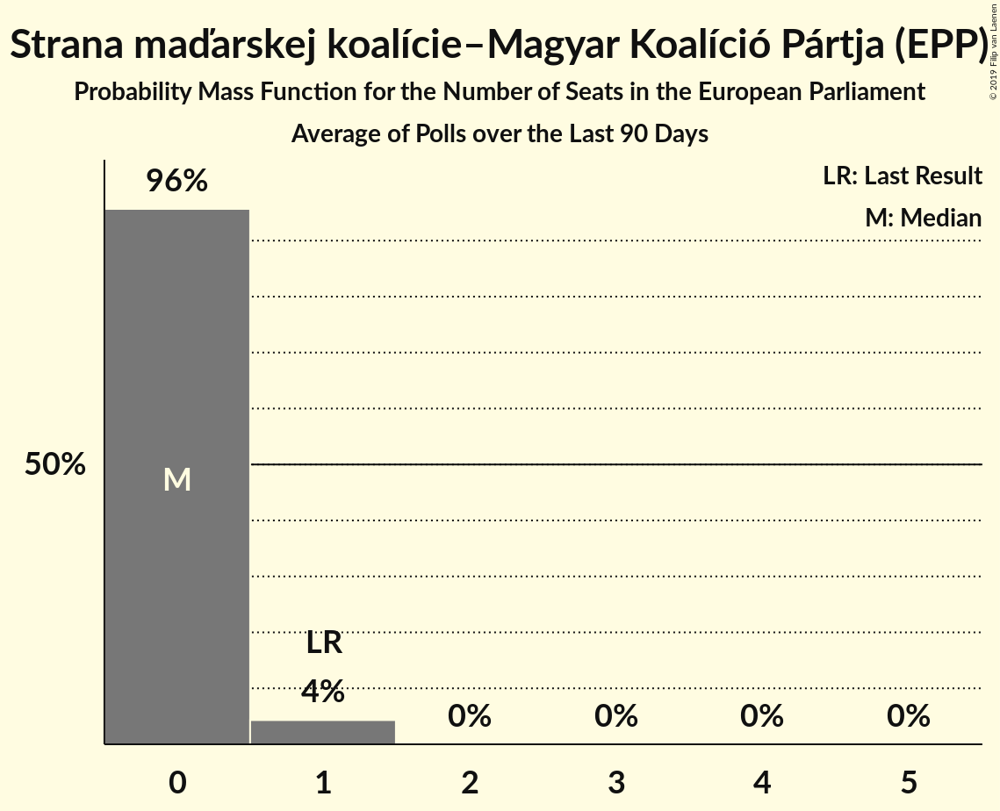

| Number of Seats | Probability | Accumulated | Special Marks |
|:---------------:|:-----------:|:-----------:|:-------------:|
| 0 | 96% | 100% | Median |
| 1 | 4% | 4% | Last Result |
| 2 | 0% | 0% |  |

### MOST–HÍD (EPP)

*For a full overview of the results for this party, see the [MOST–HÍD (EPP)](party-most–hídepp.html) page.*

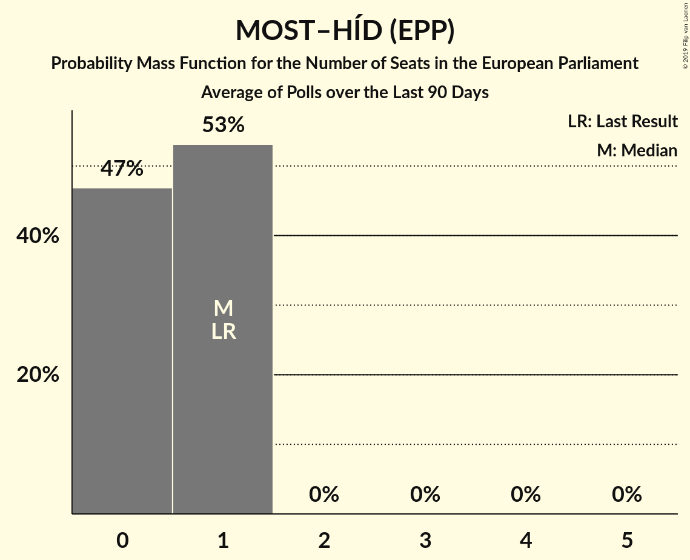

| Number of Seats | Probability | Accumulated | Special Marks |
|:---------------:|:-----------:|:-----------:|:-------------:|
| 0 | 47% | 100% |  |
| 1 | 53% | 53% | Last Result, Median |
| 2 | 0% | 0% |  |

### Slovenská národná strana (EAPN)

*For a full overview of the results for this party, see the [Slovenská národná strana (EAPN)](party-slovenskánárodnástranaeapn.html) page.*

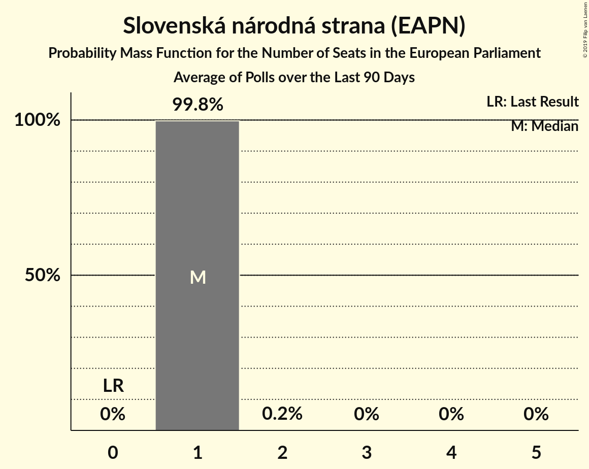

| Number of Seats | Probability | Accumulated | Special Marks |
|:---------------:|:-----------:|:-----------:|:-------------:|
| 0 | 0% | 100% | Last Result |
| 1 | 99.8% | 100% | Median |
| 2 | 0.2% | 0.2% |  |
| 3 | 0% | 0% |  |

### Kotleba–Ľudová strana Naše Slovensko (NI)

*For a full overview of the results for this party, see the [Kotleba–Ľudová strana Naše Slovensko (NI)](party-kotleba–ľudovástrananašeslovenskoni.html) page.*

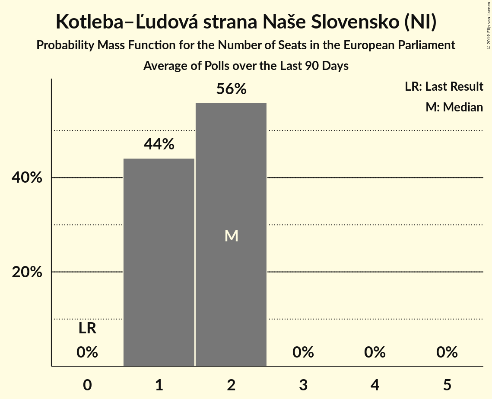

| Number of Seats | Probability | Accumulated | Special Marks |
|:---------------:|:-----------:|:-----------:|:-------------:|
| 0 | 0% | 100% | Last Result |
| 1 | 44% | 100% |  |
| 2 | 56% | 56% | Median |
| 3 | 0% | 0% |  |

### SME RODINA (EAPN)

*For a full overview of the results for this party, see the [SME RODINA (EAPN)](party-smerodinaeapn.html) page.*

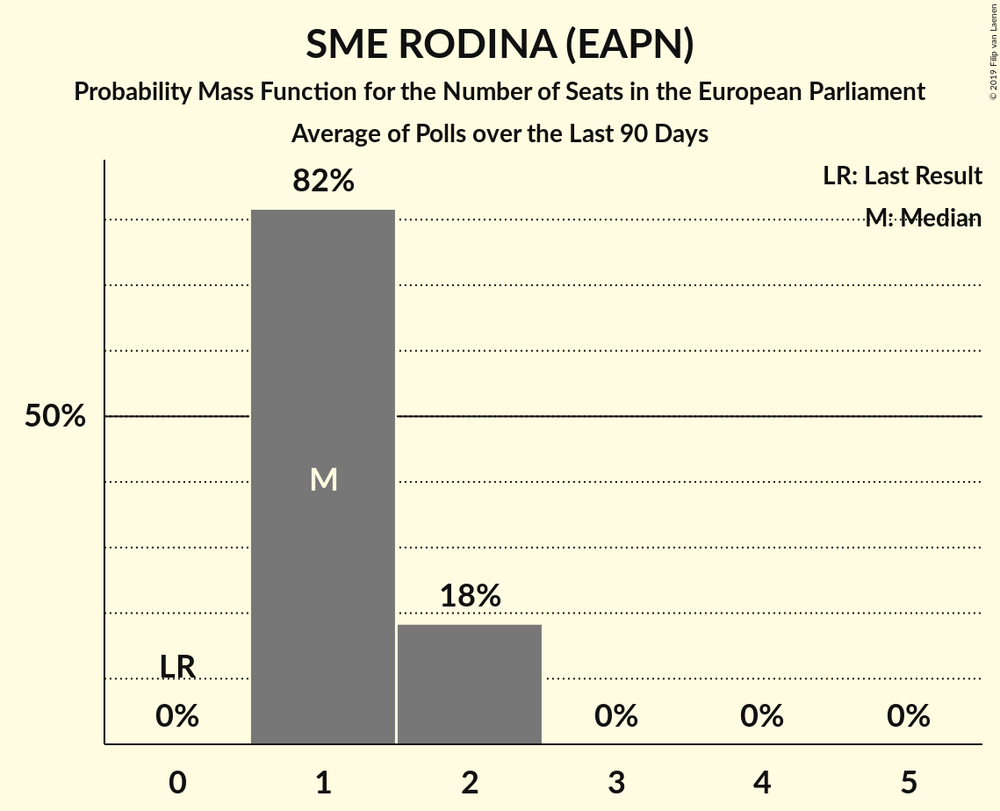

| Number of Seats | Probability | Accumulated | Special Marks |
|:---------------:|:-----------:|:-----------:|:-------------:|
| 0 | 0% | 100% | Last Result |
| 1 | 82% | 100% | Median |
| 2 | 18% | 18% |  |
| 3 | 0% | 0% |  |

### Progresívne Slovensko–SPOLU–Občianska Demokracia (ALDE)

*For a full overview of the results for this party, see the [Progresívne Slovensko–SPOLU–Občianska Demokracia (ALDE)](party-progresívneslovensko–spolu–občianskademokraciaalde.html) page.*

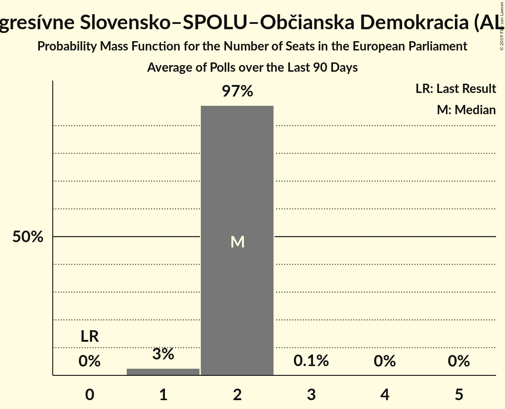

| Number of Seats | Probability | Accumulated | Special Marks |
|:---------------:|:-----------:|:-----------:|:-------------:|
| 0 | 0% | 100% | Last Result |
| 1 | 3% | 100% |  |
| 2 | 97% | 97% | Median |
| 3 | 0.1% | 0.1% |  |
| 4 | 0% | 0% |  |

## Coalitions

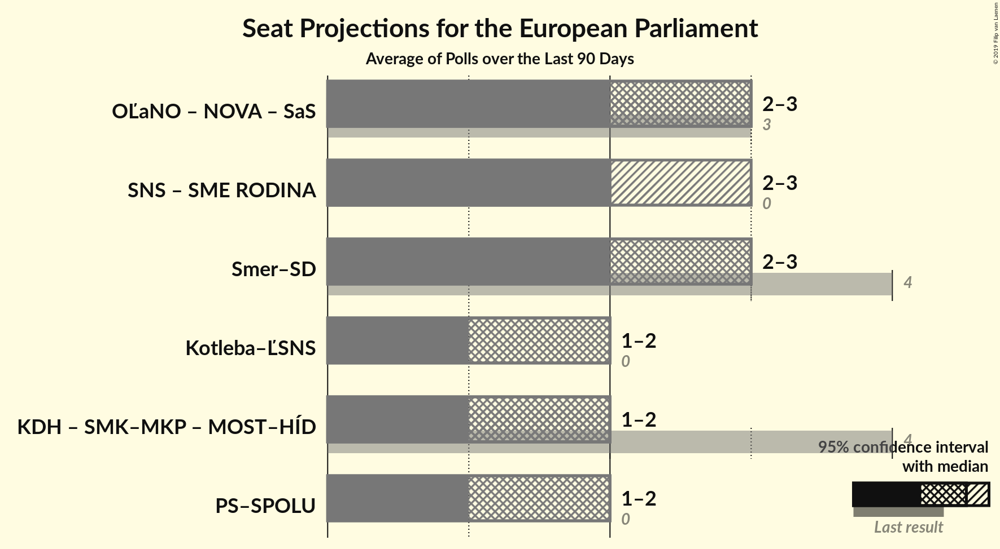

### Confidence Intervals

| Coalition | Last Result | Median | Majority? | 80% Confidence Interval | 90% Confidence Interval | 95% Confidence Interval | 99% Confidence Interval |
|:---------:|:-----------:|:------:|:---------:|:-----------------------:|:-----------------------:|:-----------------------:|:-----------------------:|
| OBYČAJNÍ ĽUDIA a nezávislé osobnosti (ECR) – NOVA (ECR) – Sloboda a Solidarita (ECR) | 3 | 3 | 0% | 2–3 | 2–3 | 2–3 | 2–4 |
| Slovenská národná strana (EAPN) – SME RODINA (EAPN) | 0 | 2 | 0% | 2–3 | 2–3 | 2–3 | 2–3 |
| SMER–sociálna demokracia (S&D) | 4 | 3 | 0% | 2–3 | 2–3 | 2–3 | 2–3 |
| Kotleba–Ľudová strana Naše Slovensko (NI) | 0 | 2 | 0% | 1–2 | 1–2 | 1–2 | 1–2 |
| Kresťanskodemokratické hnutie (EPP) – Strana maďarskej koalície–Magyar Koalíció Pártja (EPP) – MOST–HÍD (EPP) | 4 | 2 | 0% | 1–2 | 1–2 | 1–2 | 1–3 |
| Progresívne Slovensko–SPOLU–Občianska Demokracia (ALDE) | 0 | 2 | 0% | 2 | 2 | 1–2 | 1–2 |

### OBYČAJNÍ ĽUDIA a nezávislé osobnosti (ECR) – NOVA (ECR) – Sloboda a Solidarita (ECR)

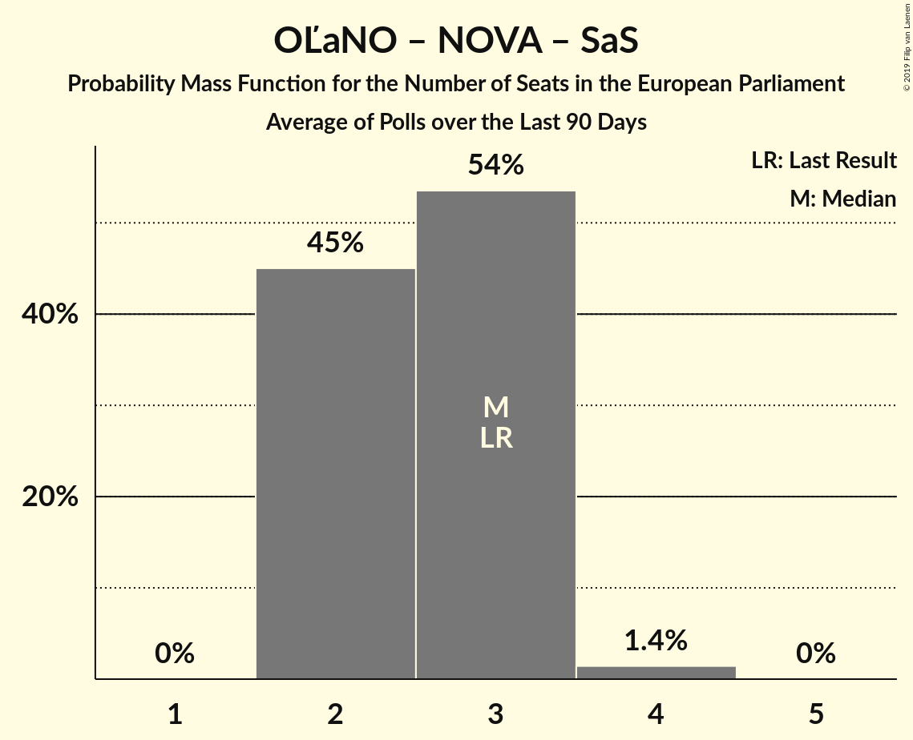

| Number of Seats | Probability | Accumulated | Special Marks |
|:---------------:|:-----------:|:-----------:|:-------------:|
| 2 | 45% | 100% |  |
| 3 | 54% | 55% | Last Result, Median |
| 4 | 1.4% | 1.4% |  |
| 5 | 0% | 0% |  |

### Slovenská národná strana (EAPN) – SME RODINA (EAPN)

| Number of Seats | Probability | Accumulated | Special Marks |
|:---------------:|:-----------:|:-----------:|:-------------:|
| 0 | 0% | 100% | Last Result |
| 1 | 0% | 100% |  |
| 2 | 81% | 100% | Median |
| 3 | 19% | 19% |  |
| 4 | 0% | 0% |  |

### SMER–sociálna demokracia (S&D)

| Number of Seats | Probability | Accumulated | Special Marks |
|:---------------:|:-----------:|:-----------:|:-------------:|
| 2 | 11% | 100% |  |
| 3 | 89% | 89% | Median |
| 4 | 0.1% | 0.1% | Last Result |
| 5 | 0% | 0% |  |

### Kotleba–Ľudová strana Naše Slovensko (NI)

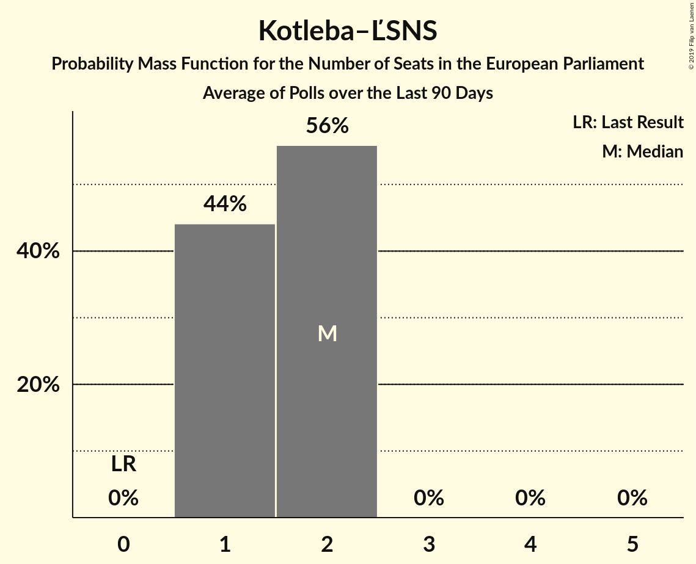

| Number of Seats | Probability | Accumulated | Special Marks |
|:---------------:|:-----------:|:-----------:|:-------------:|
| 0 | 0% | 100% | Last Result |
| 1 | 44% | 100% |  |
| 2 | 56% | 56% | Median |
| 3 | 0% | 0% |  |

### Kresťanskodemokratické hnutie (EPP) – Strana maďarskej koalície–Magyar Koalíció Pártja (EPP) – MOST–HÍD (EPP)

| Number of Seats | Probability | Accumulated | Special Marks |
|:---------------:|:-----------:|:-----------:|:-------------:|
| 0 | 0.2% | 100% |  |
| 1 | 44% | 99.8% |  |
| 2 | 54% | 55% | Median |
| 3 | 2% | 2% |  |
| 4 | 0% | 0% | Last Result |

### Progresívne Slovensko–SPOLU–Občianska Demokracia (ALDE)

| Number of Seats | Probability | Accumulated | Special Marks |
|:---------------:|:-----------:|:-----------:|:-------------:|
| 0 | 0% | 100% | Last Result |
| 1 | 3% | 100% |  |
| 2 | 97% | 97% | Median |
| 3 | 0.1% | 0.1% |  |
| 4 | 0% | 0% |  |

## Technical Information

+ **Number of polls included in this average:** 2
+ **Lowest number of simulations done in a poll included in this average:** 1,048,576
+ **Total number of simulations done in the polls included in this average:** 2,097,152
+ **Error estimate:** 1.97%
