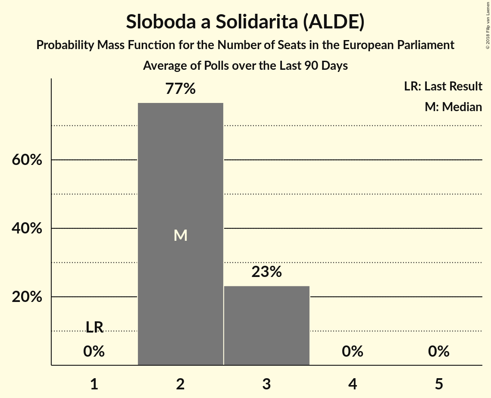

# Sloboda a Solidarita (ALDE)

<a href="#voting-intentions">Voting Intentions</a> | <a href="#seats">Seats</a>

## Voting Intentions

Last result: **6.7%** (General Election of 24 May 2014)

### Confidence Intervals

| Period     | Polling firm/Commissioner(s) | Median | 80% Confidence Interval | 90% Confidence Interval | 95% Confidence Interval | 99% Confidence Interval |
|:----------:|:----------------:|:-----------:|:-----------------------:|:-----------------------:|:-----------------------:|:-----------------------:|
| N/A | [Poll Average](average.html) | 15.1% | 13.2–17.3% | 12.7–17.8% | 12.4–18.2% | 11.7–19.1% |
| [7–13 March 2018](2018-03-13-FOCUS.html) | FOCUS | 14.0% | 12.7–15.5% | 12.3–15.9% | 12.0–16.3% | 11.4–17.1% |
| [21–26 February 2018](2018-02-26-AKO.html) | AKO | 16.2% | 14.8–17.8% | 14.4–18.2% | 14.0–18.6% | 13.4–19.4% |
| [23–28 January 2018](2018-01-28-FOCUS.html) | FOCUS | 13.1% | 11.9–14.6% | 11.5–15.0% | 11.2–15.4% | 10.6–16.1% |

### Probability Mass Function

The following table shows the probability mass function per percentage block of voting intentions for the [poll average](average.html) for Sloboda a Solidarita (ALDE).

| Voting Intentions | Probability | Accumulated | Special Marks |
|:-----------------:|:-----------:|:-----------:|:-------------:|
| 6.5–7.5% | 0% | 100% | Last Result |
| 7.5–8.5% | 0% | 100% |  |
| 8.5–9.5% | 0% | 100% |  |
| 9.5–10.5% | 0% | 100% |  |
| 10.5–11.5% | 0.4% | 100% |  |
| 11.5–12.5% | 3% | 99.6% |  |
| 12.5–13.5% | 12% | 96% |  |
| 13.5–14.5% | 21% | 84% |  |
| 14.5–15.5% | 22% | 63% | Median |
| 15.5–16.5% | 21% | 41% |  |
| 16.5–17.5% | 14% | 21% |  |
| 17.5–18.5% | 6% | 7% |  |
| 18.5–19.5% | 1.2% | 1.4% |  |
| 19.5–20.5% | 0.2% | 0.2% |  |
| 20.5–21.5% | 0% | 0% |  |

## Seats

Last result: **1** seats (General Election of 24 May 2014)

### Confidence Intervals

| Period     | Polling firm/Commissioner(s) | Median | 80% Confidence Interval | 90% Confidence Interval | 95% Confidence Interval | 99% Confidence Interval |
|:----------:|:----------------:|:------:|:-----------------------:|:-----------------------:|:-----------------------:|:-----------------------:|
| N/A | [Poll Average](average.html) | 2 | 2–3 | 2–3 | 2–3 | 2–3 |
| [7–13 March 2018](2018-03-13-FOCUS.html) | FOCUS | 2 | 2 | 2 | 2–3 | 2–3 |
| [21–26 February 2018](2018-02-26-AKO.html) | AKO | 2 | 2–3 | 2–3 | 2–3 | 2–3 |
| [23–28 January 2018](2018-01-28-FOCUS.html) | FOCUS | 2 | 2 | 2 | 2 | 2–3 |

### Probability Mass Function

The following table shows the probability mass function per seat for the [poll average](average.html) for Sloboda a Solidarita (ALDE).

| Number of Seats | Probability | Accumulated | Special Marks |
|:---------------:|:-----------:|:-----------:|:-------------:|
| 1 | 0% | 100% | Last Result |
| 2 | 77% | 100% | Median |
| 3 | 23% | 23% |  |
| 4 | 0% | 0% |  |

