# Poll Average

<a href="#voting-intentions">Voting Intentions</a> | <a href="#seats">Seats</a> | <a href="#coalitions">Coalitions</a> | <a href="#technical-information">Technical Information</a>

## Summary

The table below lists the polls on which the average is based. They are the most recent polls (less than 90 days old) registered and analyzed so far.

| Period     | Polling firm/Commissioner(s) | Smer–SD | KDH | OĽaNO | NOVA | SaS | SMK–MKP | MOST–HÍD | SNS | Kotleba–ĽSNS | PS | SME RODINA | SPOLU | PS–SPOLU | ZĽ | DV | V | HLAS–SD |
|:----------:|:----------------------------:|:--:|:--:|:--:|:--:|:--:|:--:|:--:|:--:|:--:|:--:|:--:|:--:|:--:|:--:|:--:|:--:|:--:|
| 25 May 2019 | General Election | 24.1%   4 | 13.2%   2 | 7.5%   1 | 6.8%   1 | 6.7%   1 | 6.5%   1 | 5.8%   1 | 3.6%   0 | 1.7%   0 | 0.0%   0 | 0.0%   0 | 0.0%   0 | 0.0%   0 | 0.0%   0 | 0.0%   0 | 0.0%   0 | 0.0%   0 |
| N/A | Poll Average | 8–21%   1–4 | 2–6%   0–1 | 17–25%   3–4 | N/A   N/A | 8–11%   1–2 | 2–7%   0–1 | 1–2%   0 | 1–5%   0 | 7–11%   1–2 | N/A   N/A | 6–14%   1–2 | N/A   N/A | 4–9%   0–1 | 3–6%   0–1 | 1–4%   0 | 1–4%   0 | 14–19%   2–3 |
| [21–26 August 2020](2020-08-26-Actly.html) | Actly | 9–13%   1–2 | 3–6%   0–1 | 16–21%   3–4 | N/A   N/A | 8–11%   1–2 | N/A   N/A | N/A   N/A | 2–4%   0 | 7–11%   1–2 | N/A   N/A | 8–12%   1–2 | N/A   N/A | 4–7%   0–1 | 3–5%   0 | 2–4%   0 | 2–4%   0 | 15–19%   3–4 |
| [22–27 July 2020](2020-07-27-Polis.html) | Polis | 7–11%   1–2 | 3–5%   0–1 | 19–25%   3–4 | N/A   N/A | 8–11%   1–2 | 4–7%   0–1 | 1–2%   0 | 3–5%   0 | 7–10%   1 | N/A   N/A | 7–10%   1–2 | N/A   N/A | 5–8%   1 | 4–6%   0–1 | 1–2%   0 | 0–2%   0 | 14–18%   2–3 |
| [7–17 July 2020](2020-07-17-AKO.html) | AKO | 9–13%   2 | 2–4%   0 | 21–26%   4 | N/A   N/A | 8–11%   1–2 | 2–4%   0 | 1–2%   0 | 1–2%   0 | 6–10%   1–2 | N/A   N/A | 5–8%   1 | N/A   N/A | 6–9%   1 | 3–5%   0 | 2–4%   0 | 2–4%   0 | 15–19%   3 |
| [17–24 June 2020](2020-06-24-FOCUS.html) | FOCUS | 17–22%   3–4 | 3–6%   0–1 | 19–24%   3–4 | N/A   N/A | 8–11%   1–2 | 3–5%   0–1 | 1–2%   0 | 1–3%   0 | 8–12%   1–2 | N/A   N/A | 11–15%   2–3 | N/A   N/A | 6–9%   1–2 | 3–5%   0 | 2–4%   0 | 1–3%   0 | N/A   N/A |
| 25 May 2019 | General Election | 24.1%   4 | 13.2%   2 | 7.5%   1 | 6.8%   1 | 6.7%   1 | 6.5%   1 | 5.8%   1 | 3.6%   0 | 1.7%   0 | 0.0%   0 | 0.0%   0 | 0.0%   0 | 0.0%   0 | 0.0%   0 | 0.0%   0 | 0.0%   0 | 0.0%   0 |

Only polls for which at least the sample size has been published are included in the table above.

**Legend:**
+ **Top half of each row:** Voting intentions (95% confidence interval)
+ **Bottom half of each row:** Seat projections for the European Parliament (95% confidence interval)
+ **Smer–SD:** SMER–sociálna demokracia (S&D)
+ **KDH:** Kresťanskodemokratické hnutie (EPP)
+ **OĽaNO:** OBYČAJNÍ ĽUDIA a nezávislé osobnosti (EPP)
+ **NOVA:** NOVA (ECR)
+ **SaS:** Sloboda a Solidarita (ECR)
+ **SMK–MKP:** Strana maďarskej koalície–Magyar Koalíció Pártja (EPP)
+ **MOST–HÍD:** MOST–HÍD (EPP)
+ **SNS:** Slovenská národná strana (ECR)
+ **Kotleba–ĽSNS:** Kotleba–Ľudová strana Naše Slovensko (NI)
+ **PS:** Progresívne Slovensko (RE)
+ **SME RODINA:** SME RODINA (ID)
+ **SPOLU:** SPOLU–Občianska Demokracia (EPP)
+ **PS–SPOLU:** Progresívne Slovensko–SPOLU–Občianska Demokracia (RE)
+ **ZĽ:** Za ľudí (EPP)
+ **DV:** Dobrá voľba (*)
+ **V:** VLASŤ (*)
+ **HLAS–SD:** HLAS–sociálna demokracia (S&D)
+ **N/A (single party):** Party not included the published results
+ **N/A (entire row):** Calculation for this opinion poll not started yet

## Voting Intentions

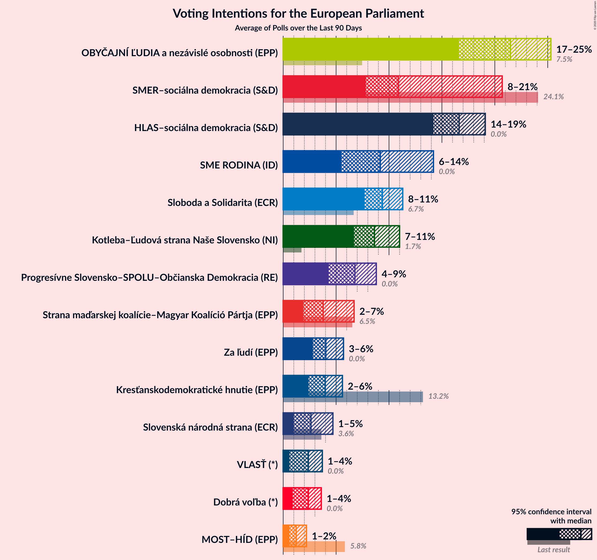

### Confidence Intervals

| Party | Last Result | Median | 80% Confidence Interval | 90% Confidence Interval | 95% Confidence Interval | 99% Confidence Interval |
|:-----:|:-----------:|:------:|:-----------------------:|:-----------------------:|:-----------------------:|:-----------------------:|
| <a href="#smer–sociálna-demokracia-(s&d)">SMER–sociálna demokracia (S&D)</a> | 24.1% | 10.9% | 8.6–19.4% |8.1–20.1% | 7.8–20.7% | 7.2–21.7% |
| <a href="#kresťanskodemokratické-hnutie-(epp)">Kresťanskodemokratické hnutie (EPP)</a> | 13.2% | 4.0% | 2.9–5.1% |2.6–5.4% | 2.4–5.6% | 2.1–6.2% |
| <a href="#obyčajní-ľudia-a-nezávislé-osobnosti-(epp)">OBYČAJNÍ ĽUDIA a nezávislé osobnosti (EPP)</a> | 7.5% | 21.5% | 17.8–24.1% |17.1–24.8% | 16.6–25.3% | 15.7–26.4% |
| <a href="#nova-(ecr)">NOVA (ECR)</a> | 6.8% | N/A | N/A |N/A | N/A | N/A |
| <a href="#sloboda-a-solidarita-(ecr)">Sloboda a Solidarita (ECR)</a> | 6.7% | 9.4% | 8.2–10.6% |7.9–11.0% | 7.7–11.3% | 7.2–11.9% |
| <a href="#strana-maďarskej-koalície–magyar-koalíció-pártja-(epp)">Strana maďarskej koalície–Magyar Koalíció Pártja (EPP)</a> | 6.5% | 3.8% | 2.3–6.0% |2.1–6.3% | 1.9–6.7% | 1.6–7.3% |
| <a href="#most–híd-(epp)">MOST–HÍD (EPP)</a> | 5.8% | 1.2% | 0.8–1.8% |0.7–2.0% | 0.6–2.2% | 0.5–2.6% |
| <a href="#slovenská-národná-strana-(ecr)">Slovenská národná strana (ECR)</a> | 3.6% | 2.6% | 1.3–4.1% |1.2–4.4% | 1.0–4.7% | 0.8–5.2% |
| <a href="#kotleba–ľudová-strana-naše-slovensko-(ni)">Kotleba–Ľudová strana Naše Slovensko (NI)</a> | 1.7% | 8.6% | 7.3–10.2% |7.0–10.6% | 6.7–11.0% | 6.2–11.7% |
| <a href="#progresívne-slovensko-(re)">Progresívne Slovensko (RE)</a> | 0.0% | N/A | N/A |N/A | N/A | N/A |
| <a href="#sme-rodina-(id)">SME RODINA (ID)</a> | 0.0% | 9.2% | 6.3–13.1% |5.8–13.7% | 5.5–14.2% | 5.0–15.1% |
| <a href="#spolu–občianska-demokracia-(epp)">SPOLU–Občianska Demokracia (EPP)</a> | 0.0% | N/A | N/A |N/A | N/A | N/A |
| <a href="#progresívne-slovensko–spolu–občianska-demokracia-(re)">Progresívne Slovensko–SPOLU–Občianska Demokracia (RE)</a> | 0.0% | 6.8% | 5.0–8.1% |4.6–8.5% | 4.3–8.8% | 3.8–9.4% |
| <a href="#za-ľudí-(epp)">Za ľudí (EPP)</a> | 0.0% | 4.0% | 3.1–5.1% |2.9–5.4% | 2.8–5.7% | 2.5–6.2% |
| <a href="#dobrá-voľba-(*)">Dobrá voľba (*)</a> | 0.0% | 2.4% | 1.2–3.2% |1.0–3.4% | 0.9–3.6% | 0.7–4.0% |
| <a href="#vlasť-(*)">VLASŤ (*)</a> | 0.0% | 2.4% | 0.9–3.3% |0.7–3.5% | 0.6–3.7% | 0.4–4.1% |
| <a href="#hlas–sociálna-demokracia-(s&d)">HLAS–sociálna demokracia (S&D)</a> | 0.0% | 16.6% | 15.0–18.2% |14.6–18.7% | 14.2–19.1% | 13.6–19.9% |

### SMER–sociálna demokracia (S&D)

*For a full overview of the results for this party, see the [SMER–sociálna demokracia (S&D)](party-smer–sociálnademokraciasd.html) page.*

| Voting Intentions | Probability | Accumulated | Special Marks |
|:-----------------:|:-----------:|:-----------:|:-------------:|
| 5.5–6.5% | 0.1% | 100% |  |
| 6.5–7.5% | 1.4% | 99.9% |  |
| 7.5–8.5% | 8% | 98.5% |  |
| 8.5–9.5% | 14% | 91% |  |
| 9.5–10.5% | 19% | 76% |  |
| 10.5–11.5% | 20% | 57% | Median |
| 11.5–12.5% | 10% | 37% |  |
| 12.5–13.5% | 2% | 28% |  |
| 13.5–14.5% | 0.2% | 25% |  |
| 14.5–15.5% | 0% | 25% |  |
| 15.5–16.5% | 0.4% | 25% |  |
| 16.5–17.5% | 2% | 25% |  |
| 17.5–18.5% | 6% | 22% |  |
| 18.5–19.5% | 8% | 17% |  |
| 19.5–20.5% | 6% | 9% |  |
| 20.5–21.5% | 2% | 3% |  |
| 21.5–22.5% | 0.6% | 0.6% |  |
| 22.5–23.5% | 0.1% | 0.1% |  |
| 23.5–24.5% | 0% | 0% | Last Result |

### Kresťanskodemokratické hnutie (EPP)

*For a full overview of the results for this party, see the [Kresťanskodemokratické hnutie (EPP)](party-kresťanskodemokratickéhnutieepp.html) page.*

| Voting Intentions | Probability | Accumulated | Special Marks |
|:-----------------:|:-----------:|:-----------:|:-------------:|
| 0.5–1.5% | 0% | 100% |  |
| 1.5–2.5% | 4% | 100% |  |
| 2.5–3.5% | 27% | 96% |  |
| 3.5–4.5% | 44% | 69% | Median |
| 4.5–5.5% | 21% | 24% |  |
| 5.5–6.5% | 3% | 3% |  |
| 6.5–7.5% | 0.1% | 0.1% |  |
| 7.5–8.5% | 0% | 0% |  |
| 8.5–9.5% | 0% | 0% |  |
| 9.5–10.5% | 0% | 0% |  |
| 10.5–11.5% | 0% | 0% |  |
| 11.5–12.5% | 0% | 0% |  |
| 12.5–13.5% | 0% | 0% | Last Result |

### OBYČAJNÍ ĽUDIA a nezávislé osobnosti (EPP)

*For a full overview of the results for this party, see the [OBYČAJNÍ ĽUDIA a nezávislé osobnosti (EPP)](party-obyčajníľudiaanezávisléosobnostiepp.html) page.*

| Voting Intentions | Probability | Accumulated | Special Marks |
|:-----------------:|:-----------:|:-----------:|:-------------:|
| 6.5–7.5% | 0% | 100% | Last Result |
| 7.5–8.5% | 0% | 100% |  |
| 8.5–9.5% | 0% | 100% |  |
| 9.5–10.5% | 0% | 100% |  |
| 10.5–11.5% | 0% | 100% |  |
| 11.5–12.5% | 0% | 100% |  |
| 12.5–13.5% | 0% | 100% |  |
| 13.5–14.5% | 0% | 100% |  |
| 14.5–15.5% | 0.3% | 100% |  |
| 15.5–16.5% | 2% | 99.7% |  |
| 16.5–17.5% | 6% | 98% |  |
| 17.5–18.5% | 8% | 92% |  |
| 18.5–19.5% | 9% | 84% |  |
| 19.5–20.5% | 11% | 75% |  |
| 20.5–21.5% | 16% | 65% | Median |
| 21.5–22.5% | 18% | 49% |  |
| 22.5–23.5% | 15% | 31% |  |
| 23.5–24.5% | 10% | 16% |  |
| 24.5–25.5% | 5% | 6% |  |
| 25.5–26.5% | 1.5% | 2% |  |
| 26.5–27.5% | 0.3% | 0.4% |  |
| 27.5–28.5% | 0% | 0% |  |
| 28.5–29.5% | 0% | 0% |  |

### Sloboda a Solidarita (ECR)

*For a full overview of the results for this party, see the [Sloboda a Solidarita (ECR)](party-slobodaasolidaritaecr.html) page.*

| Voting Intentions | Probability | Accumulated | Special Marks |
|:-----------------:|:-----------:|:-----------:|:-------------:|
| 5.5–6.5% | 0% | 100% |  |
| 6.5–7.5% | 2% | 100% | Last Result |
| 7.5–8.5% | 17% | 98% |  |
| 8.5–9.5% | 40% | 82% | Median |
| 9.5–10.5% | 31% | 41% |  |
| 10.5–11.5% | 9% | 11% |  |
| 11.5–12.5% | 1.2% | 1.3% |  |
| 12.5–13.5% | 0.1% | 0.1% |  |
| 13.5–14.5% | 0% | 0% |  |

### Strana maďarskej koalície–Magyar Koalíció Pártja (EPP)

*For a full overview of the results for this party, see the [Strana maďarskej koalície–Magyar Koalíció Pártja (EPP)](party-stranamaďarskejkoalície–magyarkoalíciópártjaepp.html) page.*

| Voting Intentions | Probability | Accumulated | Special Marks |
|:-----------------:|:-----------:|:-----------:|:-------------:|
| 0.0–0.5% | 0% | 100% |  |
| 0.5–1.5% | 0.3% | 100% |  |
| 1.5–2.5% | 16% | 99.7% |  |
| 2.5–3.5% | 28% | 83% |  |
| 3.5–4.5% | 21% | 55% | Median |
| 4.5–5.5% | 17% | 34% |  |
| 5.5–6.5% | 14% | 17% |  |
| 6.5–7.5% | 3% | 3% | Last Result |
| 7.5–8.5% | 0.2% | 0.2% |  |
| 8.5–9.5% | 0% | 0% |  |

### MOST–HÍD (EPP)

*For a full overview of the results for this party, see the [MOST–HÍD (EPP)](party-most–hídepp.html) page.*

| Voting Intentions | Probability | Accumulated | Special Marks |
|:-----------------:|:-----------:|:-----------:|:-------------:|
| 0.0–0.5% | 1.3% | 100% |  |
| 0.5–1.5% | 75% | 98.7% | Median |
| 1.5–2.5% | 23% | 24% |  |
| 2.5–3.5% | 0.5% | 0.5% |  |
| 3.5–4.5% | 0% | 0% |  |
| 4.5–5.5% | 0% | 0% |  |
| 5.5–6.5% | 0% | 0% | Last Result |

### Slovenská národná strana (ECR)

*For a full overview of the results for this party, see the [Slovenská národná strana (ECR)](party-slovenskánárodnástranaecr.html) page.*

| Voting Intentions | Probability | Accumulated | Special Marks |
|:-----------------:|:-----------:|:-----------:|:-------------:|
| 0.0–0.5% | 0% | 100% |  |
| 0.5–1.5% | 17% | 100% |  |
| 1.5–2.5% | 31% | 83% |  |
| 2.5–3.5% | 29% | 52% | Median |
| 3.5–4.5% | 20% | 24% | Last Result |
| 4.5–5.5% | 3% | 3% |  |
| 5.5–6.5% | 0.1% | 0.1% |  |
| 6.5–7.5% | 0% | 0% |  |

### Kotleba–Ľudová strana Naše Slovensko (NI)

*For a full overview of the results for this party, see the [Kotleba–Ľudová strana Naše Slovensko (NI)](party-kotleba–ľudovástrananašeslovenskoni.html) page.*

| Voting Intentions | Probability | Accumulated | Special Marks |
|:-----------------:|:-----------:|:-----------:|:-------------:|
| 1.5–2.5% | 0% | 100% | Last Result |
| 2.5–3.5% | 0% | 100% |  |
| 3.5–4.5% | 0% | 100% |  |
| 4.5–5.5% | 0% | 100% |  |
| 5.5–6.5% | 2% | 100% |  |
| 6.5–7.5% | 14% | 98% |  |
| 7.5–8.5% | 32% | 84% |  |
| 8.5–9.5% | 31% | 53% | Median |
| 9.5–10.5% | 17% | 22% |  |
| 10.5–11.5% | 5% | 6% |  |
| 11.5–12.5% | 0.7% | 0.8% |  |
| 12.5–13.5% | 0.1% | 0.1% |  |
| 13.5–14.5% | 0% | 0% |  |

### SME RODINA (ID)

*For a full overview of the results for this party, see the [SME RODINA (ID)](party-smerodinaid.html) page.*

| Voting Intentions | Probability | Accumulated | Special Marks |
|:-----------------:|:-----------:|:-----------:|:-------------:|
| 0.0–0.5% | 0% | 100% | Last Result |
| 0.5–1.5% | 0% | 100% |  |
| 1.5–2.5% | 0% | 100% |  |
| 2.5–3.5% | 0% | 100% |  |
| 3.5–4.5% | 0.1% | 100% |  |
| 4.5–5.5% | 3% | 99.9% |  |
| 5.5–6.5% | 11% | 97% |  |
| 6.5–7.5% | 13% | 86% |  |
| 7.5–8.5% | 14% | 73% |  |
| 8.5–9.5% | 13% | 59% | Median |
| 9.5–10.5% | 12% | 45% |  |
| 10.5–11.5% | 9% | 33% |  |
| 11.5–12.5% | 9% | 24% |  |
| 12.5–13.5% | 9% | 15% |  |
| 13.5–14.5% | 5% | 6% |  |
| 14.5–15.5% | 1.2% | 1.4% |  |
| 15.5–16.5% | 0.2% | 0.2% |  |
| 16.5–17.5% | 0% | 0% |  |

### Progresívne Slovensko–SPOLU–Občianska Demokracia (RE)

*For a full overview of the results for this party, see the [Progresívne Slovensko–SPOLU–Občianska Demokracia (RE)](party-progresívneslovensko–spolu–občianskademokraciare.html) page.*

| Voting Intentions | Probability | Accumulated | Special Marks |
|:-----------------:|:-----------:|:-----------:|:-------------:|
| 0.0–0.5% | 0% | 100% | Last Result |
| 0.5–1.5% | 0% | 100% |  |
| 1.5–2.5% | 0% | 100% |  |
| 2.5–3.5% | 0.1% | 100% |  |
| 3.5–4.5% | 5% | 99.9% |  |
| 4.5–5.5% | 15% | 95% |  |
| 5.5–6.5% | 23% | 81% |  |
| 6.5–7.5% | 34% | 57% | Median |
| 7.5–8.5% | 19% | 23% |  |
| 8.5–9.5% | 4% | 4% |  |
| 9.5–10.5% | 0.3% | 0.3% |  |
| 10.5–11.5% | 0% | 0% |  |

### Za ľudí (EPP)

*For a full overview of the results for this party, see the [Za ľudí (EPP)](party-zaľudíepp.html) page.*

| Voting Intentions | Probability | Accumulated | Special Marks |
|:-----------------:|:-----------:|:-----------:|:-------------:|
| 0.0–0.5% | 0% | 100% | Last Result |
| 0.5–1.5% | 0% | 100% |  |
| 1.5–2.5% | 0.8% | 100% |  |
| 2.5–3.5% | 25% | 99.2% |  |
| 3.5–4.5% | 49% | 74% | Median |
| 4.5–5.5% | 21% | 25% |  |
| 5.5–6.5% | 3% | 3% |  |
| 6.5–7.5% | 0.2% | 0.2% |  |
| 7.5–8.5% | 0% | 0% |  |

### Dobrá voľba (*)

*For a full overview of the results for this party, see the [Dobrá voľba (*)](party-dobrávoľba.html) page.*

| Voting Intentions | Probability | Accumulated | Special Marks |
|:-----------------:|:-----------:|:-----------:|:-------------:|
| 0.0–0.5% | 0.1% | 100% | Last Result |
| 0.5–1.5% | 19% | 99.9% |  |
| 1.5–2.5% | 43% | 81% | Median |
| 2.5–3.5% | 35% | 38% |  |
| 3.5–4.5% | 3% | 3% |  |
| 4.5–5.5% | 0% | 0% |  |
| 5.5–6.5% | 0% | 0% |  |

### VLASŤ (*)

*For a full overview of the results for this party, see the [VLASŤ (*)](party-vlasť.html) page.*

| Voting Intentions | Probability | Accumulated | Special Marks |
|:-----------------:|:-----------:|:-----------:|:-------------:|
| 0.0–0.5% | 2% | 100% | Last Result |
| 0.5–1.5% | 24% | 98% |  |
| 1.5–2.5% | 35% | 75% | Median |
| 2.5–3.5% | 36% | 40% |  |
| 3.5–4.5% | 4% | 4% |  |
| 4.5–5.5% | 0.1% | 0.1% |  |
| 5.5–6.5% | 0% | 0% |  |

### HLAS–sociálna demokracia (S&D)

*For a full overview of the results for this party, see the [HLAS–sociálna demokracia (S&D)](party-hlas–sociálnademokraciasd.html) page.*

| Voting Intentions | Probability | Accumulated | Special Marks |
|:-----------------:|:-----------:|:-----------:|:-------------:|
| 0.0–0.5% | 0% | 100% | Last Result |
| 0.5–1.5% | 0% | 100% |  |
| 1.5–2.5% | 0% | 100% |  |
| 2.5–3.5% | 0% | 100% |  |
| 3.5–4.5% | 0% | 100% |  |
| 4.5–5.5% | 0% | 100% |  |
| 5.5–6.5% | 0% | 100% |  |
| 6.5–7.5% | 0% | 100% |  |
| 7.5–8.5% | 0% | 100% |  |
| 8.5–9.5% | 0% | 100% |  |
| 9.5–10.5% | 0% | 100% |  |
| 10.5–11.5% | 0% | 100% |  |
| 11.5–12.5% | 0% | 100% |  |
| 12.5–13.5% | 0.5% | 100% |  |
| 13.5–14.5% | 4% | 99.5% |  |
| 14.5–15.5% | 15% | 95% |  |
| 15.5–16.5% | 29% | 80% |  |
| 16.5–17.5% | 29% | 52% | Median |
| 17.5–18.5% | 16% | 23% |  |
| 18.5–19.5% | 5% | 6% |  |
| 19.5–20.5% | 1.0% | 1.1% |  |
| 20.5–21.5% | 0.1% | 0.1% |  |
| 21.5–22.5% | 0% | 0% |  |

## Seats

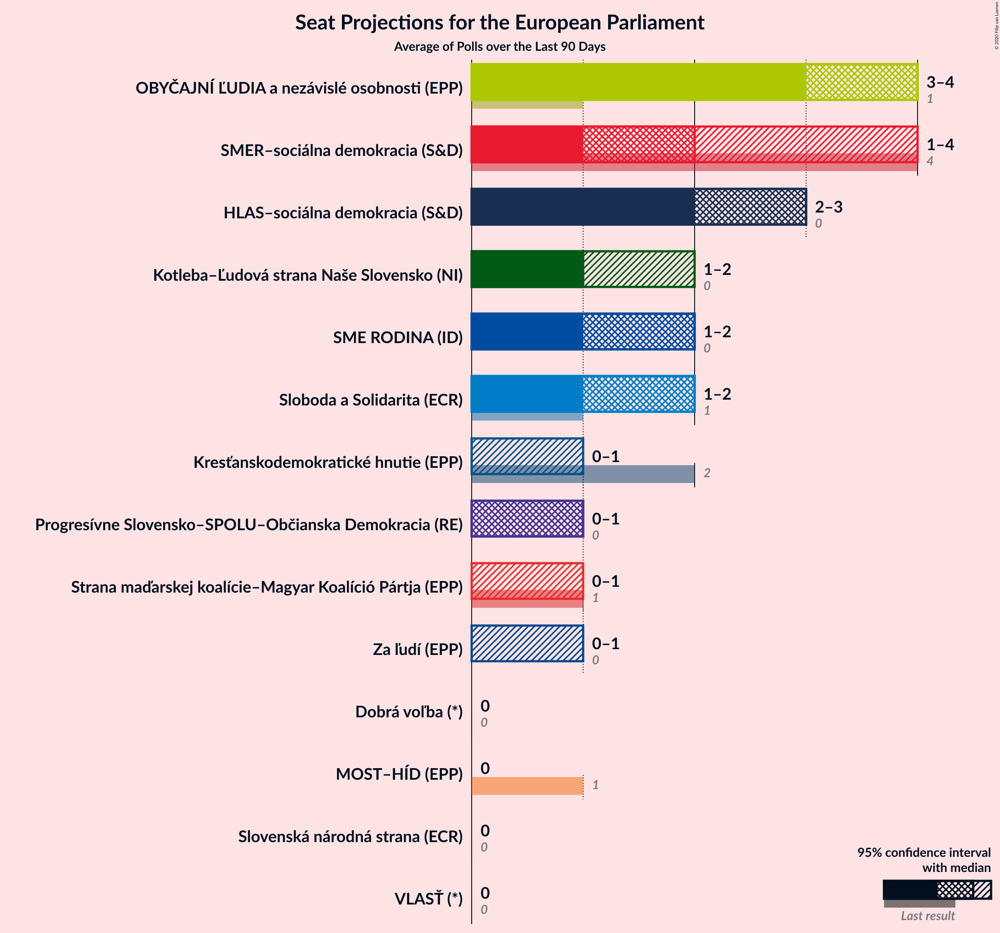

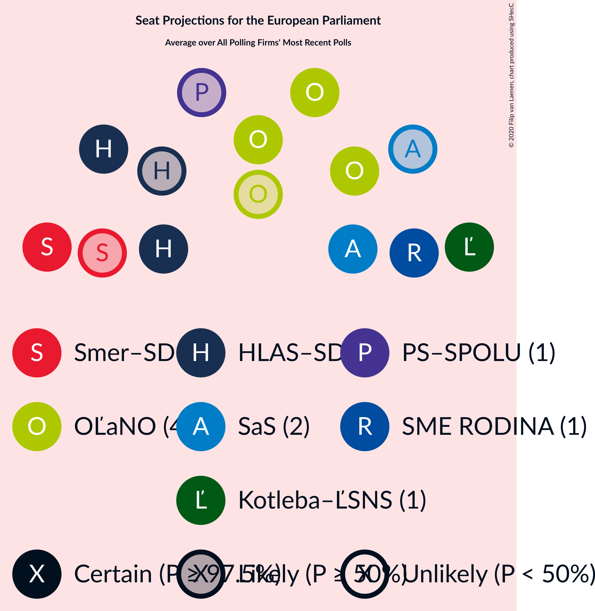

### Confidence Intervals

| Party | Last Result | Median | 80% Confidence Interval | 90% Confidence Interval | 95% Confidence Interval | 99% Confidence Interval |
|:-----:|:-----------:|:------:|:-----------------------:|:-----------------------:|:-----------------------:|:-----------------------:|
| <a href="#smer–sociálna-demokracia-(s&d)">SMER–sociálna demokracia (S&D)</a> | 4 | 2 | 1–4 |1–4 | 1–4 | 1–4 |
| <a href="#kresťanskodemokratické-hnutie-(epp)">Kresťanskodemokratické hnutie (EPP)</a> | 2 | 0 | 0 |0–1 | 0–1 | 0–1 |
| <a href="#obyčajní-ľudia-a-nezávislé-osobnosti-(epp)">OBYČAJNÍ ĽUDIA a nezávislé osobnosti (EPP)</a> | 1 | 4 | 3–4 |3–4 | 3–4 | 3–4 |
| <a href="#nova-(ecr)">NOVA (ECR)</a> | 1 | N/A | N/A |N/A | N/A | N/A |
| <a href="#sloboda-a-solidarita-(ecr)">Sloboda a Solidarita (ECR)</a> | 1 | 2 | 1–2 |1–2 | 1–2 | 1–2 |
| <a href="#strana-maďarskej-koalície–magyar-koalíció-pártja-(epp)">Strana maďarskej koalície–Magyar Koalíció Pártja (EPP)</a> | 1 | 0 | 0–1 |0–1 | 0–1 | 0–1 |
| <a href="#most–híd-(epp)">MOST–HÍD (EPP)</a> | 1 | 0 | 0 |0 | 0 | 0 |
| <a href="#slovenská-národná-strana-(ecr)">Slovenská národná strana (ECR)</a> | 0 | 0 | 0 |0 | 0 | 0 |
| <a href="#kotleba–ľudová-strana-naše-slovensko-(ni)">Kotleba–Ľudová strana Naše Slovensko (NI)</a> | 0 | 1 | 1–2 |1–2 | 1–2 | 1–2 |
| <a href="#progresívne-slovensko-(re)">Progresívne Slovensko (RE)</a> | 0 | N/A | N/A |N/A | N/A | N/A |
| <a href="#sme-rodina-(id)">SME RODINA (ID)</a> | 0 | 2 | 1–2 |1–2 | 1–2 | 1–3 |
| <a href="#spolu–občianska-demokracia-(epp)">SPOLU–Občianska Demokracia (EPP)</a> | 0 | N/A | N/A |N/A | N/A | N/A |
| <a href="#progresívne-slovensko–spolu–občianska-demokracia-(re)">Progresívne Slovensko–SPOLU–Občianska Demokracia (RE)</a> | 0 | 1 | 0–1 |0–1 | 0–1 | 0–2 |
| <a href="#za-ľudí-(epp)">Za ľudí (EPP)</a> | 0 | 0 | 0–1 |0–1 | 0–1 | 0–1 |
| <a href="#dobrá-voľba-(*)">Dobrá voľba (*)</a> | 0 | 0 | 0 |0 | 0 | 0 |
| <a href="#vlasť-(*)">VLASŤ (*)</a> | 0 | 0 | 0 |0 | 0 | 0 |
| <a href="#hlas–sociálna-demokracia-(s&d)">HLAS–sociálna demokracia (S&D)</a> | 0 | 3 | 2–3 |2–3 | 2–3 | 2–4 |

### SMER–sociálna demokracia (S&D)

*For a full overview of the results for this party, see the [SMER–sociálna demokracia (S&D)](party-smer–sociálnademokraciasd.html) page.*

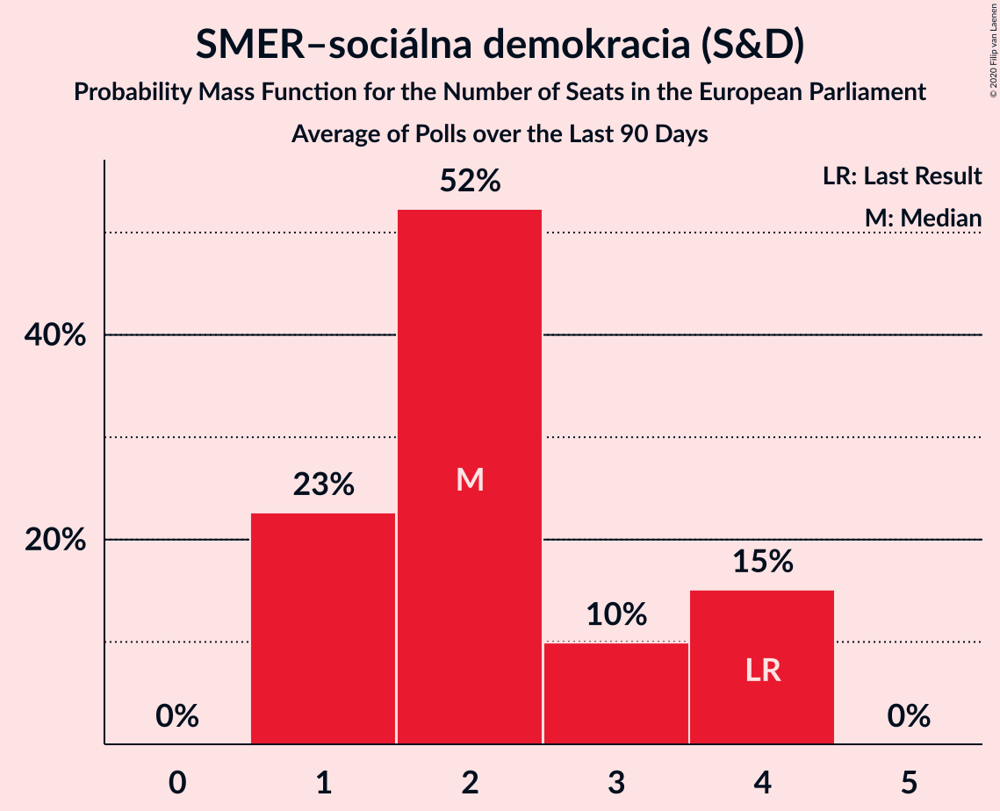

| Number of Seats | Probability | Accumulated | Special Marks |
|:---------------:|:-----------:|:-----------:|:-------------:|
| 1 | 23% | 100% |  |
| 2 | 52% | 77% | Median |
| 3 | 10% | 25% |  |
| 4 | 15% | 15% | Last Result |
| 5 | 0% | 0% |  |

### Kresťanskodemokratické hnutie (EPP)

*For a full overview of the results for this party, see the [Kresťanskodemokratické hnutie (EPP)](party-kresťanskodemokratickéhnutieepp.html) page.*

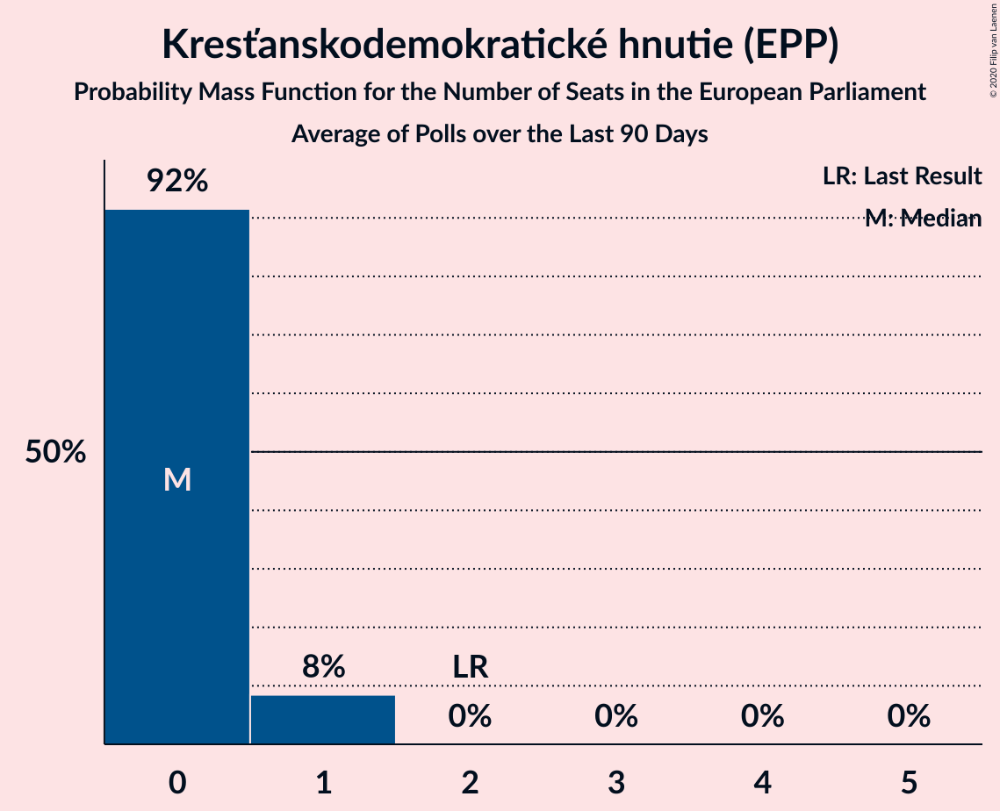

| Number of Seats | Probability | Accumulated | Special Marks |
|:---------------:|:-----------:|:-----------:|:-------------:|
| 0 | 92% | 100% | Median |
| 1 | 8% | 8% |  |
| 2 | 0% | 0% | Last Result |

### OBYČAJNÍ ĽUDIA a nezávislé osobnosti (EPP)

*For a full overview of the results for this party, see the [OBYČAJNÍ ĽUDIA a nezávislé osobnosti (EPP)](party-obyčajníľudiaanezávisléosobnostiepp.html) page.*

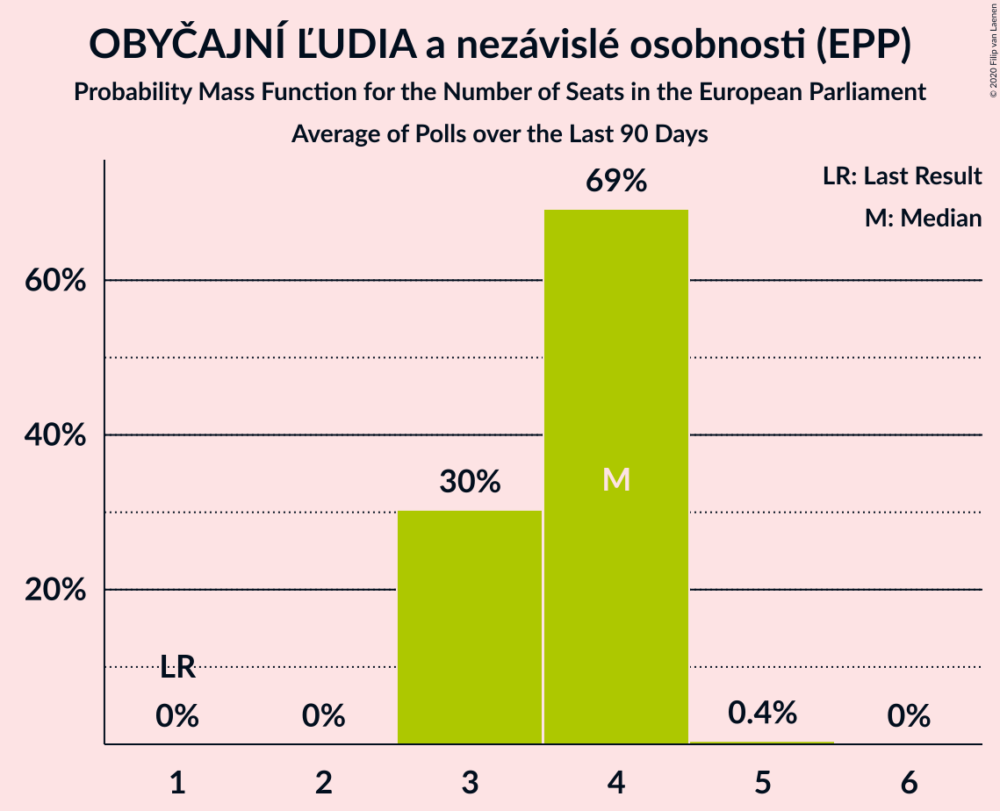

| Number of Seats | Probability | Accumulated | Special Marks |
|:---------------:|:-----------:|:-----------:|:-------------:|
| 1 | 0% | 100% | Last Result |
| 2 | 0% | 100% |  |
| 3 | 30% | 100% |  |
| 4 | 69% | 70% | Median |
| 5 | 0.4% | 0.4% |  |
| 6 | 0% | 0% |  |

### NOVA (ECR)

*For a full overview of the results for this party, see the [NOVA (ECR)](party-novaecr.html) page.*

### Sloboda a Solidarita (ECR)

*For a full overview of the results for this party, see the [Sloboda a Solidarita (ECR)](party-slobodaasolidaritaecr.html) page.*

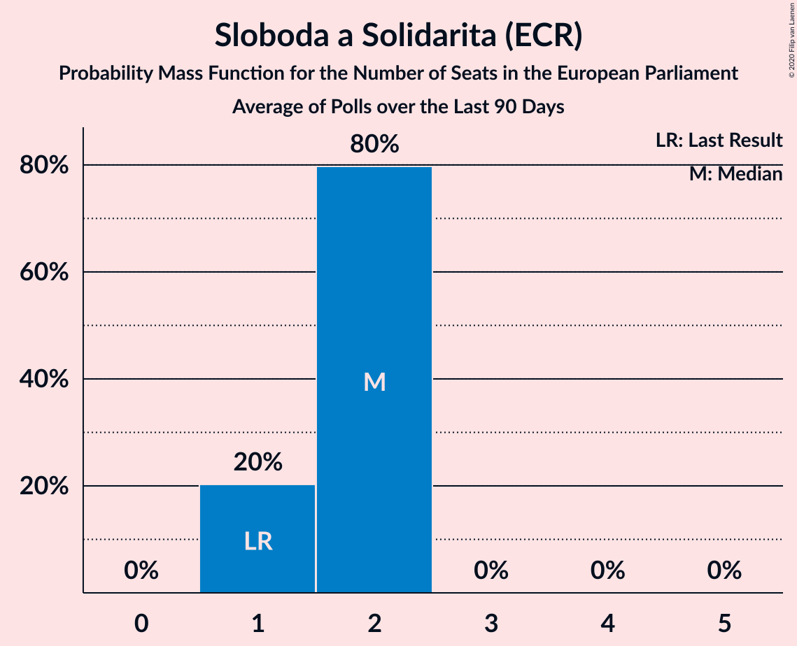

| Number of Seats | Probability | Accumulated | Special Marks |
|:---------------:|:-----------:|:-----------:|:-------------:|
| 1 | 20% | 100% | Last Result |
| 2 | 80% | 80% | Median |
| 3 | 0% | 0% |  |

### Strana maďarskej koalície–Magyar Koalíció Pártja (EPP)

*For a full overview of the results for this party, see the [Strana maďarskej koalície–Magyar Koalíció Pártja (EPP)](party-stranamaďarskejkoalície–magyarkoalíciópártjaepp.html) page.*

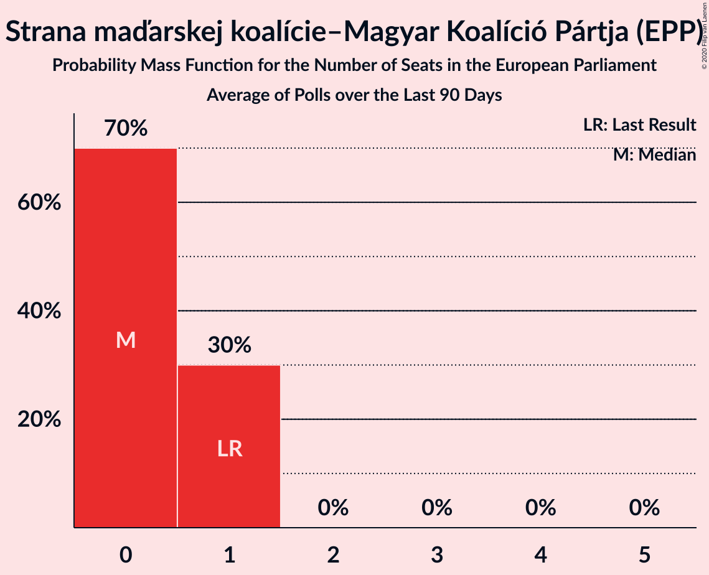

| Number of Seats | Probability | Accumulated | Special Marks |
|:---------------:|:-----------:|:-----------:|:-------------:|
| 0 | 70% | 100% | Median |
| 1 | 30% | 30% | Last Result |
| 2 | 0% | 0% |  |

### MOST–HÍD (EPP)

*For a full overview of the results for this party, see the [MOST–HÍD (EPP)](party-most–hídepp.html) page.*

| Number of Seats | Probability | Accumulated | Special Marks |
|:---------------:|:-----------:|:-----------:|:-------------:|
| 0 | 100% | 100% | Median |
| 1 | 0% | 0% | Last Result |

### Slovenská národná strana (ECR)

*For a full overview of the results for this party, see the [Slovenská národná strana (ECR)](party-slovenskánárodnástranaecr.html) page.*

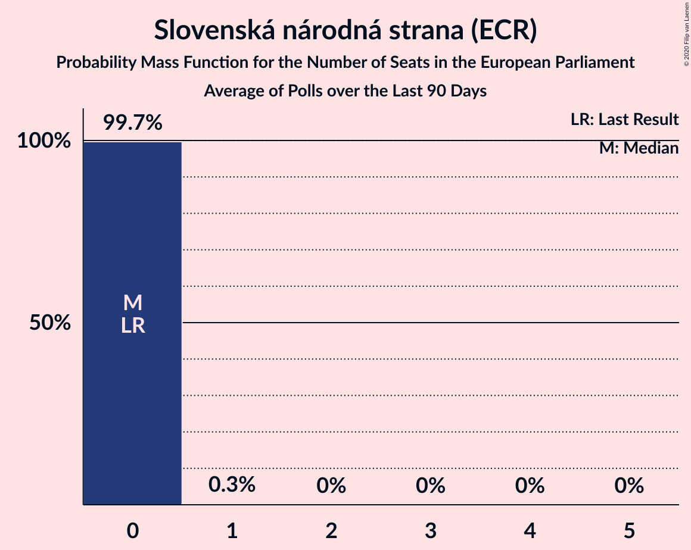

| Number of Seats | Probability | Accumulated | Special Marks |
|:---------------:|:-----------:|:-----------:|:-------------:|
| 0 | 99.7% | 100% | Last Result, Median |
| 1 | 0.3% | 0.3% |  |
| 2 | 0% | 0% |  |

### Kotleba–Ľudová strana Naše Slovensko (NI)

*For a full overview of the results for this party, see the [Kotleba–Ľudová strana Naše Slovensko (NI)](party-kotleba–ľudovástrananašeslovenskoni.html) page.*

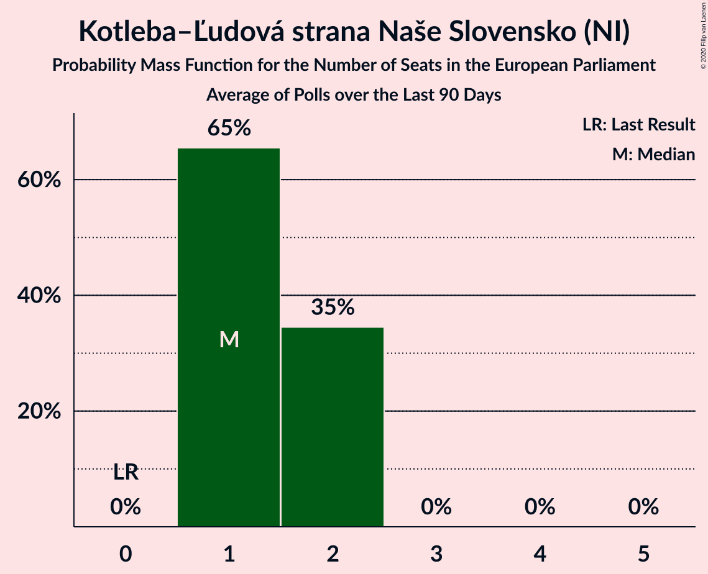

| Number of Seats | Probability | Accumulated | Special Marks |
|:---------------:|:-----------:|:-----------:|:-------------:|
| 0 | 0% | 100% | Last Result |
| 1 | 65% | 100% | Median |
| 2 | 35% | 35% |  |
| 3 | 0% | 0% |  |

### Progresívne Slovensko (RE)

*For a full overview of the results for this party, see the [Progresívne Slovensko (RE)](party-progresívneslovenskore.html) page.*

### SME RODINA (ID)

*For a full overview of the results for this party, see the [SME RODINA (ID)](party-smerodinaid.html) page.*

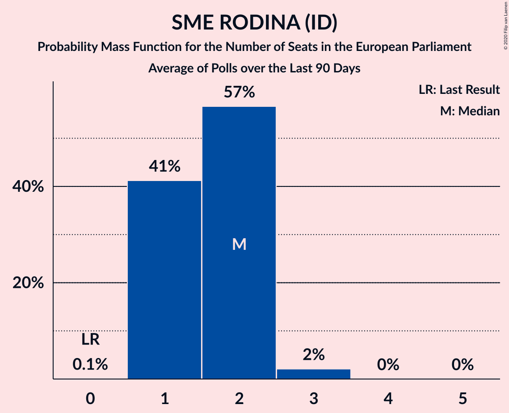

| Number of Seats | Probability | Accumulated | Special Marks |
|:---------------:|:-----------:|:-----------:|:-------------:|
| 0 | 0.1% | 100% | Last Result |
| 1 | 41% | 99.9% |  |
| 2 | 57% | 59% | Median |
| 3 | 2% | 2% |  |
| 4 | 0% | 0% |  |

### SPOLU–Občianska Demokracia (EPP)

*For a full overview of the results for this party, see the [SPOLU–Občianska Demokracia (EPP)](party-spolu–občianskademokraciaepp.html) page.*

### Progresívne Slovensko–SPOLU–Občianska Demokracia (RE)

*For a full overview of the results for this party, see the [Progresívne Slovensko–SPOLU–Občianska Demokracia (RE)](party-progresívneslovensko–spolu–občianskademokraciare.html) page.*

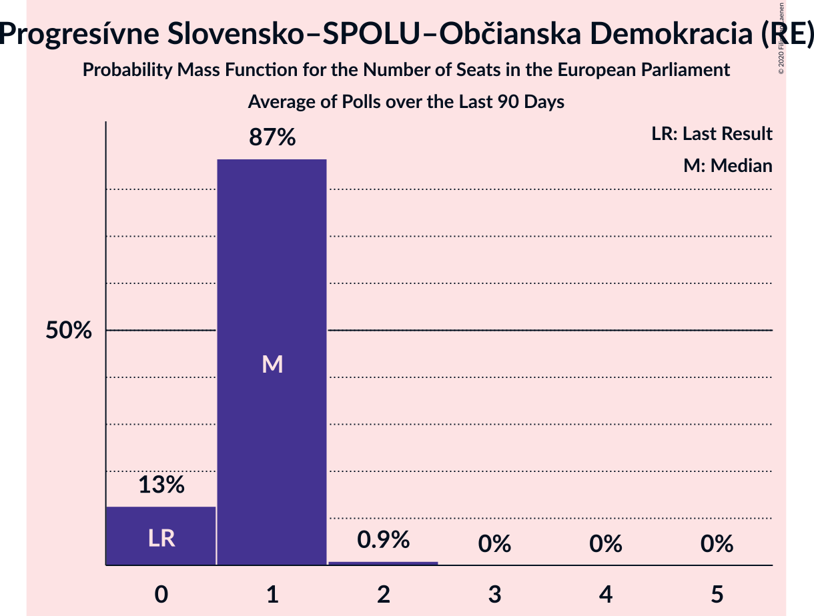

| Number of Seats | Probability | Accumulated | Special Marks |
|:---------------:|:-----------:|:-----------:|:-------------:|
| 0 | 13% | 100% | Last Result |
| 1 | 87% | 87% | Median |
| 2 | 0.9% | 0.9% |  |
| 3 | 0% | 0% |  |

### Za ľudí (EPP)

*For a full overview of the results for this party, see the [Za ľudí (EPP)](party-zaľudíepp.html) page.*

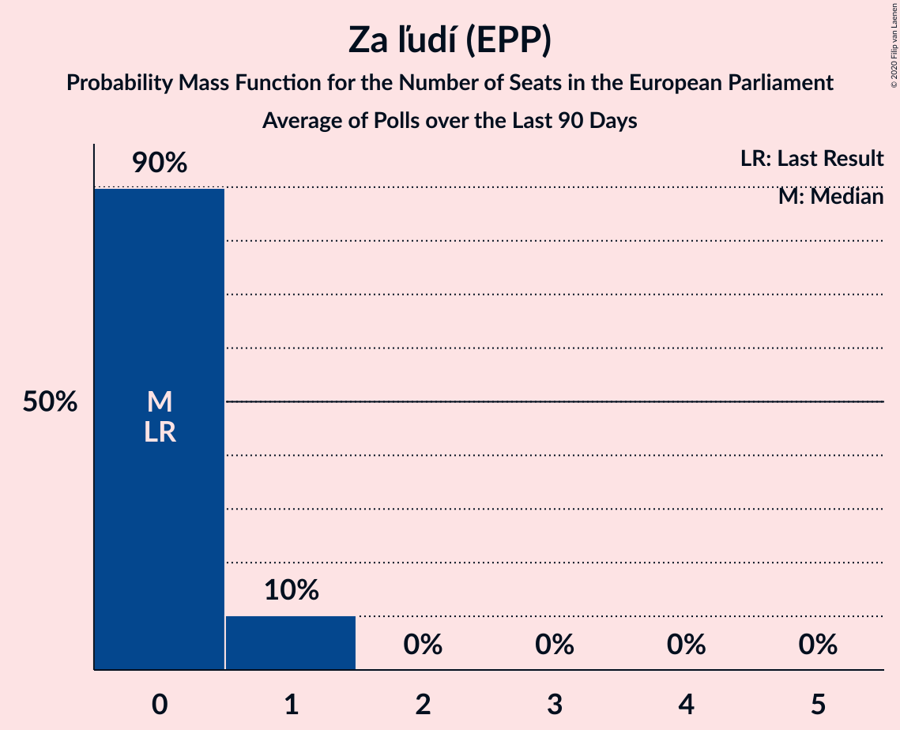

| Number of Seats | Probability | Accumulated | Special Marks |
|:---------------:|:-----------:|:-----------:|:-------------:|
| 0 | 90% | 100% | Last Result, Median |
| 1 | 10% | 10% |  |
| 2 | 0% | 0% |  |

### Dobrá voľba (*)

*For a full overview of the results for this party, see the [Dobrá voľba (*)](party-dobrávoľba.html) page.*

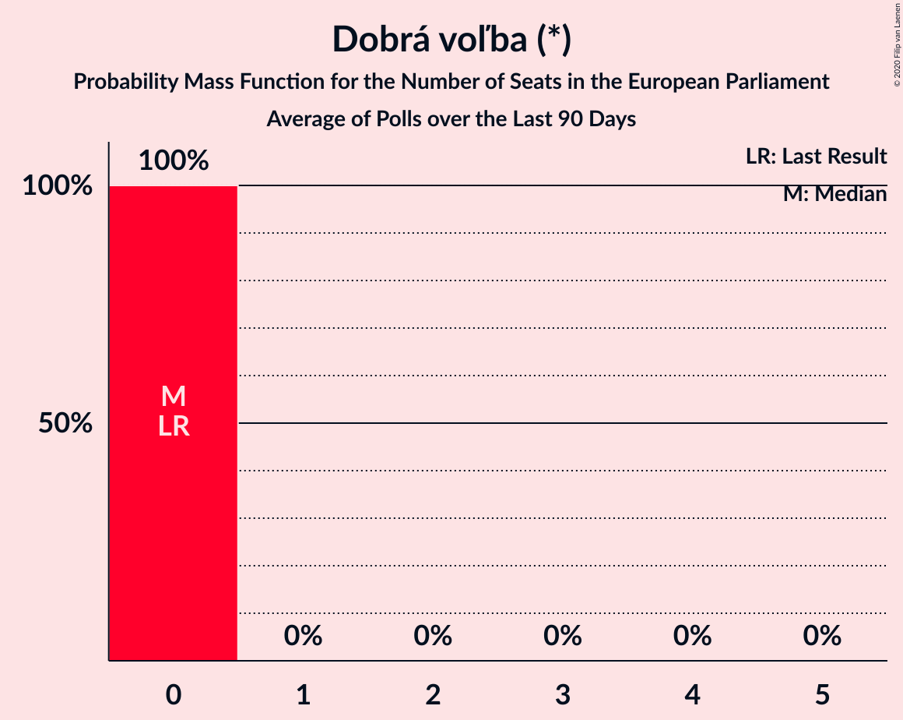

| Number of Seats | Probability | Accumulated | Special Marks |
|:---------------:|:-----------:|:-----------:|:-------------:|
| 0 | 100% | 100% | Last Result, Median |

### VLASŤ (*)

*For a full overview of the results for this party, see the [VLASŤ (*)](party-vlasť.html) page.*

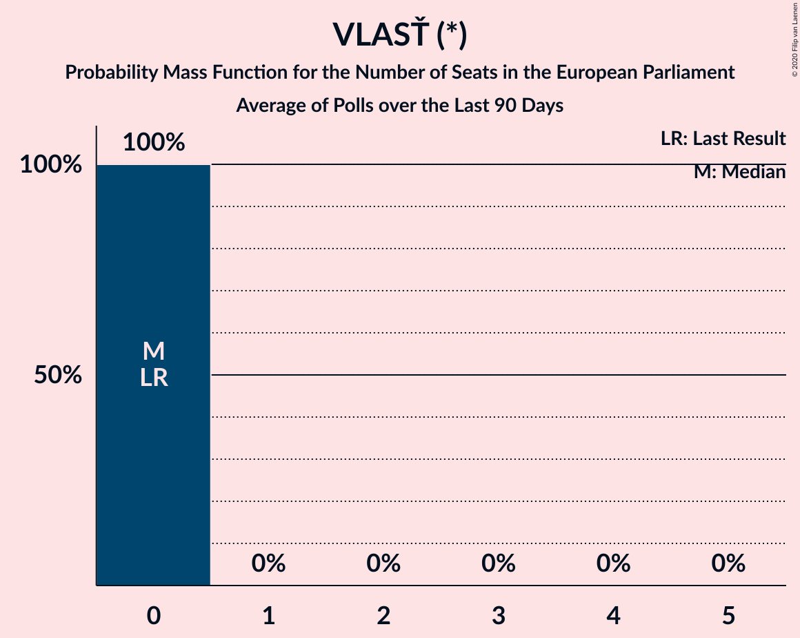

| Number of Seats | Probability | Accumulated | Special Marks |
|:---------------:|:-----------:|:-----------:|:-------------:|
| 0 | 100% | 100% | Last Result, Median |

### HLAS–sociálna demokracia (S&D)

*For a full overview of the results for this party, see the [HLAS–sociálna demokracia (S&D)](party-hlas–sociálnademokraciasd.html) page.*

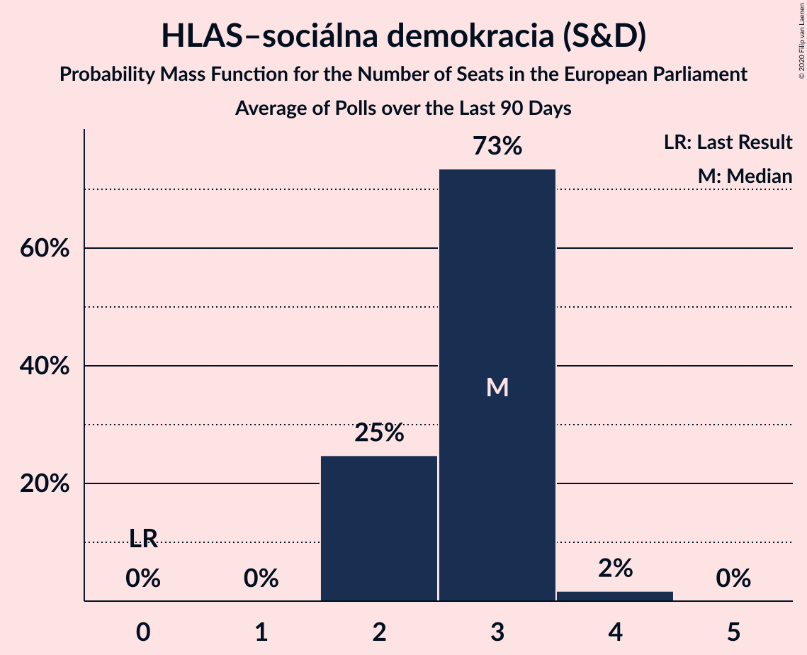

| Number of Seats | Probability | Accumulated | Special Marks |
|:---------------:|:-----------:|:-----------:|:-------------:|
| 0 | 0% | 100% | Last Result |
| 1 | 0% | 100% |  |
| 2 | 25% | 100% |  |
| 3 | 73% | 75% | Median |
| 4 | 2% | 2% |  |
| 5 | 0% | 0% |  |

## Coalitions

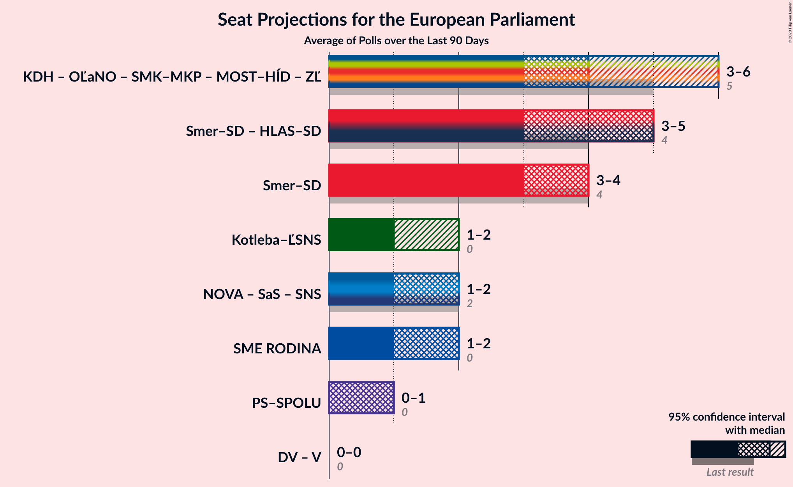

### Confidence Intervals

| Coalition | Last Result | Median | Majority? | 80% Confidence Interval | 90% Confidence Interval | 95% Confidence Interval | 99% Confidence Interval |
|:---------:|:-----------:|:------:|:---------:|:-----------------------:|:-----------------------:|:-----------------------:|:-----------------------:|
| Kresťanskodemokratické hnutie (EPP) – OBYČAJNÍ ĽUDIA a nezávislé osobnosti (EPP) – Strana maďarskej koalície–Magyar Koalíció Pártja (EPP) – MOST–HÍD (EPP) – Za ľudí (EPP) | 5 | 4 | 0% | 3–5 | 3–6 | 3–6 | 3–6 |
| SMER–sociálna demokracia (S&D) – HLAS–sociálna demokracia (S&D) | 4 | 5 | 0% | 3–5 | 3–5 | 3–5 | 3–6 |
| SMER–sociálna demokracia (S&D) | 4 | 4 | 0% | 3–4 | 3–4 | 3–4 | 3–4 |
| Kotleba–Ľudová strana Naše Slovensko (NI) | 0 | 1 | 0% | 1–2 | 1–2 | 1–2 | 1–2 |
| NOVA (ECR) – Sloboda a Solidarita (ECR) – Slovenská národná strana (ECR) | 2 | 2 | 0% | 1–2 | 1–2 | 1–2 | 1–2 |
| SME RODINA (ID) | 0 | 2 | 0% | 1–2 | 1–2 | 1–2 | 1–3 |
| Progresívne Slovensko–SPOLU–Občianska Demokracia (RE) | 0 | 1 | 0% | 0–1 | 0–1 | 0–1 | 0–2 |
| Dobrá voľba (*) – VLASŤ (*) | 0 | 0 | 0% | 0 | 0 | 0 | 0 |

### Kresťanskodemokratické hnutie (EPP) – OBYČAJNÍ ĽUDIA a nezávislé osobnosti (EPP) – Strana maďarskej koalície–Magyar Koalíció Pártja (EPP) – MOST–HÍD (EPP) – Za ľudí (EPP)

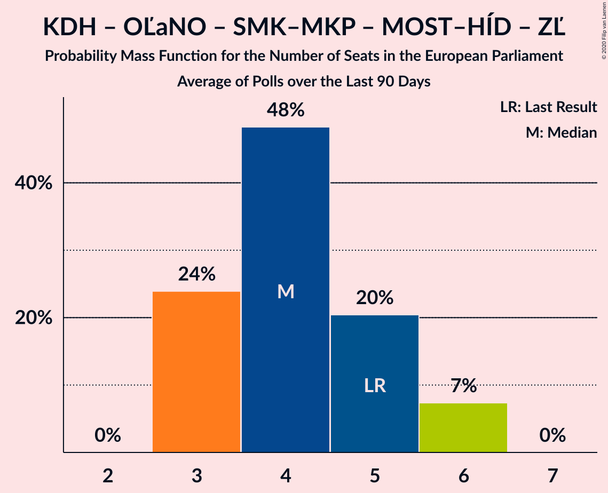

| Number of Seats | Probability | Accumulated | Special Marks |
|:---------------:|:-----------:|:-----------:|:-------------:|
| 3 | 24% | 100% |  |
| 4 | 48% | 76% | Median |
| 5 | 20% | 28% | Last Result |
| 6 | 7% | 7% |  |
| 7 | 0% | 0% |  |

### SMER–sociálna demokracia (S&D) – HLAS–sociálna demokracia (S&D)

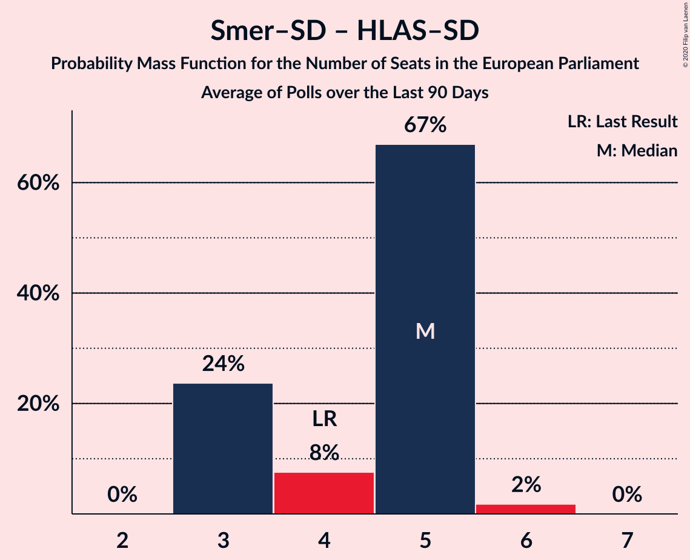

| Number of Seats | Probability | Accumulated | Special Marks |
|:---------------:|:-----------:|:-----------:|:-------------:|
| 3 | 24% | 100% |  |
| 4 | 8% | 76% | Last Result |
| 5 | 67% | 69% | Median |
| 6 | 2% | 2% |  |
| 7 | 0% | 0% |  |

### SMER–sociálna demokracia (S&D)

| Number of Seats | Probability | Accumulated | Special Marks |
|:---------------:|:-----------:|:-----------:|:-------------:|
| 3 | 40% | 100% |  |
| 4 | 60% | 60% | Last Result |
| 5 | 0% | 0% |  |

### Kotleba–Ľudová strana Naše Slovensko (NI)

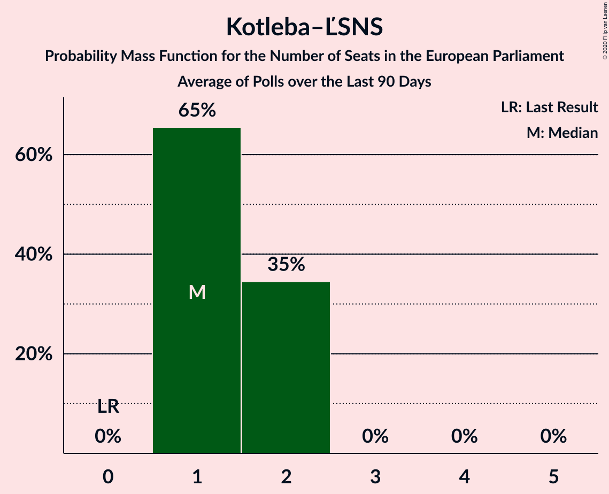

| Number of Seats | Probability | Accumulated | Special Marks |
|:---------------:|:-----------:|:-----------:|:-------------:|
| 0 | 0% | 100% | Last Result |
| 1 | 65% | 100% | Median |
| 2 | 35% | 35% |  |
| 3 | 0% | 0% |  |

### NOVA (ECR) – Sloboda a Solidarita (ECR) – Slovenská národná strana (ECR)

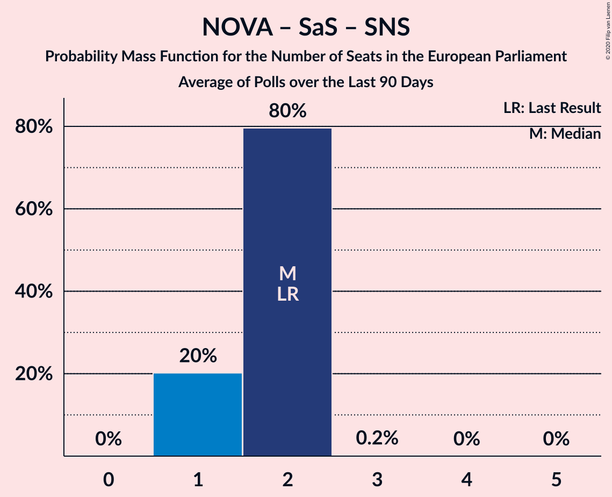

| Number of Seats | Probability | Accumulated | Special Marks |
|:---------------:|:-----------:|:-----------:|:-------------:|
| 1 | 20% | 100% |  |
| 2 | 80% | 80% | Last Result, Median |
| 3 | 0.2% | 0.2% |  |
| 4 | 0% | 0% |  |

### SME RODINA (ID)

| Number of Seats | Probability | Accumulated | Special Marks |
|:---------------:|:-----------:|:-----------:|:-------------:|
| 0 | 0.1% | 100% | Last Result |
| 1 | 41% | 99.9% |  |
| 2 | 57% | 59% | Median |
| 3 | 2% | 2% |  |
| 4 | 0% | 0% |  |

### Progresívne Slovensko–SPOLU–Občianska Demokracia (RE)

| Number of Seats | Probability | Accumulated | Special Marks |
|:---------------:|:-----------:|:-----------:|:-------------:|
| 0 | 13% | 100% | Last Result |
| 1 | 87% | 87% | Median |
| 2 | 0.9% | 0.9% |  |
| 3 | 0% | 0% |  |

### Dobrá voľba (*) – VLASŤ (*)

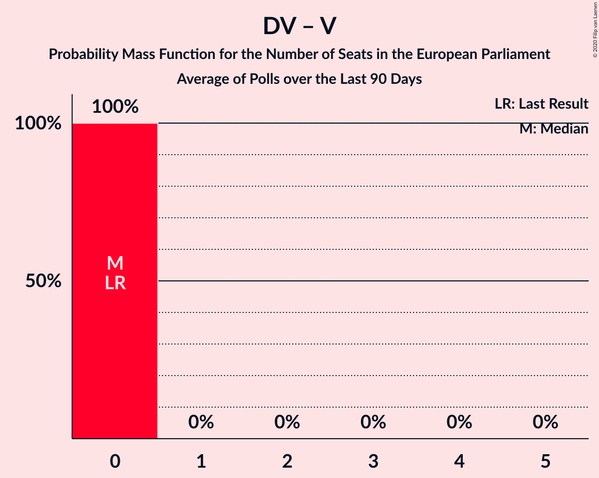

| Number of Seats | Probability | Accumulated | Special Marks |
|:---------------:|:-----------:|:-----------:|:-------------:|
| 0 | 100% | 100% | Last Result, Median |

## Technical Information

+ **Number of polls included in this average:** 4
+ **Lowest number of simulations done in a poll included in this average:** 1,048,576
+ **Total number of simulations done in the polls included in this average:** 4,194,304
+ **Error estimate:** 3.25%
