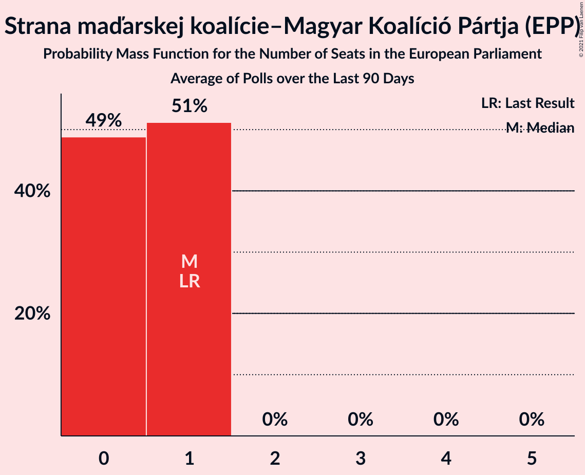

# Poll Average

<a href="#voting-intentions">Voting Intentions</a> | <a href="#seats">Seats</a> | <a href="#coalitions">Coalitions</a> | <a href="#technical-information">Technical Information</a>

## Summary

The table below lists the polls on which the average is based. They are the most recent polls (less than 90 days old) registered and analyzed so far.

| Period     | Polling firm/Commissioner(s) | Smer–SD | KDH | OĽaNO | NOVA | SaS | SMK–MKP | MOST–HÍD | SNS | Kotleba–ĽSNS | PS | SME RODINA | SPOLU | PS–SPOLU | ZĽ | DV | V | HLAS–SD | REP |
|:----------:|:----------------------------:|:--:|:--:|:--:|:--:|:--:|:--:|:--:|:--:|:--:|:--:|:--:|:--:|:--:|:--:|:--:|:--:|:--:|:--:|
| 25 May 2019 | General Election | 24.1%   4 | 13.2%   2 | 7.5%   1 | 6.8%   1 | 6.7%   1 | 6.5%   1 | 5.8%   1 | 3.6%   0 | 1.7%   0 | 0.0%   0 | 0.0%   0 | 0.0%   0 | 0.0%   0 | 0.0%   0 | 0.0%   0 | 0.0%   0 | 0.0%   0 | 0.0%   0 |
| N/A | Poll Average | 8–13%   1–2 | 4–7%   0–1 | 8–12%   1–2 | N/A   N/A | 9–15%   2–3 | 3–6%   0–1 | N/A   N/A | 1–4%   0 | 2–6%   0–1 | N/A   N/A | 6–11%   1–2 | N/A   N/A | 6–11%   1–2 | 3–5%   0 | 1–4%   0 | 0–4%   0 | 20–25%   4–5 | 3–6%   0–1 |
| [11–19 May 2021](2021-05-19-FOCUS.html) | FOCUS | 10–14%   2–3 | 4–7%   0–1 | 7–11%   1–2 | N/A   N/A | 10–14%   2–3 | 4–6%   0–1 | N/A   N/A | 2–5%   0 | 4–6%   0–1 | N/A   N/A | 6–9%   1–2 | N/A   N/A | 6–9%   1–2 | 2–5%   0 | 1–2%   0 | N/A   N/A | 20–25%   3–5 | 3–6%   0–1 |
| [13–17 May 2021](2021-05-17-AKO.html) | AKO | 8–11%   1–2 | 4–6%   0 | 8–12%   2 | N/A   N/A | 12–16%   2–3 | 4–7%   1 | N/A   N/A | 1–3%   0 | 1–3%   0 | N/A   N/A | 6–9%   1 | N/A   N/A | 8–12%   1–2 | 3–5%   0 | 2–4%   0 | 2–5%   0 | 20–25%   4 | 2–5%   0 |
| [27–31 March 2021](2021-03-31-Actly.html) | Actly | 9–13%   1–2 | 4–7%   0–1 | 8–12%   1–2 | N/A   N/A | 9–12%   1–2 | 3–6%   0–1 | N/A   N/A | 2–4%   0 | 2–4%   0 | N/A   N/A | 8–11%   1–2 | N/A   N/A | 7–10%   1–2 | 3–5%   0 | 1–3%   0 | 0–1%   0 | 20–25%   4–5 | 4–6%   0–1 |
| 25 May 2019 | General Election | 24.1%   4 | 13.2%   2 | 7.5%   1 | 6.8%   1 | 6.7%   1 | 6.5%   1 | 5.8%   1 | 3.6%   0 | 1.7%   0 | 0.0%   0 | 0.0%   0 | 0.0%   0 | 0.0%   0 | 0.0%   0 | 0.0%   0 | 0.0%   0 | 0.0%   0 | 0.0%   0 |

Only polls for which at least the sample size has been published are included in the table above.

**Legend:**
+ **Top half of each row:** Voting intentions (95% confidence interval)
+ **Bottom half of each row:** Seat projections for the European Parliament (95% confidence interval)
+ **Smer–SD:** SMER–sociálna demokracia (S&D)
+ **KDH:** Kresťanskodemokratické hnutie (EPP)
+ **OĽaNO:** OBYČAJNÍ ĽUDIA a nezávislé osobnosti (EPP)
+ **NOVA:** NOVA (ECR)
+ **SaS:** Sloboda a Solidarita (ECR)
+ **SMK–MKP:** Strana maďarskej koalície–Magyar Koalíció Pártja (EPP)
+ **MOST–HÍD:** MOST–HÍD (EPP)
+ **SNS:** Slovenská národná strana (ECR)
+ **Kotleba–ĽSNS:** Kotleba–Ľudová strana Naše Slovensko (NI)
+ **PS:** Progresívne Slovensko (RE)
+ **SME RODINA:** SME RODINA (ID)
+ **SPOLU:** SPOLU–Občianska Demokracia (EPP)
+ **PS–SPOLU:** Progresívne Slovensko–SPOLU–Občianska Demokracia (RE)
+ **ZĽ:** Za ľudí (EPP)
+ **DV:** Dobrá voľba (*)
+ **V:** VLASŤ (*)
+ **HLAS–SD:** HLAS–sociálna demokracia (S&D)
+ **REP:** REPUBLIKA (NI)
+ **N/A (single party):** Party not included the published results
+ **N/A (entire row):** Calculation for this opinion poll not started yet

## Voting Intentions

### Confidence Intervals

| Party | Last Result | Median | 80% Confidence Interval | 90% Confidence Interval | 95% Confidence Interval | 99% Confidence Interval |
|:-----:|:-----------:|:------:|:-----------------------:|:-----------------------:|:-----------------------:|:-----------------------:|
| <a href="#smer–sociálna-demokracia-(s&d)">SMER–sociálna demokracia (S&D)</a> | 24.1% | 10.6% | 8.9–12.5% |8.5–13.0% | 8.2–13.4% | 7.6–14.2% |
| <a href="#kresťanskodemokratické-hnutie-(epp)">Kresťanskodemokratické hnutie (EPP)</a> | 13.2% | 5.5% | 4.5–6.5% |4.2–6.8% | 4.0–7.1% | 3.6–7.6% |
| <a href="#obyčajní-ľudia-a-nezávislé-osobnosti-(epp)">OBYČAJNÍ ĽUDIA a nezávislé osobnosti (EPP)</a> | 7.5% | 9.5% | 8.2–10.8% |7.9–11.2% | 7.6–11.5% | 7.0–12.2% |
| <a href="#nova-(ecr)">NOVA (ECR)</a> | 6.8% | N/A | N/A |N/A | N/A | N/A |
| <a href="#sloboda-a-solidarita-(ecr)">Sloboda a Solidarita (ECR)</a> | 6.7% | 12.2% | 9.8–14.4% |9.4–14.9% | 9.0–15.3% | 8.4–16.1% |
| <a href="#strana-maďarskej-koalície–magyar-koalíció-pártja-(epp)">Strana maďarskej koalície–Magyar Koalíció Pártja (EPP)</a> | 6.5% | 4.8% | 3.8–5.9% |3.5–6.2% | 3.3–6.5% | 2.9–7.0% |
| <a href="#most–híd-(epp)">MOST–HÍD (EPP)</a> | 5.8% | N/A | N/A |N/A | N/A | N/A |
| <a href="#slovenská-národná-strana-(ecr)">Slovenská národná strana (ECR)</a> | 3.6% | 2.9% | 1.4–3.9% |1.3–4.2% | 1.1–4.4% | 0.9–4.9% |
| <a href="#kotleba–ľudová-strana-naše-slovensko-(ni)">Kotleba–Ľudová strana Naše Slovensko (NI)</a> | 1.7% | 3.0% | 1.9–5.3% |1.7–5.7% | 1.5–6.0% | 1.3–6.5% |
| <a href="#progresívne-slovensko-(re)">Progresívne Slovensko (RE)</a> | 0.0% | N/A | N/A |N/A | N/A | N/A |
| <a href="#sme-rodina-(id)">SME RODINA (ID)</a> | 0.0% | 7.9% | 6.5–10.1% |6.2–10.5% | 6.0–11.0% | 5.5–11.7% |
| <a href="#spolu–občianska-demokracia-(epp)">SPOLU–Občianska Demokracia (EPP)</a> | 0.0% | N/A | N/A |N/A | N/A | N/A |
| <a href="#progresívne-slovensko–spolu–občianska-demokracia-(re)">Progresívne Slovensko–SPOLU–Občianska Demokracia (RE)</a> | 0.0% | 8.5% | 6.9–10.6% |6.5–11.0% | 6.3–11.4% | 5.7–12.2% |
| <a href="#za-ľudí-(epp)">Za ľudí (EPP)</a> | 0.0% | 3.8% | 3.0–4.6% |2.8–4.9% | 2.7–5.1% | 2.4–5.6% |
| <a href="#dobrá-voľba-(*)">Dobrá voľba (*)</a> | 0.0% | 2.2% | 1.3–3.3% |1.1–3.6% | 1.0–3.9% | 0.8–4.3% |
| <a href="#vlasť-(*)">VLASŤ (*)</a> | 0.0% | 1.5% | 0.1–4.0% |0.1–4.3% | 0.0–4.5% | 0.0–5.0% |
| <a href="#hlas–sociálna-demokracia-(s&d)">HLAS–sociálna demokracia (S&D)</a> | 0.0% | 22.5% | 20.8–24.2% |20.3–24.7% | 19.9–25.2% | 19.2–26.0% |
| <a href="#republika-(ni)">REPUBLIKA (NI)</a> | 0.0% | 4.4% | 3.2–5.5% |2.9–5.8% | 2.8–6.1% | 2.4–6.6% |

### SMER–sociálna demokracia (S&D)

*For a full overview of the results for this party, see the [SMER–sociálna demokracia (S&D)](party-smer–sociálnademokraciasd.html) page.*

| Voting Intentions | Probability | Accumulated | Special Marks |
|:-----------------:|:-----------:|:-----------:|:-------------:|
| 5.5–6.5% | 0% | 100% |  |
| 6.5–7.5% | 0.4% | 100% |  |
| 7.5–8.5% | 5% | 99.6% |  |
| 8.5–9.5% | 17% | 95% |  |
| 9.5–10.5% | 26% | 78% |  |
| 10.5–11.5% | 25% | 52% | Median |
| 11.5–12.5% | 17% | 26% |  |
| 12.5–13.5% | 7% | 9% |  |
| 13.5–14.5% | 2% | 2% |  |
| 14.5–15.5% | 0.2% | 0.2% |  |
| 15.5–16.5% | 0% | 0% |  |
| 16.5–17.5% | 0% | 0% |  |
| 17.5–18.5% | 0% | 0% |  |
| 18.5–19.5% | 0% | 0% |  |
| 19.5–20.5% | 0% | 0% |  |
| 20.5–21.5% | 0% | 0% |  |
| 21.5–22.5% | 0% | 0% |  |
| 22.5–23.5% | 0% | 0% |  |
| 23.5–24.5% | 0% | 0% | Last Result |

### Kresťanskodemokratické hnutie (EPP)

*For a full overview of the results for this party, see the [Kresťanskodemokratické hnutie (EPP)](party-kresťanskodemokratickéhnutieepp.html) page.*

| Voting Intentions | Probability | Accumulated | Special Marks |
|:-----------------:|:-----------:|:-----------:|:-------------:|
| 1.5–2.5% | 0% | 100% |  |
| 2.5–3.5% | 0.3% | 100% |  |
| 3.5–4.5% | 11% | 99.7% |  |
| 4.5–5.5% | 43% | 88% | Median |
| 5.5–6.5% | 36% | 46% |  |
| 6.5–7.5% | 8% | 9% |  |
| 7.5–8.5% | 0.7% | 0.7% |  |
| 8.5–9.5% | 0% | 0% |  |
| 9.5–10.5% | 0% | 0% |  |
| 10.5–11.5% | 0% | 0% |  |
| 11.5–12.5% | 0% | 0% |  |
| 12.5–13.5% | 0% | 0% | Last Result |

### OBYČAJNÍ ĽUDIA a nezávislé osobnosti (EPP)

*For a full overview of the results for this party, see the [OBYČAJNÍ ĽUDIA a nezávislé osobnosti (EPP)](party-obyčajníľudiaanezávisléosobnostiepp.html) page.*

| Voting Intentions | Probability | Accumulated | Special Marks |
|:-----------------:|:-----------:|:-----------:|:-------------:|
| 5.5–6.5% | 0.1% | 100% |  |
| 6.5–7.5% | 2% | 99.9% | Last Result |
| 7.5–8.5% | 16% | 98% |  |
| 8.5–9.5% | 36% | 82% | Median |
| 9.5–10.5% | 32% | 46% |  |
| 10.5–11.5% | 12% | 15% |  |
| 11.5–12.5% | 2% | 2% |  |
| 12.5–13.5% | 0.2% | 0.2% |  |
| 13.5–14.5% | 0% | 0% |  |

### Sloboda a Solidarita (ECR)

*For a full overview of the results for this party, see the [Sloboda a Solidarita (ECR)](party-slobodaasolidaritaecr.html) page.*

| Voting Intentions | Probability | Accumulated | Special Marks |
|:-----------------:|:-----------:|:-----------:|:-------------:|
| 6.5–7.5% | 0% | 100% | Last Result |
| 7.5–8.5% | 0.8% | 100% |  |
| 8.5–9.5% | 6% | 99.2% |  |
| 9.5–10.5% | 14% | 93% |  |
| 10.5–11.5% | 17% | 80% |  |
| 11.5–12.5% | 19% | 63% | Median |
| 12.5–13.5% | 21% | 43% |  |
| 13.5–14.5% | 15% | 23% |  |
| 14.5–15.5% | 6% | 8% |  |
| 15.5–16.5% | 1.4% | 2% |  |
| 16.5–17.5% | 0.2% | 0.2% |  |
| 17.5–18.5% | 0% | 0% |  |

### Strana maďarskej koalície–Magyar Koalíció Pártja (EPP)

*For a full overview of the results for this party, see the [Strana maďarskej koalície–Magyar Koalíció Pártja (EPP)](party-stranamaďarskejkoalície–magyarkoalíciópártjaepp.html) page.*

| Voting Intentions | Probability | Accumulated | Special Marks |
|:-----------------:|:-----------:|:-----------:|:-------------:|
| 1.5–2.5% | 0% | 100% |  |
| 2.5–3.5% | 6% | 100% |  |
| 3.5–4.5% | 34% | 94% |  |
| 4.5–5.5% | 42% | 60% | Median |
| 5.5–6.5% | 16% | 18% |  |
| 6.5–7.5% | 2% | 2% | Last Result |
| 7.5–8.5% | 0.1% | 0.1% |  |
| 8.5–9.5% | 0% | 0% |  |

### Slovenská národná strana (ECR)

*For a full overview of the results for this party, see the [Slovenská národná strana (ECR)](party-slovenskánárodnástranaecr.html) page.*

| Voting Intentions | Probability | Accumulated | Special Marks |
|:-----------------:|:-----------:|:-----------:|:-------------:|
| 0.0–0.5% | 0% | 100% |  |
| 0.5–1.5% | 14% | 100% |  |
| 1.5–2.5% | 24% | 86% |  |
| 2.5–3.5% | 40% | 62% | Median |
| 3.5–4.5% | 21% | 22% | Last Result |
| 4.5–5.5% | 2% | 2% |  |
| 5.5–6.5% | 0% | 0% |  |

### Kotleba–Ľudová strana Naše Slovensko (NI)

*For a full overview of the results for this party, see the [Kotleba–Ľudová strana Naše Slovensko (NI)](party-kotleba–ľudovástrananašeslovenskoni.html) page.*

| Voting Intentions | Probability | Accumulated | Special Marks |
|:-----------------:|:-----------:|:-----------:|:-------------:|
| 0.0–0.5% | 0% | 100% |  |
| 0.5–1.5% | 3% | 100% |  |
| 1.5–2.5% | 31% | 97% | Last Result |
| 2.5–3.5% | 28% | 66% | Median |
| 3.5–4.5% | 14% | 38% |  |
| 4.5–5.5% | 18% | 24% |  |
| 5.5–6.5% | 6% | 6% |  |
| 6.5–7.5% | 0.5% | 0.5% |  |
| 7.5–8.5% | 0% | 0% |  |

### SME RODINA (ID)

*For a full overview of the results for this party, see the [SME RODINA (ID)](party-smerodinaid.html) page.*

| Voting Intentions | Probability | Accumulated | Special Marks |
|:-----------------:|:-----------:|:-----------:|:-------------:|
| 0.0–0.5% | 0% | 100% | Last Result |
| 0.5–1.5% | 0% | 100% |  |
| 1.5–2.5% | 0% | 100% |  |
| 2.5–3.5% | 0% | 100% |  |
| 3.5–4.5% | 0% | 100% |  |
| 4.5–5.5% | 0.6% | 100% |  |
| 5.5–6.5% | 10% | 99.4% |  |
| 6.5–7.5% | 30% | 89% |  |
| 7.5–8.5% | 25% | 59% | Median |
| 8.5–9.5% | 17% | 34% |  |
| 9.5–10.5% | 12% | 17% |  |
| 10.5–11.5% | 4% | 5% |  |
| 11.5–12.5% | 0.6% | 0.7% |  |
| 12.5–13.5% | 0% | 0.1% |  |
| 13.5–14.5% | 0% | 0% |  |

### Progresívne Slovensko–SPOLU–Občianska Demokracia (RE)

*For a full overview of the results for this party, see the [Progresívne Slovensko–SPOLU–Občianska Demokracia (RE)](party-progresívneslovensko–spolu–občianskademokraciare.html) page.*

| Voting Intentions | Probability | Accumulated | Special Marks |
|:-----------------:|:-----------:|:-----------:|:-------------:|
| 0.0–0.5% | 0% | 100% | Last Result |
| 0.5–1.5% | 0% | 100% |  |
| 1.5–2.5% | 0% | 100% |  |
| 2.5–3.5% | 0% | 100% |  |
| 3.5–4.5% | 0% | 100% |  |
| 4.5–5.5% | 0.2% | 100% |  |
| 5.5–6.5% | 5% | 99.8% |  |
| 6.5–7.5% | 19% | 95% |  |
| 7.5–8.5% | 26% | 76% |  |
| 8.5–9.5% | 23% | 50% | Median |
| 9.5–10.5% | 17% | 27% |  |
| 10.5–11.5% | 8% | 10% |  |
| 11.5–12.5% | 2% | 2% |  |
| 12.5–13.5% | 0.2% | 0.2% |  |
| 13.5–14.5% | 0% | 0% |  |

### Za ľudí (EPP)

*For a full overview of the results for this party, see the [Za ľudí (EPP)](party-zaľudíepp.html) page.*

| Voting Intentions | Probability | Accumulated | Special Marks |
|:-----------------:|:-----------:|:-----------:|:-------------:|
| 0.0–0.5% | 0% | 100% | Last Result |
| 0.5–1.5% | 0% | 100% |  |
| 1.5–2.5% | 1.5% | 100% |  |
| 2.5–3.5% | 35% | 98.5% |  |
| 3.5–4.5% | 52% | 64% | Median |
| 4.5–5.5% | 11% | 12% |  |
| 5.5–6.5% | 0.6% | 0.6% |  |
| 6.5–7.5% | 0% | 0% |  |

### Dobrá voľba (*)

*For a full overview of the results for this party, see the [Dobrá voľba (*)](party-dobrávoľba.html) page.*

| Voting Intentions | Probability | Accumulated | Special Marks |
|:-----------------:|:-----------:|:-----------:|:-------------:|
| 0.0–0.5% | 0% | 100% | Last Result |
| 0.5–1.5% | 22% | 100% |  |
| 1.5–2.5% | 43% | 78% | Median |
| 2.5–3.5% | 29% | 35% |  |
| 3.5–4.5% | 6% | 6% |  |
| 4.5–5.5% | 0.2% | 0.2% |  |
| 5.5–6.5% | 0% | 0% |  |

### HLAS–sociálna demokracia (S&D)

*For a full overview of the results for this party, see the [HLAS–sociálna demokracia (S&D)](party-hlas–sociálnademokraciasd.html) page.*

| Voting Intentions | Probability | Accumulated | Special Marks |
|:-----------------:|:-----------:|:-----------:|:-------------:|
| 0.0–0.5% | 0% | 100% | Last Result |
| 0.5–1.5% | 0% | 100% |  |
| 1.5–2.5% | 0% | 100% |  |
| 2.5–3.5% | 0% | 100% |  |
| 3.5–4.5% | 0% | 100% |  |
| 4.5–5.5% | 0% | 100% |  |
| 5.5–6.5% | 0% | 100% |  |
| 6.5–7.5% | 0% | 100% |  |
| 7.5–8.5% | 0% | 100% |  |
| 8.5–9.5% | 0% | 100% |  |
| 9.5–10.5% | 0% | 100% |  |
| 10.5–11.5% | 0% | 100% |  |
| 11.5–12.5% | 0% | 100% |  |
| 12.5–13.5% | 0% | 100% |  |
| 13.5–14.5% | 0% | 100% |  |
| 14.5–15.5% | 0% | 100% |  |
| 15.5–16.5% | 0% | 100% |  |
| 16.5–17.5% | 0% | 100% |  |
| 17.5–18.5% | 0.1% | 100% |  |
| 18.5–19.5% | 1.0% | 99.9% |  |
| 19.5–20.5% | 6% | 98.9% |  |
| 20.5–21.5% | 17% | 93% |  |
| 21.5–22.5% | 28% | 76% | Median |
| 22.5–23.5% | 26% | 48% |  |
| 23.5–24.5% | 15% | 21% |  |
| 24.5–25.5% | 5% | 6% |  |
| 25.5–26.5% | 1.1% | 1.3% |  |
| 26.5–27.5% | 0.1% | 0.2% |  |
| 27.5–28.5% | 0% | 0% |  |

### REPUBLIKA (NI)

*For a full overview of the results for this party, see the [REPUBLIKA (NI)](party-republikani.html) page.*

| Voting Intentions | Probability | Accumulated | Special Marks |
|:-----------------:|:-----------:|:-----------:|:-------------:|
| 0.0–0.5% | 0% | 100% | Last Result |
| 0.5–1.5% | 0% | 100% |  |
| 1.5–2.5% | 1.1% | 100% |  |
| 2.5–3.5% | 19% | 98.9% |  |
| 3.5–4.5% | 38% | 80% | Median |
| 4.5–5.5% | 33% | 42% |  |
| 5.5–6.5% | 9% | 9% |  |
| 6.5–7.5% | 0.6% | 0.7% |  |
| 7.5–8.5% | 0% | 0% |  |

### VLASŤ (*)

*For a full overview of the results for this party, see the [VLASŤ (*)](party-vlasť.html) page.*

| Voting Intentions | Probability | Accumulated | Special Marks |
|:-----------------:|:-----------:|:-----------:|:-------------:|
| 0.0–0.5% | 49% | 100% | Last Result |
| 0.5–1.5% | 1.3% | 51% |  |
| 1.5–2.5% | 2% | 50% | Median |
| 2.5–3.5% | 25% | 48% |  |
| 3.5–4.5% | 21% | 24% |  |
| 4.5–5.5% | 2% | 2% |  |
| 5.5–6.5% | 0.1% | 0.1% |  |
| 6.5–7.5% | 0% | 0% |  |

## Seats

### Confidence Intervals

| Party | Last Result | Median | 80% Confidence Interval | 90% Confidence Interval | 95% Confidence Interval | 99% Confidence Interval |
|:-----:|:-----------:|:------:|:-----------------------:|:-----------------------:|:-----------------------:|:-----------------------:|
| <a href="#smer–sociálna-demokracia-(s&d)">SMER–sociálna demokracia (S&D)</a> | 4 | 2 | 1–2 |1–2 | 1–2 | 1–3 |
| <a href="#kresťanskodemokratické-hnutie-(epp)">Kresťanskodemokratické hnutie (EPP)</a> | 2 | 1 | 0–1 |0–1 | 0–1 | 0–1 |
| <a href="#obyčajní-ľudia-a-nezávislé-osobnosti-(epp)">OBYČAJNÍ ĽUDIA a nezávislé osobnosti (EPP)</a> | 1 | 2 | 1–2 |1–2 | 1–2 | 1–2 |
| <a href="#nova-(ecr)">NOVA (ECR)</a> | 1 | N/A | N/A |N/A | N/A | N/A |
| <a href="#sloboda-a-solidarita-(ecr)">Sloboda a Solidarita (ECR)</a> | 1 | 2 | 2–3 |2–3 | 2–3 | 1–3 |
| <a href="#strana-maďarskej-koalície–magyar-koalíció-pártja-(epp)">Strana maďarskej koalície–Magyar Koalíció Pártja (EPP)</a> | 1 | 1 | 0–1 |0–1 | 0–1 | 0–1 |
| <a href="#most–híd-(epp)">MOST–HÍD (EPP)</a> | 1 | N/A | N/A |N/A | N/A | N/A |
| <a href="#slovenská-národná-strana-(ecr)">Slovenská národná strana (ECR)</a> | 0 | 0 | 0 |0 | 0 | 0 |
| <a href="#kotleba–ľudová-strana-naše-slovensko-(ni)">Kotleba–Ľudová strana Naše Slovensko (NI)</a> | 0 | 0 | 0–1 |0–1 | 0–1 | 0–1 |
| <a href="#progresívne-slovensko-(re)">Progresívne Slovensko (RE)</a> | 0 | N/A | N/A |N/A | N/A | N/A |
| <a href="#sme-rodina-(id)">SME RODINA (ID)</a> | 0 | 1 | 1–2 |1–2 | 1–2 | 1–2 |
| <a href="#spolu–občianska-demokracia-(epp)">SPOLU–Občianska Demokracia (EPP)</a> | 0 | N/A | N/A |N/A | N/A | N/A |
| <a href="#progresívne-slovensko–spolu–občianska-demokracia-(re)">Progresívne Slovensko–SPOLU–Občianska Demokracia (RE)</a> | 0 | 1 | 1–2 |1–2 | 1–2 | 1–2 |
| <a href="#za-ľudí-(epp)">Za ľudí (EPP)</a> | 0 | 0 | 0 |0 | 0 | 0–1 |
| <a href="#dobrá-voľba-(*)">Dobrá voľba (*)</a> | 0 | 0 | 0 |0 | 0 | 0 |
| <a href="#vlasť-(*)">VLASŤ (*)</a> | 0 | 0 | 0 |0 | 0 | 0 |
| <a href="#hlas–sociálna-demokracia-(s&d)">HLAS–sociálna demokracia (S&D)</a> | 0 | 4 | 4–5 |4–5 | 4–5 | 3–5 |
| <a href="#republika-(ni)">REPUBLIKA (NI)</a> | 0 | 0 | 0–1 |0–1 | 0–1 | 0–1 |

### SMER–sociálna demokracia (S&D)

*For a full overview of the results for this party, see the [SMER–sociálna demokracia (S&D)](party-smer–sociálnademokraciasd.html) page.*

| Number of Seats | Probability | Accumulated | Special Marks |
|:---------------:|:-----------:|:-----------:|:-------------:|
| 1 | 32% | 100% |  |
| 2 | 67% | 68% | Median |
| 3 | 0.9% | 0.9% |  |
| 4 | 0% | 0% | Last Result |

### Kresťanskodemokratické hnutie (EPP)

*For a full overview of the results for this party, see the [Kresťanskodemokratické hnutie (EPP)](party-kresťanskodemokratickéhnutieepp.html) page.*

| Number of Seats | Probability | Accumulated | Special Marks |
|:---------------:|:-----------:|:-----------:|:-------------:|
| 0 | 42% | 100% |  |
| 1 | 58% | 58% | Median |
| 2 | 0% | 0% | Last Result |

### OBYČAJNÍ ĽUDIA a nezávislé osobnosti (EPP)

*For a full overview of the results for this party, see the [OBYČAJNÍ ĽUDIA a nezávislé osobnosti (EPP)](party-obyčajníľudiaanezávisléosobnostiepp.html) page.*

| Number of Seats | Probability | Accumulated | Special Marks |
|:---------------:|:-----------:|:-----------:|:-------------:|
| 1 | 39% | 100% | Last Result |
| 2 | 61% | 61% | Median |
| 3 | 0% | 0% |  |

### NOVA (ECR)

*For a full overview of the results for this party, see the [NOVA (ECR)](party-novaecr.html) page.*

### Sloboda a Solidarita (ECR)

*For a full overview of the results for this party, see the [Sloboda a Solidarita (ECR)](party-slobodaasolidaritaecr.html) page.*

| Number of Seats | Probability | Accumulated | Special Marks |
|:---------------:|:-----------:|:-----------:|:-------------:|
| 1 | 2% | 100% | Last Result |
| 2 | 66% | 98% | Median |
| 3 | 32% | 32% |  |
| 4 | 0% | 0% |  |

### Strana maďarskej koalície–Magyar Koalíció Pártja (EPP)

*For a full overview of the results for this party, see the [Strana maďarskej koalície–Magyar Koalíció Pártja (EPP)](party-stranamaďarskejkoalície–magyarkoalíciópártjaepp.html) page.*

| Number of Seats | Probability | Accumulated | Special Marks |
|:---------------:|:-----------:|:-----------:|:-------------:|
| 0 | 49% | 100% |  |
| 1 | 51% | 51% | Last Result, Median |
| 2 | 0% | 0% |  |

### MOST–HÍD (EPP)

*For a full overview of the results for this party, see the [MOST–HÍD (EPP)](party-most–hídepp.html) page.*

### Slovenská národná strana (ECR)

*For a full overview of the results for this party, see the [Slovenská národná strana (ECR)](party-slovenskánárodnástranaecr.html) page.*

| Number of Seats | Probability | Accumulated | Special Marks |
|:---------------:|:-----------:|:-----------:|:-------------:|
| 0 | 99.9% | 100% | Last Result, Median |
| 1 | 0.1% | 0.1% |  |
| 2 | 0% | 0% |  |

### Kotleba–Ľudová strana Naše Slovensko (NI)

*For a full overview of the results for this party, see the [Kotleba–Ľudová strana Naše Slovensko (NI)](party-kotleba–ľudovástrananašeslovenskoni.html) page.*

| Number of Seats | Probability | Accumulated | Special Marks |
|:---------------:|:-----------:|:-----------:|:-------------:|
| 0 | 74% | 100% | Last Result, Median |
| 1 | 26% | 26% |  |
| 2 | 0% | 0% |  |

### Progresívne Slovensko (RE)

*For a full overview of the results for this party, see the [Progresívne Slovensko (RE)](party-progresívneslovenskore.html) page.*

### SME RODINA (ID)

*For a full overview of the results for this party, see the [SME RODINA (ID)](party-smerodinaid.html) page.*

| Number of Seats | Probability | Accumulated | Special Marks |
|:---------------:|:-----------:|:-----------:|:-------------:|
| 0 | 0.1% | 100% | Last Result |
| 1 | 72% | 99.9% | Median |
| 2 | 28% | 28% |  |
| 3 | 0% | 0% |  |

### SPOLU–Občianska Demokracia (EPP)

*For a full overview of the results for this party, see the [SPOLU–Občianska Demokracia (EPP)](party-spolu–občianskademokraciaepp.html) page.*

### Progresívne Slovensko–SPOLU–Občianska Demokracia (RE)

*For a full overview of the results for this party, see the [Progresívne Slovensko–SPOLU–Občianska Demokracia (RE)](party-progresívneslovensko–spolu–občianskademokraciare.html) page.*

| Number of Seats | Probability | Accumulated | Special Marks |
|:---------------:|:-----------:|:-----------:|:-------------:|
| 0 | 0.2% | 100% | Last Result |
| 1 | 55% | 99.8% | Median |
| 2 | 45% | 45% |  |
| 3 | 0% | 0% |  |

### Za ľudí (EPP)

*For a full overview of the results for this party, see the [Za ľudí (EPP)](party-zaľudíepp.html) page.*

| Number of Seats | Probability | Accumulated | Special Marks |
|:---------------:|:-----------:|:-----------:|:-------------:|
| 0 | 99.3% | 100% | Last Result, Median |
| 1 | 0.7% | 0.7% |  |
| 2 | 0% | 0% |  |

### Dobrá voľba (*)

*For a full overview of the results for this party, see the [Dobrá voľba (*)](party-dobrávoľba.html) page.*

| Number of Seats | Probability | Accumulated | Special Marks |
|:---------------:|:-----------:|:-----------:|:-------------:|
| 0 | 100% | 100% | Last Result, Median |

### VLASŤ (*)

*For a full overview of the results for this party, see the [VLASŤ (*)](party-vlasť.html) page.*

| Number of Seats | Probability | Accumulated | Special Marks |
|:---------------:|:-----------:|:-----------:|:-------------:|
| 0 | 99.9% | 100% | Last Result, Median |
| 1 | 0.1% | 0.1% |  |
| 2 | 0% | 0% |  |

### HLAS–sociálna demokracia (S&D)

*For a full overview of the results for this party, see the [HLAS–sociálna demokracia (S&D)](party-hlas–sociálnademokraciasd.html) page.*

| Number of Seats | Probability | Accumulated | Special Marks |
|:---------------:|:-----------:|:-----------:|:-------------:|
| 0 | 0% | 100% | Last Result |
| 1 | 0% | 100% |  |
| 2 | 0% | 100% |  |
| 3 | 2% | 100% |  |
| 4 | 76% | 98% | Median |
| 5 | 21% | 21% |  |
| 6 | 0% | 0% |  |

### REPUBLIKA (NI)

*For a full overview of the results for this party, see the [REPUBLIKA (NI)](party-republikani.html) page.*

| Number of Seats | Probability | Accumulated | Special Marks |
|:---------------:|:-----------:|:-----------:|:-------------:|
| 0 | 88% | 100% | Last Result, Median |
| 1 | 12% | 12% |  |
| 2 | 0% | 0% |  |

## Coalitions

### Confidence Intervals

| Coalition | Last Result | Median | Majority? | 80% Confidence Interval | 90% Confidence Interval | 95% Confidence Interval | 99% Confidence Interval |
|:---------:|:-----------:|:------:|:---------:|:-----------------------:|:-----------------------:|:-----------------------:|:-----------------------:|
| SMER–sociálna demokracia (S&D) – HLAS–sociálna demokracia (S&D) | 4 | 6 | 0.1% | 5–7 | 5–7 | 5–7 | 5–7 |
| Kresťanskodemokratické hnutie (EPP) – OBYČAJNÍ ĽUDIA a nezávislé osobnosti (EPP) – Strana maďarskej koalície–Magyar Koalíció Pártja (EPP) – MOST–HÍD (EPP) – Za ľudí (EPP) | 5 | 3 | 0% | 2–3 | 2–3 | 2–3 | 1–4 |
| NOVA (ECR) – Sloboda a Solidarita (ECR) – Slovenská národná strana (ECR) | 2 | 2 | 0% | 2–3 | 2–3 | 2–3 | 1–3 |
| Progresívne Slovensko–SPOLU–Občianska Demokracia (RE) | 0 | 1 | 0% | 1–2 | 1–2 | 1–2 | 1–2 |
| SME RODINA (ID) | 0 | 1 | 0% | 1–2 | 1–2 | 1–2 | 1–2 |
| Kotleba–Ľudová strana Naše Slovensko (NI) – REPUBLIKA (NI) | 0 | 0 | 0% | 0–1 | 0–1 | 0–1 | 0–2 |
| Dobrá voľba (*) – VLASŤ (*) | 0 | 0 | 0% | 0 | 0 | 0 | 0 |

### SMER–sociálna demokracia (S&D) – HLAS–sociálna demokracia (S&D)

| Number of Seats | Probability | Accumulated | Special Marks |
|:---------------:|:-----------:|:-----------:|:-------------:|
| 4 | 0.3% | 100% | Last Result |
| 5 | 34% | 99.7% |  |
| 6 | 44% | 66% | Median |
| 7 | 22% | 22% |  |
| 8 | 0.1% | 0.1% | Majority |
| 9 | 0% | 0% |  |

### Kresťanskodemokratické hnutie (EPP) – OBYČAJNÍ ĽUDIA a nezávislé osobnosti (EPP) – Strana maďarskej koalície–Magyar Koalíció Pártja (EPP) – MOST–HÍD (EPP) – Za ľudí (EPP)

| Number of Seats | Probability | Accumulated | Special Marks |
|:---------------:|:-----------:|:-----------:|:-------------:|
| 1 | 1.1% | 100% |  |
| 2 | 29% | 98.9% |  |
| 3 | 68% | 70% |  |
| 4 | 2% | 2% | Median |
| 5 | 0% | 0% | Last Result |

### NOVA (ECR) – Sloboda a Solidarita (ECR) – Slovenská národná strana (ECR)

| Number of Seats | Probability | Accumulated | Special Marks |
|:---------------:|:-----------:|:-----------:|:-------------:|
| 1 | 2% | 100% |  |
| 2 | 66% | 98% | Last Result, Median |
| 3 | 32% | 32% |  |
| 4 | 0% | 0% |  |

### Progresívne Slovensko–SPOLU–Občianska Demokracia (RE)

| Number of Seats | Probability | Accumulated | Special Marks |
|:---------------:|:-----------:|:-----------:|:-------------:|
| 0 | 0.2% | 100% | Last Result |
| 1 | 55% | 99.8% | Median |
| 2 | 45% | 45% |  |
| 3 | 0% | 0% |  |

### SME RODINA (ID)

| Number of Seats | Probability | Accumulated | Special Marks |
|:---------------:|:-----------:|:-----------:|:-------------:|
| 0 | 0.1% | 100% | Last Result |
| 1 | 72% | 99.9% | Median |
| 2 | 28% | 28% |  |
| 3 | 0% | 0% |  |

### Kotleba–Ľudová strana Naše Slovensko (NI) – REPUBLIKA (NI)

| Number of Seats | Probability | Accumulated | Special Marks |
|:---------------:|:-----------:|:-----------:|:-------------:|
| 0 | 64% | 100% | Last Result, Median |
| 1 | 34% | 36% |  |
| 2 | 2% | 2% |  |
| 3 | 0% | 0% |  |

### Dobrá voľba (*) – VLASŤ (*)

| Number of Seats | Probability | Accumulated | Special Marks |
|:---------------:|:-----------:|:-----------:|:-------------:|
| 0 | 99.9% | 100% | Last Result, Median |
| 1 | 0.1% | 0.1% |  |
| 2 | 0% | 0% |  |

## Technical Information

+ **Number of polls included in this average:** 3
+ **Lowest number of simulations done in a poll included in this average:** 1,048,576
+ **Total number of simulations done in the polls included in this average:** 3,145,728
+ **Error estimate:** 2.16%
