# Poll Average

<a href="#voting-intentions">Voting Intentions</a> | <a href="#seats">Seats</a> | <a href="#coalitions">Coalitions</a> | <a href="#technical-information">Technical Information</a>

## Summary

The table below lists the polls on which the average is based. They are the most recent polls (less than 30 days old) registered and analyzed so far.

| Period     | Polling firm/Commissioner(s) | Smer–SD | KDH | OĽaNO | NOVA | SaS | SMK–MKP | MOST–HÍD | SNS | Kotleba–ĽSNS | PS | SME RODINA | SPOLU | PS–SPOLU | ZĽ | DV | V | HLAS–SD | REP | MODRÍ | MODRÍ–MOST–HÍD | OĽaNO–KÚ–ZĽ | KÚ | HLAS–SD–DV | MF |
|:----------:|:----------------------------:|:--:|:--:|:--:|:--:|:--:|:--:|:--:|:--:|:--:|:--:|:--:|:--:|:--:|:--:|:--:|:--:|:--:|:--:|:--:|:--:|:--:|:--:|:--:|:--:|
| 25 May 2019 | General Election | 24.1%   4 | 13.2%   2 | 7.5%   1 | 6.8%   1 | 6.7%   1 | 6.5%   1 | 5.8%   1 | 3.6%   0 | 1.7%   0 | 0.0%   0 | 0.0%   0 | 0.0%   0 | 0.0%   0 | 0.0%   0 | 0.0%   0 | 0.0%   0 | 0.0%   0 | 0.0%   0 | 0.0%   0 | 0.0%   0 | 0.0%   0 | 0.0%   0 | 0.0%   0 | 0.0%   0 |
| N/A | Poll Average | 18–25%   3–5 | 4–8%   0–1 | N/A   N/A | N/A   N/A | 4–8%   0–1 | 2–6%   0–1 | N/A   N/A | 4–7%   0–1 | 0–4%   0 | 13–20%   2–4 | 4–8%   0–1 | 2–4%   0 | N/A   N/A | N/A   N/A | N/A   N/A | N/A   N/A | 10–16%   2–3 | 5–11%   1–2 | N/A   N/A | 1–3%   0 | 4–9%   0–2 | N/A   N/A | N/A   N/A | 0–2%   0 |
| [11–16 August 2023](2023-08-16-PolisSlovakia.html) | Polis Slovakia   Zoznam | 21–26%   3–4 | 4–7%   0–1 | N/A   N/A | N/A   N/A | 5–8%   1 | 4–7%   0–1 | N/A   N/A | 5–8%   0–1 | 1–3%   0 | 12–16%   2–3 | 4–7%   0–1 | 2–3%   0 | N/A   N/A | N/A   N/A | N/A   N/A | N/A   N/A | 11–15%   2–3 | 5–8%   1 | N/A   N/A | 1–3%   0 | 4–7%   0–1 | N/A   N/A | N/A   N/A | 1–2%   0 |
| [9–16 August 2023](2023-08-16-Focus.html) | Focus   TV Markíza | 18–23%   3–4 | 5–8%   0–1 | N/A   N/A | N/A   N/A | 5–8%   0–1 | 2–5%   0 | N/A   N/A | 4–7%   0–1 | 1–3%   0 | 13–17%   2–3 | 4–7%   0–1 | 2–4%   0 | N/A   N/A | N/A   N/A | N/A   N/A | N/A   N/A | 12–16%   2–3 | 7–11%   1–2 | N/A   N/A | 1–3%   0 | 5–8%   1 | N/A   N/A | N/A   N/A | 0–1%   0 |
| [10–14 August 2023](2023-08-14-IPSOS.html) | IPSOS   Denník N | 17–22%   3–4 | 5–8%   1 | N/A   N/A | N/A   N/A | 4–7%   0–1 | 3–5%   0 | N/A   N/A | 4–7%   0–1 | 2–4%   0 | 15–19%   2–4 | 4–7%   0–1 | 2–4%   0 | N/A   N/A | N/A   N/A | N/A   N/A | N/A   N/A | 11–16%   2–3 | 6–10%   1–2 | N/A   N/A | 1–2%   0 | 6–9%   1–2 | N/A   N/A | N/A   N/A | 0–1%   0 |
| [7–14 August 2023](2023-08-14-AKO.html) | AKO   TV JOJ | 17–22%   3–4 | 5–8%   0–1 | N/A   N/A | N/A   N/A | 5–8%   1 | 2–4%   0 | N/A   N/A | 5–8%   0–1 | 0–1%   0 | 16–20%   3 | 4–7%   0–1 | 2–4%   0 | N/A   N/A | N/A   N/A | N/A   N/A | N/A   N/A | 13–17%   2–3 | 5–8%   0–1 | N/A   N/A | 1–3%   0 | 6–9%   1 | N/A   N/A | N/A   N/A | 0–2%   0 |
| [1–7 August 2023](2023-08-07-NMS.html) | NMS | 21–26%   4–5 | 4–6%   0–1 | N/A   N/A | N/A   N/A | 4–6%   0–1 | 2–4%   0 | N/A   N/A | 5–7%   0–1 | 2–4%   0 | 15–19%   3–4 | 4–7%   0–1 | 2–4%   0 | N/A   N/A | N/A   N/A | N/A   N/A | N/A   N/A | 10–13%   2 | 6–9%   1–2 | N/A   N/A | 1–2%   0 | 5–8%   0–1 | N/A   N/A | N/A   N/A | 0–1%   0 |
| [21–26 July 2023](2023-07-26-Median.html) | Median   RTVS | 19–24%   3–4 | 5–8%   0–1 | N/A   N/A | N/A   N/A | 5–8%   1 | 2–4%   0 | N/A   N/A | 3–6%   0–1 | N/A   N/A | 15–20%   2–3 | 6–9%   1–2 | 2–5%   0 | N/A   N/A | N/A   N/A | N/A   N/A | N/A   N/A | 10–14%   2 | 8–12%   1–2 | N/A   N/A | N/A   N/A | 4–7%   0–1 | N/A   N/A | N/A   N/A | N/A   N/A |
| 25 May 2019 | General Election | 24.1%   4 | 13.2%   2 | 7.5%   1 | 6.8%   1 | 6.7%   1 | 6.5%   1 | 5.8%   1 | 3.6%   0 | 1.7%   0 | 0.0%   0 | 0.0%   0 | 0.0%   0 | 0.0%   0 | 0.0%   0 | 0.0%   0 | 0.0%   0 | 0.0%   0 | 0.0%   0 | 0.0%   0 | 0.0%   0 | 0.0%   0 | 0.0%   0 | 0.0%   0 | 0.0%   0 |

Only polls for which at least the sample size has been published are included in the table above.

**Legend:**
+ **Top half of each row:** Voting intentions (95% confidence interval)
+ **Bottom half of each row:** Seat projections for the European Parliament (95% confidence interval)
+ **Smer–SD:** SMER–sociálna demokracia (S&D)
+ **KDH:** Kresťanskodemokratické hnutie (EPP)
+ **OĽaNO:** OBYČAJNÍ ĽUDIA a nezávislé osobnosti (EPP)
+ **NOVA:** NOVA (ECR)
+ **SaS:** Sloboda a Solidarita (ECR)
+ **SMK–MKP:** Strana maďarskej koalície–Magyar Koalíció Pártja (EPP)
+ **MOST–HÍD:** MOST–HÍD (EPP)
+ **SNS:** Slovenská národná strana (ECR)
+ **Kotleba–ĽSNS:** Kotleba–Ľudová strana Naše Slovensko (NI)
+ **PS:** Progresívne Slovensko (RE)
+ **SME RODINA:** SME RODINA (ID)
+ **SPOLU:** SPOLU–Občianska Demokracia (EPP)
+ **PS–SPOLU:** Progresívne Slovensko–SPOLU–Občianska Demokracia (RE)
+ **ZĽ:** Za ľudí (EPP)
+ **DV:** Dobrá voľba (*)
+ **V:** VLASŤ (*)
+ **HLAS–SD:** HLAS–sociálna demokracia (S&D)
+ **REP:** REPUBLIKA (NI)
+ **MODRÍ:** MODRÍ–Európske Slovensko (EPP)
+ **MODRÍ–MOST–HÍD:** MODRÍ–Európske Slovensko–MOST–HÍD (EPP)
+ **OĽaNO–KÚ–ZĽ:** OBYČAJNÍ ĽUDIA a nezávislé osobnosti–Kresťanská únia–Za ľudí (EPP)
+ **KÚ:** Kresťanská únia (ECR)
+ **HLAS–SD–DV:** HLAS–sociálna demokracia–Dobrá voľba (S&D)
+ **MF:** Magyar Fórum (EPP)
+ **N/A (single party):** Party not included the published results
+ **N/A (entire row):** Calculation for this opinion poll not started yet

## Voting Intentions

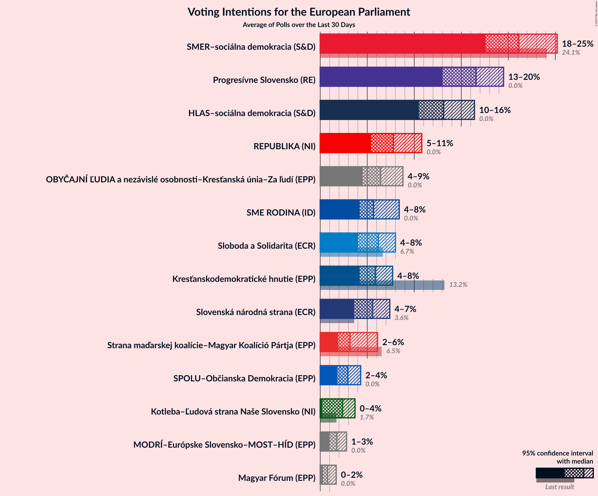

### Confidence Intervals

| Party | Last Result | Median | 80% Confidence Interval | 90% Confidence Interval | 95% Confidence Interval | 99% Confidence Interval |
|:-----:|:-----------:|:------:|:-----------------------:|:-----------------------:|:-----------------------:|:-----------------------:|
| <a href="#smer–sociálna-demokracia-(s&d)">SMER–sociálna demokracia (S&D)</a> | 24.1% | 21.1% | 18.6–24.1% |18.1–24.7% | 17.6–25.2% | 16.8–26.2% |
| <a href="#kresťanskodemokratické-hnutie-(epp)">Kresťanskodemokratické hnutie (EPP)</a> | 13.2% | 5.9% | 4.7–7.1% |4.5–7.4% | 4.2–7.7% | 3.9–8.3% |
| <a href="#obyčajní-ľudia-a-nezávislé-osobnosti-(epp)">OBYČAJNÍ ĽUDIA a nezávislé osobnosti (EPP)</a> | 7.5% | N/A | N/A |N/A | N/A | N/A |
| <a href="#nova-(ecr)">NOVA (ECR)</a> | 6.8% | N/A | N/A |N/A | N/A | N/A |
| <a href="#sloboda-a-solidarita-(ecr)">Sloboda a Solidarita (ECR)</a> | 6.7% | 6.2% | 4.6–7.4% |4.3–7.7% | 4.0–8.0% | 3.6–8.6% |
| <a href="#strana-maďarskej-koalície–magyar-koalíció-pártja-(epp)">Strana maďarskej koalície–Magyar Koalíció Pártja (EPP)</a> | 6.5% | 3.2% | 2.2–5.2% |2.0–5.7% | 1.9–6.1% | 1.6–6.7% |
| <a href="#most–híd-(epp)">MOST–HÍD (EPP)</a> | 5.8% | N/A | N/A |N/A | N/A | N/A |
| <a href="#slovenská-národná-strana-(ecr)">Slovenská národná strana (ECR)</a> | 3.6% | 5.6% | 4.2–6.7% |3.8–7.1% | 3.6–7.4% | 3.1–7.9% |
| <a href="#kotleba–ľudová-strana-naše-slovensko-(ni)">Kotleba–Ľudová strana Naše Slovensko (NI)</a> | 1.7% | 2.4% | 0.4–3.3% |0.3–3.5% | 0.2–3.7% | 0.1–4.2% |
| <a href="#progresívne-slovensko-(re)">Progresívne Slovensko (RE)</a> | 0.0% | 16.6% | 14.0–18.5% |13.4–19.0% | 13.0–19.5% | 12.2–20.4% |
| <a href="#sme-rodina-(id)">SME RODINA (ID)</a> | 0.0% | 5.7% | 4.6–7.4% |4.4–7.9% | 4.2–8.4% | 3.8–9.1% |
| <a href="#spolu–občianska-demokracia-(epp)">SPOLU–Občianska Demokracia (EPP)</a> | 0.0% | 2.9% | 2.2–3.8% |2.0–4.0% | 1.8–4.3% | 1.5–4.7% |
| <a href="#progresívne-slovensko–spolu–občianska-demokracia-(re)">Progresívne Slovensko–SPOLU–Občianska Demokracia (RE)</a> | 0.0% | N/A | N/A |N/A | N/A | N/A |
| <a href="#za-ľudí-(epp)">Za ľudí (EPP)</a> | 0.0% | N/A | N/A |N/A | N/A | N/A |
| <a href="#dobrá-voľba-(*)">Dobrá voľba (*)</a> | 0.0% | N/A | N/A |N/A | N/A | N/A |
| <a href="#vlasť-(*)">VLASŤ (*)</a> | 0.0% | N/A | N/A |N/A | N/A | N/A |
| <a href="#hlas–sociálna-demokracia-(s&d)">HLAS–sociálna demokracia (S&D)</a> | 0.0% | 13.1% | 11.2–15.4% |10.8–15.9% | 10.5–16.4% | 9.9–17.3% |
| <a href="#republika-(ni)">REPUBLIKA (NI)</a> | 0.0% | 7.8% | 6.1–9.9% |5.7–10.4% | 5.4–10.8% | 4.9–11.6% |
| <a href="#modrí–európske-slovensko-(epp)">MODRÍ–Európske Slovensko (EPP)</a> | 0.0% | N/A | N/A |N/A | N/A | N/A |
| <a href="#modrí–európske-slovensko–most–híd-(epp)">MODRÍ–Európske Slovensko–MOST–HÍD (EPP)</a> | 0.0% | 1.8% | 1.2–2.4% |1.1–2.6% | 1.0–2.8% | 0.8–3.2% |
| <a href="#obyčajní-ľudia-a-nezávislé-osobnosti–kresťanská-únia–za-ľudí-(epp)">OBYČAJNÍ ĽUDIA a nezávislé osobnosti–Kresťanská únia–Za ľudí (EPP)</a> | 0.0% | 6.4% | 5.1–8.0% |4.8–8.5% | 4.5–8.8% | 4.1–9.5% |
| <a href="#kresťanská-únia-(ecr)">Kresťanská únia (ECR)</a> | 0.0% | N/A | N/A |N/A | N/A | N/A |
| <a href="#hlas–sociálna-demokracia–dobrá-voľba-(s&d)">HLAS–sociálna demokracia–Dobrá voľba (S&D)</a> | 0.0% | N/A | N/A |N/A | N/A | N/A |
| <a href="#magyar-fórum-(epp)">Magyar Fórum (EPP)</a> | 0.0% | 0.8% | 0.4–1.3% |0.3–1.5% | 0.3–1.7% | 0.2–2.0% |

### SMER–sociálna demokracia (S&D)

*For a full overview of the results for this party, see the [SMER–sociálna demokracia (S&D)](party-smer–sociálnademokraciasd.html) page.*

| Voting Intentions | Probability | Accumulated | Special Marks |
|:-----------------:|:-----------:|:-----------:|:-------------:|
| 14.5–15.5% | 0% | 100% |  |
| 15.5–16.5% | 0.3% | 100% |  |
| 16.5–17.5% | 2% | 99.7% |  |
| 17.5–18.5% | 7% | 98% |  |
| 18.5–19.5% | 14% | 91% |  |
| 19.5–20.5% | 17% | 76% |  |
| 20.5–21.5% | 16% | 59% | Median |
| 21.5–22.5% | 14% | 43% |  |
| 22.5–23.5% | 13% | 29% |  |
| 23.5–24.5% | 10% | 16% | Last Result |
| 24.5–25.5% | 4% | 6% |  |
| 25.5–26.5% | 1.2% | 1.5% |  |
| 26.5–27.5% | 0.2% | 0.2% |  |
| 27.5–28.5% | 0% | 0% |  |

### Kresťanskodemokratické hnutie (EPP)

*For a full overview of the results for this party, see the [Kresťanskodemokratické hnutie (EPP)](party-kresťanskodemokratickéhnutieepp.html) page.*

| Voting Intentions | Probability | Accumulated | Special Marks |
|:-----------------:|:-----------:|:-----------:|:-------------:|
| 2.5–3.5% | 0.1% | 100% |  |
| 3.5–4.5% | 6% | 99.9% |  |
| 4.5–5.5% | 30% | 94% |  |
| 5.5–6.5% | 40% | 64% | Median |
| 6.5–7.5% | 20% | 24% |  |
| 7.5–8.5% | 3% | 4% |  |
| 8.5–9.5% | 0.2% | 0.2% |  |
| 9.5–10.5% | 0% | 0% |  |
| 10.5–11.5% | 0% | 0% |  |
| 11.5–12.5% | 0% | 0% |  |
| 12.5–13.5% | 0% | 0% | Last Result |

### Sloboda a Solidarita (ECR)

*For a full overview of the results for this party, see the [Sloboda a Solidarita (ECR)](party-slobodaasolidaritaecr.html) page.*

| Voting Intentions | Probability | Accumulated | Special Marks |
|:-----------------:|:-----------:|:-----------:|:-------------:|
| 1.5–2.5% | 0% | 100% |  |
| 2.5–3.5% | 0.4% | 100% |  |
| 3.5–4.5% | 9% | 99.6% |  |
| 4.5–5.5% | 20% | 91% |  |
| 5.5–6.5% | 36% | 71% | Median |
| 6.5–7.5% | 27% | 34% | Last Result |
| 7.5–8.5% | 7% | 7% |  |
| 8.5–9.5% | 0.6% | 0.6% |  |
| 9.5–10.5% | 0% | 0% |  |

### Strana maďarskej koalície–Magyar Koalíció Pártja (EPP)

*For a full overview of the results for this party, see the [Strana maďarskej koalície–Magyar Koalíció Pártja (EPP)](party-stranamaďarskejkoalície–magyarkoalíciópártjaepp.html) page.*

| Voting Intentions | Probability | Accumulated | Special Marks |
|:-----------------:|:-----------:|:-----------:|:-------------:|
| 0.0–0.5% | 0% | 100% |  |
| 0.5–1.5% | 0.4% | 100% |  |
| 1.5–2.5% | 21% | 99.6% |  |
| 2.5–3.5% | 43% | 79% | Median |
| 3.5–4.5% | 20% | 36% |  |
| 4.5–5.5% | 10% | 16% |  |
| 5.5–6.5% | 5% | 6% |  |
| 6.5–7.5% | 0.8% | 0.8% | Last Result |
| 7.5–8.5% | 0% | 0% |  |

### Slovenská národná strana (ECR)

*For a full overview of the results for this party, see the [Slovenská národná strana (ECR)](party-slovenskánárodnástranaecr.html) page.*

| Voting Intentions | Probability | Accumulated | Special Marks |
|:-----------------:|:-----------:|:-----------:|:-------------:|
| 1.5–2.5% | 0% | 100% |  |
| 2.5–3.5% | 2% | 100% |  |
| 3.5–4.5% | 15% | 98% | Last Result |
| 4.5–5.5% | 32% | 82% |  |
| 5.5–6.5% | 36% | 50% | Median |
| 6.5–7.5% | 13% | 14% |  |
| 7.5–8.5% | 1.4% | 1.5% |  |
| 8.5–9.5% | 0.1% | 0.1% |  |
| 9.5–10.5% | 0% | 0% |  |

### Kotleba–Ľudová strana Naše Slovensko (NI)

*For a full overview of the results for this party, see the [Kotleba–Ľudová strana Naše Slovensko (NI)](party-kotleba–ľudovástrananašeslovenskoni.html) page.*

| Voting Intentions | Probability | Accumulated | Special Marks |
|:-----------------:|:-----------:|:-----------:|:-------------:|
| 0.0–0.5% | 16% | 100% |  |
| 0.5–1.5% | 7% | 84% |  |
| 1.5–2.5% | 37% | 78% | Last Result, Median |
| 2.5–3.5% | 36% | 41% |  |
| 3.5–4.5% | 5% | 5% |  |
| 4.5–5.5% | 0.1% | 0.1% |  |
| 5.5–6.5% | 0% | 0% |  |

### HLAS–sociálna demokracia (S&D)

*For a full overview of the results for this party, see the [HLAS–sociálna demokracia (S&D)](party-hlas–sociálnademokraciasd.html) page.*

| Voting Intentions | Probability | Accumulated | Special Marks |
|:-----------------:|:-----------:|:-----------:|:-------------:|
| 0.0–0.5% | 0% | 100% | Last Result |
| 0.5–1.5% | 0% | 100% |  |
| 1.5–2.5% | 0% | 100% |  |
| 2.5–3.5% | 0% | 100% |  |
| 3.5–4.5% | 0% | 100% |  |
| 4.5–5.5% | 0% | 100% |  |
| 5.5–6.5% | 0% | 100% |  |
| 6.5–7.5% | 0% | 100% |  |
| 7.5–8.5% | 0% | 100% |  |
| 8.5–9.5% | 0.2% | 100% |  |
| 9.5–10.5% | 3% | 99.8% |  |
| 10.5–11.5% | 12% | 97% |  |
| 11.5–12.5% | 21% | 85% |  |
| 12.5–13.5% | 23% | 64% | Median |
| 13.5–14.5% | 20% | 41% |  |
| 14.5–15.5% | 13% | 21% |  |
| 15.5–16.5% | 6% | 8% |  |
| 16.5–17.5% | 2% | 2% |  |
| 17.5–18.5% | 0.3% | 0.3% |  |
| 18.5–19.5% | 0% | 0% |  |

### Progresívne Slovensko (RE)

*For a full overview of the results for this party, see the [Progresívne Slovensko (RE)](party-progresívneslovenskore.html) page.*

| Voting Intentions | Probability | Accumulated | Special Marks |
|:-----------------:|:-----------:|:-----------:|:-------------:|
| 0.0–0.5% | 0% | 100% | Last Result |
| 0.5–1.5% | 0% | 100% |  |
| 1.5–2.5% | 0% | 100% |  |
| 2.5–3.5% | 0% | 100% |  |
| 3.5–4.5% | 0% | 100% |  |
| 4.5–5.5% | 0% | 100% |  |
| 5.5–6.5% | 0% | 100% |  |
| 6.5–7.5% | 0% | 100% |  |
| 7.5–8.5% | 0% | 100% |  |
| 8.5–9.5% | 0% | 100% |  |
| 9.5–10.5% | 0% | 100% |  |
| 10.5–11.5% | 0.1% | 100% |  |
| 11.5–12.5% | 1.0% | 99.9% |  |
| 12.5–13.5% | 5% | 98.9% |  |
| 13.5–14.5% | 11% | 94% |  |
| 14.5–15.5% | 14% | 83% |  |
| 15.5–16.5% | 19% | 69% |  |
| 16.5–17.5% | 23% | 50% | Median |
| 17.5–18.5% | 17% | 27% |  |
| 18.5–19.5% | 7% | 10% |  |
| 19.5–20.5% | 2% | 2% |  |
| 20.5–21.5% | 0.3% | 0.4% |  |
| 21.5–22.5% | 0% | 0% |  |

### Magyar Fórum (EPP)

*For a full overview of the results for this party, see the [Magyar Fórum (EPP)](party-magyarfórumepp.html) page.*

| Voting Intentions | Probability | Accumulated | Special Marks |
|:-----------------:|:-----------:|:-----------:|:-------------:|
| 0.0–0.5% | 23% | 100% | Last Result |
| 0.5–1.5% | 73% | 77% | Median |
| 1.5–2.5% | 4% | 4% |  |
| 2.5–3.5% | 0% | 0% |  |

### SPOLU–Občianska Demokracia (EPP)

*For a full overview of the results for this party, see the [SPOLU–Občianska Demokracia (EPP)](party-spolu–občianskademokraciaepp.html) page.*

| Voting Intentions | Probability | Accumulated | Special Marks |
|:-----------------:|:-----------:|:-----------:|:-------------:|
| 0.0–0.5% | 0% | 100% | Last Result |
| 0.5–1.5% | 0.5% | 100% |  |
| 1.5–2.5% | 27% | 99.5% |  |
| 2.5–3.5% | 56% | 73% | Median |
| 3.5–4.5% | 15% | 16% |  |
| 4.5–5.5% | 0.9% | 0.9% |  |
| 5.5–6.5% | 0% | 0% |  |

### MODRÍ–Európske Slovensko–MOST–HÍD (EPP)

*For a full overview of the results for this party, see the [MODRÍ–Európske Slovensko–MOST–HÍD (EPP)](party-modrí–európskeslovensko–most–hídepp.html) page.*

| Voting Intentions | Probability | Accumulated | Special Marks |
|:-----------------:|:-----------:|:-----------:|:-------------:|
| 0.0–0.5% | 0% | 100% | Last Result |
| 0.5–1.5% | 31% | 100% |  |
| 1.5–2.5% | 61% | 68% | Median |
| 2.5–3.5% | 7% | 7% |  |
| 3.5–4.5% | 0.1% | 0.1% |  |
| 4.5–5.5% | 0% | 0% |  |

### OBYČAJNÍ ĽUDIA a nezávislé osobnosti–Kresťanská únia–Za ľudí (EPP)

*For a full overview of the results for this party, see the [OBYČAJNÍ ĽUDIA a nezávislé osobnosti–Kresťanská únia–Za ľudí (EPP)](party-obyčajníľudiaanezávisléosobnosti–kresťanskáúnia–zaľudíepp.html) page.*

| Voting Intentions | Probability | Accumulated | Special Marks |
|:-----------------:|:-----------:|:-----------:|:-------------:|
| 0.0–0.5% | 0% | 100% | Last Result |
| 0.5–1.5% | 0% | 100% |  |
| 1.5–2.5% | 0% | 100% |  |
| 2.5–3.5% | 0% | 100% |  |
| 3.5–4.5% | 3% | 100% |  |
| 4.5–5.5% | 18% | 97% |  |
| 5.5–6.5% | 34% | 80% | Median |
| 6.5–7.5% | 28% | 46% |  |
| 7.5–8.5% | 14% | 18% |  |
| 8.5–9.5% | 4% | 4% |  |
| 9.5–10.5% | 0.4% | 0.4% |  |
| 10.5–11.5% | 0% | 0% |  |

### REPUBLIKA (NI)

*For a full overview of the results for this party, see the [REPUBLIKA (NI)](party-republikani.html) page.*

| Voting Intentions | Probability | Accumulated | Special Marks |
|:-----------------:|:-----------:|:-----------:|:-------------:|
| 0.0–0.5% | 0% | 100% | Last Result |
| 0.5–1.5% | 0% | 100% |  |
| 1.5–2.5% | 0% | 100% |  |
| 2.5–3.5% | 0% | 100% |  |
| 3.5–4.5% | 0.1% | 100% |  |
| 4.5–5.5% | 3% | 99.9% |  |
| 5.5–6.5% | 16% | 97% |  |
| 6.5–7.5% | 25% | 81% |  |
| 7.5–8.5% | 24% | 55% | Median |
| 8.5–9.5% | 17% | 32% |  |
| 9.5–10.5% | 10% | 14% |  |
| 10.5–11.5% | 3% | 4% |  |
| 11.5–12.5% | 0.6% | 0.6% |  |
| 12.5–13.5% | 0% | 0% |  |
| 13.5–14.5% | 0% | 0% |  |

### SME RODINA (ID)

*For a full overview of the results for this party, see the [SME RODINA (ID)](party-smerodinaid.html) page.*

| Voting Intentions | Probability | Accumulated | Special Marks |
|:-----------------:|:-----------:|:-----------:|:-------------:|
| 0.0–0.5% | 0% | 100% | Last Result |
| 0.5–1.5% | 0% | 100% |  |
| 1.5–2.5% | 0% | 100% |  |
| 2.5–3.5% | 0.2% | 100% |  |
| 3.5–4.5% | 8% | 99.8% |  |
| 4.5–5.5% | 37% | 92% |  |
| 5.5–6.5% | 34% | 55% | Median |
| 6.5–7.5% | 13% | 21% |  |
| 7.5–8.5% | 6% | 8% |  |
| 8.5–9.5% | 2% | 2% |  |
| 9.5–10.5% | 0.2% | 0.2% |  |
| 10.5–11.5% | 0% | 0% |  |

## Seats

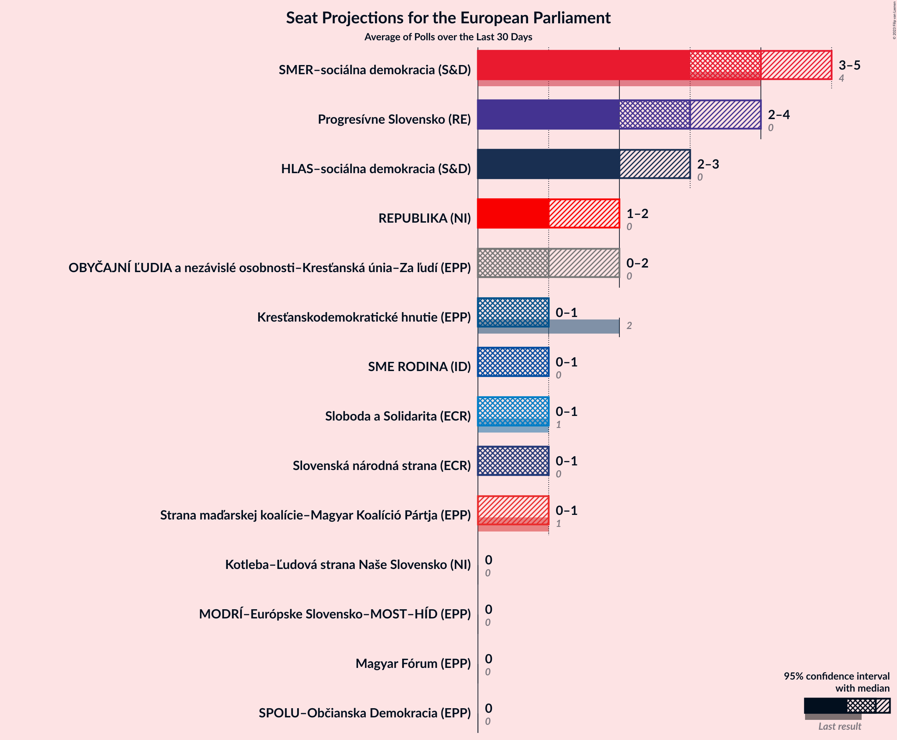

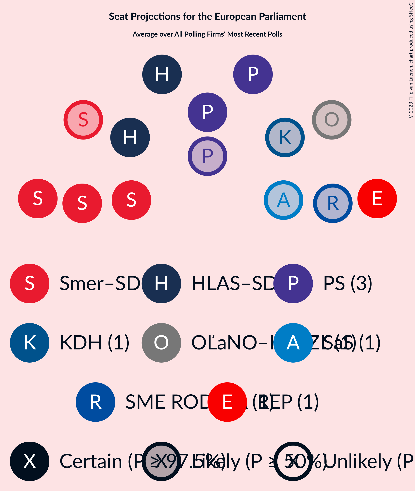

### Confidence Intervals

| Party | Last Result | Median | 80% Confidence Interval | 90% Confidence Interval | 95% Confidence Interval | 99% Confidence Interval |
|:-----:|:-----------:|:------:|:-----------------------:|:-----------------------:|:-----------------------:|:-----------------------:|
| <a href="#smer–sociálna-demokracia-(s&d)">SMER–sociálna demokracia (S&D)</a> | 4 | 4 | 3–4 |3–4 | 3–5 | 3–5 |
| <a href="#kresťanskodemokratické-hnutie-(epp)">Kresťanskodemokratické hnutie (EPP)</a> | 2 | 1 | 0–1 |0–1 | 0–1 | 0–1 |
| <a href="#obyčajní-ľudia-a-nezávislé-osobnosti-(epp)">OBYČAJNÍ ĽUDIA a nezávislé osobnosti (EPP)</a> | 1 | N/A | N/A |N/A | N/A | N/A |
| <a href="#nova-(ecr)">NOVA (ECR)</a> | 1 | N/A | N/A |N/A | N/A | N/A |
| <a href="#sloboda-a-solidarita-(ecr)">Sloboda a Solidarita (ECR)</a> | 1 | 1 | 0–1 |0–1 | 0–1 | 0–1 |
| <a href="#strana-maďarskej-koalície–magyar-koalíció-pártja-(epp)">Strana maďarskej koalície–Magyar Koalíció Pártja (EPP)</a> | 1 | 0 | 0–1 |0–1 | 0–1 | 0–1 |
| <a href="#most–híd-(epp)">MOST–HÍD (EPP)</a> | 1 | N/A | N/A |N/A | N/A | N/A |
| <a href="#slovenská-národná-strana-(ecr)">Slovenská národná strana (ECR)</a> | 0 | 1 | 0–1 |0–1 | 0–1 | 0–1 |
| <a href="#kotleba–ľudová-strana-naše-slovensko-(ni)">Kotleba–Ľudová strana Naše Slovensko (NI)</a> | 0 | 0 | 0 |0 | 0 | 0 |
| <a href="#progresívne-slovensko-(re)">Progresívne Slovensko (RE)</a> | 0 | 3 | 2–3 |2–3 | 2–4 | 2–4 |
| <a href="#sme-rodina-(id)">SME RODINA (ID)</a> | 0 | 1 | 0–1 |0–1 | 0–1 | 0–1 |
| <a href="#spolu–občianska-demokracia-(epp)">SPOLU–Občianska Demokracia (EPP)</a> | 0 | 0 | 0 |0 | 0 | 0 |
| <a href="#progresívne-slovensko–spolu–občianska-demokracia-(re)">Progresívne Slovensko–SPOLU–Občianska Demokracia (RE)</a> | 0 | N/A | N/A |N/A | N/A | N/A |
| <a href="#za-ľudí-(epp)">Za ľudí (EPP)</a> | 0 | N/A | N/A |N/A | N/A | N/A |
| <a href="#dobrá-voľba-(*)">Dobrá voľba (*)</a> | 0 | N/A | N/A |N/A | N/A | N/A |
| <a href="#vlasť-(*)">VLASŤ (*)</a> | 0 | N/A | N/A |N/A | N/A | N/A |
| <a href="#hlas–sociálna-demokracia-(s&d)">HLAS–sociálna demokracia (S&D)</a> | 0 | 2 | 2–3 |2–3 | 2–3 | 2–3 |
| <a href="#republika-(ni)">REPUBLIKA (NI)</a> | 0 | 1 | 1–2 |1–2 | 1–2 | 0–2 |
| <a href="#modrí–európske-slovensko-(epp)">MODRÍ–Európske Slovensko (EPP)</a> | 0 | N/A | N/A |N/A | N/A | N/A |
| <a href="#modrí–európske-slovensko–most–híd-(epp)">MODRÍ–Európske Slovensko–MOST–HÍD (EPP)</a> | 0 | 0 | 0 |0 | 0 | 0 |
| <a href="#obyčajní-ľudia-a-nezávislé-osobnosti–kresťanská-únia–za-ľudí-(epp)">OBYČAJNÍ ĽUDIA a nezávislé osobnosti–Kresťanská únia–Za ľudí (EPP)</a> | 0 | 1 | 1 |0–1 | 0–2 | 0–2 |
| <a href="#kresťanská-únia-(ecr)">Kresťanská únia (ECR)</a> | 0 | N/A | N/A |N/A | N/A | N/A |
| <a href="#hlas–sociálna-demokracia–dobrá-voľba-(s&d)">HLAS–sociálna demokracia–Dobrá voľba (S&D)</a> | 0 | N/A | N/A |N/A | N/A | N/A |
| <a href="#magyar-fórum-(epp)">Magyar Fórum (EPP)</a> | 0 | 0 | 0 |0 | 0 | 0 |

### SMER–sociálna demokracia (S&D)

*For a full overview of the results for this party, see the [SMER–sociálna demokracia (S&D)](party-smer–sociálnademokraciasd.html) page.*

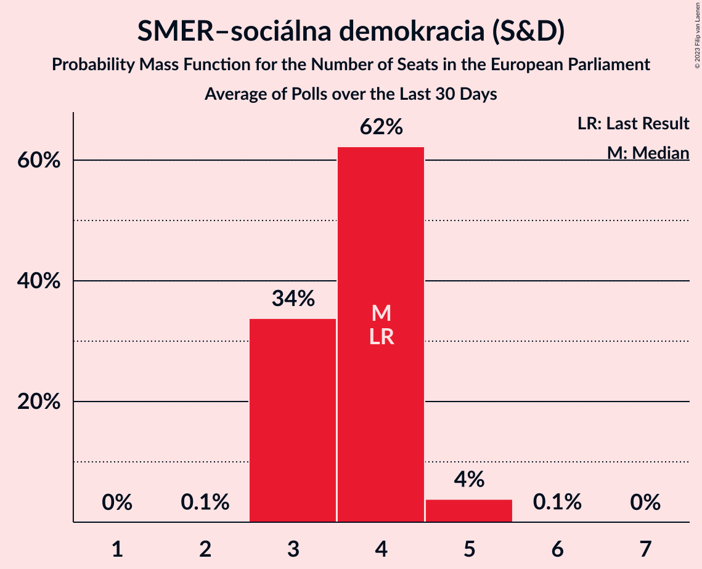

| Number of Seats | Probability | Accumulated | Special Marks |
|:---------------:|:-----------:|:-----------:|:-------------:|
| 2 | 0.1% | 100% |  |
| 3 | 34% | 99.9% |  |
| 4 | 62% | 66% | Last Result, Median |
| 5 | 4% | 4% |  |
| 6 | 0.1% | 0.1% |  |
| 7 | 0% | 0% |  |

### Kresťanskodemokratické hnutie (EPP)

*For a full overview of the results for this party, see the [Kresťanskodemokratické hnutie (EPP)](party-kresťanskodemokratickéhnutieepp.html) page.*

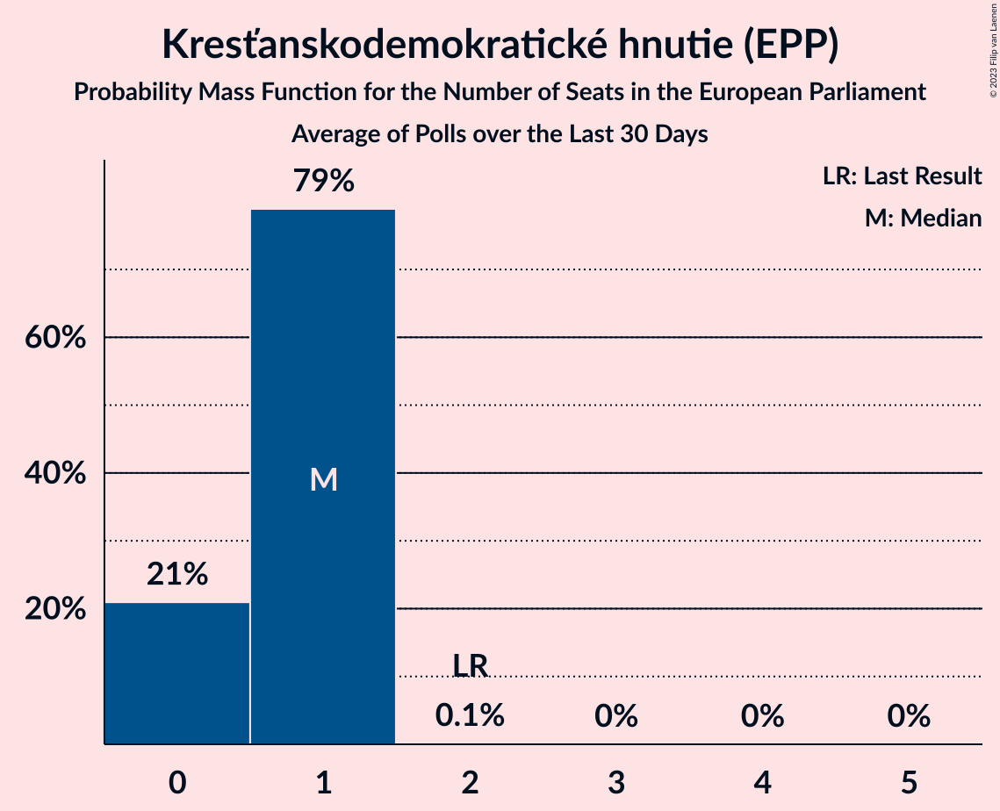

| Number of Seats | Probability | Accumulated | Special Marks |
|:---------------:|:-----------:|:-----------:|:-------------:|
| 0 | 21% | 100% |  |
| 1 | 79% | 79% | Median |
| 2 | 0.1% | 0.1% | Last Result |
| 3 | 0% | 0% |  |

### OBYČAJNÍ ĽUDIA a nezávislé osobnosti (EPP)

*For a full overview of the results for this party, see the [OBYČAJNÍ ĽUDIA a nezávislé osobnosti (EPP)](party-obyčajníľudiaanezávisléosobnostiepp.html) page.*

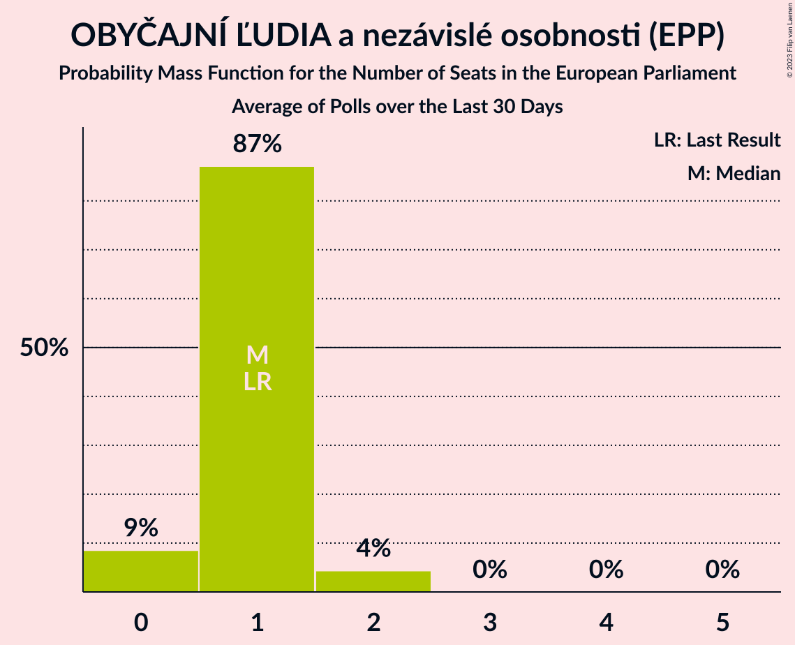

### NOVA (ECR)

*For a full overview of the results for this party, see the [NOVA (ECR)](party-novaecr.html) page.*

### Sloboda a Solidarita (ECR)

*For a full overview of the results for this party, see the [Sloboda a Solidarita (ECR)](party-slobodaasolidaritaecr.html) page.*

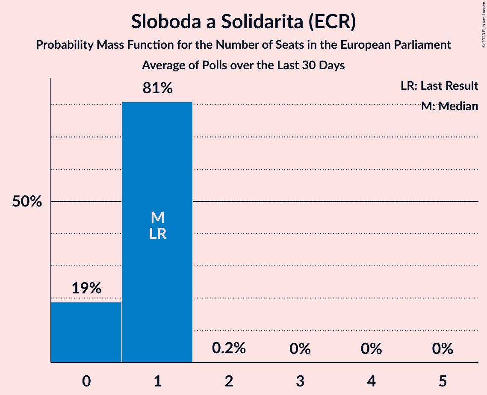

| Number of Seats | Probability | Accumulated | Special Marks |
|:---------------:|:-----------:|:-----------:|:-------------:|
| 0 | 19% | 100% |  |
| 1 | 81% | 81% | Last Result, Median |
| 2 | 0.2% | 0.2% |  |
| 3 | 0% | 0% |  |

### Strana maďarskej koalície–Magyar Koalíció Pártja (EPP)

*For a full overview of the results for this party, see the [Strana maďarskej koalície–Magyar Koalíció Pártja (EPP)](party-stranamaďarskejkoalície–magyarkoalíciópártjaepp.html) page.*

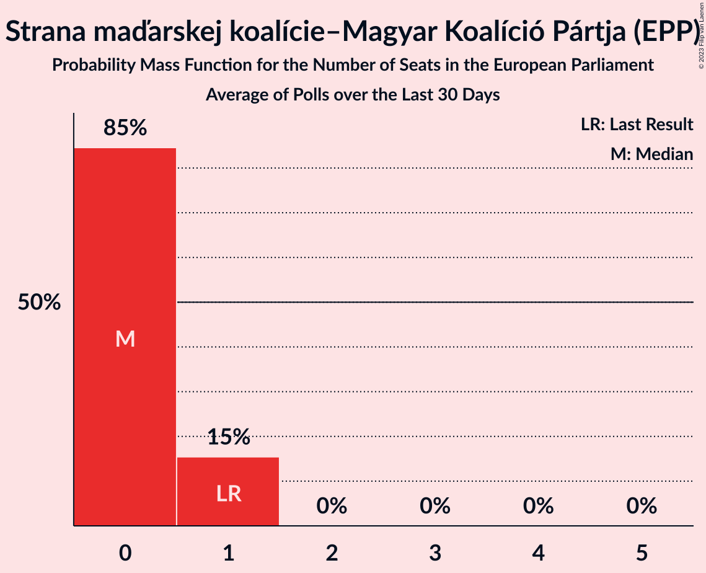

| Number of Seats | Probability | Accumulated | Special Marks |
|:---------------:|:-----------:|:-----------:|:-------------:|
| 0 | 85% | 100% | Median |
| 1 | 15% | 15% | Last Result |
| 2 | 0% | 0% |  |

### MOST–HÍD (EPP)

*For a full overview of the results for this party, see the [MOST–HÍD (EPP)](party-most–hídepp.html) page.*

### Slovenská národná strana (ECR)

*For a full overview of the results for this party, see the [Slovenská národná strana (ECR)](party-slovenskánárodnástranaecr.html) page.*

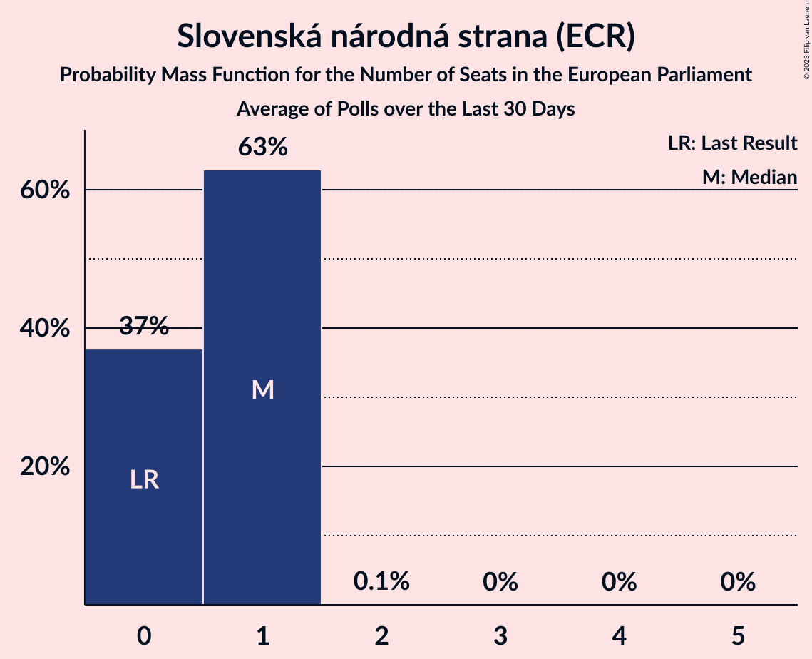

| Number of Seats | Probability | Accumulated | Special Marks |
|:---------------:|:-----------:|:-----------:|:-------------:|
| 0 | 37% | 100% | Last Result |
| 1 | 63% | 63% | Median |
| 2 | 0.1% | 0.1% |  |
| 3 | 0% | 0% |  |

### Kotleba–Ľudová strana Naše Slovensko (NI)

*For a full overview of the results for this party, see the [Kotleba–Ľudová strana Naše Slovensko (NI)](party-kotleba–ľudovástrananašeslovenskoni.html) page.*

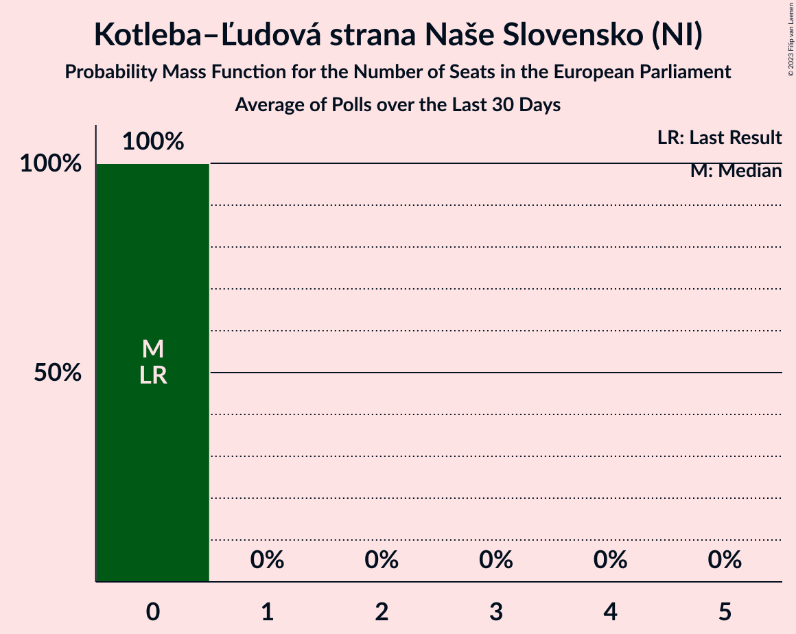

| Number of Seats | Probability | Accumulated | Special Marks |
|:---------------:|:-----------:|:-----------:|:-------------:|
| 0 | 100% | 100% | Last Result, Median |

### Progresívne Slovensko (RE)

*For a full overview of the results for this party, see the [Progresívne Slovensko (RE)](party-progresívneslovenskore.html) page.*

| Number of Seats | Probability | Accumulated | Special Marks |
|:---------------:|:-----------:|:-----------:|:-------------:|
| 0 | 0% | 100% | Last Result |
| 1 | 0% | 100% |  |
| 2 | 25% | 100% |  |
| 3 | 73% | 75% | Median |
| 4 | 3% | 3% |  |
| 5 | 0% | 0% |  |

### SME RODINA (ID)

*For a full overview of the results for this party, see the [SME RODINA (ID)](party-smerodinaid.html) page.*

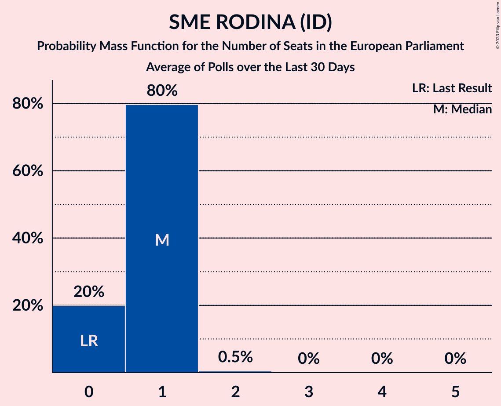

| Number of Seats | Probability | Accumulated | Special Marks |
|:---------------:|:-----------:|:-----------:|:-------------:|
| 0 | 20% | 100% | Last Result |
| 1 | 80% | 80% | Median |
| 2 | 0.5% | 0.5% |  |
| 3 | 0% | 0% |  |

### SPOLU–Občianska Demokracia (EPP)

*For a full overview of the results for this party, see the [SPOLU–Občianska Demokracia (EPP)](party-spolu–občianskademokraciaepp.html) page.*

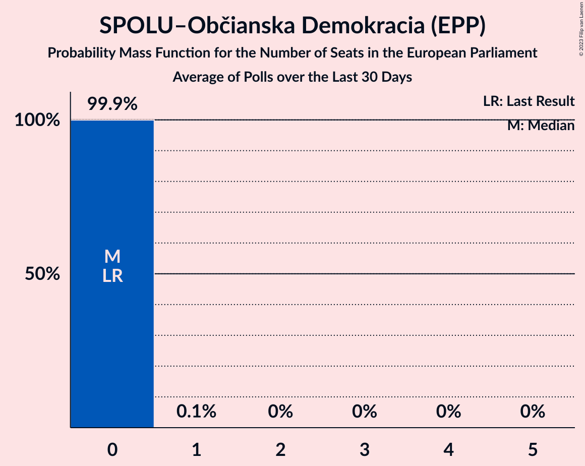

| Number of Seats | Probability | Accumulated | Special Marks |
|:---------------:|:-----------:|:-----------:|:-------------:|
| 0 | 99.9% | 100% | Last Result, Median |
| 1 | 0.1% | 0.1% |  |
| 2 | 0% | 0% |  |

### Progresívne Slovensko–SPOLU–Občianska Demokracia (RE)

*For a full overview of the results for this party, see the [Progresívne Slovensko–SPOLU–Občianska Demokracia (RE)](party-progresívneslovensko–spolu–občianskademokraciare.html) page.*

### Za ľudí (EPP)

*For a full overview of the results for this party, see the [Za ľudí (EPP)](party-zaľudíepp.html) page.*

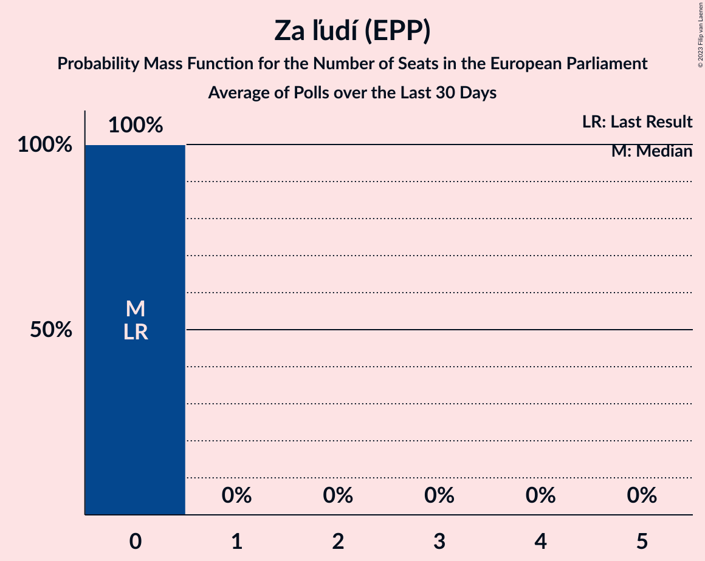

### Dobrá voľba (*)

*For a full overview of the results for this party, see the [Dobrá voľba (*)](party-dobrávoľba.html) page.*

### VLASŤ (*)

*For a full overview of the results for this party, see the [VLASŤ (*)](party-vlasť.html) page.*

### HLAS–sociálna demokracia (S&D)

*For a full overview of the results for this party, see the [HLAS–sociálna demokracia (S&D)](party-hlas–sociálnademokraciasd.html) page.*

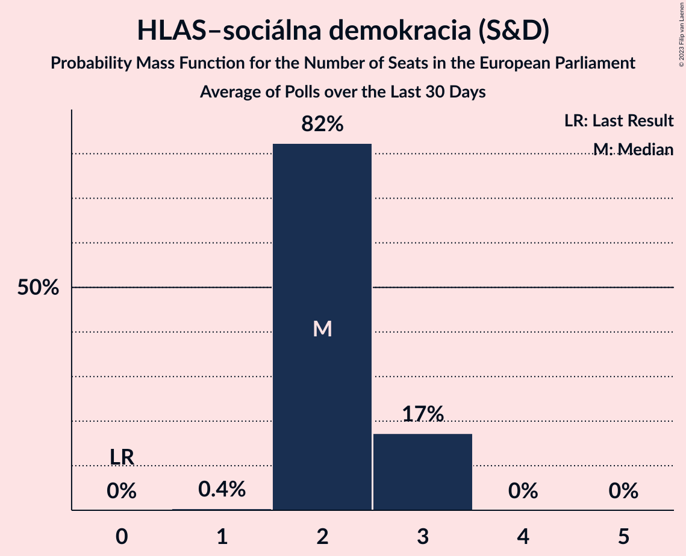

| Number of Seats | Probability | Accumulated | Special Marks |
|:---------------:|:-----------:|:-----------:|:-------------:|
| 0 | 0% | 100% | Last Result |
| 1 | 0.4% | 100% |  |
| 2 | 82% | 99.6% | Median |
| 3 | 17% | 17% |  |
| 4 | 0% | 0% |  |

### REPUBLIKA (NI)

*For a full overview of the results for this party, see the [REPUBLIKA (NI)](party-republikani.html) page.*

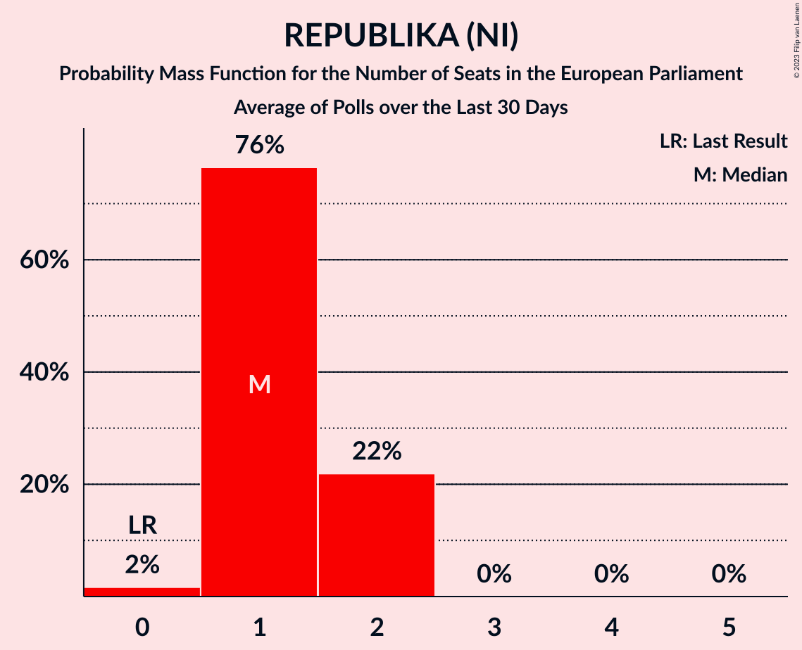

| Number of Seats | Probability | Accumulated | Special Marks |
|:---------------:|:-----------:|:-----------:|:-------------:|
| 0 | 2% | 100% | Last Result |
| 1 | 76% | 98% | Median |
| 2 | 22% | 22% |  |
| 3 | 0% | 0% |  |

### MODRÍ–Európske Slovensko (EPP)

*For a full overview of the results for this party, see the [MODRÍ–Európske Slovensko (EPP)](party-modrí–európskeslovenskoepp.html) page.*

### MODRÍ–Európske Slovensko–MOST–HÍD (EPP)

*For a full overview of the results for this party, see the [MODRÍ–Európske Slovensko–MOST–HÍD (EPP)](party-modrí–európskeslovensko–most–hídepp.html) page.*

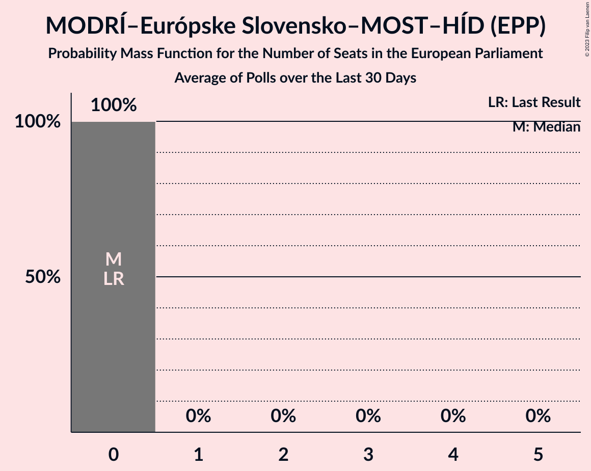

| Number of Seats | Probability | Accumulated | Special Marks |
|:---------------:|:-----------:|:-----------:|:-------------:|
| 0 | 100% | 100% | Last Result, Median |

### OBYČAJNÍ ĽUDIA a nezávislé osobnosti–Kresťanská únia–Za ľudí (EPP)

*For a full overview of the results for this party, see the [OBYČAJNÍ ĽUDIA a nezávislé osobnosti–Kresťanská únia–Za ľudí (EPP)](party-obyčajníľudiaanezávisléosobnosti–kresťanskáúnia–zaľudíepp.html) page.*

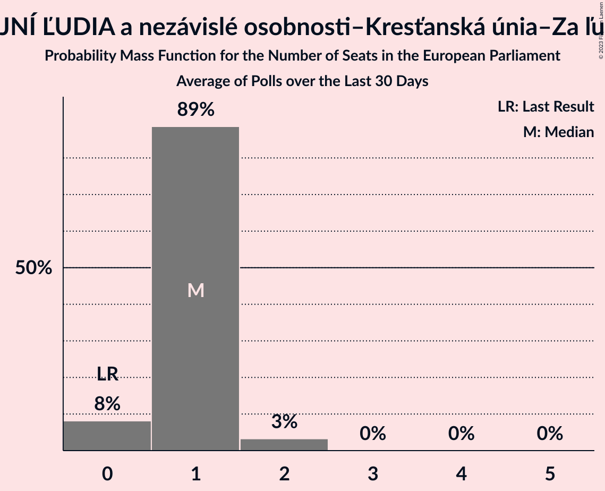

| Number of Seats | Probability | Accumulated | Special Marks |
|:---------------:|:-----------:|:-----------:|:-------------:|
| 0 | 8% | 100% | Last Result |
| 1 | 89% | 92% | Median |
| 2 | 3% | 3% |  |
| 3 | 0% | 0% |  |

### Kresťanská únia (ECR)

*For a full overview of the results for this party, see the [Kresťanská únia (ECR)](party-kresťanskáúniaecr.html) page.*

### HLAS–sociálna demokracia–Dobrá voľba (S&D)

*For a full overview of the results for this party, see the [HLAS–sociálna demokracia–Dobrá voľba (S&D)](party-hlas–sociálnademokracia–dobrávoľbasd.html) page.*

### Magyar Fórum (EPP)

*For a full overview of the results for this party, see the [Magyar Fórum (EPP)](party-magyarfórumepp.html) page.*

| Number of Seats | Probability | Accumulated | Special Marks |
|:---------------:|:-----------:|:-----------:|:-------------:|
| 0 | 100% | 100% | Last Result, Median |

## Coalitions

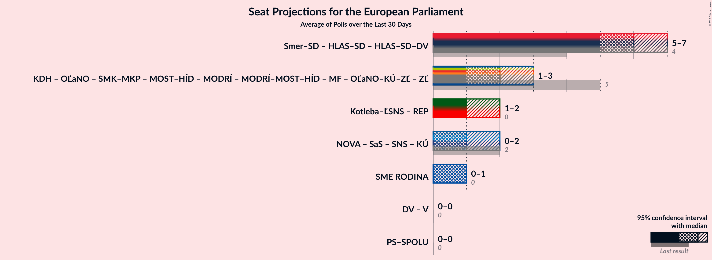

### Confidence Intervals

| Coalition | Last Result | Median | Majority? | 80% Confidence Interval | 90% Confidence Interval | 95% Confidence Interval | 99% Confidence Interval |
|:---------:|:-----------:|:------:|:---------:|:-----------------------:|:-----------------------:|:-----------------------:|:-----------------------:|
| SMER–sociálna demokracia (S&D) – HLAS–sociálna demokracia (S&D) – HLAS–sociálna demokracia–Dobrá voľba (S&D) | 4 | 6 | 0.2% | 5–6 | 5–7 | 5–7 | 5–7 |
| Kresťanskodemokratické hnutie (EPP) – OBYČAJNÍ ĽUDIA a nezávislé osobnosti (EPP) – Strana maďarskej koalície–Magyar Koalíció Pártja (EPP) – MOST–HÍD (EPP) – MODRÍ–Európske Slovensko (EPP) – MODRÍ–Európske Slovensko–MOST–HÍD (EPP) – Magyar Fórum (EPP) – OBYČAJNÍ ĽUDIA a nezávislé osobnosti–Kresťanská únia–Za ľudí (EPP) – Za ľudí (EPP) | 5 | 2 | 0% | 1–2 | 1–3 | 1–3 | 0–3 |
| Kotleba–Ľudová strana Naše Slovensko (NI) – REPUBLIKA (NI) | 0 | 1 | 0% | 1–2 | 1–2 | 1–2 | 0–2 |
| NOVA (ECR) – Sloboda a Solidarita (ECR) – Slovenská národná strana (ECR) – Kresťanská únia (ECR) | 2 | 1 | 0% | 1–2 | 1–2 | 0–2 | 0–2 |
| SME RODINA (ID) | 0 | 1 | 0% | 0–1 | 0–1 | 0–1 | 0–1 |
| Dobrá voľba (*) – VLASŤ (*) | 0 | 0 | 0% | 0 | 0 | 0 | 0 |
| Progresívne Slovensko–SPOLU–Občianska Demokracia (RE) | 0 | 0 | 0% | 0 | 0 | 0 | 0 |

### SMER–sociálna demokracia (S&D) – HLAS–sociálna demokracia (S&D) – HLAS–sociálna demokracia–Dobrá voľba (S&D)

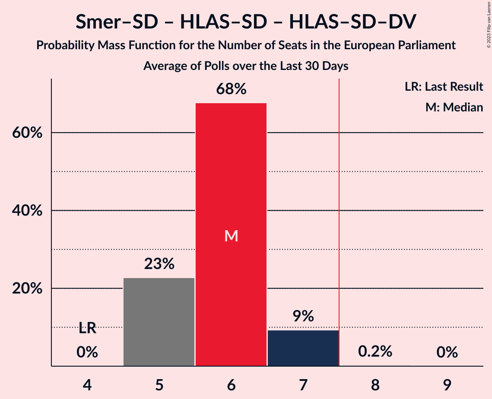

| Number of Seats | Probability | Accumulated | Special Marks |
|:---------------:|:-----------:|:-----------:|:-------------:|
| 4 | 0% | 100% | Last Result |
| 5 | 23% | 100% |  |
| 6 | 68% | 77% | Median |
| 7 | 9% | 10% |  |
| 8 | 0.2% | 0.2% | Majority |
| 9 | 0% | 0% |  |

### Kresťanskodemokratické hnutie (EPP) – OBYČAJNÍ ĽUDIA a nezávislé osobnosti (EPP) – Strana maďarskej koalície–Magyar Koalíció Pártja (EPP) – MOST–HÍD (EPP) – MODRÍ–Európske Slovensko (EPP) – MODRÍ–Európske Slovensko–MOST–HÍD (EPP) – Magyar Fórum (EPP) – OBYČAJNÍ ĽUDIA a nezávislé osobnosti–Kresťanská únia–Za ľudí (EPP) – Za ľudí (EPP)

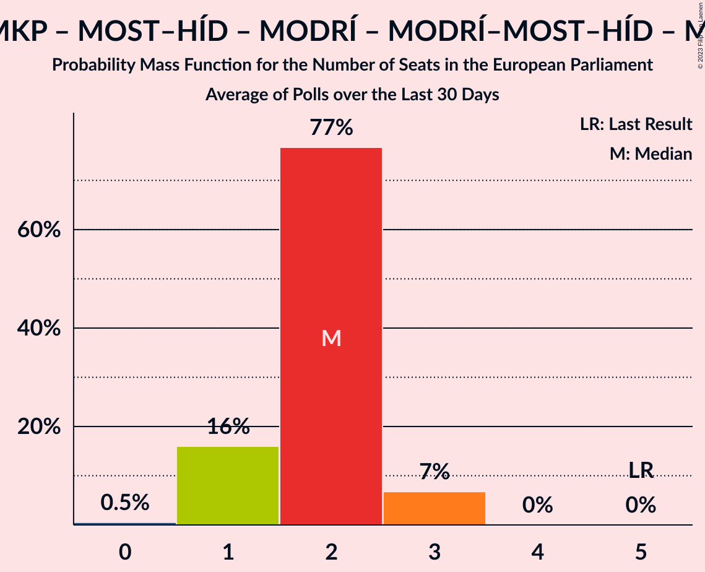

| Number of Seats | Probability | Accumulated | Special Marks |
|:---------------:|:-----------:|:-----------:|:-------------:|
| 0 | 0.5% | 100% |  |
| 1 | 16% | 99.5% |  |
| 2 | 77% | 83% | Median |
| 3 | 7% | 7% |  |
| 4 | 0% | 0% |  |
| 5 | 0% | 0% | Last Result |

### Kotleba–Ľudová strana Naše Slovensko (NI) – REPUBLIKA (NI)

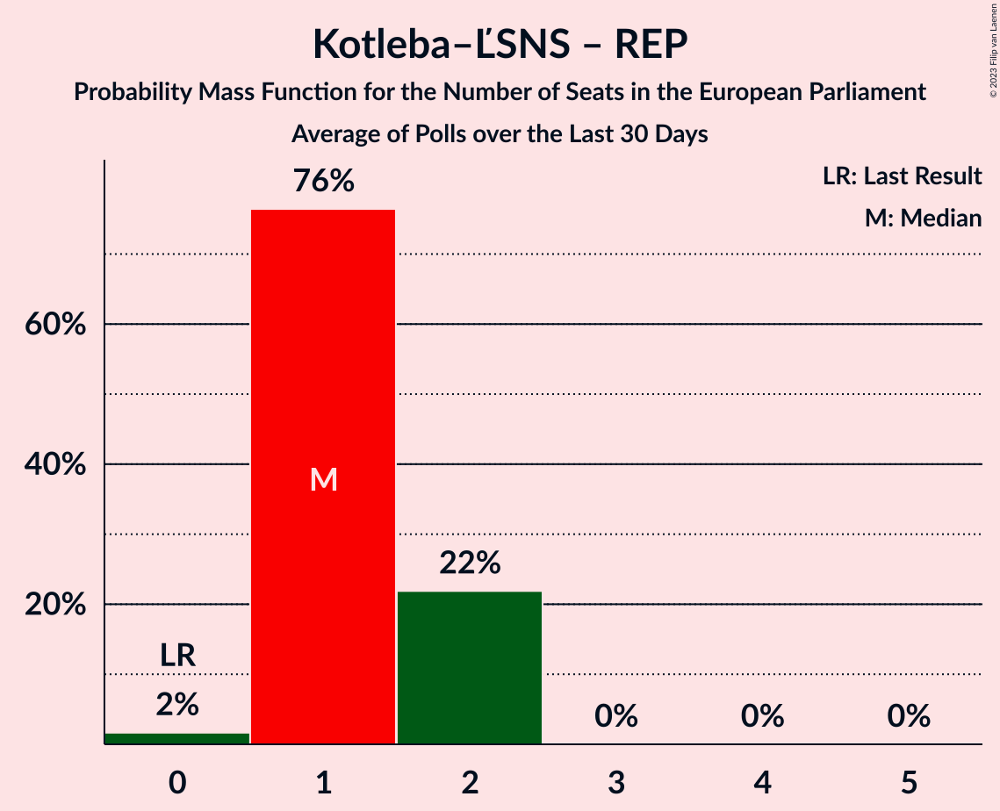

| Number of Seats | Probability | Accumulated | Special Marks |
|:---------------:|:-----------:|:-----------:|:-------------:|
| 0 | 2% | 100% | Last Result |
| 1 | 76% | 98% | Median |
| 2 | 22% | 22% |  |
| 3 | 0% | 0% |  |

### NOVA (ECR) – Sloboda a Solidarita (ECR) – Slovenská národná strana (ECR) – Kresťanská únia (ECR)

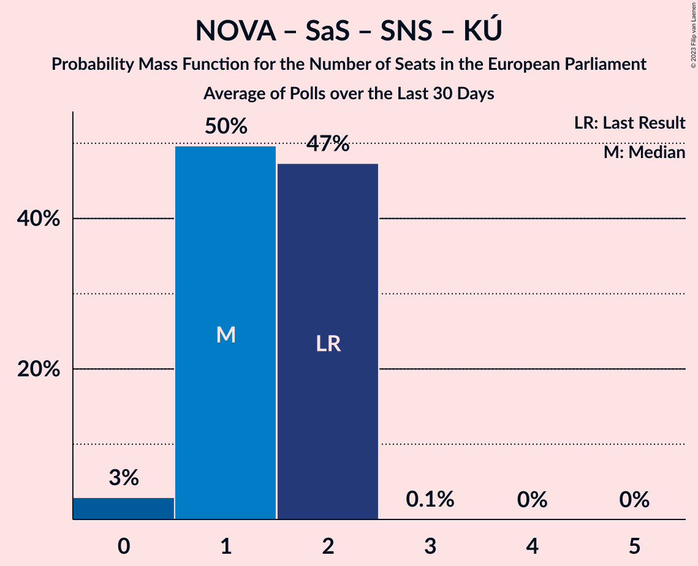

| Number of Seats | Probability | Accumulated | Special Marks |
|:---------------:|:-----------:|:-----------:|:-------------:|
| 0 | 3% | 100% |  |
| 1 | 50% | 97% |  |
| 2 | 47% | 47% | Last Result, Median |
| 3 | 0.1% | 0.1% |  |
| 4 | 0% | 0% |  |

### SME RODINA (ID)

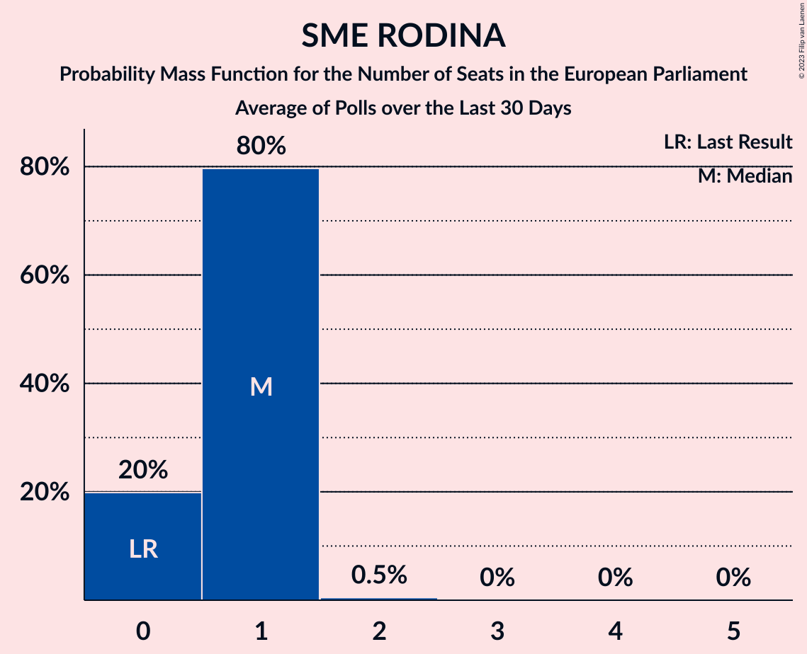

| Number of Seats | Probability | Accumulated | Special Marks |
|:---------------:|:-----------:|:-----------:|:-------------:|
| 0 | 20% | 100% | Last Result |
| 1 | 80% | 80% | Median |
| 2 | 0.5% | 0.5% |  |
| 3 | 0% | 0% |  |

### Dobrá voľba (*) – VLASŤ (*)

| Number of Seats | Probability | Accumulated | Special Marks |
|:---------------:|:-----------:|:-----------:|:-------------:|
| 0 | 100% | 100% | Last Result, Median |

### Progresívne Slovensko–SPOLU–Občianska Demokracia (RE)

| Number of Seats | Probability | Accumulated | Special Marks |
|:---------------:|:-----------:|:-----------:|:-------------:|
| 0 | 100% | 100% | Last Result, Median |

## Technical Information

+ **Number of polls included in this average:** 6
+ **Lowest number of simulations done in a poll included in this average:** 1,048,576
+ **Total number of simulations done in the polls included in this average:** 6,291,456
+ **Error estimate:** 2.74%
