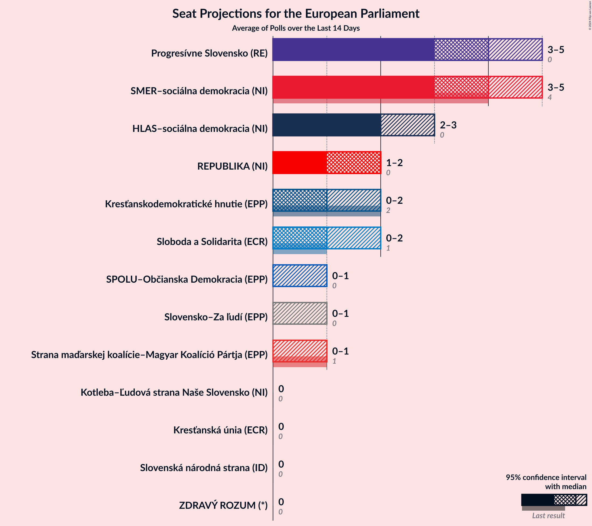
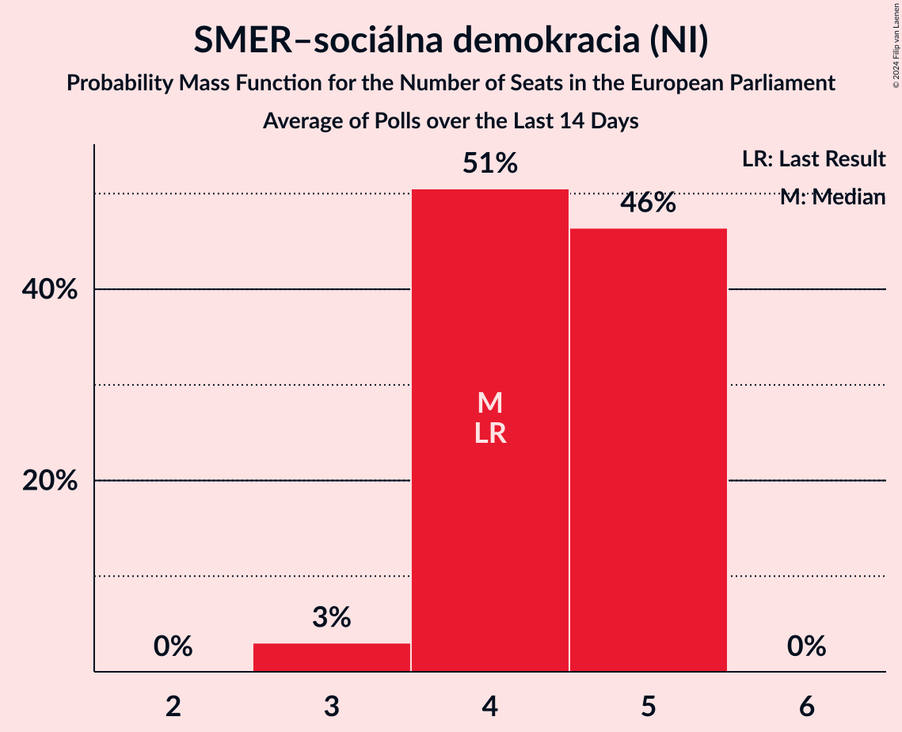
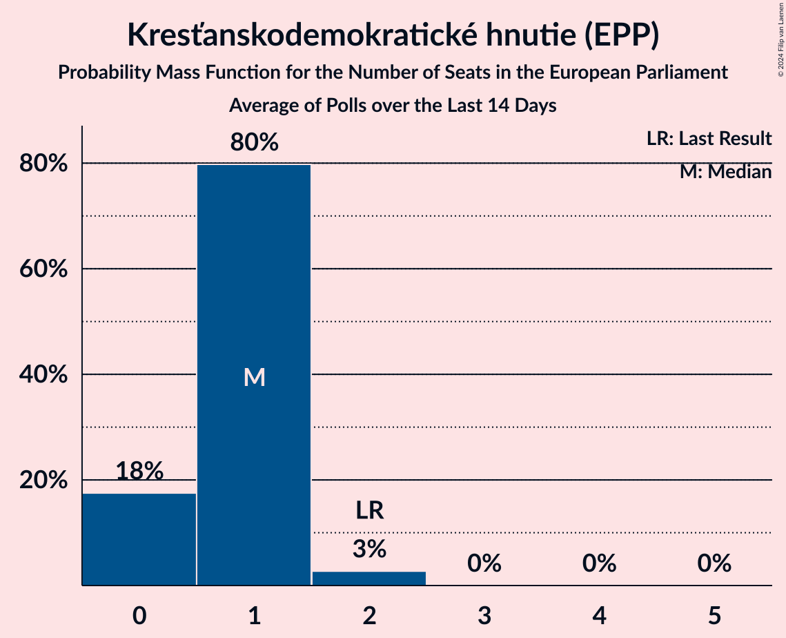
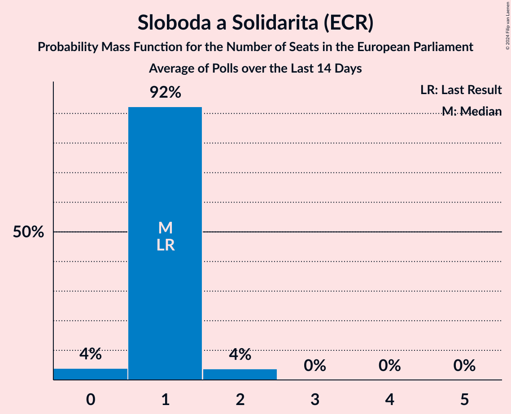
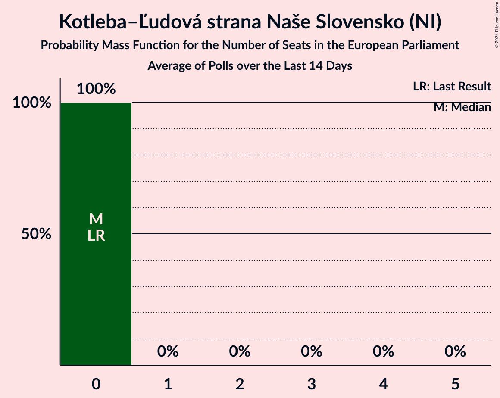
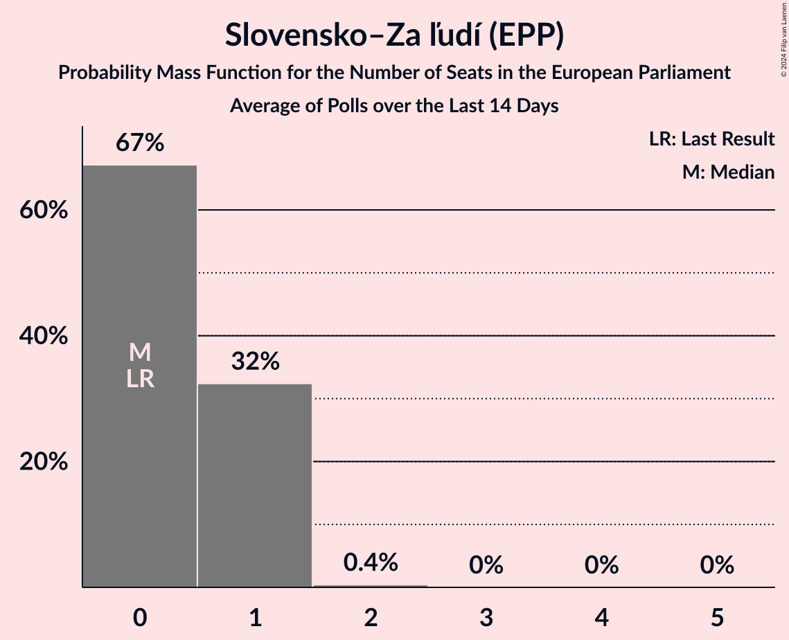
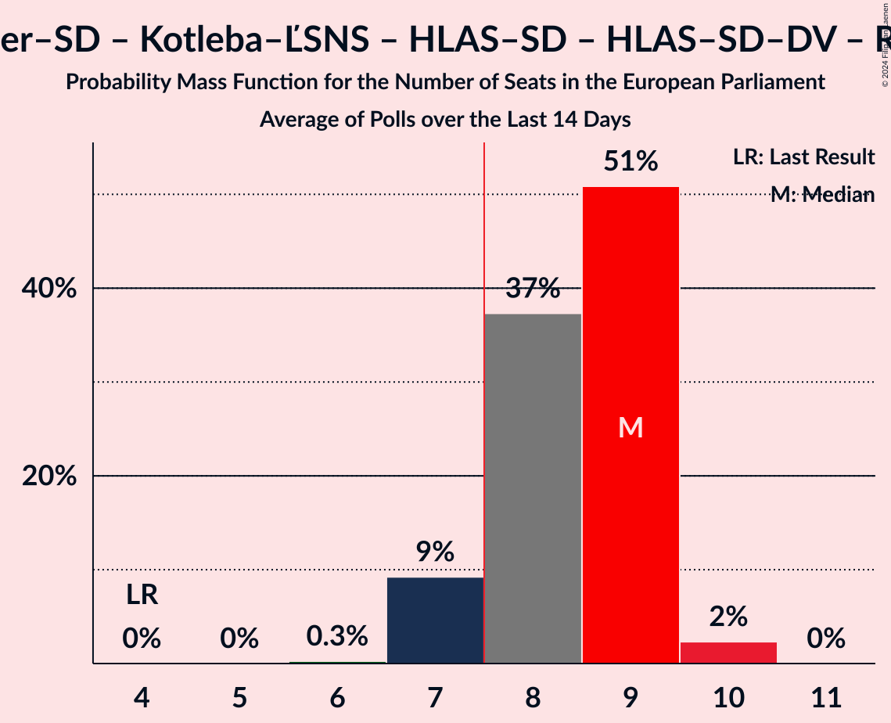
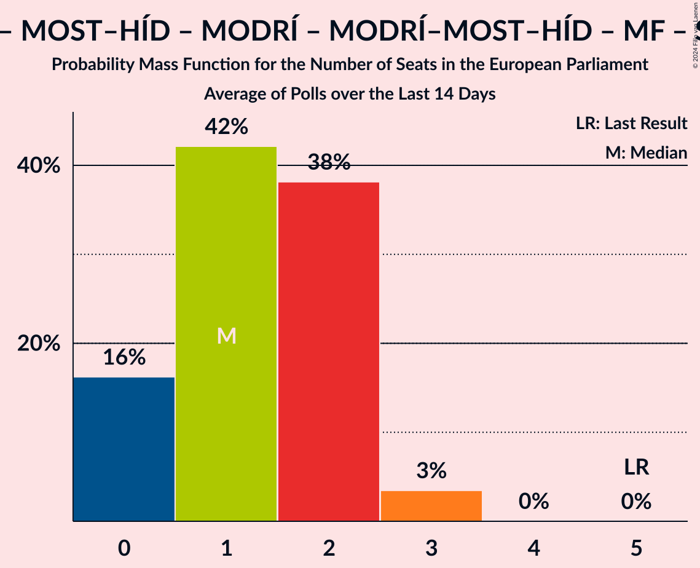
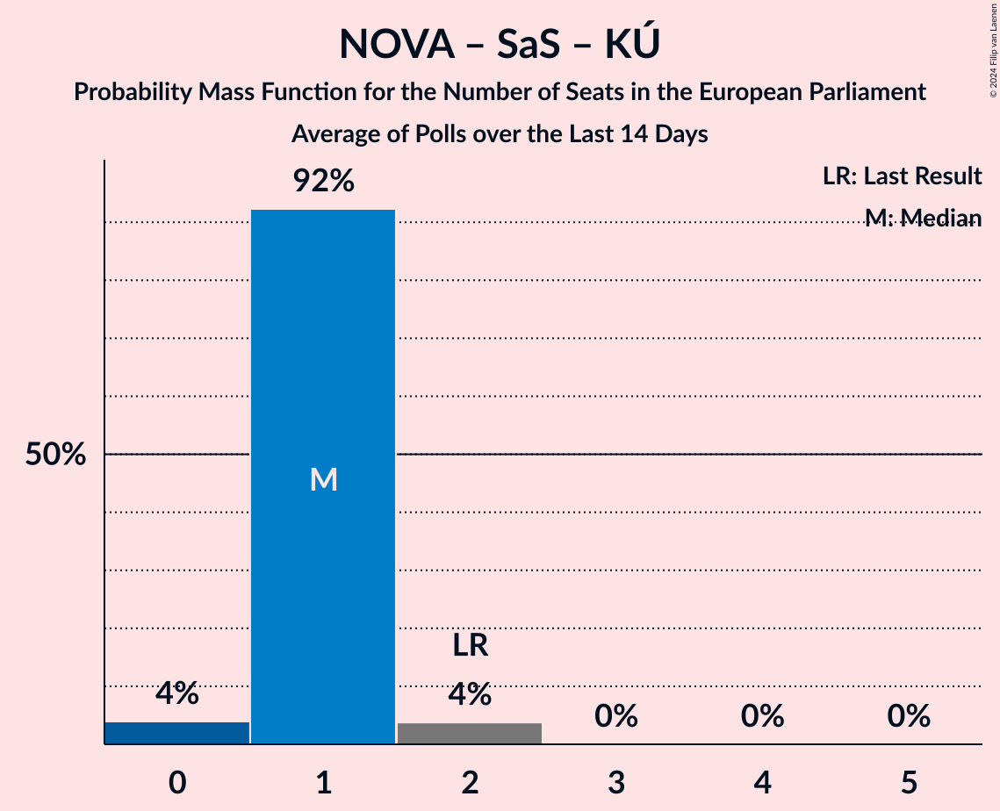

# Poll Average

<a href="#voting-intentions">Voting Intentions</a> | <a href="#seats">Seats</a> | <a href="#coalitions">Coalitions</a> | <a href="#technical-information">Technical Information</a>

## Summary

The table below lists the polls on which the average is based. They are the most recent polls (less than 14 days old) registered and analyzed so far.

| Period     | Polling firm/Commissioner(s) | Smer–SD | KDH | SK | NOVA | SaS | SMK–MKP | MOST–HÍD | SNS | Kotleba–ĽSNS | PS | SME RODINA | SPOLU | PS–SPOLU | ZĽ | DV | V | HLAS–SD | REP | MODRÍ | MODRÍ–MOST–HÍD | SK–KÚ–ZĽ | KÚ | HLAS–SD–DV | MF | SK–ZĽ | ZR |
|:----------:|:----------------------------:|:--:|:--:|:--:|:--:|:--:|:--:|:--:|:--:|:--:|:--:|:--:|:--:|:--:|:--:|:--:|:--:|:--:|:--:|:--:|:--:|:--:|:--:|:--:|:--:|:--:|:--:|
| 25 May 2019 | General Election | 24.1%   4 | 13.2%   2 | 7.5%   1 | 6.8%   1 | 6.7%   1 | 6.5%   1 | 5.8%   1 | 3.6%   0 | 1.7%   0 | 0.0%   0 | 0.0%   0 | 0.0%   0 | 0.0%   0 | 0.0%   0 | 0.0%   0 | 0.0%   0 | 0.0%   0 | 0.0%   0 | 0.0%   0 | 0.0%   0 | 0.0%   0 | 0.0%   0 | 0.0%   0 | 0.0%   0 | 0.0%   0 | 0.0%   0 |
| N/A | Poll Average | 20–26%   3–5 | 4–9%   0–2 | N/A   N/A | N/A   N/A | 5–9%   0–2 | 2–6%   0–1 | N/A   N/A | 2–4%   0 | 0–2%   0 | 18–25%   3–5 | N/A   N/A | 3–6%   0–1 | N/A   N/A | N/A   N/A | N/A   N/A | N/A   N/A | 10–16%   2–3 | 8–13%   1–2 | N/A   N/A | N/A   N/A | N/A   N/A | 1–2%   0 | N/A   N/A | N/A   N/A | 3–8%   0–1 | 0–1%   0 |
| [30 May–4 June 2024](2024-06-04-Ipsos.html) | Ipsos   Denník N | 22–27%   4–5 | 5–8%   0–1 | N/A   N/A | N/A   N/A | 5–7%   0–1 | 4–6%   0–1 | N/A   N/A | 2–4%   0 | 1–2%   0 | 20–24%   4 | N/A   N/A | 4–7%   0–1 | N/A   N/A | N/A   N/A | N/A   N/A | N/A   N/A | 10–13%   2 | 7–10%   1–2 | N/A   N/A | N/A   N/A | N/A   N/A | 1–2%   0 | N/A   N/A | N/A   N/A | 3–6%   0–1 | 0–1%   0 |
| [30 May–3 June 2024](2024-06-03-NMS.html) | NMS | 20–25%   4–5 | 4–7%   0–1 | N/A   N/A | N/A   N/A | 5–8%   0–2 | 3–5%   0–1 | N/A   N/A | 2–4%   0 | 0–1%   0 | 21–26%   4–5 | N/A   N/A | 2–5%   0 | N/A   N/A | N/A   N/A | N/A   N/A | N/A   N/A | 10–14%   2–3 | 9–13%   2–3 | N/A   N/A | N/A   N/A | N/A   N/A | 1–2%   0 | N/A   N/A | N/A   N/A | 2–5%   0 | N/A   N/A |
| [21–27 May 2024](2024-05-27-Median.html) | Median | 19–26%   3–4 | 5–9%   1–2 | N/A   N/A | N/A   N/A | 5–9%   1–2 | 2–5%   0 | N/A   N/A | 1–4%   0 | 1–3%   0 | 18–24%   3–4 | N/A   N/A | 3–7%   0–1 | N/A   N/A | N/A   N/A | N/A   N/A | N/A   N/A | 12–17%   2–3 | 7–12%   1–2 | N/A   N/A | N/A   N/A | N/A   N/A | N/A   N/A | N/A   N/A | N/A   N/A | 5–9%   0–1 | N/A   N/A |
| 25 May 2019 | General Election | 24.1%   4 | 13.2%   2 | 7.5%   1 | 6.8%   1 | 6.7%   1 | 6.5%   1 | 5.8%   1 | 3.6%   0 | 1.7%   0 | 0.0%   0 | 0.0%   0 | 0.0%   0 | 0.0%   0 | 0.0%   0 | 0.0%   0 | 0.0%   0 | 0.0%   0 | 0.0%   0 | 0.0%   0 | 0.0%   0 | 0.0%   0 | 0.0%   0 | 0.0%   0 | 0.0%   0 | 0.0%   0 | 0.0%   0 |

Only polls for which at least the sample size has been published are included in the table above.

**Legend:**
+ **Top half of each row:** Voting intentions (95% confidence interval)
+ **Bottom half of each row:** Seat projections for the European Parliament (95% confidence interval)
+ **Smer–SD:** SMER–sociálna demokracia (NI)
+ **KDH:** Kresťanskodemokratické hnutie (EPP)
+ **SK:** Slovensko (EPP)
+ **NOVA:** NOVA (ECR)
+ **SaS:** Sloboda a Solidarita (ECR)
+ **SMK–MKP:** Strana maďarskej koalície–Magyar Koalíció Pártja (EPP)
+ **MOST–HÍD:** MOST–HÍD (EPP)
+ **SNS:** Slovenská národná strana (ID)
+ **Kotleba–ĽSNS:** Kotleba–Ľudová strana Naše Slovensko (NI)
+ **PS:** Progresívne Slovensko (RE)
+ **SME RODINA:** SME RODINA (ID)
+ **SPOLU:** SPOLU–Občianska Demokracia (EPP)
+ **PS–SPOLU:** Progresívne Slovensko–SPOLU–Občianska Demokracia (RE)
+ **ZĽ:** Za ľudí (EPP)
+ **DV:** Dobrá voľba (*)
+ **V:** VLASŤ (*)
+ **HLAS–SD:** HLAS–sociálna demokracia (NI)
+ **REP:** REPUBLIKA (NI)
+ **MODRÍ:** MODRÍ–Európske Slovensko (EPP)
+ **MODRÍ–MOST–HÍD:** MODRÍ–Európske Slovensko–MOST–HÍD (EPP)
+ **SK–KÚ–ZĽ:** Slovensko–Kresťanská únia–Za ľudí (EPP)
+ **KÚ:** Kresťanská únia (ECR)
+ **HLAS–SD–DV:** HLAS–sociálna demokracia–Dobrá voľba (NI)
+ **MF:** Magyar Fórum (EPP)
+ **SK–ZĽ:** Slovensko–Za ľudí (EPP)
+ **ZR:** ZDRAVÝ ROZUM (*)
+ **N/A (single party):** Party not included the published results
+ **N/A (entire row):** Calculation for this opinion poll not started yet

## Voting Intentions

### Confidence Intervals

| Party | Last Result | Median | 80% Confidence Interval | 90% Confidence Interval | 95% Confidence Interval | 99% Confidence Interval |
|:-----:|:-----------:|:------:|:-----------------------:|:-----------------------:|:-----------------------:|:-----------------------:|
| <a href="#smer–sociálna-demokracia-(ni)">SMER–sociálna demokracia (NI)</a> | 24.1% | 23.1% | 20.8–25.4% |20.2–26.0% | 19.8–26.5% | 18.9–27.4% |
| <a href="#kresťanskodemokratické-hnutie-(epp)">Kresťanskodemokratické hnutie (EPP)</a> | 13.2% | 6.2% | 4.7–7.9% |4.4–8.4% | 4.1–8.8% | 3.7–9.7% |
| <a href="#slovensko-(epp)">Slovensko (EPP)</a> | 7.5% | N/A | N/A |N/A | N/A | N/A |
| <a href="#nova-(ecr)">NOVA (ECR)</a> | 6.8% | N/A | N/A |N/A | N/A | N/A |
| <a href="#sloboda-a-solidarita-(ecr)">Sloboda a Solidarita (ECR)</a> | 6.7% | 6.4% | 5.3–7.8% |5.0–8.3% | 4.8–8.7% | 4.4–9.5% |
| <a href="#strana-maďarskej-koalície–magyar-koalíció-pártja-(epp)">Strana maďarskej koalície–Magyar Koalíció Pártja (EPP)</a> | 6.5% | 4.0% | 2.9–5.5% |2.6–5.8% | 2.4–6.1% | 2.1–6.6% |
| <a href="#most–híd-(epp)">MOST–HÍD (EPP)</a> | 5.8% | N/A | N/A |N/A | N/A | N/A |
| <a href="#slovenská-národná-strana-(id)">Slovenská národná strana (ID)</a> | 3.6% | 3.0% | 2.1–3.8% |1.9–4.1% | 1.7–4.3% | 1.3–4.7% |
| <a href="#kotleba–ľudová-strana-naše-slovensko-(ni)">Kotleba–Ľudová strana Naše Slovensko (NI)</a> | 1.7% | 1.0% | 0.6–1.8% |0.5–2.1% | 0.4–2.3% | 0.3–2.8% |
| <a href="#progresívne-slovensko-(re)">Progresívne Slovensko (RE)</a> | 0.0% | 22.0% | 19.7–24.2% |19.0–24.8% | 18.4–25.3% | 17.4–26.2% |
| <a href="#sme-rodina-(id)">SME RODINA (ID)</a> | 0.0% | N/A | N/A |N/A | N/A | N/A |
| <a href="#spolu–občianska-demokracia-(epp)">SPOLU–Občianska Demokracia (EPP)</a> | 0.0% | 4.7% | 3.1–5.9% |2.8–6.3% | 2.6–6.5% | 2.3–7.1% |
| <a href="#progresívne-slovensko–spolu–občianska-demokracia-(re)">Progresívne Slovensko–SPOLU–Občianska Demokracia (RE)</a> | 0.0% | N/A | N/A |N/A | N/A | N/A |
| <a href="#za-ľudí-(epp)">Za ľudí (EPP)</a> | 0.0% | N/A | N/A |N/A | N/A | N/A |
| <a href="#dobrá-voľba-(*)">Dobrá voľba (*)</a> | 0.0% | N/A | N/A |N/A | N/A | N/A |
| <a href="#vlasť-(*)">VLASŤ (*)</a> | 0.0% | N/A | N/A |N/A | N/A | N/A |
| <a href="#hlas–sociálna-demokracia-(ni)">HLAS–sociálna demokracia (NI)</a> | 0.0% | 12.2% | 10.5–14.9% |10.2–15.6% | 9.9–16.2% | 9.3–17.3% |
| <a href="#republika-(ni)">REPUBLIKA (NI)</a> | 0.0% | 9.7% | 8.1–11.7% |7.8–12.1% | 7.5–12.6% | 6.9–13.3% |
| <a href="#modrí–európske-slovensko-(epp)">MODRÍ–Európske Slovensko (EPP)</a> | 0.0% | N/A | N/A |N/A | N/A | N/A |
| <a href="#modrí–európske-slovensko–most–híd-(epp)">MODRÍ–Európske Slovensko–MOST–HÍD (EPP)</a> | 0.0% | N/A | N/A |N/A | N/A | N/A |
| <a href="#slovensko–kresťanská-únia–za-ľudí-(epp)">Slovensko–Kresťanská únia–Za ľudí (EPP)</a> | 0.0% | N/A | N/A |N/A | N/A | N/A |
| <a href="#kresťanská-únia-(ecr)">Kresťanská únia (ECR)</a> | 0.0% | 1.4% | 0.9–1.9% |0.8–2.1% | 0.8–2.2% | 0.6–2.5% |
| <a href="#hlas–sociálna-demokracia–dobrá-voľba-(ni)">HLAS–sociálna demokracia–Dobrá voľba (NI)</a> | 0.0% | N/A | N/A |N/A | N/A | N/A |
| <a href="#magyar-fórum-(epp)">Magyar Fórum (EPP)</a> | 0.0% | N/A | N/A |N/A | N/A | N/A |
| <a href="#slovensko–za-ľudí-(epp)">Slovensko–Za ľudí (EPP)</a> | 0.0% | 4.5% | 3.0–7.2% |2.8–7.7% | 2.6–8.2% | 2.2–9.0% |
| <a href="#zdravý-rozum-(*)">ZDRAVÝ ROZUM (*)</a> | 0.0% | 0.8% | 0.5–1.2% |0.4–1.3% | 0.4–1.4% | 0.3–1.6% |

### SMER–sociálna demokracia (NI)

*For a full overview of the results for this party, see the [SMER–sociálna demokracia (NI)](party-smer–sociálnademokraciani.html) page.*

| Voting Intentions | Probability | Accumulated | Special Marks |
|:-----------------:|:-----------:|:-----------:|:-------------:|
| 16.5–17.5% | 0% | 100% |  |
| 17.5–18.5% | 0.2% | 100% |  |
| 18.5–19.5% | 1.5% | 99.7% |  |
| 19.5–20.5% | 6% | 98% |  |
| 20.5–21.5% | 13% | 93% |  |
| 21.5–22.5% | 19% | 80% |  |
| 22.5–23.5% | 20% | 61% | Median |
| 23.5–24.5% | 18% | 41% | Last Result |
| 24.5–25.5% | 13% | 22% |  |
| 25.5–26.5% | 7% | 9% |  |
| 26.5–27.5% | 2% | 2% |  |
| 27.5–28.5% | 0.3% | 0.4% |  |
| 28.5–29.5% | 0% | 0% |  |

### Kresťanskodemokratické hnutie (EPP)

*For a full overview of the results for this party, see the [Kresťanskodemokratické hnutie (EPP)](party-kresťanskodemokratickéhnutieepp.html) page.*

| Voting Intentions | Probability | Accumulated | Special Marks |
|:-----------------:|:-----------:|:-----------:|:-------------:|
| 1.5–2.5% | 0% | 100% |  |
| 2.5–3.5% | 0.2% | 100% |  |
| 3.5–4.5% | 7% | 99.8% |  |
| 4.5–5.5% | 23% | 92% |  |
| 5.5–6.5% | 31% | 70% | Median |
| 6.5–7.5% | 24% | 39% |  |
| 7.5–8.5% | 11% | 15% |  |
| 8.5–9.5% | 3% | 4% |  |
| 9.5–10.5% | 0.6% | 0.7% |  |
| 10.5–11.5% | 0.1% | 0.1% |  |
| 11.5–12.5% | 0% | 0% |  |
| 12.5–13.5% | 0% | 0% | Last Result |

### Sloboda a Solidarita (ECR)

*For a full overview of the results for this party, see the [Sloboda a Solidarita (ECR)](party-slobodaasolidaritaecr.html) page.*

| Voting Intentions | Probability | Accumulated | Special Marks |
|:-----------------:|:-----------:|:-----------:|:-------------:|
| 2.5–3.5% | 0% | 100% |  |
| 3.5–4.5% | 1.0% | 100% |  |
| 4.5–5.5% | 17% | 99.0% |  |
| 5.5–6.5% | 40% | 82% | Median |
| 6.5–7.5% | 28% | 43% | Last Result |
| 7.5–8.5% | 11% | 14% |  |
| 8.5–9.5% | 3% | 3% |  |
| 9.5–10.5% | 0.4% | 0.5% |  |
| 10.5–11.5% | 0% | 0% |  |
| 11.5–12.5% | 0% | 0% |  |

### Strana maďarskej koalície–Magyar Koalíció Pártja (EPP)

*For a full overview of the results for this party, see the [Strana maďarskej koalície–Magyar Koalíció Pártja (EPP)](party-stranamaďarskejkoalície–magyarkoalíciópártjaepp.html) page.*

| Voting Intentions | Probability | Accumulated | Special Marks |
|:-----------------:|:-----------:|:-----------:|:-------------:|
| 0.5–1.5% | 0% | 100% |  |
| 1.5–2.5% | 4% | 100% |  |
| 2.5–3.5% | 28% | 96% |  |
| 3.5–4.5% | 35% | 69% | Median |
| 4.5–5.5% | 25% | 33% |  |
| 5.5–6.5% | 8% | 9% |  |
| 6.5–7.5% | 0.6% | 0.6% | Last Result |
| 7.5–8.5% | 0% | 0% |  |

### Slovenská národná strana (ID)

*For a full overview of the results for this party, see the [Slovenská národná strana (ID)](party-slovenskánárodnástranaid.html) page.*

| Voting Intentions | Probability | Accumulated | Special Marks |
|:-----------------:|:-----------:|:-----------:|:-------------:|
| 0.0–0.5% | 0% | 100% |  |
| 0.5–1.5% | 2% | 100% |  |
| 1.5–2.5% | 23% | 98% |  |
| 2.5–3.5% | 56% | 75% | Median |
| 3.5–4.5% | 19% | 20% | Last Result |
| 4.5–5.5% | 0.9% | 0.9% |  |
| 5.5–6.5% | 0% | 0% |  |

### Kotleba–Ľudová strana Naše Slovensko (NI)

*For a full overview of the results for this party, see the [Kotleba–Ľudová strana Naše Slovensko (NI)](party-kotleba–ľudovástrananašeslovenskoni.html) page.*

| Voting Intentions | Probability | Accumulated | Special Marks |
|:-----------------:|:-----------:|:-----------:|:-------------:|
| 0.0–0.5% | 8% | 100% |  |
| 0.5–1.5% | 75% | 92% | Median |
| 1.5–2.5% | 16% | 18% | Last Result |
| 2.5–3.5% | 1.2% | 1.2% |  |
| 3.5–4.5% | 0% | 0% |  |

### Progresívne Slovensko (RE)

*For a full overview of the results for this party, see the [Progresívne Slovensko (RE)](party-progresívneslovenskore.html) page.*

| Voting Intentions | Probability | Accumulated | Special Marks |
|:-----------------:|:-----------:|:-----------:|:-------------:|
| 0.0–0.5% | 0% | 100% | Last Result |
| 0.5–1.5% | 0% | 100% |  |
| 1.5–2.5% | 0% | 100% |  |
| 2.5–3.5% | 0% | 100% |  |
| 3.5–4.5% | 0% | 100% |  |
| 4.5–5.5% | 0% | 100% |  |
| 5.5–6.5% | 0% | 100% |  |
| 6.5–7.5% | 0% | 100% |  |
| 7.5–8.5% | 0% | 100% |  |
| 8.5–9.5% | 0% | 100% |  |
| 9.5–10.5% | 0% | 100% |  |
| 10.5–11.5% | 0% | 100% |  |
| 11.5–12.5% | 0% | 100% |  |
| 12.5–13.5% | 0% | 100% |  |
| 13.5–14.5% | 0% | 100% |  |
| 14.5–15.5% | 0% | 100% |  |
| 15.5–16.5% | 0.1% | 100% |  |
| 16.5–17.5% | 0.6% | 99.9% |  |
| 17.5–18.5% | 2% | 99.3% |  |
| 18.5–19.5% | 6% | 97% |  |
| 19.5–20.5% | 11% | 91% |  |
| 20.5–21.5% | 19% | 80% |  |
| 21.5–22.5% | 23% | 61% | Median |
| 22.5–23.5% | 19% | 37% |  |
| 23.5–24.5% | 12% | 18% |  |
| 24.5–25.5% | 5% | 6% |  |
| 25.5–26.5% | 1.4% | 2% |  |
| 26.5–27.5% | 0.2% | 0.3% |  |
| 27.5–28.5% | 0% | 0% |  |

### SPOLU–Občianska Demokracia (EPP)

*For a full overview of the results for this party, see the [SPOLU–Občianska Demokracia (EPP)](party-spolu–občianskademokraciaepp.html) page.*

| Voting Intentions | Probability | Accumulated | Special Marks |
|:-----------------:|:-----------:|:-----------:|:-------------:|
| 0.0–0.5% | 0% | 100% | Last Result |
| 0.5–1.5% | 0% | 100% |  |
| 1.5–2.5% | 2% | 100% |  |
| 2.5–3.5% | 20% | 98% |  |
| 3.5–4.5% | 26% | 78% |  |
| 4.5–5.5% | 34% | 53% | Median |
| 5.5–6.5% | 17% | 19% |  |
| 6.5–7.5% | 2% | 2% |  |
| 7.5–8.5% | 0.1% | 0.2% |  |
| 8.5–9.5% | 0% | 0% |  |

### HLAS–sociálna demokracia (NI)

*For a full overview of the results for this party, see the [HLAS–sociálna demokracia (NI)](party-hlas–sociálnademokraciani.html) page.*

| Voting Intentions | Probability | Accumulated | Special Marks |
|:-----------------:|:-----------:|:-----------:|:-------------:|
| 0.0–0.5% | 0% | 100% | Last Result |
| 0.5–1.5% | 0% | 100% |  |
| 1.5–2.5% | 0% | 100% |  |
| 2.5–3.5% | 0% | 100% |  |
| 3.5–4.5% | 0% | 100% |  |
| 4.5–5.5% | 0% | 100% |  |
| 5.5–6.5% | 0% | 100% |  |
| 6.5–7.5% | 0% | 100% |  |
| 7.5–8.5% | 0% | 100% |  |
| 8.5–9.5% | 1.1% | 100% |  |
| 9.5–10.5% | 9% | 98.9% |  |
| 10.5–11.5% | 24% | 90% |  |
| 11.5–12.5% | 25% | 66% | Median |
| 12.5–13.5% | 17% | 41% |  |
| 13.5–14.5% | 12% | 24% |  |
| 14.5–15.5% | 8% | 13% |  |
| 15.5–16.5% | 4% | 5% |  |
| 16.5–17.5% | 1.2% | 2% |  |
| 17.5–18.5% | 0.3% | 0.3% |  |
| 18.5–19.5% | 0% | 0% |  |
| 19.5–20.5% | 0% | 0% |  |

### Slovensko–Za ľudí (EPP)

*For a full overview of the results for this party, see the [Slovensko–Za ľudí (EPP)](party-slovensko–zaľudíepp.html) page.*

| Voting Intentions | Probability | Accumulated | Special Marks |
|:-----------------:|:-----------:|:-----------:|:-------------:|
| 0.0–0.5% | 0% | 100% | Last Result |
| 0.5–1.5% | 0% | 100% |  |
| 1.5–2.5% | 2% | 100% |  |
| 2.5–3.5% | 22% | 98% |  |
| 3.5–4.5% | 28% | 76% | Median |
| 4.5–5.5% | 17% | 48% |  |
| 5.5–6.5% | 13% | 31% |  |
| 6.5–7.5% | 12% | 18% |  |
| 7.5–8.5% | 5% | 6% |  |
| 8.5–9.5% | 1.1% | 1.2% |  |
| 9.5–10.5% | 0.1% | 0.1% |  |
| 10.5–11.5% | 0% | 0% |  |

### ZDRAVÝ ROZUM (*)

*For a full overview of the results for this party, see the [ZDRAVÝ ROZUM (*)](party-zdravýrozum.html) page.*

| Voting Intentions | Probability | Accumulated | Special Marks |
|:-----------------:|:-----------:|:-----------:|:-------------:|
| 0.0–0.5% | 14% | 100% | Last Result |
| 0.5–1.5% | 85% | 86% | Median |
| 1.5–2.5% | 0.8% | 0.8% |  |
| 2.5–3.5% | 0% | 0% |  |

### Kresťanská únia (ECR)

*For a full overview of the results for this party, see the [Kresťanská únia (ECR)](party-kresťanskáúniaecr.html) page.*

| Voting Intentions | Probability | Accumulated | Special Marks |
|:-----------------:|:-----------:|:-----------:|:-------------:|
| 0.0–0.5% | 0.3% | 100% | Last Result |
| 0.5–1.5% | 67% | 99.7% | Median |
| 1.5–2.5% | 33% | 33% |  |
| 2.5–3.5% | 0.4% | 0.4% |  |
| 3.5–4.5% | 0% | 0% |  |

### REPUBLIKA (NI)

*For a full overview of the results for this party, see the [REPUBLIKA (NI)](party-republikani.html) page.*

| Voting Intentions | Probability | Accumulated | Special Marks |
|:-----------------:|:-----------:|:-----------:|:-------------:|
| 0.0–0.5% | 0% | 100% | Last Result |
| 0.5–1.5% | 0% | 100% |  |
| 1.5–2.5% | 0% | 100% |  |
| 2.5–3.5% | 0% | 100% |  |
| 3.5–4.5% | 0% | 100% |  |
| 4.5–5.5% | 0% | 100% |  |
| 5.5–6.5% | 0.1% | 100% |  |
| 6.5–7.5% | 3% | 99.9% |  |
| 7.5–8.5% | 17% | 97% |  |
| 8.5–9.5% | 27% | 80% |  |
| 9.5–10.5% | 23% | 53% | Median |
| 10.5–11.5% | 18% | 30% |  |
| 11.5–12.5% | 9% | 11% |  |
| 12.5–13.5% | 2% | 3% |  |
| 13.5–14.5% | 0.3% | 0.3% |  |
| 14.5–15.5% | 0% | 0% |  |

## Seats

### Confidence Intervals

| Party | Last Result | Median | 80% Confidence Interval | 90% Confidence Interval | 95% Confidence Interval | 99% Confidence Interval |
|:-----:|:-----------:|:------:|:-----------------------:|:-----------------------:|:-----------------------:|:-----------------------:|
| <a href="#smer–sociálna-demokracia-(ni)">SMER–sociálna demokracia (NI)</a> | 4 | 4 | 4–5 |4–5 | 3–5 | 3–5 |
| <a href="#kresťanskodemokratické-hnutie-(epp)">Kresťanskodemokratické hnutie (EPP)</a> | 2 | 1 | 0–1 |0–1 | 0–2 | 0–2 |
| <a href="#slovensko-(epp)">Slovensko (EPP)</a> | 1 | N/A | N/A |N/A | N/A | N/A |
| <a href="#nova-(ecr)">NOVA (ECR)</a> | 1 | N/A | N/A |N/A | N/A | N/A |
| <a href="#sloboda-a-solidarita-(ecr)">Sloboda a Solidarita (ECR)</a> | 1 | 1 | 1 |1 | 0–2 | 0–2 |
| <a href="#strana-maďarskej-koalície–magyar-koalíció-pártja-(epp)">Strana maďarskej koalície–Magyar Koalíció Pártja (EPP)</a> | 1 | 0 | 0–1 |0–1 | 0–1 | 0–1 |
| <a href="#most–híd-(epp)">MOST–HÍD (EPP)</a> | 1 | N/A | N/A |N/A | N/A | N/A |
| <a href="#slovenská-národná-strana-(id)">Slovenská národná strana (ID)</a> | 0 | 0 | 0 |0 | 0 | 0 |
| <a href="#kotleba–ľudová-strana-naše-slovensko-(ni)">Kotleba–Ľudová strana Naše Slovensko (NI)</a> | 0 | 0 | 0 |0 | 0 | 0 |
| <a href="#progresívne-slovensko-(re)">Progresívne Slovensko (RE)</a> | 0 | 4 | 3–5 |3–5 | 3–5 | 3–5 |
| <a href="#sme-rodina-(id)">SME RODINA (ID)</a> | 0 | N/A | N/A |N/A | N/A | N/A |
| <a href="#spolu–občianska-demokracia-(epp)">SPOLU–Občianska Demokracia (EPP)</a> | 0 | 0 | 0–1 |0–1 | 0–1 | 0–1 |
| <a href="#progresívne-slovensko–spolu–občianska-demokracia-(re)">Progresívne Slovensko–SPOLU–Občianska Demokracia (RE)</a> | 0 | N/A | N/A |N/A | N/A | N/A |
| <a href="#za-ľudí-(epp)">Za ľudí (EPP)</a> | 0 | N/A | N/A |N/A | N/A | N/A |
| <a href="#dobrá-voľba-(*)">Dobrá voľba (*)</a> | 0 | N/A | N/A |N/A | N/A | N/A |
| <a href="#vlasť-(*)">VLASŤ (*)</a> | 0 | N/A | N/A |N/A | N/A | N/A |
| <a href="#hlas–sociálna-demokracia-(ni)">HLAS–sociálna demokracia (NI)</a> | 0 | 2 | 2–3 |2–3 | 2–3 | 2–3 |
| <a href="#republika-(ni)">REPUBLIKA (NI)</a> | 0 | 2 | 1–2 |1–2 | 1–2 | 1–3 |
| <a href="#modrí–európske-slovensko-(epp)">MODRÍ–Európske Slovensko (EPP)</a> | 0 | N/A | N/A |N/A | N/A | N/A |
| <a href="#modrí–európske-slovensko–most–híd-(epp)">MODRÍ–Európske Slovensko–MOST–HÍD (EPP)</a> | 0 | N/A | N/A |N/A | N/A | N/A |
| <a href="#slovensko–kresťanská-únia–za-ľudí-(epp)">Slovensko–Kresťanská únia–Za ľudí (EPP)</a> | 0 | N/A | N/A |N/A | N/A | N/A |
| <a href="#kresťanská-únia-(ecr)">Kresťanská únia (ECR)</a> | 0 | 0 | 0 |0 | 0 | 0 |
| <a href="#hlas–sociálna-demokracia–dobrá-voľba-(ni)">HLAS–sociálna demokracia–Dobrá voľba (NI)</a> | 0 | N/A | N/A |N/A | N/A | N/A |
| <a href="#magyar-fórum-(epp)">Magyar Fórum (EPP)</a> | 0 | N/A | N/A |N/A | N/A | N/A |
| <a href="#slovensko–za-ľudí-(epp)">Slovensko–Za ľudí (EPP)</a> | 0 | 0 | 0–1 |0–1 | 0–1 | 0–1 |
| <a href="#zdravý-rozum-(*)">ZDRAVÝ ROZUM (*)</a> | 0 | 0 | 0 |0 | 0 | 0 |

### SMER–sociálna demokracia (NI)

*For a full overview of the results for this party, see the [SMER–sociálna demokracia (NI)](party-smer–sociálnademokraciani.html) page.*

| Number of Seats | Probability | Accumulated | Special Marks |
|:---------------:|:-----------:|:-----------:|:-------------:|
| 3 | 3% | 100% |  |
| 4 | 51% | 97% | Last Result, Median |
| 5 | 46% | 46% |  |
| 6 | 0% | 0% |  |

### Kresťanskodemokratické hnutie (EPP)

*For a full overview of the results for this party, see the [Kresťanskodemokratické hnutie (EPP)](party-kresťanskodemokratickéhnutieepp.html) page.*

| Number of Seats | Probability | Accumulated | Special Marks |
|:---------------:|:-----------:|:-----------:|:-------------:|
| 0 | 18% | 100% |  |
| 1 | 80% | 82% | Median |
| 2 | 3% | 3% | Last Result |
| 3 | 0% | 0% |  |

### Slovensko (EPP)

*For a full overview of the results for this party, see the [Slovensko (EPP)](party-slovenskoepp.html) page.*

### NOVA (ECR)

*For a full overview of the results for this party, see the [NOVA (ECR)](party-novaecr.html) page.*

### Sloboda a Solidarita (ECR)

*For a full overview of the results for this party, see the [Sloboda a Solidarita (ECR)](party-slobodaasolidaritaecr.html) page.*

| Number of Seats | Probability | Accumulated | Special Marks |
|:---------------:|:-----------:|:-----------:|:-------------:|
| 0 | 4% | 100% |  |
| 1 | 92% | 96% | Last Result, Median |
| 2 | 4% | 4% |  |
| 3 | 0% | 0% |  |

### Strana maďarskej koalície–Magyar Koalíció Pártja (EPP)

*For a full overview of the results for this party, see the [Strana maďarskej koalície–Magyar Koalíció Pártja (EPP)](party-stranamaďarskejkoalície–magyarkoalíciópártjaepp.html) page.*

| Number of Seats | Probability | Accumulated | Special Marks |
|:---------------:|:-----------:|:-----------:|:-------------:|
| 0 | 90% | 100% | Median |
| 1 | 10% | 10% | Last Result |
| 2 | 0% | 0% |  |

### MOST–HÍD (EPP)

*For a full overview of the results for this party, see the [MOST–HÍD (EPP)](party-most–hídepp.html) page.*

### Slovenská národná strana (ID)

*For a full overview of the results for this party, see the [Slovenská národná strana (ID)](party-slovenskánárodnástranaid.html) page.*

| Number of Seats | Probability | Accumulated | Special Marks |
|:---------------:|:-----------:|:-----------:|:-------------:|
| 0 | 99.9% | 100% | Last Result, Median |
| 1 | 0.1% | 0.1% |  |
| 2 | 0% | 0% |  |

### Kotleba–Ľudová strana Naše Slovensko (NI)

*For a full overview of the results for this party, see the [Kotleba–Ľudová strana Naše Slovensko (NI)](party-kotleba–ľudovástrananašeslovenskoni.html) page.*

| Number of Seats | Probability | Accumulated | Special Marks |
|:---------------:|:-----------:|:-----------:|:-------------:|
| 0 | 100% | 100% | Last Result, Median |

### Progresívne Slovensko (RE)

*For a full overview of the results for this party, see the [Progresívne Slovensko (RE)](party-progresívneslovenskore.html) page.*

| Number of Seats | Probability | Accumulated | Special Marks |
|:---------------:|:-----------:|:-----------:|:-------------:|
| 0 | 0% | 100% | Last Result |
| 1 | 0% | 100% |  |
| 2 | 0% | 100% |  |
| 3 | 14% | 100% |  |
| 4 | 67% | 86% | Median |
| 5 | 19% | 19% |  |
| 6 | 0.2% | 0.2% |  |
| 7 | 0% | 0% |  |

### SME RODINA (ID)

*For a full overview of the results for this party, see the [SME RODINA (ID)](party-smerodinaid.html) page.*

### SPOLU–Občianska Demokracia (EPP)

*For a full overview of the results for this party, see the [SPOLU–Občianska Demokracia (EPP)](party-spolu–občianskademokraciaepp.html) page.*

| Number of Seats | Probability | Accumulated | Special Marks |
|:---------------:|:-----------:|:-----------:|:-------------:|
| 0 | 79% | 100% | Last Result, Median |
| 1 | 21% | 21% |  |
| 2 | 0% | 0% |  |

### Progresívne Slovensko–SPOLU–Občianska Demokracia (RE)

*For a full overview of the results for this party, see the [Progresívne Slovensko–SPOLU–Občianska Demokracia (RE)](party-progresívneslovensko–spolu–občianskademokraciare.html) page.*

### Za ľudí (EPP)

*For a full overview of the results for this party, see the [Za ľudí (EPP)](party-zaľudíepp.html) page.*

### Dobrá voľba (*)

*For a full overview of the results for this party, see the [Dobrá voľba (*)](party-dobrávoľba.html) page.*

### VLASŤ (*)

*For a full overview of the results for this party, see the [VLASŤ (*)](party-vlasť.html) page.*

### HLAS–sociálna demokracia (NI)

*For a full overview of the results for this party, see the [HLAS–sociálna demokracia (NI)](party-hlas–sociálnademokraciani.html) page.*

| Number of Seats | Probability | Accumulated | Special Marks |
|:---------------:|:-----------:|:-----------:|:-------------:|
| 0 | 0% | 100% | Last Result |
| 1 | 0.1% | 100% |  |
| 2 | 78% | 99.9% | Median |
| 3 | 21% | 21% |  |
| 4 | 0% | 0% |  |

### REPUBLIKA (NI)

*For a full overview of the results for this party, see the [REPUBLIKA (NI)](party-republikani.html) page.*

| Number of Seats | Probability | Accumulated | Special Marks |
|:---------------:|:-----------:|:-----------:|:-------------:|
| 0 | 0% | 100% | Last Result |
| 1 | 21% | 100% |  |
| 2 | 77% | 79% | Median |
| 3 | 2% | 2% |  |
| 4 | 0% | 0% |  |

### MODRÍ–Európske Slovensko (EPP)

*For a full overview of the results for this party, see the [MODRÍ–Európske Slovensko (EPP)](party-modrí–európskeslovenskoepp.html) page.*

### MODRÍ–Európske Slovensko–MOST–HÍD (EPP)

*For a full overview of the results for this party, see the [MODRÍ–Európske Slovensko–MOST–HÍD (EPP)](party-modrí–európskeslovensko–most–hídepp.html) page.*

### Slovensko–Kresťanská únia–Za ľudí (EPP)

*For a full overview of the results for this party, see the [Slovensko–Kresťanská únia–Za ľudí (EPP)](party-slovensko–kresťanskáúnia–zaľudíepp.html) page.*

### Kresťanská únia (ECR)

*For a full overview of the results for this party, see the [Kresťanská únia (ECR)](party-kresťanskáúniaecr.html) page.*

| Number of Seats | Probability | Accumulated | Special Marks |
|:---------------:|:-----------:|:-----------:|:-------------:|
| 0 | 100% | 100% | Last Result, Median |

### HLAS–sociálna demokracia–Dobrá voľba (NI)

*For a full overview of the results for this party, see the [HLAS–sociálna demokracia–Dobrá voľba (NI)](party-hlas–sociálnademokracia–dobrávoľbani.html) page.*

### Magyar Fórum (EPP)

*For a full overview of the results for this party, see the [Magyar Fórum (EPP)](party-magyarfórumepp.html) page.*

### Slovensko–Za ľudí (EPP)

*For a full overview of the results for this party, see the [Slovensko–Za ľudí (EPP)](party-slovensko–zaľudíepp.html) page.*

| Number of Seats | Probability | Accumulated | Special Marks |
|:---------------:|:-----------:|:-----------:|:-------------:|
| 0 | 67% | 100% | Last Result, Median |
| 1 | 32% | 33% |  |
| 2 | 0.4% | 0.4% |  |
| 3 | 0% | 0% |  |

### ZDRAVÝ ROZUM (*)

*For a full overview of the results for this party, see the [ZDRAVÝ ROZUM (*)](party-zdravýrozum.html) page.*

| Number of Seats | Probability | Accumulated | Special Marks |
|:---------------:|:-----------:|:-----------:|:-------------:|
| 0 | 100% | 100% | Last Result, Median |

## Coalitions

### Confidence Intervals

| Coalition | Last Result | Median | Majority? | 80% Confidence Interval | 90% Confidence Interval | 95% Confidence Interval | 99% Confidence Interval |
|:---------:|:-----------:|:------:|:---------:|:-----------------------:|:-----------------------:|:-----------------------:|:-----------------------:|
| SMER–sociálna demokracia (NI) – Kotleba–Ľudová strana Naše Slovensko (NI) – HLAS–sociálna demokracia (NI) – HLAS–sociálna demokracia–Dobrá voľba (NI) – REPUBLIKA (NI) | 4 | 9 | 91% | 8–9 | 7–9 | 7–9 | 7–10 |
| Kresťanskodemokratické hnutie (EPP) – Slovensko (EPP) – Strana maďarskej koalície–Magyar Koalíció Pártja (EPP) – MOST–HÍD (EPP) – MODRÍ–Európske Slovensko (EPP) – MODRÍ–Európske Slovensko–MOST–HÍD (EPP) – Magyar Fórum (EPP) – Slovensko–Kresťanská únia–Za ľudí (EPP) – Slovensko–Za ľudí (EPP) – Za ľudí (EPP) | 5 | 1 | 0% | 0–2 | 0–2 | 0–3 | 0–3 |
| NOVA (ECR) – Sloboda a Solidarita (ECR) – Kresťanská únia (ECR) | 2 | 1 | 0% | 1 | 1 | 0–2 | 0–2 |
| Dobrá voľba (*) – VLASŤ (*) – ZDRAVÝ ROZUM (*) | 0 | 0 | 0% | 0 | 0 | 0 | 0 |
| Progresívne Slovensko–SPOLU–Občianska Demokracia (RE) | 0 | 0 | 0% | 0 | 0 | 0 | 0 |
| Slovenská národná strana (ID) – SME RODINA (ID) | 0 | 0 | 0% | 0 | 0 | 0 | 0 |

### SMER–sociálna demokracia (NI) – Kotleba–Ľudová strana Naše Slovensko (NI) – HLAS–sociálna demokracia (NI) – HLAS–sociálna demokracia–Dobrá voľba (NI) – REPUBLIKA (NI)

| Number of Seats | Probability | Accumulated | Special Marks |
|:---------------:|:-----------:|:-----------:|:-------------:|
| 4 | 0% | 100% | Last Result |
| 5 | 0% | 100% |  |
| 6 | 0.3% | 100% |  |
| 7 | 9% | 99.7% |  |
| 8 | 37% | 91% | Median, Majority |
| 9 | 51% | 53% |  |
| 10 | 2% | 2% |  |
| 11 | 0% | 0% |  |

### Kresťanskodemokratické hnutie (EPP) – Slovensko (EPP) – Strana maďarskej koalície–Magyar Koalíció Pártja (EPP) – MOST–HÍD (EPP) – MODRÍ–Európske Slovensko (EPP) – MODRÍ–Európske Slovensko–MOST–HÍD (EPP) – Magyar Fórum (EPP) – Slovensko–Kresťanská únia–Za ľudí (EPP) – Slovensko–Za ľudí (EPP) – Za ľudí (EPP)

| Number of Seats | Probability | Accumulated | Special Marks |
|:---------------:|:-----------:|:-----------:|:-------------:|
| 0 | 16% | 100% |  |
| 1 | 42% | 84% | Median |
| 2 | 38% | 42% |  |
| 3 | 3% | 3% |  |
| 4 | 0% | 0% |  |
| 5 | 0% | 0% | Last Result |

### NOVA (ECR) – Sloboda a Solidarita (ECR) – Kresťanská únia (ECR)

| Number of Seats | Probability | Accumulated | Special Marks |
|:---------------:|:-----------:|:-----------:|:-------------:|
| 0 | 4% | 100% |  |
| 1 | 92% | 96% | Median |
| 2 | 4% | 4% | Last Result |
| 3 | 0% | 0% |  |

### Dobrá voľba (*) – VLASŤ (*) – ZDRAVÝ ROZUM (*)

| Number of Seats | Probability | Accumulated | Special Marks |
|:---------------:|:-----------:|:-----------:|:-------------:|
| 0 | 100% | 100% | Last Result, Median |

### Progresívne Slovensko–SPOLU–Občianska Demokracia (RE)

| Number of Seats | Probability | Accumulated | Special Marks |
|:---------------:|:-----------:|:-----------:|:-------------:|
| 0 | 100% | 100% | Last Result, Median |

### Slovenská národná strana (ID) – SME RODINA (ID)

| Number of Seats | Probability | Accumulated | Special Marks |
|:---------------:|:-----------:|:-----------:|:-------------:|
| 0 | 99.9% | 100% | Last Result, Median |
| 1 | 0.1% | 0.1% |  |
| 2 | 0% | 0% |  |

## Technical Information

+ **Number of polls included in this average:** 3
+ **Lowest number of simulations done in a poll included in this average:** 2,097,152
+ **Total number of simulations done in the polls included in this average:** 6,291,456
+ **Error estimate:** 4.97%
