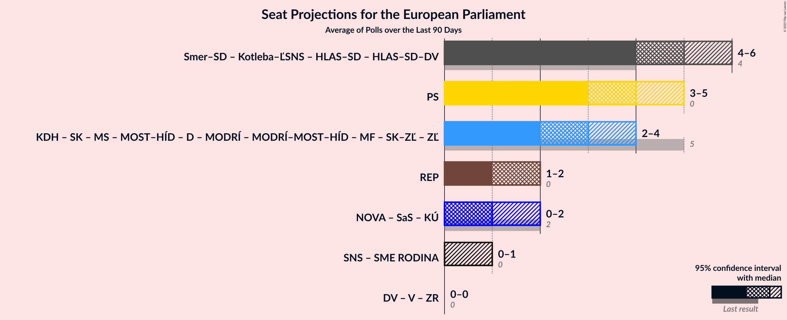

# Overview

The table below lists the most recent polls (less than 90 days old) registered and analyzed so far.

| Period     | Polling firm/Commissioner(s) | PS | KDH | SK | MS | MOST–HÍD | D | ZĽ | MODRÍ | MODRÍ–MOST–HÍD | MF | SK–ZĽ | NOVA | SaS | KÚ | SNS | SME RODINA | REP | Smer–SD | Kotleba–ĽSNS | HLAS–SD | HLAS–SD–DV | DV | V | ZR |
|:----------:|:----------------------------:|:--:|:--:|:--:|:--:|:--:|:--:|:--:|:--:|:--:|:--:|:--:|:--:|:--:|:--:|:--:|:--:|:--:|:--:|:--:|:--:|:--:|:--:|:--:|:--:|
| 8 June 2024 | General Election | 0.0%   0 | 13.2%   2 | 7.5%   1 | 6.5%   1 | 5.8%   1 | 0.0%   0 | 0.0%   0 | 0.0%   0 | 0.0%   0 | 0.0%   0 | 0.0%   0 | 6.8%   1 | 6.7%   1 | 0.0%   0 | 3.6%   0 | 0.0%   0 | 0.0%   0 | 24.1%   4 | 1.7%   0 | 0.0%   0 | 0.0%   0 | 0.0%   0 | 0.0%   0 | 0.0%   0 |
| N/A | [Poll Average](average.html) | 20–25%   4–5 | 5–8%   0–2 | 6–10%   1–2 | 2–5%   0–1 | N/A   N/A | 4–7%   0–1 | 0–2%   0 | N/A   N/A | N/A   N/A | N/A   N/A | N/A   N/A | N/A   N/A | 5–9%   0–2 | 0–2%   0 | 2–6%   0–1 | 2–5%   0 | 7–12%   1–2 | 16–22%   3–4 | 0–2%   0 | 7–12%   1–2 | N/A   N/A | N/A   N/A | N/A   N/A | N/A   N/A |
| [8–22 September 2025](2025-09-22-AKO.html) | AKO   TV JOJ | 21–26%   4–5 | 6–9%   1–2 | 7–11%   1–2 | 2–4%   0 | N/A   N/A | 4–6%   0–1 | N/A   N/A | N/A   N/A | N/A   N/A | N/A   N/A | N/A   N/A | N/A   N/A | 6–9%   1–2 | N/A   N/A | 3–6%   0–1 | 3–5%   0 | 7–10%   1–2 | 15–20%   3–4 | N/A   N/A | 9–13%   2 | N/A   N/A | N/A   N/A | N/A   N/A | N/A   N/A |
| [17–21 September 2025](2025-09-21-Ipsos.html) | Ipsos   Denník N | 20–25%   4–5 | 5–9%   1–2 | 6–9%   1–2 | 3–5%   0 | N/A   N/A | 3–6%   0–1 | N/A   N/A | N/A   N/A | N/A   N/A | N/A   N/A | N/A   N/A | N/A   N/A | 6–9%   1–2 | N/A   N/A | 3–5%   0 | 3–5%   0 | 9–13%   2 | 16–21%   3–4 | N/A   N/A | 7–10%   1–2 | N/A   N/A | N/A   N/A | N/A   N/A | N/A   N/A |
| [10–17 September 2025](2025-09-17-Focus.html) | Focus   360tka.sk | 20–25%   4–5 | 5–8%   0–1 | 7–10%   1–2 | 3–6%   0–1 | N/A   N/A | 4–7%   0–1 | 0–1%   0 | N/A   N/A | N/A   N/A | N/A   N/A | N/A   N/A | N/A   N/A | 5–8%   0–1 | 1–2%   0 | 3–6%   0–1 | 2–4%   0 | 8–12%   1–2 | 16–21%   3–4 | N/A   N/A | 8–12%   1–2 | N/A   N/A | N/A   N/A | N/A   N/A | N/A   N/A |
| [3–7 September 2025](2025-09-07-NMS.html) | NMS | 20–25%   4–5 | 4–7%   0–1 | 6–9%   1–2 | 3–6%   0–1 | N/A   N/A | 4–7%   0–1 | 1–3%   0 | N/A   N/A | N/A   N/A | N/A   N/A | N/A   N/A | N/A   N/A | 5–8%   0–1 | 0–1%   0 | 1–3%   0 | 2–4%   0 | 8–12%   1–2 | 18–23%   3–4 | 0–2%   0 | 8–11%   1–2 | N/A   N/A | N/A   N/A | N/A   N/A | N/A   N/A |
| 8 June 2024 | General Election | 0.0%   0 | 13.2%   2 | 7.5%   1 | 6.5%   1 | 5.8%   1 | 0.0%   0 | 0.0%   0 | 0.0%   0 | 0.0%   0 | 0.0%   0 | 0.0%   0 | 6.8%   1 | 6.7%   1 | 0.0%   0 | 3.6%   0 | 0.0%   0 | 0.0%   0 | 24.1%   4 | 1.7%   0 | 0.0%   0 | 0.0%   0 | 0.0%   0 | 0.0%   0 | 0.0%   0 |

Only polls for which at least the sample size has been published are included in the table above.

**Legend:**
+ **Top half of each row:** Voting intentions (95% confidence interval)
+ **Bottom half of each row:** Seat projections for the European Parliament (95% confidence interval)
+ **PS:** Progresívne Slovensko (RE)
+ **KDH:** Kresťanskodemokratické hnutie (EPP)
+ **SK:** Slovensko (EPP)
+ **MS:** Magyar Szövetség (EPP)
+ **MOST–HÍD:** MOST–HÍD (EPP)
+ **D:** Demokrati (EPP)
+ **ZĽ:** Za ľudí (EPP)
+ **MODRÍ:** MODRÍ–Európske Slovensko (EPP)
+ **MODRÍ–MOST–HÍD:** MODRÍ–Európske Slovensko–MOST–HÍD (EPP)
+ **MF:** Magyar Fórum (EPP)
+ **SK–ZĽ:** Slovensko–Za ľudí (EPP)
+ **NOVA:** NOVA (ECR)
+ **SaS:** Sloboda a Solidarita (ECR)
+ **KÚ:** Kresťanská únia (ECR)
+ **SNS:** Slovenská národná strana (PfE)
+ **SME RODINA:** SME RODINA (PfE)
+ **REP:** REPUBLIKA (ESN)
+ **Smer–SD:** SMER–sociálna demokracia (NI)
+ **Kotleba–ĽSNS:** Kotleba–Ľudová strana Naše Slovensko (NI)
+ **HLAS–SD:** HLAS–sociálna demokracia (NI)
+ **HLAS–SD–DV:** HLAS–sociálna demokracia–Dobrá voľba (NI)
+ **DV:** Dobrá voľba (*)
+ **V:** VLASŤ (*)
+ **ZR:** ZDRAVÝ ROZUM (*)
+ **N/A (single party):** Party not included the published results
+ **N/A (entire row):** Calculation for this opinion poll not started yet

