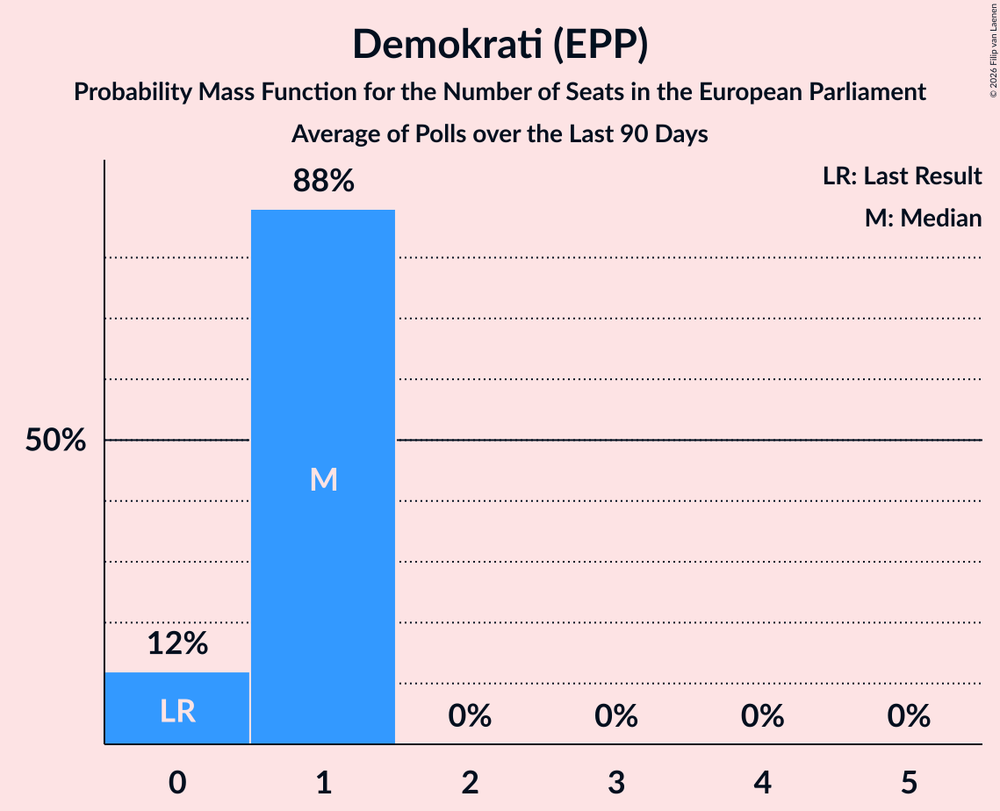

# Demokrati (EPP)

<a href="#voting-intentions">Voting Intentions</a> | <a href="#seats">Seats</a>

## Voting Intentions

Last result: **0.0%** (General Election of 8 June 2024)

### Confidence Intervals

| Period     | Polling firm/Commissioner(s) | Median | 80% Confidence Interval | 90% Confidence Interval | 95% Confidence Interval | 99% Confidence Interval |
|:----------:|:----------------:|:-----------:|:-----------------------:|:-----------------------:|:-----------------------:|:-----------------------:|
| N/A | [Poll Average](average.html) | 4.6% | 3.7–5.7% | 3.5–6.0% | 3.3–6.3% | 2.9–6.8% |
| [8–15 July 2025](2025-07-15-AKO.html) | AKO   TV JOJ | 4.1% | 3.4–5.0% | 3.2–5.3% | 3.0–5.5% | 2.7–6.0% |
| [7–13 July 2025](2025-07-13-Focus.html) | Focus   360tka.sk | 4.6% | 3.8–5.5% | 3.6–5.8% | 3.4–6.0% | 3.1–6.5% |
| [2–7 July 2025](2025-07-07-NMS.html) | NMS | 5.2% | 4.4–6.2% | 4.1–6.4% | 3.9–6.7% | 3.6–7.2% |
| [16–19 June 2025](2025-06-19-Ipsos.html) | Ipsos   Denník N | 4.5% | 3.7–5.4% | 3.5–5.7% | 3.4–6.0% | 3.0–6.4% |
| [11–19 June 2025](2025-06-19-AKO.html) | AKO   TV JOJ | 4.8% | 4.0–5.8% | 3.8–6.1% | 3.6–6.3% | 3.3–6.8% |
| [2–9 June 2025](2025-06-09-Focus.html) | Focus   360tka.sk | 4.8% | N/A | N/A | N/A | N/A |
| [4–8 June 2025](2025-06-08-NMS.html) | NMS | 4.9% | 4.1–5.9% | 3.9–6.2% | 3.7–6.4% | 3.4–6.9% |
| [19–26 May 2025](2025-05-26-AKO.html) | AKO   TV JOJ | 4.5% | 3.8–5.5% | 3.6–5.7% | 3.4–6.0% | 3.0–6.5% |
| [12–18 May 2025](2025-05-18-Focus.html) | Focus   360tka.sk | 4.6% | N/A | N/A | N/A | N/A |
| [12–16 May 2025](2025-05-16-Ipsos.html) | Ipsos   Denník N | 4.7% | 4.0–5.7% | 3.8–6.0% | 3.6–6.2% | 3.3–6.7% |
| [30 April–4 May 2025](2025-05-04-NMS.html) | NMS | 4.8% | 4.0–5.7% | 3.8–6.0% | 3.6–6.3% | 3.3–6.8% |
| [10–17 April 2025](2025-04-17-AKO.html) | AKO   TV JOJ | 4.2% | 3.5–5.1% | 3.3–5.4% | 3.1–5.6% | 2.8–6.1% |
| [1–8 April 2025](2025-04-08-Focus.html) | Focus   360tka.sk | 4.3% | N/A | N/A | N/A | N/A |
| [2–6 April 2025](2025-04-06-NMS.html) | NMS | 4.8% | 4.0–5.8% | 3.8–6.0% | 3.6–6.3% | 3.3–6.8% |
| [11–19 March 2025](2025-03-19-AKO.html) | AKO   TV JOJ | 4.0% | 3.3–4.9% | 3.1–5.2% | 2.9–5.4% | 2.7–5.9% |
| [10–14 March 2025](2025-03-14-Ipsos.html) | Ipsos   Denník N | 5.0% | 4.3–6.0% | 4.0–6.3% | 3.9–6.6% | 3.5–7.1% |
| [5–9 March 2025](2025-03-09-NMS.html) | NMS   TV Markíza | 4.1% | 3.4–5.0% | 3.2–5.3% | 3.0–5.5% | 2.7–6.0% |
| [7–12 February 2025](2025-02-12-Focus.html) | Focus   360tka.sk | 4.6% | 3.8–5.5% | 3.6–5.8% | 3.4–6.0% | 3.1–6.5% |
| [5–12 February 2025](2025-02-12-AKO.html) | AKO   TV JOJ | 4.6% | 3.9–5.6% | 3.6–5.8% | 3.5–6.1% | 3.1–6.6% |
| [5–9 February 2025](2025-02-09-NMS.html) | NMS | 3.0% | 2.4–3.8% | 2.2–4.0% | 2.1–4.3% | 1.9–4.7% |
| [27–31 January 2025](2025-01-31-CSV.html) | CSV | 3.8% | 3.2–4.7% | 3.0–4.9% | 2.8–5.1% | 2.6–5.6% |
| [14–24 January 2025](2025-01-24-AKO.html) | AKO   TV JOJ | 4.6% | 3.9–5.6% | 3.6–5.8% | 3.5–6.1% | 3.1–6.6% |
| [11–17 January 2025](2025-01-17-Ipsos.html) | Ipsos   Denník N | 4.0% | 3.3–4.9% | 3.1–5.1% | 2.9–5.4% | 2.7–5.8% |
| [9–13 January 2025](2025-01-13-NMS.html) | NMS | 4.0% | 3.3–4.9% | 3.1–5.2% | 2.9–5.4% | 2.6–5.9% |
| [16–19 December 2024](2024-12-19-AKO.html) | AKO   TV JOJ | 4.3% | 3.6–5.2% | 3.4–5.5% | 3.2–5.7% | 2.9–6.2% |
| [4–9 December 2024](2024-12-09-NMS.html) | NMS | 3.9% | 3.2–4.8% | 3.0–5.1% | 2.9–5.3% | 2.6–5.8% |
| [2–8 December 2024](2024-12-08-Focus.html) | Focus   360tka | 4.0% | 3.3–4.9% | 3.1–5.2% | 3.0–5.4% | 2.7–5.9% |
| [12–20 November 2024](2024-11-20-AKO.html) | AKO   TV JOJ | 4.1% | 3.4–5.0% | 3.2–5.3% | 3.0–5.5% | 2.7–6.0% |
| [6–13 November 2024](2024-11-13-Focus.html) | Focus   360tka | 4.6% | 3.9–5.6% | 3.7–5.9% | 3.5–6.1% | 3.2–6.6% |
| [7–11 November 2024](2024-11-11-NMS.html) | NMS | 4.4% | 3.7–5.3% | 3.5–5.6% | 3.3–5.9% | 3.0–6.4% |
| [27 October–1 November 2024](2024-11-01-Ipsos.html) | Ipsos   Denník N | 4.4% | 3.7–5.3% | 3.4–5.6% | 3.3–5.9% | 3.0–6.3% |
| [8–17 October 2024](2024-10-17-AKO.html) | AKO   TV JOJ | 4.7% | 3.9–5.7% | 3.7–6.0% | 3.6–6.2% | 3.2–6.7% |
| [2–7 October 2024](2024-10-07-NMS.html) | NMS | 5.1% | 4.3–6.1% | 4.1–6.4% | 3.9–6.6% | 3.6–7.2% |
| [17–26 September 2024](2024-09-26-Focus.html) | Focus | 5.0% | 4.2–6.0% | 4.0–6.3% | 3.8–6.5% | 3.5–7.0% |
| [10–16 September 2024](2024-09-16-AKO.html) | AKO   TV JOJ | 4.9% | 4.1–5.9% | 3.9–6.2% | 3.7–6.4% | 3.4–6.9% |
| [6–10 September 2024](2024-09-10-Ipsos.html) | Ipsos   Denník N | 5.1% | 4.3–6.1% | 4.1–6.4% | 3.9–6.6% | 3.5–7.1% |
| [5–9 September 2024](2024-09-09-NMS.html) | NMS | 3.3% | 2.7–4.1% | 2.5–4.4% | 2.3–4.6% | 2.1–5.0% |
| [8–12 August 2024](2024-08-12-NMS.html) | NMS | 4.5% | 3.8–5.5% | 3.6–5.8% | 3.4–6.0% | 3.1–6.5% |
| [6–12 August 2024](2024-08-12-AKO.html) | AKO   TV JOJ | 4.5% | 3.8–5.5% | 3.6–5.7% | 3.4–6.0% | 3.0–6.5% |
| [9–15 July 2024](2024-07-15-AKO.html) | AKO   TV JOJ | 4.4% | 3.7–5.3% | 3.5–5.6% | 3.3–5.9% | 3.0–6.4% |
| [9–14 July 2024](2024-07-14-Focus.html) | Focus | 4.7% | 4.0–5.7% | 3.8–6.0% | 3.6–6.2% | 3.3–6.7% |
| [4–8 July 2024](2024-07-08-NMS.html) | NMS | 4.6% | 3.9–5.6% | 3.7–5.8% | 3.5–6.1% | 3.2–6.6% |
| [26 June–1 July 2024](2024-07-01-Ipsos.html) | Ipsos   Denník N | 4.7% | 4.0–5.7% | 3.7–6.0% | 3.6–6.2% | 3.2–6.7% |
| [11–18 June 2024](2024-06-18-AKO.html) | AKO   TV JOJ | 4.1% | N/A | N/A | N/A | N/A |
| [5–12 June 2024](2024-06-12-Focus.html) | Focus   TV Markíza | 3.6% | 3.0–4.5% | 2.8–4.7% | 2.6–4.9% | 2.3–5.4% |

### Probability Mass Function

The following table shows the probability mass function per percentage block of voting intentions for the [poll average](average.html) for Demokrati (EPP).

| Voting Intentions | Probability | Accumulated | Special Marks |
|:-----------------:|:-----------:|:-----------:|:-------------:|
| 0.0–0.5% | 0% | 100% | Last Result |
| 0.5–1.5% | 0% | 100% |  |
| 1.5–2.5% | 0% | 100% |  |
| 2.5–3.5% | 6% | 100% |  |
| 3.5–4.5% | 40% | 94% |  |
| 4.5–5.5% | 41% | 53% | Median |
| 5.5–6.5% | 12% | 13% |  |
| 6.5–7.5% | 1.1% | 1.1% |  |
| 7.5–8.5% | 0% | 0% |  |

## Seats

Last result: **0** seats (General Election of 8 June 2024)

### Confidence Intervals

| Period     | Polling firm/Commissioner(s) | Median | 80% Confidence Interval | 90% Confidence Interval | 95% Confidence Interval | 99% Confidence Interval |
|:----------:|:----------------:|:------:|:-----------------------:|:-----------------------:|:-----------------------:|:-----------------------:|
| N/A | [Poll Average](average.html) | 0 | 0–1 | 0–1 | 0–1 | 0–1 |
| [8–15 July 2025](2025-07-15-AKO.html) | AKO   TV JOJ | 0 | 0–1 | 0–1 | 0–1 | 0–1 |
| [7–13 July 2025](2025-07-13-Focus.html) | Focus   360tka.sk | 0 | 0–1 | 0–1 | 0–1 | 0–1 |
| [2–7 July 2025](2025-07-07-NMS.html) | NMS | 1 | 0–1 | 0–1 | 0–1 | 0–1 |
| [16–19 June 2025](2025-06-19-Ipsos.html) | Ipsos   Denník N | 0 | 0–1 | 0–1 | 0–1 | 0–1 |
| [11–19 June 2025](2025-06-19-AKO.html) | AKO   TV JOJ | 0 | 0–1 | 0–1 | 0–1 | 0–1 |
| [2–9 June 2025](2025-06-09-Focus.html) | Focus   360tka.sk |  |  |  |  |  |
| [4–8 June 2025](2025-06-08-NMS.html) | NMS | 0 | 0–1 | 0–1 | 0–1 | 0–1 |
| [19–26 May 2025](2025-05-26-AKO.html) | AKO   TV JOJ | 0 | 0–1 | 0–1 | 0–1 | 0–1 |
| [12–18 May 2025](2025-05-18-Focus.html) | Focus   360tka.sk |  |  |  |  |  |
| [12–16 May 2025](2025-05-16-Ipsos.html) | Ipsos   Denník N | 1 | 0–1 | 0–1 | 0–1 | 0–1 |
| [30 April–4 May 2025](2025-05-04-NMS.html) | NMS | 0 | 0–1 | 0–1 | 0–1 | 0–1 |
| [10–17 April 2025](2025-04-17-AKO.html) | AKO   TV JOJ | 0 | 0–1 | 0–1 | 0–1 | 0–1 |
| [1–8 April 2025](2025-04-08-Focus.html) | Focus   360tka.sk |  |  |  |  |  |
| [2–6 April 2025](2025-04-06-NMS.html) | NMS | 1 | 0–1 | 0–1 | 0–1 | 0–1 |
| [11–19 March 2025](2025-03-19-AKO.html) | AKO   TV JOJ | 0 | 0 | 0 | 0 | 0–1 |
| [10–14 March 2025](2025-03-14-Ipsos.html) | Ipsos   Denník N | 0 | 0–1 | 0–1 | 0–1 | 0–1 |
| [5–9 March 2025](2025-03-09-NMS.html) | NMS   TV Markíza | 0 | 0 | 0–1 | 0–1 | 0–1 |
| [7–12 February 2025](2025-02-12-Focus.html) | Focus   360tka.sk | 0 | 0–1 | 0–1 | 0–1 | 0–1 |
| [5–12 February 2025](2025-02-12-AKO.html) | AKO   TV JOJ | 0 | 0–1 | 0–1 | 0–1 | 0–1 |
| [5–9 February 2025](2025-02-09-NMS.html) | NMS | 0 | 0 | 0 | 0 | 0 |
| [27–31 January 2025](2025-01-31-CSV.html) | CSV | 0 | 0 | 0 | 0 | 0–1 |
| [14–24 January 2025](2025-01-24-AKO.html) | AKO   TV JOJ | 0 | 0–1 | 0–1 | 0–1 | 0–1 |
| [11–17 January 2025](2025-01-17-Ipsos.html) | Ipsos   Denník N | 0 | 0 | 0–1 | 0–1 | 0–1 |
| [9–13 January 2025](2025-01-13-NMS.html) | NMS | 0 | 0 | 0 | 0–1 | 0–1 |
| [16–19 December 2024](2024-12-19-AKO.html) | AKO   TV JOJ | 0 | 0–1 | 0–1 | 0–1 | 0–1 |
| [4–9 December 2024](2024-12-09-NMS.html) | NMS | 0 | 0 | 0 | 0 | 0 |
| [2–8 December 2024](2024-12-08-Focus.html) | Focus   360tka | 0 | 0 | 0–1 | 0–1 | 0–1 |
| [12–20 November 2024](2024-11-20-AKO.html) | AKO   TV JOJ | 0 | 0 | 0–1 | 0–1 | 0–1 |
| [6–13 November 2024](2024-11-13-Focus.html) | Focus   360tka | 0 | 0–1 | 0–1 | 0–1 | 0–1 |
| [7–11 November 2024](2024-11-11-NMS.html) | NMS | 0 | 0–1 | 0–1 | 0–1 | 0–1 |
| [27 October–1 November 2024](2024-11-01-Ipsos.html) | Ipsos   Denník N | 0 | 0 | 0 | 0–1 | 0–1 |
| [8–17 October 2024](2024-10-17-AKO.html) | AKO   TV JOJ | 0 | 0–1 | 0–1 | 0–1 | 0–1 |
| [2–7 October 2024](2024-10-07-NMS.html) | NMS | 1 | 0–1 | 0–1 | 0–1 | 0–1 |
| [17–26 September 2024](2024-09-26-Focus.html) | Focus | 0 | 0–1 | 0–1 | 0–1 | 0–1 |
| [10–16 September 2024](2024-09-16-AKO.html) | AKO   TV JOJ | 0 | 0–1 | 0–1 | 0–1 | 0–1 |
| [6–10 September 2024](2024-09-10-Ipsos.html) | Ipsos   Denník N | 1 | 0–1 | 0–1 | 0–1 | 0–1 |
| [5–9 September 2024](2024-09-09-NMS.html) | NMS | 0 | 0 | 0 | 0 | 0–1 |
| [8–12 August 2024](2024-08-12-NMS.html) | NMS | 0 | 0 | 0–1 | 0–1 | 0–1 |
| [6–12 August 2024](2024-08-12-AKO.html) | AKO   TV JOJ | 0 | 0–1 | 0–1 | 0–1 | 0–1 |
| [9–15 July 2024](2024-07-15-AKO.html) | AKO   TV JOJ | 0 | 0–1 | 0–1 | 0–1 | 0–1 |
| [9–14 July 2024](2024-07-14-Focus.html) | Focus | 0 | 0–1 | 0–1 | 0–1 | 0–1 |
| [4–8 July 2024](2024-07-08-NMS.html) | NMS | 0 | 0–1 | 0–1 | 0–1 | 0–1 |
| [26 June–1 July 2024](2024-07-01-Ipsos.html) | Ipsos   Denník N | 0 | 0–1 | 0–1 | 0–1 | 0–1 |
| [11–18 June 2024](2024-06-18-AKO.html) | AKO   TV JOJ |  |  |  |  |  |
| [5–12 June 2024](2024-06-12-Focus.html) | Focus   TV Markíza | 0 | 0 | 0 | 0 | 0 |

### Probability Mass Function

The following table shows the probability mass function per seat for the [poll average](average.html) for Demokrati (EPP).

| Number of Seats | Probability | Accumulated | Special Marks |
|:---------------:|:-----------:|:-----------:|:-------------:|
| 0 | 54% | 100% | Last Result, Median |
| 1 | 46% | 46% |  |
| 2 | 0% | 0% |  |

