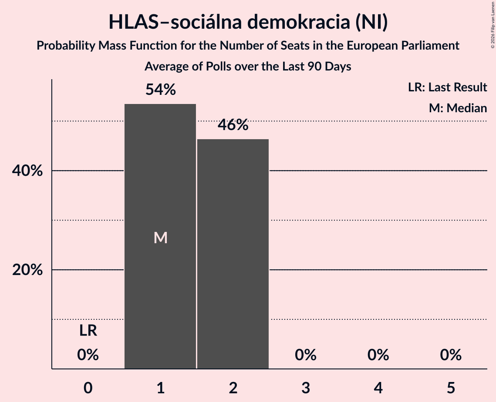

# HLAS–sociálna demokracia (NI)

<a href="#voting-intentions">Voting Intentions</a> | <a href="#seats">Seats</a>

## Voting Intentions

Last result: **0.0%** (General Election of 8 June 2024)

### Confidence Intervals

| Period     | Polling firm/Commissioner(s) | Median | 80% Confidence Interval | 90% Confidence Interval | 95% Confidence Interval | 99% Confidence Interval |
|:----------:|:----------------:|:-----------:|:-----------------------:|:-----------------------:|:-----------------------:|:-----------------------:|
| N/A | [Poll Average](average.html) | 11.5% | 9.0–13.2% | 8.4–13.7% | 8.0–14.1% | 7.3–14.8% |
| [30 April–4 May 2025](2025-05-04-NMS.html) | NMS | 8.9% | 7.9–10.2% | 7.6–10.5% | 7.3–10.9% | 6.8–11.5% |
| [10–17 April 2025](2025-04-17-AKO.html) | AKO   TV JOJ | 12.0% | 10.8–13.4% | 10.4–13.8% | 10.1–14.2% | 9.6–14.9% |
| [1–8 April 2025](2025-04-08-FOCUS.html) | FOCUS   360tka.sk | 10.9% | 9.7–12.2% | 9.4–12.6% | 9.1–13.0% | 8.6–13.6% |
| [2–6 April 2025](2025-04-06-NMS.html) | NMS | 8.5% | 7.4–9.7% | 7.1–10.0% | 6.9–10.3% | 6.4–11.0% |
| [11–19 March 2025](2025-03-19-AKO.html) | AKO   TV JOJ | 12.3% | 11.1–13.7% | 10.7–14.1% | 10.4–14.5% | 9.8–15.2% |
| [10–14 March 2025](2025-03-14-Ipsos.html) | Ipsos   Denník N | 12.5% | 11.3–13.9% | 10.9–14.3% | 10.6–14.7% | 10.0–15.4% |
| [5–9 March 2025](2025-03-09-NMS.html) | NMS   TV Markíza | 8.8% | 7.7–10.0% | 7.4–10.4% | 7.2–10.7% | 6.7–11.3% |
| [7–12 February 2025](2025-02-12-Focus.html) | Focus   360tka.sk | 11.8% | 10.6–13.2% | 10.2–13.6% | 9.9–13.9% | 9.4–14.6% |
| [5–12 February 2025](2025-02-12-AKO.html) | AKO   TV JOJ | 12.5% | 11.2–13.9% | 10.9–14.3% | 10.6–14.7% | 10.0–15.4% |
| [5–9 February 2025](2025-02-09-NMS.html) | NMS | 10.5% | 9.3–11.8% | 9.0–12.2% | 8.7–12.5% | 8.2–13.2% |
| [27–31 January 2025](2025-01-31-CSV.html) | CSV | 13.7% | 12.4–15.1% | 12.1–15.5% | 11.8–15.8% | 11.2–16.5% |
| [14–24 January 2025](2025-01-24-AKO.html) | AKO   TV JOJ | 13.0% | 11.7–14.5% | 11.4–14.9% | 11.1–15.2% | 10.5–16.0% |
| [11–17 January 2025](2025-01-17-Ipsos.html) | Ipsos   Denník N | 11.1% | 9.9–12.4% | 9.6–12.8% | 9.3–13.1% | 8.7–13.8% |
| [9–13 January 2025](2025-01-13-NMS.html) | NMS | 11.5% | 10.3–12.9% | 9.9–13.3% | 9.6–13.6% | 9.1–14.3% |
| [16–19 December 2024](2024-12-19-AKO.html) | AKO   TV JOJ | 13.9% | 12.6–15.4% | 12.2–15.8% | 11.9–16.2% | 11.3–16.9% |
| [4–9 December 2024](2024-12-09-NMS.html) | NMS | 10.7% | 9.5–12.1% | 9.2–12.4% | 8.9–12.8% | 8.4–13.5% |
| [2–8 December 2024](2024-12-08-Focus.html) | Focus   360tka | 13.8% | 12.5–15.3% | 12.1–15.7% | 11.8–16.0% | 11.2–16.8% |
| [12–20 November 2024](2024-11-20-AKO.html) | AKO   TV JOJ | 14.7% | 13.3–16.2% | 13.0–16.7% | 12.6–17.0% | 12.0–17.8% |
| [6–13 November 2024](2024-11-13-Focus.html) | Focus   360tka | 13.3% | 12.0–14.7% | 11.6–15.1% | 11.3–15.5% | 10.7–16.2% |
| [7–11 November 2024](2024-11-11-NMS.html) | NMS | 10.8% | 9.6–12.2% | 9.3–12.5% | 9.0–12.9% | 8.5–13.6% |
| [27 October–1 November 2024](2024-11-01-Ipsos.html) | Ipsos   Denník N | 12.8% | 11.5–14.2% | 11.1–14.6% | 10.8–15.0% | 10.3–15.7% |
| [8–17 October 2024](2024-10-17-AKO.html) | AKO   TV JOJ | 15.0% | 13.6–16.5% | 13.2–17.0% | 12.9–17.4% | 12.3–18.1% |
| [2–7 October 2024](2024-10-07-NMS.html) | NMS | 12.0% | 10.8–13.4% | 10.4–13.8% | 10.1–14.2% | 9.6–14.9% |
| [17–26 September 2024](2024-09-26-Focus.html) | Focus | 12.8% | 11.5–14.2% | 11.2–14.6% | 10.9–15.0% | 10.3–15.7% |
| [10–16 September 2024](2024-09-16-AKO.html) | AKO   TV JOJ | 15.1% | 13.7–16.6% | 13.3–17.1% | 13.0–17.5% | 12.4–18.2% |
| [6–10 September 2024](2024-09-10-Ipsos.html) | Ipsos   Denník N | 11.9% | 10.7–13.3% | 10.3–13.7% | 10.1–14.0% | 9.5–14.7% |
| [5–9 September 2024](2024-09-09-NMS.html) | NMS | 12.6% | 11.3–14.0% | 11.0–14.4% | 10.7–14.8% | 10.1–15.5% |
| [8–12 August 2024](2024-08-12-NMS.html) | NMS | 14.3% | 13.0–15.8% | 12.6–16.2% | 12.3–16.6% | 11.7–17.3% |
| [6–12 August 2024](2024-08-12-AKO.html) | AKO   TV JOJ | 15.9% | 14.5–17.5% | 14.1–17.9% | 13.8–18.3% | 13.1–19.1% |
| [9–15 July 2024](2024-07-15-AKO.html) | AKO   TV JOJ | 15.5% | 14.1–17.1% | 13.7–17.5% | 13.4–17.9% | 12.7–18.7% |
| [9–14 July 2024](2024-07-14-Focus.html) | Focus | 11.3% | 10.1–12.6% | 9.7–13.0% | 9.4–13.4% | 8.9–14.0% |
| [4–8 July 2024](2024-07-08-NMS.html) | NMS | 13.0% | 11.8–14.5% | 11.4–14.9% | 11.1–15.3% | 10.5–16.0% |
| [26 June–1 July 2024](2024-07-01-Ipsos.html) | Ipsos   Denník N | 13.5% | 12.2–14.9% | 11.8–15.3% | 11.5–15.7% | 10.9–16.4% |
| [11–18 June 2024](2024-06-18-AKO.html) | AKO   TV JOJ | 15.2% | N/A | N/A | N/A | N/A |
| [5–12 June 2024](2024-06-12-Focus.html) | Focus   TV Markíza | 14.5% | 13.2–16.0% | 12.8–16.5% | 12.5–16.8% | 11.9–17.6% |

### Probability Mass Function

The following table shows the probability mass function per percentage block of voting intentions for the [poll average](average.html) for HLAS–sociálna demokracia (NI).

| Voting Intentions | Probability | Accumulated | Special Marks |
|:-----------------:|:-----------:|:-----------:|:-------------:|
| 0.0–0.5% | 0% | 100% | Last Result |
| 0.5–1.5% | 0% | 100% |  |
| 1.5–2.5% | 0% | 100% |  |
| 2.5–3.5% | 0% | 100% |  |
| 3.5–4.5% | 0% | 100% |  |
| 4.5–5.5% | 0% | 100% |  |
| 5.5–6.5% | 0% | 100% |  |
| 6.5–7.5% | 0.9% | 100% |  |
| 7.5–8.5% | 5% | 99.1% |  |
| 8.5–9.5% | 10% | 94% |  |
| 9.5–10.5% | 13% | 84% |  |
| 10.5–11.5% | 22% | 71% | Median |
| 11.5–12.5% | 26% | 48% |  |
| 12.5–13.5% | 16% | 22% |  |
| 13.5–14.5% | 5% | 6% |  |
| 14.5–15.5% | 0.9% | 0.9% |  |
| 15.5–16.5% | 0.1% | 0.1% |  |
| 16.5–17.5% | 0% | 0% |  |

## Seats

Last result: **0** seats (General Election of 8 June 2024)

### Confidence Intervals

| Period     | Polling firm/Commissioner(s) | Median | 80% Confidence Interval | 90% Confidence Interval | 95% Confidence Interval | 99% Confidence Interval |
|:----------:|:----------------:|:------:|:-----------------------:|:-----------------------:|:-----------------------:|:-----------------------:|
| N/A | [Poll Average](average.html) | 2 | 2 | 2 | 1–3 | 1–3 |
| [30 April–4 May 2025](2025-05-04-NMS.html) | NMS | 2 | 1–2 | 1–2 | 1–2 | 1–2 |
| [10–17 April 2025](2025-04-17-AKO.html) | AKO   TV JOJ | 2 | 2 | 2 | 2–3 | 2–3 |
| [1–8 April 2025](2025-04-08-FOCUS.html) | FOCUS   360tka.sk | 2 | 2 | 2 | 2 | 1–2 |
| [2–6 April 2025](2025-04-06-NMS.html) | NMS | 1 | 1–2 | 1–2 | 1–2 | 1–2 |
| [11–19 March 2025](2025-03-19-AKO.html) | AKO   TV JOJ | 2 | 2 | 2–3 | 2–3 | 2–3 |
| [10–14 March 2025](2025-03-14-Ipsos.html) | Ipsos   Denník N | 2 | 2–3 | 2–3 | 2–3 | 2–3 |
| [5–9 March 2025](2025-03-09-NMS.html) | NMS   TV Markíza | 2 | 1–2 | 1–2 | 1–2 | 1–2 |
| [7–12 February 2025](2025-02-12-Focus.html) | Focus   360tka.sk | 2 | 2 | 2 | 2–3 | 1–3 |
| [5–12 February 2025](2025-02-12-AKO.html) | AKO   TV JOJ | 2 | 2–3 | 2–3 | 2–3 | 2–3 |
| [5–9 February 2025](2025-02-09-NMS.html) | NMS | 2 | 2 | 2 | 2 | 1–2 |
| [27–31 January 2025](2025-01-31-CSV.html) | CSV | 3 | 2–3 | 2–3 | 2–3 | 2–3 |
| [14–24 January 2025](2025-01-24-AKO.html) | AKO   TV JOJ | 2 | 2–3 | 2–3 | 2–3 | 2–3 |
| [11–17 January 2025](2025-01-17-Ipsos.html) | Ipsos   Denník N | 2 | 2–3 | 2–3 | 2–3 | 2–3 |
| [9–13 January 2025](2025-01-13-NMS.html) | NMS | 2 | 2 | 2 | 2–3 | 2–3 |
| [16–19 December 2024](2024-12-19-AKO.html) | AKO   TV JOJ | 3 | 2–3 | 2–3 | 2–3 | 2–3 |
| [4–9 December 2024](2024-12-09-NMS.html) | NMS | 2 | 2 | 2 | 2–3 | 2–3 |
| [2–8 December 2024](2024-12-08-Focus.html) | Focus   360tka | 3 | 2–3 | 2–3 | 2–3 | 2–3 |
| [12–20 November 2024](2024-11-20-AKO.html) | AKO   TV JOJ | 3 | 2–3 | 2–3 | 2–3 | 2–3 |
| [6–13 November 2024](2024-11-13-Focus.html) | Focus   360tka | 2 | 2–3 | 2–3 | 2–3 | 2–3 |
| [7–11 November 2024](2024-11-11-NMS.html) | NMS | 2 | 2 | 2 | 2 | 1–3 |
| [27 October–1 November 2024](2024-11-01-Ipsos.html) | Ipsos   Denník N | 3 | 2–3 | 2–3 | 2–3 | 2–3 |
| [8–17 October 2024](2024-10-17-AKO.html) | AKO   TV JOJ | 3 | 2–3 | 2–4 | 2–4 | 2–4 |
| [2–7 October 2024](2024-10-07-NMS.html) | NMS | 2 | 2 | 2 | 2 | 2–3 |
| [17–26 September 2024](2024-09-26-Focus.html) | Focus | 2 | 2 | 2 | 2–3 | 2–3 |
| [10–16 September 2024](2024-09-16-AKO.html) | AKO   TV JOJ | 3 | 2–3 | 2–3 | 2–3 | 2–4 |
| [6–10 September 2024](2024-09-10-Ipsos.html) | Ipsos   Denník N | 2 | 2 | 2–3 | 2–3 | 2–3 |
| [5–9 September 2024](2024-09-09-NMS.html) | NMS | 2 | 2–3 | 2–3 | 2–3 | 2–3 |
| [8–12 August 2024](2024-08-12-NMS.html) | NMS | 3 | 2–3 | 2–3 | 2–3 | 2–3 |
| [6–12 August 2024](2024-08-12-AKO.html) | AKO   TV JOJ | 3 | 3 | 3 | 3 | 2–4 |
| [9–15 July 2024](2024-07-15-AKO.html) | AKO   TV JOJ | 3 | 3 | 2–3 | 2–3 | 2–4 |
| [9–14 July 2024](2024-07-14-Focus.html) | Focus | 2 | 2–3 | 2–3 | 2–3 | 2–3 |
| [4–8 July 2024](2024-07-08-NMS.html) | NMS | 3 | 2–3 | 2–3 | 2–3 | 2–3 |
| [26 June–1 July 2024](2024-07-01-Ipsos.html) | Ipsos   Denník N | 3 | 2–3 | 2–3 | 2–3 | 2–3 |
| [11–18 June 2024](2024-06-18-AKO.html) | AKO   TV JOJ |  |  |  |  |  |
| [5–12 June 2024](2024-06-12-Focus.html) | Focus   TV Markíza | 3 | 2–3 | 2–3 | 2–3 | 2–3 |

### Probability Mass Function

The following table shows the probability mass function per seat for the [poll average](average.html) for HLAS–sociálna demokracia (NI).

| Number of Seats | Probability | Accumulated | Special Marks |
|:---------------:|:-----------:|:-----------:|:-------------:|
| 0 | 0% | 100% | Last Result |
| 1 | 3% | 100% |  |
| 2 | 92% | 97% | Median |
| 3 | 5% | 5% |  |
| 4 | 0% | 0% |  |

