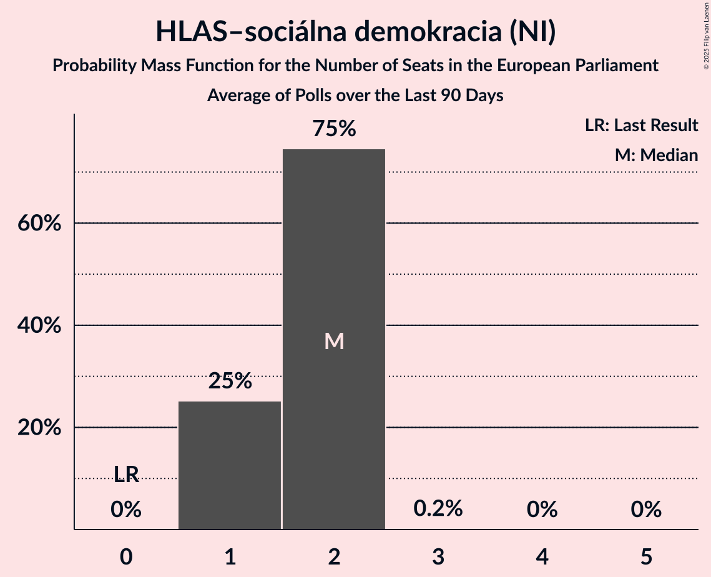

# HLAS–sociálna demokracia (NI)

<a href="#voting-intentions">Voting Intentions</a> | <a href="#seats">Seats</a>

## Voting Intentions

Last result: **0.0%** (General Election of 8 June 2024)

### Confidence Intervals

| Period     | Polling firm/Commissioner(s) | Median | 80% Confidence Interval | 90% Confidence Interval | 95% Confidence Interval | 99% Confidence Interval |
|:----------:|:----------------:|:-----------:|:-----------------------:|:-----------------------:|:-----------------------:|:-----------------------:|
| N/A | [Poll Average](average.html) | 12.5% | 10.7–16.2% | 10.3–16.9% | 9.9–17.5% | 9.3–18.4% |
| [6–10 September 2024](2024-09-10-Ipsos.html) | Ipsos   Denník N | 11.9% | 10.7–13.3% | 10.3–13.7% | 10.1–14.0% | 9.5–14.7% |
| [5–9 September 2024](2024-09-09-NMS.html) | NMS | 12.6% | 11.3–14.0% | 11.0–14.4% | 10.7–14.8% | 10.1–15.5% |
| [8–12 August 2024](2024-08-12-NMS.html) | NMS | 14.3% | 13.0–15.8% | 12.6–16.2% | 12.3–16.6% | 11.7–17.3% |
| [6–12 August 2024](2024-08-12-AKO.html) | AKO   TV JOJ | 15.9% | 14.5–17.5% | 14.1–17.9% | 13.8–18.3% | 13.1–19.1% |
| [9–15 July 2024](2024-07-15-AKO.html) | AKO   TV JOJ | 15.5% | 14.1–17.1% | 13.7–17.5% | 13.4–17.9% | 12.7–18.7% |
| [9–14 July 2024](2024-07-14-Focus.html) | Focus | 11.3% | 10.1–12.6% | 9.7–13.0% | 9.4–13.4% | 8.9–14.0% |
| [4–8 July 2024](2024-07-08-NMS.html) | NMS | 13.0% | 11.8–14.5% | 11.4–14.9% | 11.1–15.3% | 10.5–16.0% |
| [26 June–1 July 2024](2024-07-01-Ipsos.html) | Ipsos   Denník N | 13.5% | 12.2–14.9% | 11.8–15.3% | 11.5–15.7% | 10.9–16.4% |
| [11–18 June 2024](2024-06-18-AKO.html) | AKO   TV JOJ | 15.2% | N/A | N/A | N/A | N/A |
| [5–12 June 2024](2024-06-12-Focus.html) | Focus   TV Markíza | 14.5% | 13.2–16.0% | 12.8–16.5% | 12.5–16.8% | 11.9–17.6% |

### Probability Mass Function

The following table shows the probability mass function per percentage block of voting intentions for the [poll average](average.html) for HLAS–sociálna demokracia (NI).

| Voting Intentions | Probability | Accumulated | Special Marks |
|:-----------------:|:-----------:|:-----------:|:-------------:|
| 0.0–0.5% | 0% | 100% | Last Result |
| 0.5–1.5% | 0% | 100% |  |
| 1.5–2.5% | 0% | 100% |  |
| 2.5–3.5% | 0% | 100% |  |
| 3.5–4.5% | 0% | 100% |  |
| 4.5–5.5% | 0% | 100% |  |
| 5.5–6.5% | 0% | 100% |  |
| 6.5–7.5% | 0% | 100% |  |
| 7.5–8.5% | 0% | 100% |  |
| 8.5–9.5% | 0.9% | 100% |  |
| 9.5–10.5% | 7% | 99.0% |  |
| 10.5–11.5% | 19% | 92% |  |
| 11.5–12.5% | 25% | 73% | Median |
| 12.5–13.5% | 17% | 48% |  |
| 13.5–14.5% | 8% | 32% |  |
| 14.5–15.5% | 7% | 23% |  |
| 15.5–16.5% | 8% | 16% |  |
| 16.5–17.5% | 5% | 8% |  |
| 17.5–18.5% | 2% | 2% |  |
| 18.5–19.5% | 0.3% | 0.4% |  |
| 19.5–20.5% | 0% | 0% |  |

## Seats

Last result: **0** seats (General Election of 8 June 2024)

### Confidence Intervals

| Period     | Polling firm/Commissioner(s) | Median | 80% Confidence Interval | 90% Confidence Interval | 95% Confidence Interval | 99% Confidence Interval |
|:----------:|:----------------:|:------:|:-----------------------:|:-----------------------:|:-----------------------:|:-----------------------:|
| N/A | [Poll Average](average.html) | 2 | 2–3 | 2–3 | 2–3 | 2–3 |
| [6–10 September 2024](2024-09-10-Ipsos.html) | Ipsos   Denník N | 2 | 2 | 2–3 | 2–3 | 2–3 |
| [5–9 September 2024](2024-09-09-NMS.html) | NMS | 2 | 2–3 | 2–3 | 2–3 | 2–3 |
| [8–12 August 2024](2024-08-12-NMS.html) | NMS | 3 | 2–3 | 2–3 | 2–3 | 2–3 |
| [6–12 August 2024](2024-08-12-AKO.html) | AKO   TV JOJ | 3 | 3 | 3 | 3 | 2–4 |
| [9–15 July 2024](2024-07-15-AKO.html) | AKO   TV JOJ | 3 | 3 | 2–3 | 2–3 | 2–4 |
| [9–14 July 2024](2024-07-14-Focus.html) | Focus | 2 | 2–3 | 2–3 | 2–3 | 1–3 |
| [4–8 July 2024](2024-07-08-NMS.html) | NMS | 3 | 2–3 | 2–3 | 2–3 | 2–3 |
| [26 June–1 July 2024](2024-07-01-Ipsos.html) | Ipsos   Denník N | 3 | 2–3 | 2–3 | 2–3 | 2–3 |
| [11–18 June 2024](2024-06-18-AKO.html) | AKO   TV JOJ |  |  |  |  |  |
| [5–12 June 2024](2024-06-12-Focus.html) | Focus   TV Markíza | 3 | 2–3 | 2–3 | 2–3 | 2–3 |

### Probability Mass Function

The following table shows the probability mass function per seat for the [poll average](average.html) for HLAS–sociálna demokracia (NI).

| Number of Seats | Probability | Accumulated | Special Marks |
|:---------------:|:-----------:|:-----------:|:-------------:|
| 0 | 0% | 100% | Last Result |
| 1 | 0.2% | 100% |  |
| 2 | 63% | 99.8% | Median |
| 3 | 37% | 37% |  |
| 4 | 0.2% | 0.2% |  |
| 5 | 0% | 0% |  |

