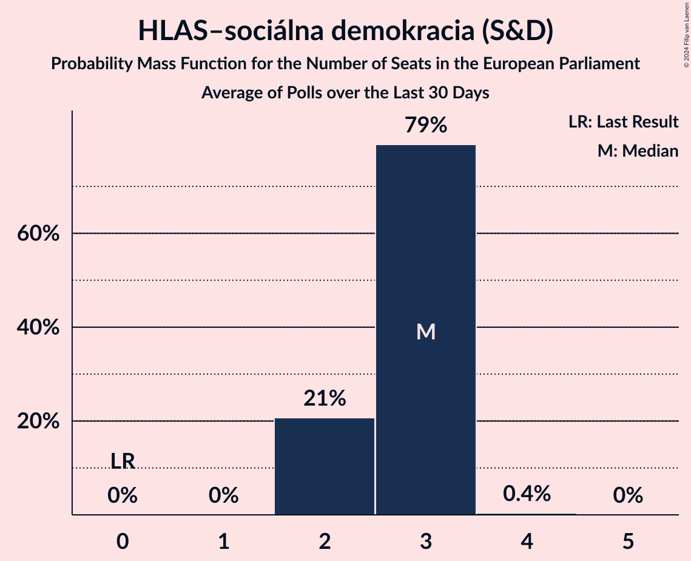

# HLAS–sociálna demokracia (S&D)

<a href="#voting-intentions">Voting Intentions</a> | <a href="#seats">Seats</a>

## Voting Intentions

Last result: **0.0%** (General Election of 25 May 2019)

### Confidence Intervals

| Period     | Polling firm/Commissioner(s) | Median | 80% Confidence Interval | 90% Confidence Interval | 95% Confidence Interval | 99% Confidence Interval |
|:----------:|:----------------:|:-----------:|:-----------------------:|:-----------------------:|:-----------------------:|:-----------------------:|
| N/A | [Poll Average](average.html) | 16.6% | 15.1–18.2% | 14.7–18.7% | 14.3–19.1% | 13.6–19.9% |
| [4–10 May 2023](2023-05-10-AKO.html) | AKO   TV JOJ | 16.5% | 15.1–18.1% | 14.7–18.5% | 14.3–18.9% | 13.7–19.7% |
| [19–26 April 2023](2023-04-26-Focus.html) | Focus   TV Markíza | 17.0% | 15.5–18.6% | 15.1–19.0% | 14.8–19.4% | 14.1–20.2% |
| [10–14 April 2023](2023-04-14-IPSOS.html) | IPSOS   Denník N | 16.2% | 14.8–17.8% | 14.4–18.2% | 14.0–18.6% | 13.4–19.4% |
| [4–11 April 2023](2023-04-11-AKO.html) | AKO   TV JOJ | 16.3% | 14.9–17.9% | 14.5–18.3% | 14.1–18.7% | 13.5–19.5% |
| [28 March–2 April 2023](2023-04-02-NMS.html) | NMS | 14.2% | 12.9–15.7% | 12.5–16.2% | 12.2–16.5% | 11.6–17.3% |
| [1–31 March 2023](2023-03-31-IPSOS.html) | IPSOS   Denník N | 16.0% | 14.5–17.5% | 14.1–18.0% | 13.8–18.4% | 13.2–19.1% |
| [14–22 March 2023](2023-03-22-Focus.html) | Focus   TV Markíza | 17.1% | 15.7–18.7% | 15.2–19.1% | 14.9–19.5% | 14.2–20.3% |
| [12 March 2023](2023-03-12-AKO.html) | AKO   TV JOJ | 16.1% | 14.7–17.7% | 14.3–18.1% | 13.9–18.5% | 13.3–19.3% |
| [1 February–5 March 2023](2023-03-05-Median.html) | Median | 14.5% | 13.2–16.0% | 12.8–16.4% | 12.5–16.7% | 11.9–17.5% |
| [7–13 February 2023](2023-02-13-AKO.html) | AKO   TV JOJ | 18.9% | 17.4–20.6% | 16.9–21.0% | 16.6–21.4% | 15.9–22.3% |
| [1–8 February 2023](2023-02-08-Focus.html) | Focus   TV Markíza | 20.8% | 19.3–22.6% | 18.8–23.0% | 18.5–23.5% | 17.7–24.3% |
| [9 January–5 February 2023](2023-02-05-Median.html) | Median | 15.6% | 14.3–17.2% | 13.9–17.6% | 13.5–18.0% | 12.9–18.8% |
| [28 January–1 February 2023](2023-02-01-Polis.html) | Polis   SITA | 19.4% | 17.8–21.0% | 17.4–21.5% | 17.0–21.9% | 16.3–22.8% |
| [18–20 January 2023](2023-01-20-IPSOS.html) | IPSOS   Denník N | 18.2% | 16.7–19.9% | 16.3–20.3% | 16.0–20.7% | 15.3–21.5% |
| [10–16 January 2023](2023-01-16-AKO.html) | AKO   TV JOJ | 17.6% | 16.1–19.2% | 15.7–19.7% | 15.4–20.1% | 14.7–20.9% |
| [19–23 December 2022](2022-12-23-Median.html) | Median | 19.1% | 17.6–20.8% | 17.1–21.2% | 16.8–21.6% | 16.1–22.5% |
| [16–20 December 2022](2022-12-20-Focus.html) | Focus   TV Markíza | 19.0% | 17.6–20.5% | 17.2–20.9% | 16.8–21.3% | 16.2–22.1% |
| [6–12 December 2022](2022-12-12-AKO.html) | AKO   TV JOJ | 20.2% | 18.6–21.9% | 18.2–22.4% | 17.8–22.8% | 17.1–23.6% |
| [30 November–7 December 2022](2022-12-07-Focus.html) | Focus   TV Markíza | 20.0% | 18.4–21.7% | 18.0–22.1% | 17.6–22.5% | 16.9–23.4% |
| [22–28 November 2022](2022-11-28-IPSOS.html) | IPSOS   Denník N | 19.7% | 18.2–21.4% | 17.8–21.9% | 17.4–22.3% | 16.7–23.1% |
| [8–12 November 2022](2022-11-12-AKO.html) | AKO   TV JOJ | 19.5% | 18.0–21.2% | 17.5–21.7% | 17.2–22.1% | 16.4–22.9% |
| [8–11 November 2022](2022-11-11-Focus.html) | Focus   TV Markíza | 19.4% | 17.8–21.0% | 17.4–21.5% | 17.1–21.9% | 16.4–22.7% |
| [18–21 October 2022](2022-10-21-IPSOS.html) | IPSOS   Denník N | 20.2% | N/A | N/A | N/A | N/A |
| [12–19 October 2022](2022-10-19-AKO.html) | AKO   TV JOJ | 19.5% | 18.0–21.2% | 17.5–21.7% | 17.2–22.1% | 16.4–22.9% |
| [21–27 September 2022](2022-09-27-Focus.html) | Focus   TV Markíza | 20.4% | 18.9–22.1% | 18.4–22.6% | 18.0–23.0% | 17.3–23.9% |
| [14–20 September 2022](2022-09-20-IPSOS.html) | IPSOS   Denník N | 18.3% | 16.8–20.0% | 16.4–20.5% | 16.1–20.9% | 15.4–21.7% |
| [8–18 September 2022](2022-09-18-AKO.html) | AKO   TV JOJ | 19.3% | 17.8–21.0% | 17.3–21.5% | 17.0–21.9% | 16.3–22.7% |
| [15–18 August 2022](2022-08-18-AKO.html) | AKO   TV JOJ | 19.2% | 17.7–20.9% | 17.2–21.4% | 16.9–21.8% | 16.2–22.6% |
| [29 July–8 August 2022](2022-08-08-IPSOS.html) | IPSOS   Denník N | 17.2% | 15.8–18.8% | 15.4–19.3% | 15.1–19.7% | 14.4–20.5% |
| [7–14 July 2022](2022-07-14-AKO.html) | AKO   TV JOJ | 20.0% | 18.4–21.7% | 18.0–22.2% | 17.6–22.6% | 16.9–23.4% |
| [20–27 June 2022](2022-06-27-Focus.html) | Focus   TV Markíza | 20.5% | 18.9–22.2% | 18.5–22.7% | 18.1–23.1% | 17.4–23.9% |
| [7–10 June 2022](2022-06-10-AKO.html) | AKO   TV JOJ | 20.2% | 18.6–21.9% | 18.2–22.4% | 17.8–22.8% | 17.1–23.6% |
| [25–31 May 2022](2022-05-31-Focus.html) | Focus   TV Markíza | 20.3% | N/A | N/A | N/A | N/A |
| [10–16 May 2022](2022-05-16-AKO.html) | AKO   TV JOJ | 18.9% | N/A | N/A | N/A | N/A |
| [5–11 April 2022](2022-04-11-AKO.html) | AKO   TV JOJ | 18.9% | N/A | N/A | N/A | N/A |
| [30 March–6 April 2022](2022-04-06-Focus.html) | Focus   TV Markíza | 19.0% | N/A | N/A | N/A | N/A |
| [8–11 March 2022](2022-03-11-AKO.html) | AKO   TV JOJ | 18.0% | N/A | N/A | N/A | N/A |
| [22 February–1 March 2022](2022-03-01-Focus.html) | Focus   TV Markíza | 18.5% | N/A | N/A | N/A | N/A |
| [9–20 February 2022](2022-02-20-Median.html) | Median | 17.0% | N/A | N/A | N/A | N/A |
| [8–14 February 2022](2022-02-14-AKO.html) | AKO   TV JOJ | 17.5% | 16.0–19.1% | 15.6–19.6% | 15.3–20.0% | 14.6–20.8% |
| [27 January–1 February 2022](2022-02-01-Median.html) | Median | 13.5% | 12.2–15.0% | 11.9–15.4% | 11.5–15.8% | 10.9–16.5% |
| [19–26 January 2022](2022-01-26-Focus.html) | Focus   TV Markíza | 17.8% | 16.3–19.4% | 15.9–19.9% | 15.6–20.3% | 14.9–21.1% |
| [10–17 January 2022](2022-01-17-AKO.html) | AKO   TV JOJ | 18.0% | 16.5–19.6% | 16.1–20.1% | 15.7–20.5% | 15.1–21.3% |
| [7–13 December 2021](2021-12-13-AKO.html) | AKO   TV JOJ | 19.0% | 17.5–20.7% | 17.1–21.1% | 16.7–21.6% | 16.0–22.4% |
| [16–23 November 2021](2021-11-23-FOCUS.html) | FOCUS   TV Markíza | 19.2% | 17.7–20.9% | 17.3–21.4% | 16.9–21.8% | 16.2–22.6% |
| [8–16 November 2021](2021-11-16-AKO.html) | AKO   TV JOJ | 18.5% | 17.0–20.1% | 16.6–20.6% | 16.2–21.0% | 15.5–21.8% |
| [20–27 October 2021](2021-10-27-FOCUS.html) | FOCUS   TV Markíza | 19.5% | 18.0–21.2% | 17.6–21.7% | 17.2–22.1% | 16.5–22.9% |
| [17–20 October 2021](2021-10-20-Actly.html) | Actly   Zoznam/Topky | 21.0% | 19.4–22.7% | 18.9–23.2% | 18.6–23.6% | 17.8–24.4% |
| [4–7 October 2021](2021-10-07-AKO.html) | AKO   TV JOJ | 18.2% | 16.7–19.8% | 16.3–20.3% | 15.9–20.7% | 15.2–21.5% |
| [6–13 September 2021](2021-09-13-AKO.html) | AKO | 18.8% | N/A | N/A | N/A | N/A |
| [1–7 September 2021](2021-09-07-FOCUS.html) | FOCUS   TV Markíza | 18.5% | N/A | N/A | N/A | N/A |
| [10–15 August 2021](2021-08-15-AKO.html) | AKO | 19.5% | N/A | N/A | N/A | N/A |
| [6–12 July 2021](2021-07-12-AKO.html) | AKO | 20.8% | 19.2–22.5% | 18.8–23.0% | 18.4–23.4% | 17.7–24.3% |
| [7–11 June 2021](2021-06-11-AKO.html) | AKO | 21.0% | 19.4–22.7% | 19.0–23.2% | 18.6–23.6% | 17.8–24.5% |
| [2–9 June 2021](2021-06-09-FOCUS.html) | FOCUS | 21.6% | 20.0–23.3% | 19.5–23.8% | 19.1–24.2% | 18.4–25.1% |
| [4–7 June 2021](2021-06-07-Actly.html) | Actly | 22.5% | N/A | N/A | N/A | N/A |
| [11–19 May 2021](2021-05-19-FOCUS.html) | FOCUS | 22.4% | 20.8–24.2% | 20.3–24.7% | 20.0–25.1% | 19.2–26.0% |
| [13–17 May 2021](2021-05-17-AKO.html) | AKO | 22.2% | 20.6–24.0% | 20.1–24.4% | 19.8–24.9% | 19.0–25.7% |
| [12–17 April 2021](2021-04-17-AKO.html) | AKO | 23.9% | 22.2–25.7% | 21.8–26.2% | 21.4–26.6% | 20.6–27.5% |
| [31 March–7 April 2021](2021-04-07-FOCUS.html) | FOCUS | 22.3% | 20.7–24.0% | 20.2–24.5% | 19.8–25.0% | 19.1–25.8% |
| [27–31 March 2021](2021-03-31-Actly.html) | Actly | 22.7% | 21.1–24.5% | 20.6–25.0% | 20.2–25.4% | 19.4–26.3% |
| [8–12 March 2021](2021-03-12-AKO.html) | AKO | 24.9% | 23.2–26.7% | 22.7–27.2% | 22.3–27.7% | 21.5–28.6% |
| [17–24 February 2021](2021-02-24-FOCUS.html) | FOCUS | 23.0% | 21.4–24.8% | 20.9–25.2% | 20.5–25.7% | 19.7–26.5% |
| [8–11 February 2021](2021-02-11-AKO.html) | AKO | 25.0% | 23.3–26.8% | 22.8–27.3% | 22.4–27.8% | 21.6–28.7% |
| [31 January–8 February 2021](2021-02-08-Polis.html) | Polis   SITA | 21.4% | 19.9–23.0% | 19.5–23.5% | 19.1–23.9% | 18.4–24.7% |
| [16–20 January 2021](2021-01-20-Polis.html) | Polis | 21.4% | 19.9–23.0% | 19.4–23.5% | 19.1–23.9% | 18.4–24.7% |
| [12–19 January 2021](2021-01-19-FOCUS.html) | FOCUS | 24.3% | 22.6–26.1% | 22.1–26.6% | 21.7–27.0% | 20.9–27.9% |
| [7–13 January 2021](2021-01-13-MedianSK.html) | Median SK   RTVS | 21.7% | 20.1–23.4% | 19.6–23.9% | 19.2–24.3% | 18.5–25.2% |
| [19–22 December 2020](2020-12-22-Polis.html) | Polis | 22.9% | 21.3–24.6% | 20.9–25.1% | 20.5–25.5% | 19.8–26.3% |
| [17–19 December 2020](2020-12-19-AKO.html) | AKO | 22.8% | 21.2–24.6% | 20.7–25.1% | 20.3–25.5% | 19.5–26.4% |
| [8–14 December 2020](2020-12-14-FOCUS.html) | FOCUS | 20.1% | 18.5–21.8% | 18.1–22.3% | 17.7–22.7% | 17.0–23.5% |
| [6–11 December 2020](2020-12-11-Actly.html) | Actly | 22.0% | 20.3–23.7% | 19.9–24.2% | 19.5–24.6% | 18.7–25.5% |
| [20–25 November 2020](2020-11-25-Polis.html) | Polis | 21.3% | 19.7–23.0% | 19.2–23.5% | 18.9–23.9% | 18.1–24.7% |
| [18–25 November 2020](2020-11-25-FOCUS.html) | FOCUS | 19.1% | 17.6–20.8% | 17.2–21.3% | 16.8–21.7% | 16.1–22.5% |
| [6–11 November 2020](2020-11-11-MedianSK.html) | Median SK   RTVS | 20.3% | 18.8–22.0% | 18.4–22.5% | 18.0–22.9% | 17.3–23.7% |
| [21–26 October 2020](2020-10-26-Actly.html) | Actly | 26.5% | 24.8–28.3% | 24.3–28.9% | 23.9–29.3% | 23.0–30.2% |
| [15–23 October 2020](2020-10-23-Polis.html) | Polis | 22.1% | 20.5–23.8% | 20.0–24.3% | 19.6–24.7% | 18.9–25.5% |
| [7–15 October 2020](2020-10-15-FOCUS.html) | FOCUS | 18.7% | 17.2–20.4% | 16.8–20.9% | 16.4–21.3% | 15.8–22.1% |
| [7–12 October 2020](2020-10-12-Polis.html) | Polis | 20.8% | 19.3–22.3% | 18.9–22.8% | 18.6–23.2% | 17.9–23.9% |
| [1–9 October 2020](2020-10-09-AKO.html) | AKO | 18.8% | 17.3–20.5% | 16.9–20.9% | 16.5–21.4% | 15.8–22.2% |
| [14–18 September 2020](2020-09-18-MedianSK.html) | Median SK   RTVS | 16.9% | 15.4–18.5% | 15.0–18.9% | 14.7–19.3% | 14.0–20.1% |
| [4–9 September 2020](2020-09-09-Polis.html) | Polis | 16.0% | 14.7–17.5% | 14.4–17.8% | 14.1–18.2% | 13.5–18.9% |
| [26 August–2 September 2020](2020-09-02-FOCUS.html) | FOCUS | 16.2% | 14.8–17.8% | 14.4–18.2% | 14.1–18.6% | 13.5–19.4% |
| [21–26 August 2020](2020-08-26-Actly.html) | Actly | 17.0% | 15.5–18.6% | 15.2–19.1% | 14.8–19.5% | 14.1–20.3% |
| [22–27 July 2020](2020-07-27-Polis.html) | Polis | 16.0% | 14.6–17.5% | 14.2–18.0% | 13.9–18.3% | 13.2–19.1% |
| [7–17 July 2020](2020-07-17-AKO.html) | AKO | 16.7% | 15.3–18.3% | 14.9–18.7% | 14.5–19.1% | 13.9–19.9% |
| [17–24 June 2020](2020-06-24-FOCUS.html) | FOCUS | 0.0% | N/A | N/A | N/A | N/A |
| [5–10 June 2020](2020-06-10-Polis.html) | Polis | 0.0% | N/A | N/A | N/A | N/A |
| [23–27 May 2020](2020-05-27-Polis.html) | Polis | 0.0% | N/A | N/A | N/A | N/A |
| [14–21 May 2020](2020-05-21-FOCUS.html) | FOCUS | 0.0% | N/A | N/A | N/A | N/A |
| [15–19 April 2020](2020-04-19-FOCUS.html) | FOCUS | 0.0% | N/A | N/A | N/A | N/A |
| [14–17 April 2020](2020-04-17-AKO.html) | AKO | 0.0% | N/A | N/A | N/A | N/A |
| [4–8 April 2020](2020-04-08-Polis.html) | Polis | 0.0% | N/A | N/A | N/A | N/A |
| [18–21 March 2020](2020-03-21-FOCUS.html) | FOCUS | 0.0% | N/A | N/A | N/A | N/A |
| [11–13 February 2020](2020-02-13-AKO.html) | AKO | 0.0% | N/A | N/A | N/A | N/A |
| [6–12 February 2020](2020-02-12-FOCUS.html) | FOCUS | 0.0% | N/A | N/A | N/A | N/A |
| [3–6 February 2020](2020-02-06-AKO.html) | AKO | 0.0% | N/A | N/A | N/A | N/A |
| [24–31 January 2020](2020-01-31-MVK.html) | MVK | 0.0% | N/A | N/A | N/A | N/A |
| [23–30 January 2020](2020-01-30-Polis.html) | Polis | 0.0% | N/A | N/A | N/A | N/A |
| [15–22 January 2020](2020-01-22-FOCUS.html) | FOCUS | 0.0% | N/A | N/A | N/A | N/A |
| [15–17 January 2020](2020-01-17-AKO.html) | AKO | 0.0% | N/A | N/A | N/A | N/A |
| [10–15 January 2020](2020-01-15-Polis.html) | Polis | 0.0% | N/A | N/A | N/A | N/A |
| [10–14 January 2020](2020-01-14-FOCUS.html) | FOCUS | 0.0% | N/A | N/A | N/A | N/A |
| [7–9 January 2020](2020-01-09-AKO.html) | AKO   TA3 | 0.0% | N/A | N/A | N/A | N/A |
| [7–11 December 2019](2019-12-11-Polis.html) | Polis | 0.0% | N/A | N/A | N/A | N/A |
| [2–9 December 2019](2019-12-09-FOCUS.html) | FOCUS | 0.0% | N/A | N/A | N/A | N/A |
| [19–25 November 2019](2019-11-25-AKO.html) | AKO | 0.0% | N/A | N/A | N/A | N/A |
| [9–13 November 2019](2019-11-13-Polis.html) | Polis | 0.0% | N/A | N/A | N/A | N/A |
| [30 October–6 November 2019](2019-11-06-FOCUS.html) | FOCUS | 0.0% | N/A | N/A | N/A | N/A |
| [15–22 October 2019](2019-10-22-FOCUS.html) | FOCUS | 0.0% | N/A | N/A | N/A | N/A |
| [7–10 October 2019](2019-10-10-AKO.html) | AKO | 0.0% | N/A | N/A | N/A | N/A |
| [18–25 September 2019](2019-09-25-AKO.html) | AKO | 0.0% | N/A | N/A | N/A | N/A |
| [11–17 September 2019](2019-09-17-FOCUS.html) | FOCUS | 0.0% | N/A | N/A | N/A | N/A |
| [26–29 August 2019](2019-08-29-AKO.html) | AKO | 0.0% | N/A | N/A | N/A | N/A |
| [12 August 2019](2019-08-12-MVK.html) | MVK | 0.0% | N/A | N/A | N/A | N/A |
| [1–7 August 2019](2019-08-07-FOCUS.html) | FOCUS | 0.0% | N/A | N/A | N/A | N/A |
| [19–25 June 2019](2019-06-25-FOCUS.html) | FOCUS | 0.0% | N/A | N/A | N/A | N/A |
| [11–18 June 2019](2019-06-18-Polis.html) | Polis | 0.0% | N/A | N/A | N/A | N/A |
| [1–11 June 2019](2019-06-11-FOCUS.html) | FOCUS | 0.0% | N/A | N/A | N/A | N/A |
| [28–31 May 2019](2019-05-31-AKO.html) | AKO | 0.0% | N/A | N/A | N/A | N/A |

### Probability Mass Function

The following table shows the probability mass function per percentage block of voting intentions for the [poll average](average.html) for HLAS–sociálna demokracia (S&D).

| Voting Intentions | Probability | Accumulated | Special Marks |
|:-----------------:|:-----------:|:-----------:|:-------------:|
| 0.0–0.5% | 0% | 100% | Last Result |
| 0.5–1.5% | 0% | 100% |  |
| 1.5–2.5% | 0% | 100% |  |
| 2.5–3.5% | 0% | 100% |  |
| 3.5–4.5% | 0% | 100% |  |
| 4.5–5.5% | 0% | 100% |  |
| 5.5–6.5% | 0% | 100% |  |
| 6.5–7.5% | 0% | 100% |  |
| 7.5–8.5% | 0% | 100% |  |
| 8.5–9.5% | 0% | 100% |  |
| 9.5–10.5% | 0% | 100% |  |
| 10.5–11.5% | 0% | 100% |  |
| 11.5–12.5% | 0% | 100% |  |
| 12.5–13.5% | 0.4% | 100% |  |
| 13.5–14.5% | 4% | 99.6% |  |
| 14.5–15.5% | 15% | 96% |  |
| 15.5–16.5% | 29% | 81% |  |
| 16.5–17.5% | 29% | 52% | Median |
| 17.5–18.5% | 16% | 22% |  |
| 18.5–19.5% | 5% | 6% |  |
| 19.5–20.5% | 0.9% | 1.0% |  |
| 20.5–21.5% | 0.1% | 0.1% |  |
| 21.5–22.5% | 0% | 0% |  |

## Seats

Last result: **0** seats (General Election of 25 May 2019)

### Confidence Intervals

| Period     | Polling firm/Commissioner(s) | Median | 80% Confidence Interval | 90% Confidence Interval | 95% Confidence Interval | 99% Confidence Interval |
|:----------:|:----------------:|:------:|:-----------------------:|:-----------------------:|:-----------------------:|:-----------------------:|
| N/A | [Poll Average](average.html) | 3 | 3 | 2–3 | 2–3 | 2–4 |
| [4–10 May 2023](2023-05-10-AKO.html) | AKO   TV JOJ | 3 | 3 | 2–3 | 2–3 | 2–3 |
| [19–26 April 2023](2023-04-26-Focus.html) | Focus   TV Markíza | 3 | 3 | 3 | 3 | 2–4 |
| [10–14 April 2023](2023-04-14-IPSOS.html) | IPSOS   Denník N | 3 | 2–3 | 2–3 | 2–3 | 2–3 |
| [4–11 April 2023](2023-04-11-AKO.html) | AKO   TV JOJ | 3 | 3 | 3 | 2–3 | 2–3 |
| [28 March–2 April 2023](2023-04-02-NMS.html) | NMS | 2 | 2–3 | 2–3 | 2–3 | 2–3 |
| [1–31 March 2023](2023-03-31-IPSOS.html) | IPSOS   Denník N | 3 | 3 | 2–3 | 2–3 | 2–4 |
| [14–22 March 2023](2023-03-22-Focus.html) | Focus   TV Markíza | 3 | 3 | 3 | 3 | 2–4 |
| [12 March 2023](2023-03-12-AKO.html) | AKO   TV JOJ | 3 | 2–3 | 2–3 | 2–3 | 2–3 |
| [1 February–5 March 2023](2023-03-05-Median.html) | Median | 3 | 2–3 | 2–3 | 2–3 | 2–3 |
| [7–13 February 2023](2023-02-13-AKO.html) | AKO   TV JOJ | 3 | 3–4 | 3–4 | 3–4 | 3–4 |
| [1–8 February 2023](2023-02-08-Focus.html) | Focus   TV Markíza | 4 | 3–4 | 3–4 | 3–4 | 3–4 |
| [9 January–5 February 2023](2023-02-05-Median.html) | Median | 3 | 3 | 3 | 3 | 2–4 |
| [28 January–1 February 2023](2023-02-01-Polis.html) | Polis   SITA | 3 | 3–4 | 3–4 | 3–4 | 3–4 |
| [18–20 January 2023](2023-01-20-IPSOS.html) | IPSOS   Denník N | 3 | 3–4 | 3–4 | 3–4 | 3–4 |
| [10–16 January 2023](2023-01-16-AKO.html) | AKO   TV JOJ | 3 | 3 | 3 | 3 | 3 |
| [19–23 December 2022](2022-12-23-Median.html) | Median | 3 | 3–4 | 3–4 | 3–4 | 3–4 |
| [16–20 December 2022](2022-12-20-Focus.html) | Focus   TV Markíza | 3 | 3–4 | 3–4 | 3–4 | 3–4 |
| [6–12 December 2022](2022-12-12-AKO.html) | AKO   TV JOJ | 3 | 3–4 | 3–4 | 3–4 | 3–4 |
| [30 November–7 December 2022](2022-12-07-Focus.html) | Focus   TV Markíza | 4 | 3–4 | 3–4 | 3–4 | 3–4 |
| [22–28 November 2022](2022-11-28-IPSOS.html) | IPSOS   Denník N | 4 | 3–4 | 3–4 | 3–4 | 3–4 |
| [8–12 November 2022](2022-11-12-AKO.html) | AKO   TV JOJ | 3 | 3–4 | 3–4 | 3–4 | 3–4 |
| [8–11 November 2022](2022-11-11-Focus.html) | Focus   TV Markíza | 3 | 3–4 | 3–4 | 3–4 | 3–4 |
| [18–21 October 2022](2022-10-21-IPSOS.html) | IPSOS   Denník N |  |  |  |  |  |
| [12–19 October 2022](2022-10-19-AKO.html) | AKO   TV JOJ | 3 | 3–4 | 3–4 | 3–4 | 2–4 |
| [21–27 September 2022](2022-09-27-Focus.html) | Focus   TV Markíza | 3 | 3–4 | 3–4 | 3–4 | 3–4 |
| [14–20 September 2022](2022-09-20-IPSOS.html) | IPSOS   Denník N | 3 | 3 | 3–4 | 3–4 | 3–4 |
| [8–18 September 2022](2022-09-18-AKO.html) | AKO   TV JOJ | 3 | 3–4 | 3–4 | 3–4 | 3–4 |
| [15–18 August 2022](2022-08-18-AKO.html) | AKO   TV JOJ | 3 | 3–4 | 3–4 | 3–4 | 3–4 |
| [29 July–8 August 2022](2022-08-08-IPSOS.html) | IPSOS   Denník N | 3 | 3 | 3 | 3–4 | 3–4 |
| [7–14 July 2022](2022-07-14-AKO.html) | AKO   TV JOJ | 3 | 3–4 | 3–4 | 3–4 | 3–4 |
| [20–27 June 2022](2022-06-27-Focus.html) | Focus   TV Markíza | 3 | 3–4 | 3–4 | 3–4 | 3–4 |
| [7–10 June 2022](2022-06-10-AKO.html) | AKO   TV JOJ | 3 | 3–4 | 3–4 | 3–4 | 3–4 |
| [25–31 May 2022](2022-05-31-Focus.html) | Focus   TV Markíza |  |  |  |  |  |
| [10–16 May 2022](2022-05-16-AKO.html) | AKO   TV JOJ |  |  |  |  |  |
| [5–11 April 2022](2022-04-11-AKO.html) | AKO   TV JOJ |  |  |  |  |  |
| [30 March–6 April 2022](2022-04-06-Focus.html) | Focus   TV Markíza |  |  |  |  |  |
| [8–11 March 2022](2022-03-11-AKO.html) | AKO   TV JOJ |  |  |  |  |  |
| [22 February–1 March 2022](2022-03-01-Focus.html) | Focus   TV Markíza |  |  |  |  |  |
| [9–20 February 2022](2022-02-20-Median.html) | Median |  |  |  |  |  |
| [8–14 February 2022](2022-02-14-AKO.html) | AKO   TV JOJ | 3 | 3 | 3 | 2–3 | 2–3 |
| [27 January–1 February 2022](2022-02-01-Median.html) | Median | 3 | 2–3 | 2–3 | 2–3 | 2–3 |
| [19–26 January 2022](2022-01-26-Focus.html) | Focus   TV Markíza | 3 | 3 | 3 | 3 | 3–4 |
| [10–17 January 2022](2022-01-17-AKO.html) | AKO   TV JOJ | 3 | 3 | 3 | 3–4 | 3–4 |
| [7–13 December 2021](2021-12-13-AKO.html) | AKO   TV JOJ | 3 | 3–4 | 3–4 | 3–4 | 3–4 |
| [16–23 November 2021](2021-11-23-FOCUS.html) | FOCUS   TV Markíza | 3 | 3–4 | 3–4 | 3–4 | 3–4 |
| [8–16 November 2021](2021-11-16-AKO.html) | AKO   TV JOJ | 3 | 3–4 | 3–4 | 3–4 | 3–4 |
| [20–27 October 2021](2021-10-27-FOCUS.html) | FOCUS   TV Markíza | 3 | 3–4 | 3–4 | 3–4 | 3–4 |
| [17–20 October 2021](2021-10-20-Actly.html) | Actly   Zoznam/Topky | 4 | 3–4 | 3–4 | 3–4 | 3–4 |
| [4–7 October 2021](2021-10-07-AKO.html) | AKO   TV JOJ | 3 | 3–4 | 3–4 | 3–4 | 3–4 |
| [6–13 September 2021](2021-09-13-AKO.html) | AKO |  |  |  |  |  |
| [1–7 September 2021](2021-09-07-FOCUS.html) | FOCUS   TV Markíza |  |  |  |  |  |
| [10–15 August 2021](2021-08-15-AKO.html) | AKO |  |  |  |  |  |
| [6–12 July 2021](2021-07-12-AKO.html) | AKO | 4 | 3–4 | 3–4 | 3–4 | 3–4 |
| [7–11 June 2021](2021-06-11-AKO.html) | AKO | 4 | 4 | 3–4 | 3–4 | 3–5 |
| [2–9 June 2021](2021-06-09-FOCUS.html) | FOCUS | 4 | 3–4 | 3–4 | 3–4 | 3–5 |
| [4–7 June 2021](2021-06-07-Actly.html) | Actly |  |  |  |  |  |
| [11–19 May 2021](2021-05-19-FOCUS.html) | FOCUS | 4 | 4 | 4–5 | 3–5 | 3–5 |
| [13–17 May 2021](2021-05-17-AKO.html) | AKO | 4 | 4 | 4 | 4 | 4–5 |
| [12–17 April 2021](2021-04-17-AKO.html) | AKO | 4 | 4–5 | 4–5 | 4–5 | 4–5 |
| [31 March–7 April 2021](2021-04-07-FOCUS.html) | FOCUS | 4 | 3–5 | 3–5 | 3–5 | 3–5 |
| [27–31 March 2021](2021-03-31-Actly.html) | Actly | 5 | 4–5 | 4–5 | 4–5 | 3–5 |
| [8–12 March 2021](2021-03-12-AKO.html) | AKO | 4 | 4–5 | 4–5 | 4–5 | 4–5 |
| [17–24 February 2021](2021-02-24-FOCUS.html) | FOCUS | 4 | 4–5 | 4–5 | 4–5 | 4–5 |
| [8–11 February 2021](2021-02-11-AKO.html) | AKO | 5 | 4–5 | 4–5 | 4–5 | 4–5 |
| [31 January–8 February 2021](2021-02-08-Polis.html) | Polis   SITA | 4 | 3–4 | 3–4 | 3–4 | 3–4 |
| [16–20 January 2021](2021-01-20-Polis.html) | Polis | 4 | 3–4 | 3–4 | 3–4 | 3–4 |
| [12–19 January 2021](2021-01-19-FOCUS.html) | FOCUS | 5 | 4–5 | 4–5 | 4–5 | 4–6 |
| [7–13 January 2021](2021-01-13-MedianSK.html) | Median SK   RTVS | 4 | 4 | 4–5 | 4–5 | 3–5 |
| [19–22 December 2020](2020-12-22-Polis.html) | Polis | 4 | 4–5 | 4–5 | 3–5 | 3–5 |
| [17–19 December 2020](2020-12-19-AKO.html) | AKO | 4 | 4 | 4 | 3–5 | 3–5 |
| [8–14 December 2020](2020-12-14-FOCUS.html) | FOCUS | 4 | 3–5 | 3–5 | 3–5 | 3–5 |
| [6–11 December 2020](2020-12-11-Actly.html) | Actly | 4 | 4 | 3–5 | 3–5 | 3–5 |
| [20–25 November 2020](2020-11-25-Polis.html) | Polis | 4 | 3–4 | 3–4 | 3–5 | 3–5 |
| [18–25 November 2020](2020-11-25-FOCUS.html) | FOCUS | 3 | 3–4 | 3–4 | 3–4 | 3–4 |
| [6–11 November 2020](2020-11-11-MedianSK.html) | Median SK   RTVS | 4 | 3–4 | 3–4 | 3–4 | 3–5 |
| [21–26 October 2020](2020-10-26-Actly.html) | Actly | 4 | 4–5 | 4–5 | 4–5 | 4–5 |
| [15–23 October 2020](2020-10-23-Polis.html) | Polis | 4 | 4 | 4 | 3–5 | 3–5 |
| [7–15 October 2020](2020-10-15-FOCUS.html) | FOCUS | 4 | 3–4 | 3–4 | 3–4 | 3–4 |
| [7–12 October 2020](2020-10-12-Polis.html) | Polis | 3 | 3 | 3 | 3–4 | 3–4 |
| [1–9 October 2020](2020-10-09-AKO.html) | AKO | 3 | 3–4 | 3–4 | 3–4 | 3–4 |
| [14–18 September 2020](2020-09-18-MedianSK.html) | Median SK   RTVS | 3 | 3 | 3 | 3 | 2–4 |
| [4–9 September 2020](2020-09-09-Polis.html) | Polis | 3 | 3 | 3 | 3 | 2–3 |
| [26 August–2 September 2020](2020-09-02-FOCUS.html) | FOCUS | 3 | 3 | 3 | 3 | 2–3 |
| [21–26 August 2020](2020-08-26-Actly.html) | Actly | 3 | 3 | 3–4 | 3–4 | 2–4 |
| [22–27 July 2020](2020-07-27-Polis.html) | Polis | 2 | 2–3 | 2–3 | 2–3 | 2–3 |
| [7–17 July 2020](2020-07-17-AKO.html) | AKO | 3 | 3 | 3 | 3 | 2–3 |
| [17–24 June 2020](2020-06-24-FOCUS.html) | FOCUS |  |  |  |  |  |
| [5–10 June 2020](2020-06-10-Polis.html) | Polis |  |  |  |  |  |
| [23–27 May 2020](2020-05-27-Polis.html) | Polis |  |  |  |  |  |
| [14–21 May 2020](2020-05-21-FOCUS.html) | FOCUS |  |  |  |  |  |
| [15–19 April 2020](2020-04-19-FOCUS.html) | FOCUS |  |  |  |  |  |
| [14–17 April 2020](2020-04-17-AKO.html) | AKO |  |  |  |  |  |
| [4–8 April 2020](2020-04-08-Polis.html) | Polis |  |  |  |  |  |
| [18–21 March 2020](2020-03-21-FOCUS.html) | FOCUS |  |  |  |  |  |
| [11–13 February 2020](2020-02-13-AKO.html) | AKO |  |  |  |  |  |
| [6–12 February 2020](2020-02-12-FOCUS.html) | FOCUS |  |  |  |  |  |
| [3–6 February 2020](2020-02-06-AKO.html) | AKO |  |  |  |  |  |
| [24–31 January 2020](2020-01-31-MVK.html) | MVK |  |  |  |  |  |
| [23–30 January 2020](2020-01-30-Polis.html) | Polis |  |  |  |  |  |
| [15–22 January 2020](2020-01-22-FOCUS.html) | FOCUS |  |  |  |  |  |
| [15–17 January 2020](2020-01-17-AKO.html) | AKO |  |  |  |  |  |
| [10–15 January 2020](2020-01-15-Polis.html) | Polis |  |  |  |  |  |
| [10–14 January 2020](2020-01-14-FOCUS.html) | FOCUS |  |  |  |  |  |
| [7–9 January 2020](2020-01-09-AKO.html) | AKO   TA3 |  |  |  |  |  |
| [7–11 December 2019](2019-12-11-Polis.html) | Polis |  |  |  |  |  |
| [2–9 December 2019](2019-12-09-FOCUS.html) | FOCUS |  |  |  |  |  |
| [19–25 November 2019](2019-11-25-AKO.html) | AKO |  |  |  |  |  |
| [9–13 November 2019](2019-11-13-Polis.html) | Polis |  |  |  |  |  |
| [30 October–6 November 2019](2019-11-06-FOCUS.html) | FOCUS |  |  |  |  |  |
| [15–22 October 2019](2019-10-22-FOCUS.html) | FOCUS |  |  |  |  |  |
| [7–10 October 2019](2019-10-10-AKO.html) | AKO |  |  |  |  |  |
| [18–25 September 2019](2019-09-25-AKO.html) | AKO |  |  |  |  |  |
| [11–17 September 2019](2019-09-17-FOCUS.html) | FOCUS |  |  |  |  |  |
| [26–29 August 2019](2019-08-29-AKO.html) | AKO |  |  |  |  |  |
| [12 August 2019](2019-08-12-MVK.html) | MVK |  |  |  |  |  |
| [1–7 August 2019](2019-08-07-FOCUS.html) | FOCUS |  |  |  |  |  |
| [19–25 June 2019](2019-06-25-FOCUS.html) | FOCUS |  |  |  |  |  |
| [11–18 June 2019](2019-06-18-Polis.html) | Polis |  |  |  |  |  |
| [1–11 June 2019](2019-06-11-FOCUS.html) | FOCUS |  |  |  |  |  |
| [28–31 May 2019](2019-05-31-AKO.html) | AKO |  |  |  |  |  |

### Probability Mass Function

The following table shows the probability mass function per seat for the [poll average](average.html) for HLAS–sociálna demokracia (S&D).

| Number of Seats | Probability | Accumulated | Special Marks |
|:---------------:|:-----------:|:-----------:|:-------------:|
| 0 | 0% | 100% | Last Result |
| 1 | 0% | 100% |  |
| 2 | 8% | 100% |  |
| 3 | 92% | 92% | Median |
| 4 | 0.7% | 0.7% |  |
| 5 | 0% | 0% |  |

