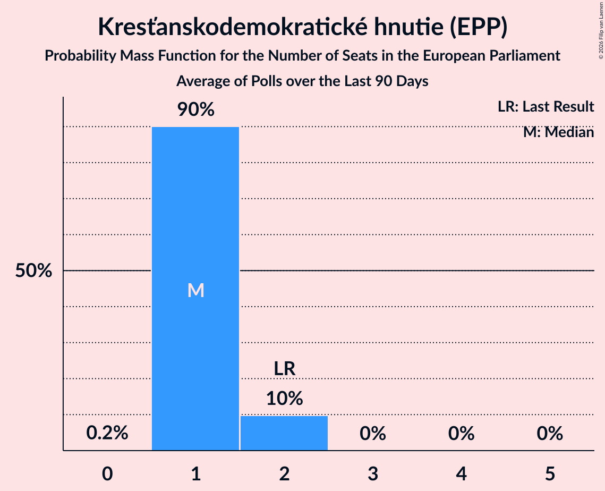

# Kresťanskodemokratické hnutie (EPP)

<a href="#voting-intentions">Voting Intentions</a> | <a href="#seats">Seats</a>

## Voting Intentions

Last result: **13.2%** (General Election of 25 May 2019)

### Confidence Intervals

| Period     | Polling firm/Commissioner(s) | Median | 80% Confidence Interval | 90% Confidence Interval | 95% Confidence Interval | 99% Confidence Interval |
|:----------:|:----------------:|:-----------:|:-----------------------:|:-----------------------:|:-----------------------:|:-----------------------:|
| N/A | [Poll Average](average.html) | 5.7% | 4.8–6.7% | 4.5–7.0% | 4.3–7.2% | 4.0–7.8% |
| [15–22 January 2020](2020-01-22-Polis.html) | Polis | 5.5% | N/A | N/A | N/A | N/A |
| [15–22 January 2020](2020-01-22-FOCUS.html) | FOCUS | 5.7% | 4.9–6.8% | 4.6–7.1% | 4.5–7.3% | 4.1–7.9% |
| [15–17 January 2020](2020-01-17-AKO.html) | AKO | 5.5% | 4.7–6.5% | 4.4–6.8% | 4.3–7.1% | 3.9–7.6% |
| [10–15 January 2020](2020-01-15-Polis.html) | Polis | 6.0% | 5.2–7.0% | 4.9–7.3% | 4.7–7.5% | 4.4–8.0% |
| [10–14 January 2020](2020-01-14-FOCUS.html) | FOCUS | 6.0% | 5.2–7.1% | 4.9–7.4% | 4.7–7.7% | 4.3–8.2% |
| [7–9 January 2020](2020-01-09-AKO.html) | AKO   TA3 | 6.2% | 5.3–7.3% | 5.1–7.6% | 4.9–7.9% | 4.5–8.4% |
| [7–11 December 2019](2019-12-11-Polis.html) | Polis | 6.1% | 5.3–7.1% | 5.0–7.4% | 4.8–7.7% | 4.5–8.2% |
| [2–9 December 2019](2019-12-09-FOCUS.html) | FOCUS | 5.7% | 4.8–6.7% | 4.6–7.0% | 4.4–7.3% | 4.0–7.8% |
| [19–25 November 2019](2019-11-25-AKO.html) | AKO | 6.4% | 5.5–7.5% | 5.3–7.8% | 5.0–8.1% | 4.6–8.7% |
| [9–13 November 2019](2019-11-13-Polis.html) | Polis | 6.0% | 5.1–7.0% | 4.9–7.3% | 4.7–7.6% | 4.3–8.2% |
| [30 October–6 November 2019](2019-11-06-FOCUS.html) | FOCUS | 5.7% | 4.8–6.7% | 4.6–7.0% | 4.4–7.3% | 4.1–7.8% |
| [15–22 October 2019](2019-10-22-FOCUS.html) | FOCUS | 6.5% | 5.6–7.6% | 5.3–7.9% | 5.1–8.2% | 4.7–8.7% |
| [7–10 October 2019](2019-10-10-AKO.html) | AKO | 5.6% | 4.8–6.6% | 4.5–7.0% | 4.3–7.2% | 4.0–7.7% |
| [18–25 September 2019](2019-09-25-AKO.html) | AKO | 7.4% | 6.4–8.6% | 6.2–8.9% | 5.9–9.2% | 5.5–9.8% |
| [11–17 September 2019](2019-09-17-FOCUS.html) | FOCUS | 6.9% | 6.0–8.0% | 5.7–8.4% | 5.5–8.6% | 5.1–9.2% |
| [26–29 August 2019](2019-08-29-AKO.html) | AKO | 5.8% | 5.0–6.9% | 4.7–7.2% | 4.5–7.4% | 4.1–8.0% |
| [12 August 2019](2019-08-12-MVK.html) | MVK | 9.4% | 8.3–10.7% | 8.0–11.1% | 7.7–11.4% | 7.2–12.0% |
| [1–7 August 2019](2019-08-07-FOCUS.html) | FOCUS | 7.5% | 6.6–8.7% | 6.3–9.1% | 6.1–9.3% | 5.6–9.9% |
| [19–25 June 2019](2019-06-25-FOCUS.html) | FOCUS | 7.0% | 6.1–8.2% | 5.8–8.5% | 5.6–8.8% | 5.2–9.4% |
| [11–18 June 2019](2019-06-18-Polis.html) | Polis | 8.2% | 7.3–9.4% | 7.0–9.7% | 6.8–10.0% | 6.4–10.5% |
| [1–11 June 2019](2019-06-11-FOCUS.html) | FOCUS | 7.5% | 6.5–8.6% | 6.2–9.0% | 6.0–9.3% | 5.6–9.8% |
| [28–31 May 2019](2019-05-31-AKO.html) | AKO | 8.6% | 7.6–9.8% | 7.3–10.2% | 7.0–10.5% | 6.5–11.1% |

### Probability Mass Function

The following table shows the probability mass function per percentage block of voting intentions for the [poll average](average.html) for Kresťanskodemokratické hnutie (EPP).

| Voting Intentions | Probability | Accumulated | Special Marks |
|:-----------------:|:-----------:|:-----------:|:-------------:|
| 2.5–3.5% | 0% | 100% |  |
| 3.5–4.5% | 5% | 100% |  |
| 4.5–5.5% | 38% | 95% |  |
| 5.5–6.5% | 44% | 57% | Median |
| 6.5–7.5% | 12% | 13% |  |
| 7.5–8.5% | 1.0% | 1.0% |  |
| 8.5–9.5% | 0% | 0% |  |
| 9.5–10.5% | 0% | 0% |  |
| 10.5–11.5% | 0% | 0% |  |
| 11.5–12.5% | 0% | 0% |  |
| 12.5–13.5% | 0% | 0% | Last Result |

## Seats

Last result: **2** seats (General Election of 25 May 2019)

### Confidence Intervals

| Period     | Polling firm/Commissioner(s) | Median | 80% Confidence Interval | 90% Confidence Interval | 95% Confidence Interval | 99% Confidence Interval |
|:----------:|:----------------:|:------:|:-----------------------:|:-----------------------:|:-----------------------:|:-----------------------:|
| N/A | [Poll Average](average.html) | 1 | 0–1 | 0–1 | 0–1 | 0–1 |
| [15–22 January 2020](2020-01-22-Polis.html) | Polis |  |  |  |  |  |
| [15–22 January 2020](2020-01-22-FOCUS.html) | FOCUS | 1 | 1 | 0–1 | 0–1 | 0–1 |
| [15–17 January 2020](2020-01-17-AKO.html) | AKO | 1 | 0–1 | 0–1 | 0–1 | 0–1 |
| [10–15 January 2020](2020-01-15-Polis.html) | Polis | 1 | 1 | 1 | 0–1 | 0–1 |
| [10–14 January 2020](2020-01-14-FOCUS.html) | FOCUS | 1 | 1 | 0–1 | 0–1 | 0–1 |
| [7–9 January 2020](2020-01-09-AKO.html) | AKO   TA3 | 1 | 1 | 1 | 0–1 | 0–1 |
| [7–11 December 2019](2019-12-11-Polis.html) | Polis | 1 | 1 | 1 | 0–1 | 0–1 |
| [2–9 December 2019](2019-12-09-FOCUS.html) | FOCUS | 1 | 0–1 | 0–1 | 0–1 | 0–1 |
| [19–25 November 2019](2019-11-25-AKO.html) | AKO | 1 | 1 | 1 | 1 | 0–1 |
| [9–13 November 2019](2019-11-13-Polis.html) | Polis | 1 | 1 | 1 | 0–1 | 0–1 |
| [30 October–6 November 2019](2019-11-06-FOCUS.html) | FOCUS | 1 | 0–1 | 0–1 | 0–1 | 0–1 |
| [15–22 October 2019](2019-10-22-FOCUS.html) | FOCUS | 1 | 1 | 1 | 1 | 0–1 |
| [7–10 October 2019](2019-10-10-AKO.html) | AKO | 1 | 0–1 | 0–1 | 0–1 | 0–1 |
| [18–25 September 2019](2019-09-25-AKO.html) | AKO | 1 | 1 | 1 | 1 | 1–2 |
| [11–17 September 2019](2019-09-17-FOCUS.html) | FOCUS | 1 | 1 | 1 | 1 | 0–1 |
| [26–29 August 2019](2019-08-29-AKO.html) | AKO | 1 | 1 | 0–1 | 0–1 | 0–1 |
| [12 August 2019](2019-08-12-MVK.html) | MVK | 1 | 1–2 | 1–2 | 1–2 | 1–2 |
| [1–7 August 2019](2019-08-07-FOCUS.html) | FOCUS | 1 | 1 | 1 | 1 | 1–2 |
| [19–25 June 2019](2019-06-25-FOCUS.html) | FOCUS | 1 | 1 | 1 | 1 | 1 |
| [11–18 June 2019](2019-06-18-Polis.html) | Polis | 1 | 1–2 | 1–2 | 1–2 | 1–2 |
| [1–11 June 2019](2019-06-11-FOCUS.html) | FOCUS | 1 | 1 | 1 | 1 | 1 |
| [28–31 May 2019](2019-05-31-AKO.html) | AKO | 1 | 1 | 1 | 1 | 1–2 |

### Probability Mass Function

The following table shows the probability mass function per seat for the [poll average](average.html) for Kresťanskodemokratické hnutie (EPP).

| Number of Seats | Probability | Accumulated | Special Marks |
|:---------------:|:-----------:|:-----------:|:-------------:|
| 0 | 13% | 100% |  |
| 1 | 87% | 87% | Median |
| 2 | 0% | 0% | Last Result |

