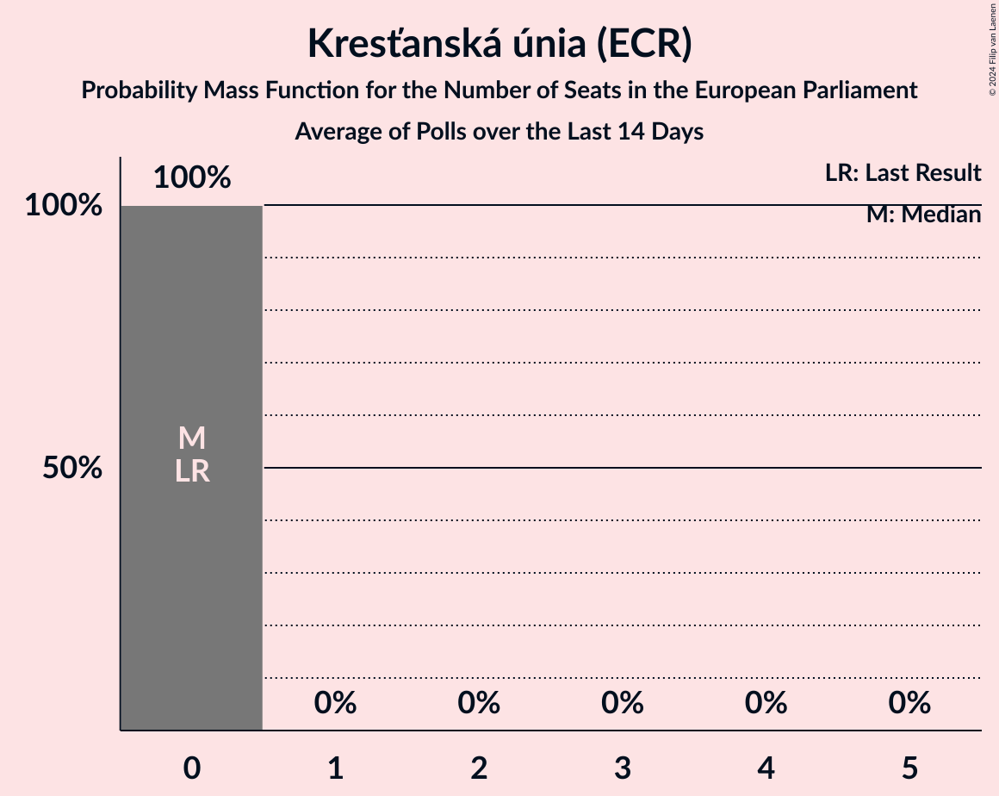

# Kresťanská únia (ECR)

<a href="#voting-intentions">Voting Intentions</a> | <a href="#seats">Seats</a>

## Voting Intentions

Last result: **0.0%** (General Election of 8 June 2024)

### Confidence Intervals

| Period     | Polling firm/Commissioner(s) | Median | 80% Confidence Interval | 90% Confidence Interval | 95% Confidence Interval | 99% Confidence Interval |
|:----------:|:----------------:|:-----------:|:-----------------------:|:-----------------------:|:-----------------------:|:-----------------------:|
| N/A | [Poll Average](average.html) | 0.9% | 0.5–1.3% | 0.5–1.4% | 0.4–1.6% | 0.3–1.9% |
| [9–15 July 2024](2024-07-15-AKO.html) | AKO   TV JOJ | 0.8% | 0.5–1.3% | 0.5–1.4% | 0.4–1.6% | 0.3–1.9% |
| [4–8 July 2024](2024-07-08-NMS.html) | NMS | 1.2% | N/A | N/A | N/A | N/A |
| [26 June–1 July 2024](2024-07-01-Ipsos.html) | Ipsos   Denník N | 1.0% | N/A | N/A | N/A | N/A |
| [11–18 June 2024](2024-06-18-AKO.html) | AKO   TV JOJ | 1.1% | N/A | N/A | N/A | N/A |
| [5–12 June 2024](2024-06-12-Focus.html) | Focus   TV Markíza | 1.0% | N/A | N/A | N/A | N/A |

### Probability Mass Function

The following table shows the probability mass function per percentage block of voting intentions for the [poll average](average.html) for Kresťanská únia (ECR).

| Voting Intentions | Probability | Accumulated | Special Marks |
|:-----------------:|:-----------:|:-----------:|:-------------:|
| 0.0–0.5% | 10% | 100% | Last Result |
| 0.5–1.5% | 87% | 90% | Median |
| 1.5–2.5% | 3% | 3% |  |
| 2.5–3.5% | 0% | 0% |  |

## Seats

Last result: **0** seats (General Election of 8 June 2024)

### Confidence Intervals

| Period     | Polling firm/Commissioner(s) | Median | 80% Confidence Interval | 90% Confidence Interval | 95% Confidence Interval | 99% Confidence Interval |
|:----------:|:----------------:|:------:|:-----------------------:|:-----------------------:|:-----------------------:|:-----------------------:|
| N/A | [Poll Average](average.html) | 0 | 0 | 0 | 0 | 0 |
| [9–15 July 2024](2024-07-15-AKO.html) | AKO   TV JOJ | 0 | 0 | 0 | 0 | 0 |
| [4–8 July 2024](2024-07-08-NMS.html) | NMS |  |  |  |  |  |
| [26 June–1 July 2024](2024-07-01-Ipsos.html) | Ipsos   Denník N |  |  |  |  |  |
| [11–18 June 2024](2024-06-18-AKO.html) | AKO   TV JOJ |  |  |  |  |  |
| [5–12 June 2024](2024-06-12-Focus.html) | Focus   TV Markíza |  |  |  |  |  |

### Probability Mass Function

The following table shows the probability mass function per seat for the [poll average](average.html) for Kresťanská únia (ECR).

| Number of Seats | Probability | Accumulated | Special Marks |
|:---------------:|:-----------:|:-----------:|:-------------:|
| 0 | 100% | 100% | Last Result, Median |

