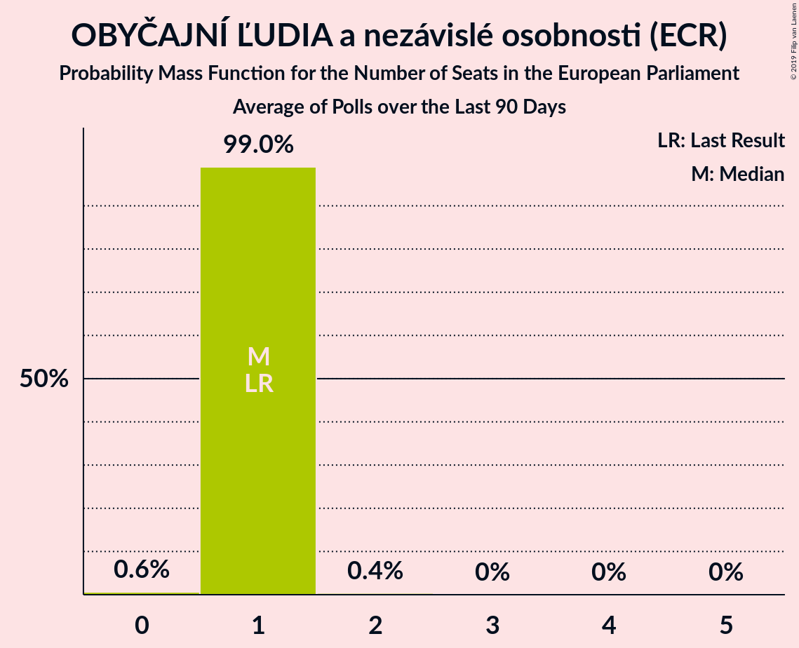

# OBYČAJNÍ ĽUDIA a nezávislé osobnosti (ECR)

<a href="#voting-intentions">Voting Intentions</a> | <a href="#seats">Seats</a>

## Voting Intentions

Last result: **7.5%** (General Election of 25 May 2019)

### Confidence Intervals

| Period     | Polling firm/Commissioner(s) | Median | 80% Confidence Interval | 90% Confidence Interval | 95% Confidence Interval | 99% Confidence Interval |
|:----------:|:----------------:|:-----------:|:-----------------------:|:-----------------------:|:-----------------------:|:-----------------------:|
| N/A | [Poll Average](average.html) | 6.5% | 5.5–7.5% | 5.3–7.8% | 5.1–8.1% | 4.7–8.7% |
| [11–18 June 2019](2019-06-18-Polis.html) | Polis | 6.3% | 5.4–7.3% | 5.2–7.6% | 5.0–7.8% | 4.6–8.3% |
| [1–11 June 2019](2019-06-11-FOCUS.html) | FOCUS | 6.7% | 5.8–7.8% | 5.5–8.1% | 5.3–8.4% | 4.9–9.0% |
| [28–31 May 2019](2019-05-31-AKO.html) | AKO | 6.3% | 5.4–7.4% | 5.2–7.7% | 5.0–8.0% | 4.6–8.6% |

### Probability Mass Function

The following table shows the probability mass function per percentage block of voting intentions for the [poll average](average.html) for OBYČAJNÍ ĽUDIA a nezávislé osobnosti (ECR).

| Voting Intentions | Probability | Accumulated | Special Marks |
|:-----------------:|:-----------:|:-----------:|:-------------:|
| 2.5–3.5% | 0% | 100% |  |
| 3.5–4.5% | 0.3% | 100% |  |
| 4.5–5.5% | 10% | 99.7% |  |
| 5.5–6.5% | 44% | 89% | Median |
| 6.5–7.5% | 36% | 46% | Last Result |
| 7.5–8.5% | 9% | 10% |  |
| 8.5–9.5% | 0.7% | 0.8% |  |
| 9.5–10.5% | 0% | 0% |  |

## Seats

Last result: **1** seats (General Election of 25 May 2019)

### Confidence Intervals

| Period     | Polling firm/Commissioner(s) | Median | 80% Confidence Interval | 90% Confidence Interval | 95% Confidence Interval | 99% Confidence Interval |
|:----------:|:----------------:|:------:|:-----------------------:|:-----------------------:|:-----------------------:|:-----------------------:|
| N/A | [Poll Average](average.html) | 1 | 1 | 1 | 0–1 | 0–1 |
| [11–18 June 2019](2019-06-18-Polis.html) | Polis | 1 | 1 | 1 | 0–1 | 0–1 |
| [1–11 June 2019](2019-06-11-FOCUS.html) | FOCUS | 1 | 1 | 1 | 0–1 | 0–1 |
| [28–31 May 2019](2019-05-31-AKO.html) | AKO | 1 | 1 | 1 | 0–1 | 0–1 |

### Probability Mass Function

The following table shows the probability mass function per seat for the [poll average](average.html) for OBYČAJNÍ ĽUDIA a nezávislé osobnosti (ECR).

| Number of Seats | Probability | Accumulated | Special Marks |
|:---------------:|:-----------:|:-----------:|:-------------:|
| 0 | 3% | 100% |  |
| 1 | 97% | 97% | Last Result, Median |
| 2 | 0% | 0% |  |

