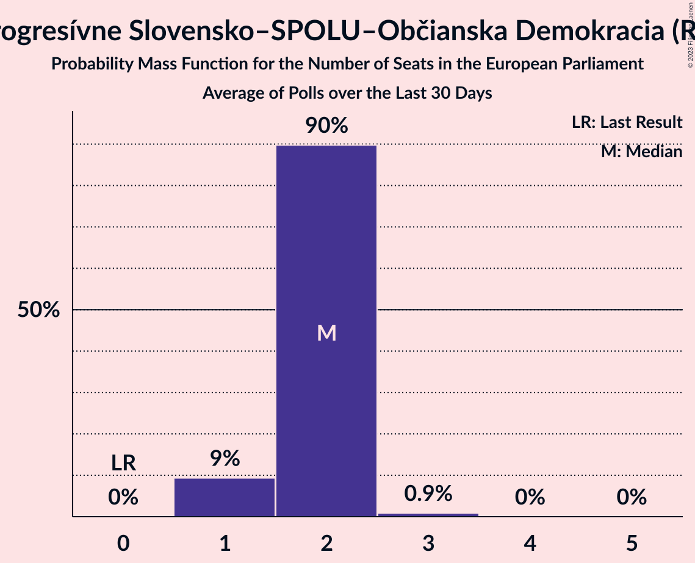

# Progresívne Slovensko–SPOLU–Občianska Demokracia (RE)

<a href="#voting-intentions">Voting Intentions</a> | <a href="#seats">Seats</a>

## Voting Intentions

Last result: **0.0%** (General Election of 25 May 2019)

### Confidence Intervals

| Period     | Polling firm/Commissioner(s) | Median | 80% Confidence Interval | 90% Confidence Interval | 95% Confidence Interval | 99% Confidence Interval |
|:----------:|:----------------:|:-----------:|:-----------------------:|:-----------------------:|:-----------------------:|:-----------------------:|
| N/A | [Poll Average](average.html) | 16.1% | 14.3–18.7% | 13.8–19.3% | 13.5–19.8% | 12.8–20.8% |
| [1–7 August 2019](2019-08-07-FOCUS.html) | FOCUS | 14.0% | 12.7–15.5% | 12.3–15.9% | 12.0–16.3% | 11.4–17.0% |
| [19–25 June 2019](2019-06-25-FOCUS.html) | FOCUS | 15.7% | 14.4–17.3% | 14.0–17.7% | 13.6–18.1% | 13.0–18.9% |
| [11–18 June 2019](2019-06-18-Polis.html) | Polis | 15.0% | 13.7–16.4% | 13.4–16.8% | 13.1–17.2% | 12.5–17.9% |
| [1–11 June 2019](2019-06-11-FOCUS.html) | FOCUS | 17.8% | 16.3–19.4% | 15.9–19.9% | 15.6–20.3% | 14.9–21.1% |
| [28–31 May 2019](2019-05-31-AKO.html) | AKO | 18.0% | 16.5–19.6% | 16.1–20.1% | 15.7–20.5% | 15.1–21.3% |

### Probability Mass Function

The following table shows the probability mass function per percentage block of voting intentions for the [poll average](average.html) for Progresívne Slovensko–SPOLU–Občianska Demokracia (RE).

| Voting Intentions | Probability | Accumulated | Special Marks |
|:-----------------:|:-----------:|:-----------:|:-------------:|
| 0.0–0.5% | 0% | 100% | Last Result |
| 0.5–1.5% | 0% | 100% |  |
| 1.5–2.5% | 0% | 100% |  |
| 2.5–3.5% | 0% | 100% |  |
| 3.5–4.5% | 0% | 100% |  |
| 4.5–5.5% | 0% | 100% |  |
| 5.5–6.5% | 0% | 100% |  |
| 6.5–7.5% | 0% | 100% |  |
| 7.5–8.5% | 0% | 100% |  |
| 8.5–9.5% | 0% | 100% |  |
| 9.5–10.5% | 0% | 100% |  |
| 10.5–11.5% | 0% | 100% |  |
| 11.5–12.5% | 0.2% | 100% |  |
| 12.5–13.5% | 3% | 99.8% |  |
| 13.5–14.5% | 12% | 97% |  |
| 14.5–15.5% | 22% | 85% |  |
| 15.5–16.5% | 22% | 63% | Median |
| 16.5–17.5% | 16% | 41% |  |
| 17.5–18.5% | 13% | 25% |  |
| 18.5–19.5% | 8% | 12% |  |
| 19.5–20.5% | 3% | 4% |  |
| 20.5–21.5% | 0.7% | 0.8% |  |
| 21.5–22.5% | 0.1% | 0.1% |  |
| 22.5–23.5% | 0% | 0% |  |

## Seats

Last result: **0** seats (General Election of 25 May 2019)

### Confidence Intervals

| Period     | Polling firm/Commissioner(s) | Median | 80% Confidence Interval | 90% Confidence Interval | 95% Confidence Interval | 99% Confidence Interval |
|:----------:|:----------------:|:------:|:-----------------------:|:-----------------------:|:-----------------------:|:-----------------------:|
| N/A | [Poll Average](average.html) | 2 | 2–3 | 2–3 | 2–3 | 2–3 |
| [1–7 August 2019](2019-08-07-FOCUS.html) | FOCUS | 2 | 2 | 2 | 2 | 1–3 |
| [19–25 June 2019](2019-06-25-FOCUS.html) | FOCUS | 2 | 2–3 | 2–3 | 2–3 | 2–3 |
| [11–18 June 2019](2019-06-18-Polis.html) | Polis | 2 | 2 | 2 | 2–3 | 2–3 |
| [1–11 June 2019](2019-06-11-FOCUS.html) | FOCUS | 3 | 2–3 | 2–3 | 2–3 | 2–3 |
| [28–31 May 2019](2019-05-31-AKO.html) | AKO | 3 | 2–3 | 2–3 | 2–3 | 2–3 |

### Probability Mass Function

The following table shows the probability mass function per seat for the [poll average](average.html) for Progresívne Slovensko–SPOLU–Občianska Demokracia (RE).

| Number of Seats | Probability | Accumulated | Special Marks |
|:---------------:|:-----------:|:-----------:|:-------------:|
| 0 | 0% | 100% | Last Result |
| 1 | 0.2% | 100% |  |
| 2 | 70% | 99.8% | Median |
| 3 | 29% | 29% |  |
| 4 | 0% | 0% |  |

