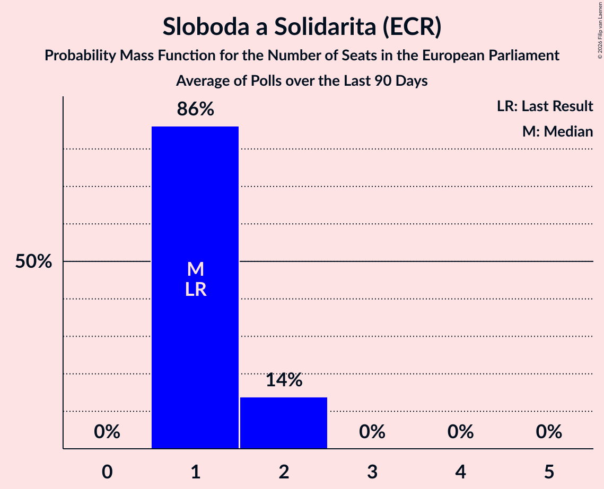

# Sloboda a Solidarita (ECR)

<a href="#voting-intentions">Voting Intentions</a> | <a href="#seats">Seats</a>

## Voting Intentions

Last result: **6.7%** (General Election of 25 May 2019)

### Confidence Intervals

| Period     | Polling firm/Commissioner(s) | Median | 80% Confidence Interval | 90% Confidence Interval | 95% Confidence Interval | 99% Confidence Interval |
|:----------:|:----------------:|:-----------:|:-----------------------:|:-----------------------:|:-----------------------:|:-----------------------:|
| N/A | [Poll Average](average.html) | 11.9% | 9.9–14.3% | 9.5–14.8% | 9.1–15.3% | 8.5–16.2% |
| [12–17 April 2021](2021-04-17-AKO.html) | AKO | 13.8% | 12.5–15.3% | 12.1–15.7% | 11.8–16.1% | 11.2–16.8% |
| [31 March–7 April 2021](2021-04-07-FOCUS.html) | FOCUS | 11.2% | 10.0–12.6% | 9.7–13.0% | 9.4–13.3% | 8.8–14.0% |
| [27–31 March 2021](2021-03-31-Actly.html) | Actly | 10.3% | 9.2–11.6% | 8.8–12.0% | 8.6–12.3% | 8.0–13.0% |
| [8–12 March 2021](2021-03-12-AKO.html) | AKO | 14.3% | 13.0–15.8% | 12.6–16.2% | 12.3–16.6% | 11.6–17.4% |
| [17–24 February 2021](2021-02-24-FOCUS.html) | FOCUS | 12.9% | 11.6–14.3% | 11.2–14.7% | 10.9–15.1% | 10.4–15.8% |
| [8–11 February 2021](2021-02-11-AKO.html) | AKO | 15.1% | 13.7–16.6% | 13.3–17.1% | 13.0–17.5% | 12.4–18.2% |
| [31 January–8 February 2021](2021-02-08-Polis.html) | Polis   SITA | 12.5% | 11.3–13.8% | 10.9–14.2% | 10.7–14.5% | 10.1–15.2% |
| [16–20 January 2021](2021-01-20-Polis.html) | Polis | 15.3% | 14.0–16.8% | 13.6–17.2% | 13.3–17.5% | 12.7–18.2% |
| [12–19 January 2021](2021-01-19-FOCUS.html) | FOCUS | 13.3% | 12.0–14.8% | 11.7–15.2% | 11.4–15.6% | 10.8–16.3% |
| [7–13 January 2021](2021-01-13-MedianSK.html) | Median SK   RTVS | 11.8% | 10.6–13.2% | 10.2–13.6% | 9.9–13.9% | 9.4–14.6% |
| [19–22 December 2020](2020-12-22-Polis.html) | Polis | 15.5% | 14.2–17.0% | 13.8–17.5% | 13.5–17.8% | 12.9–18.5% |
| [17–19 December 2020](2020-12-19-AKO.html) | AKO | 16.2% | 14.8–17.8% | 14.4–18.2% | 14.0–18.6% | 13.4–19.4% |
| [8–14 December 2020](2020-12-14-FOCUS.html) | FOCUS | 15.8% | 14.4–17.4% | 14.0–17.8% | 13.7–18.2% | 13.0–19.0% |
| [6–11 December 2020](2020-12-11-Actly.html) | Actly | 13.4% | 12.1–14.8% | 11.7–15.3% | 11.4–15.6% | 10.8–16.4% |
| [20–25 November 2020](2020-11-25-Polis.html) | Polis | 14.2% | 12.9–15.7% | 12.5–16.1% | 12.2–16.5% | 11.6–17.2% |
| [18–25 November 2020](2020-11-25-FOCUS.html) | FOCUS | 12.1% | 10.8–13.5% | 10.5–13.9% | 10.2–14.2% | 9.6–14.9% |
| [6–11 November 2020](2020-11-11-MedianSK.html) | Median SK   RTVS | 12.5% | 11.2–13.9% | 10.9–14.3% | 10.6–14.7% | 10.0–15.4% |
| [21–26 October 2020](2020-10-26-Actly.html) | Actly | 11.2% | 10.0–12.6% | 9.7–13.0% | 9.4–13.3% | 8.8–14.0% |
| [15–23 October 2020](2020-10-23-Polis.html) | Polis | 13.1% | 11.8–14.5% | 11.5–14.9% | 11.2–15.3% | 10.6–16.0% |
| [7–15 October 2020](2020-10-15-FOCUS.html) | FOCUS | 10.7% | 9.5–12.0% | 9.2–12.4% | 8.9–12.7% | 8.4–13.4% |
| [7–12 October 2020](2020-10-12-Polis.html) | Polis | 12.0% | 10.8–13.3% | 10.5–13.6% | 10.3–13.9% | 9.7–14.6% |
| [1–9 October 2020](2020-10-09-AKO.html) | AKO | 13.4% | 12.1–14.9% | 11.7–15.3% | 11.4–15.7% | 10.8–16.4% |
| [14–18 September 2020](2020-09-18-MedianSK.html) | Median SK   RTVS | 11.9% | 10.7–13.3% | 10.3–13.7% | 10.1–14.1% | 9.5–14.8% |
| [4–9 September 2020](2020-09-09-Polis.html) | Polis | 11.6% | 10.5–12.8% | 10.2–13.2% | 9.9–13.5% | 9.4–14.1% |
| [26 August–2 September 2020](2020-09-02-FOCUS.html) | FOCUS | 9.9% | 8.8–11.2% | 8.5–11.6% | 8.2–11.9% | 7.7–12.5% |
| [21–26 August 2020](2020-08-26-Actly.html) | Actly | 9.4% | 8.3–10.7% | 8.0–11.1% | 7.7–11.4% | 7.2–12.0% |
| [22–27 July 2020](2020-07-27-Polis.html) | Polis | 9.2% | 8.1–10.5% | 7.8–10.8% | 7.6–11.1% | 7.1–11.8% |
| [7–17 July 2020](2020-07-17-AKO.html) | AKO | 9.4% | 8.3–10.7% | 8.0–11.1% | 7.7–11.4% | 7.2–12.0% |
| [17–24 June 2020](2020-06-24-FOCUS.html) | FOCUS | 9.2% | 8.1–10.5% | 7.8–10.9% | 7.6–11.2% | 7.1–11.8% |
| [5–10 June 2020](2020-06-10-Polis.html) | Polis | 8.9% | 7.8–10.1% | 7.5–10.5% | 7.3–10.8% | 6.8–11.4% |
| [23–27 May 2020](2020-05-27-Polis.html) | Polis | 10.7% | 9.6–12.0% | 9.3–12.4% | 9.0–12.7% | 8.5–13.4% |
| [14–21 May 2020](2020-05-21-FOCUS.html) | FOCUS | 8.0% | 7.0–9.2% | 6.7–9.6% | 6.5–9.9% | 6.0–10.5% |
| [15–19 April 2020](2020-04-19-FOCUS.html) | FOCUS | 6.8% | 5.9–7.9% | 5.6–8.2% | 5.4–8.5% | 5.0–9.1% |
| [14–17 April 2020](2020-04-17-AKO.html) | AKO | 9.7% | 8.6–11.0% | 8.3–11.4% | 8.0–11.7% | 7.5–12.3% |
| [4–8 April 2020](2020-04-08-Polis.html) | Polis | 8.2% | 7.3–9.4% | 7.0–9.7% | 6.7–10.0% | 6.3–10.6% |
| [18–21 March 2020](2020-03-21-FOCUS.html) | FOCUS | 5.8% | 4.9–6.8% | 4.7–7.1% | 4.5–7.4% | 4.1–7.9% |
| [11–13 February 2020](2020-02-13-AKO.html) | AKO | 6.1% | 5.2–7.2% | 5.0–7.5% | 4.8–7.8% | 4.4–8.3% |
| [6–12 February 2020](2020-02-12-FOCUS.html) | FOCUS | 5.3% | 4.5–6.3% | 4.2–6.6% | 4.1–6.8% | 3.7–7.4% |
| [3–6 February 2020](2020-02-06-AKO.html) | AKO | 5.8% | 5.0–6.9% | 4.7–7.2% | 4.5–7.4% | 4.1–8.0% |
| [24–31 January 2020](2020-01-31-MVK.html) | MVK | 3.8% | 3.2–4.7% | 3.0–4.9% | 2.9–5.1% | 2.6–5.6% |
| [23–30 January 2020](2020-01-30-Polis.html) | Polis | 5.2% | 4.5–6.2% | 4.3–6.5% | 4.1–6.7% | 3.7–7.2% |
| [15–22 January 2020](2020-01-22-FOCUS.html) | FOCUS | 5.5% | 4.7–6.6% | 4.5–6.9% | 4.3–7.1% | 3.9–7.7% |
| [15–17 January 2020](2020-01-17-AKO.html) | AKO | 6.7% | 5.8–7.8% | 5.5–8.2% | 5.3–8.4% | 4.9–9.0% |
| [10–15 January 2020](2020-01-15-Polis.html) | Polis | 5.6% | 4.8–6.6% | 4.6–6.9% | 4.4–7.1% | 4.1–7.6% |
| [10–14 January 2020](2020-01-14-FOCUS.html) | FOCUS | 5.4% | 4.6–6.5% | 4.4–6.8% | 4.2–7.0% | 3.8–7.6% |
| [7–9 January 2020](2020-01-09-AKO.html) | AKO   TA3 | 6.8% | 5.9–7.9% | 5.6–8.3% | 5.4–8.5% | 5.0–9.1% |
| [7–11 December 2019](2019-12-11-Polis.html) | Polis | 5.2% | 4.5–6.2% | 4.2–6.4% | 4.1–6.7% | 3.7–7.2% |
| [2–9 December 2019](2019-12-09-FOCUS.html) | FOCUS | 5.7% | 4.8–6.7% | 4.6–7.0% | 4.4–7.3% | 4.0–7.8% |
| [19–25 November 2019](2019-11-25-AKO.html) | AKO | 6.3% | 5.4–7.4% | 5.2–7.7% | 5.0–8.0% | 4.6–8.6% |
| [9–13 November 2019](2019-11-13-Polis.html) | Polis | 5.1% | 4.3–6.1% | 4.1–6.4% | 3.9–6.6% | 3.6–7.1% |
| [30 October–6 November 2019](2019-11-06-FOCUS.html) | FOCUS | 5.0% | 4.2–6.0% | 4.0–6.3% | 3.8–6.5% | 3.5–7.0% |
| [15–22 October 2019](2019-10-22-FOCUS.html) | FOCUS | 5.2% | 4.4–6.2% | 4.2–6.5% | 4.0–6.7% | 3.6–7.2% |
| [7–10 October 2019](2019-10-10-AKO.html) | AKO | 6.7% | 5.8–7.8% | 5.5–8.2% | 5.3–8.4% | 4.9–9.0% |
| [18–25 September 2019](2019-09-25-AKO.html) | AKO | 7.0% | 6.1–8.2% | 5.8–8.5% | 5.6–8.8% | 5.2–9.3% |
| [11–17 September 2019](2019-09-17-FOCUS.html) | FOCUS | 6.4% | 5.5–7.5% | 5.3–7.8% | 5.1–8.1% | 4.7–8.7% |
| [26–29 August 2019](2019-08-29-AKO.html) | AKO | 8.1% | 7.1–9.3% | 6.8–9.7% | 6.6–10.0% | 6.1–10.6% |
| [12 August 2019](2019-08-12-MVK.html) | MVK | 5.5% | 4.7–6.5% | 4.4–6.8% | 4.3–7.1% | 3.9–7.6% |
| [1–7 August 2019](2019-08-07-FOCUS.html) | FOCUS | 7.0% | 6.0–8.1% | 5.8–8.4% | 5.5–8.7% | 5.1–9.3% |
| [19–25 June 2019](2019-06-25-FOCUS.html) | FOCUS | 7.1% | 6.2–8.3% | 5.9–8.6% | 5.7–8.9% | 5.3–9.5% |
| [11–18 June 2019](2019-06-18-Polis.html) | Polis | 8.5% | 7.5–9.6% | 7.3–10.0% | 7.0–10.2% | 6.6–10.8% |
| [1–11 June 2019](2019-06-11-FOCUS.html) | FOCUS | 8.0% | 7.0–9.2% | 6.7–9.5% | 6.4–9.8% | 6.0–10.4% |
| [28–31 May 2019](2019-05-31-AKO.html) | AKO | 10.8% | 9.6–12.2% | 9.3–12.5% | 9.0–12.9% | 8.5–13.6% |

### Probability Mass Function

The following table shows the probability mass function per percentage block of voting intentions for the [poll average](average.html) for Sloboda a Solidarita (ECR).

| Voting Intentions | Probability | Accumulated | Special Marks |
|:-----------------:|:-----------:|:-----------:|:-------------:|
| 6.5–7.5% | 0% | 100% | Last Result |
| 7.5–8.5% | 0.6% | 100% |  |
| 8.5–9.5% | 5% | 99.4% |  |
| 9.5–10.5% | 15% | 94% |  |
| 10.5–11.5% | 21% | 79% |  |
| 11.5–12.5% | 21% | 58% | Median |
| 12.5–13.5% | 18% | 37% |  |
| 13.5–14.5% | 12% | 19% |  |
| 14.5–15.5% | 5% | 7% |  |
| 15.5–16.5% | 1.5% | 2% |  |
| 16.5–17.5% | 0.2% | 0.2% |  |
| 17.5–18.5% | 0% | 0% |  |

## Seats

Last result: **1** seats (General Election of 25 May 2019)

### Confidence Intervals

| Period     | Polling firm/Commissioner(s) | Median | 80% Confidence Interval | 90% Confidence Interval | 95% Confidence Interval | 99% Confidence Interval |
|:----------:|:----------------:|:------:|:-----------------------:|:-----------------------:|:-----------------------:|:-----------------------:|
| N/A | [Poll Average](average.html) | 2 | 2–3 | 2–3 | 2–3 | 1–3 |
| [12–17 April 2021](2021-04-17-AKO.html) | AKO | 3 | 2–3 | 2–3 | 2–3 | 2–3 |
| [31 March–7 April 2021](2021-04-07-FOCUS.html) | FOCUS | 2 | 2 | 2 | 1–3 | 1–3 |
| [27–31 March 2021](2021-03-31-Actly.html) | Actly | 2 | 2 | 1–2 | 1–2 | 1–2 |
| [8–12 March 2021](2021-03-12-AKO.html) | AKO | 3 | 2–3 | 2–3 | 2–3 | 2–3 |
| [17–24 February 2021](2021-02-24-FOCUS.html) | FOCUS | 2 | 2–3 | 2–3 | 2–3 | 2–3 |
| [8–11 February 2021](2021-02-11-AKO.html) | AKO | 3 | 2–3 | 2–3 | 2–3 | 2–3 |
| [31 January–8 February 2021](2021-02-08-Polis.html) | Polis   SITA | 2 | 2 | 2 | 2 | 2 |
| [16–20 January 2021](2021-01-20-Polis.html) | Polis | 2 | 2–3 | 2–3 | 2–3 | 2–3 |
| [12–19 January 2021](2021-01-19-FOCUS.html) | FOCUS | 3 | 2–3 | 2–3 | 2–3 | 2–3 |
| [7–13 January 2021](2021-01-13-MedianSK.html) | Median SK   RTVS | 2 | 2 | 2 | 2 | 2–3 |
| [19–22 December 2020](2020-12-22-Polis.html) | Polis | 3 | 2–3 | 2–3 | 2–3 | 2–3 |
| [17–19 December 2020](2020-12-19-AKO.html) | AKO | 3 | 2–3 | 2–3 | 2–3 | 2–3 |
| [8–14 December 2020](2020-12-14-FOCUS.html) | FOCUS | 3 | 2–3 | 2–3 | 2–3 | 2–3 |
| [6–11 December 2020](2020-12-11-Actly.html) | Actly | 2 | 2–3 | 2–3 | 2–3 | 2–3 |
| [20–25 November 2020](2020-11-25-Polis.html) | Polis | 2 | 2–3 | 2–3 | 2–3 | 2–3 |
| [18–25 November 2020](2020-11-25-FOCUS.html) | FOCUS | 2 | 2 | 2 | 2–3 | 2–3 |
| [6–11 November 2020](2020-11-11-MedianSK.html) | Median SK   RTVS | 2 | 2–3 | 2–3 | 2–3 | 2–3 |
| [21–26 October 2020](2020-10-26-Actly.html) | Actly | 2 | 2 | 2 | 2 | 1–2 |
| [15–23 October 2020](2020-10-23-Polis.html) | Polis | 3 | 2–3 | 2–3 | 2–3 | 2–3 |
| [7–15 October 2020](2020-10-15-FOCUS.html) | FOCUS | 2 | 2 | 2 | 1–2 | 1–2 |
| [7–12 October 2020](2020-10-12-Polis.html) | Polis | 2 | 2 | 2 | 2 | 2 |
| [1–9 October 2020](2020-10-09-AKO.html) | AKO | 2 | 2 | 2 | 2–3 | 2–3 |
| [14–18 September 2020](2020-09-18-MedianSK.html) | Median SK   RTVS | 2 | 2 | 2 | 2 | 2–3 |
| [4–9 September 2020](2020-09-09-Polis.html) | Polis | 2 | 2 | 2 | 2 | 2 |
| [26 August–2 September 2020](2020-09-02-FOCUS.html) | FOCUS | 2 | 2 | 2 | 2 | 1–2 |
| [21–26 August 2020](2020-08-26-Actly.html) | Actly | 2 | 2 | 1–2 | 1–2 | 1–2 |
| [22–27 July 2020](2020-07-27-Polis.html) | Polis | 2 | 1–2 | 1–2 | 1–2 | 1–2 |
| [7–17 July 2020](2020-07-17-AKO.html) | AKO | 2 | 2 | 2 | 1–2 | 1–2 |
| [17–24 June 2020](2020-06-24-FOCUS.html) | FOCUS | 1 | 1–2 | 1–2 | 1–2 | 1–2 |
| [5–10 June 2020](2020-06-10-Polis.html) | Polis | 2 | 1–2 | 1–2 | 1–2 | 1–2 |
| [23–27 May 2020](2020-05-27-Polis.html) | Polis | 2 | 2 | 1–2 | 1–2 | 1–2 |
| [14–21 May 2020](2020-05-21-FOCUS.html) | FOCUS | 1 | 1 | 1–2 | 1–2 | 1–2 |
| [15–19 April 2020](2020-04-19-FOCUS.html) | FOCUS | 1 | 1 | 1 | 1 | 0–2 |
| [14–17 April 2020](2020-04-17-AKO.html) | AKO | 2 | 2 | 1–2 | 1–2 | 1–2 |
| [4–8 April 2020](2020-04-08-Polis.html) | Polis | 2 | 1–2 | 1–2 | 1–2 | 1–2 |
| [18–21 March 2020](2020-03-21-FOCUS.html) | FOCUS | 1 | 1 | 0–1 | 0–1 | 0–1 |
| [11–13 February 2020](2020-02-13-AKO.html) | AKO | 1 | 0–1 | 0–1 | 0–1 | 0–1 |
| [6–12 February 2020](2020-02-12-FOCUS.html) | FOCUS | 1 | 0–1 | 0–1 | 0–1 | 0–1 |
| [3–6 February 2020](2020-02-06-AKO.html) | AKO | 1 | 0–1 | 0–1 | 0–1 | 0–1 |
| [24–31 January 2020](2020-01-31-MVK.html) | MVK | 0 | 0 | 0 | 0–1 | 0–1 |
| [23–30 January 2020](2020-01-30-Polis.html) | Polis | 1 | 0–1 | 0–1 | 0–1 | 0–1 |
| [15–22 January 2020](2020-01-22-FOCUS.html) | FOCUS | 1 | 0–1 | 0–1 | 0–1 | 0–1 |
| [15–17 January 2020](2020-01-17-AKO.html) | AKO | 1 | 1 | 1 | 1 | 0–2 |
| [10–15 January 2020](2020-01-15-Polis.html) | Polis | 1 | 0–1 | 0–1 | 0–1 | 0–1 |
| [10–14 January 2020](2020-01-14-FOCUS.html) | FOCUS | 1 | 0–1 | 0–1 | 0–1 | 0–1 |
| [7–9 January 2020](2020-01-09-AKO.html) | AKO   TA3 | 1 | 1 | 1 | 1 | 1–2 |
| [7–11 December 2019](2019-12-11-Polis.html) | Polis | 1 | 0–1 | 0–1 | 0–1 | 0–1 |
| [2–9 December 2019](2019-12-09-FOCUS.html) | FOCUS | 1 | 1 | 0–1 | 0–1 | 0–1 |
| [19–25 November 2019](2019-11-25-AKO.html) | AKO | 1 | 1 | 1 | 1 | 0–2 |
| [9–13 November 2019](2019-11-13-Polis.html) | Polis | 1 | 0–1 | 0–1 | 0–1 | 0–1 |
| [30 October–6 November 2019](2019-11-06-FOCUS.html) | FOCUS | 1 | 0–1 | 0–1 | 0–1 | 0–1 |
| [15–22 October 2019](2019-10-22-FOCUS.html) | FOCUS | 1 | 0–1 | 0–1 | 0–1 | 0–1 |
| [7–10 October 2019](2019-10-10-AKO.html) | AKO | 1 | 1 | 1 | 1–2 | 0–2 |
| [18–25 September 2019](2019-09-25-AKO.html) | AKO | 1 | 1 | 1 | 1 | 0–1 |
| [11–17 September 2019](2019-09-17-FOCUS.html) | FOCUS | 1 | 1 | 1 | 1 | 0–1 |
| [26–29 August 2019](2019-08-29-AKO.html) | AKO | 1 | 1–2 | 1–2 | 1–2 | 1–2 |
| [12 August 2019](2019-08-12-MVK.html) | MVK | 1 | 0–1 | 0–1 | 0–1 | 0–1 |
| [1–7 August 2019](2019-08-07-FOCUS.html) | FOCUS | 1 | 1 | 1 | 1 | 1–2 |
| [19–25 June 2019](2019-06-25-FOCUS.html) | FOCUS | 1 | 1 | 1 | 1 | 1–2 |
| [11–18 June 2019](2019-06-18-Polis.html) | Polis | 1 | 1–2 | 1–2 | 1–2 | 1–2 |
| [1–11 June 2019](2019-06-11-FOCUS.html) | FOCUS | 1 | 1–2 | 1–2 | 1–2 | 1–2 |
| [28–31 May 2019](2019-05-31-AKO.html) | AKO | 2 | 1–2 | 1–2 | 1–2 | 1–2 |

### Probability Mass Function

The following table shows the probability mass function per seat for the [poll average](average.html) for Sloboda a Solidarita (ECR).

| Number of Seats | Probability | Accumulated | Special Marks |
|:---------------:|:-----------:|:-----------:|:-------------:|
| 1 | 2% | 100% | Last Result |
| 2 | 80% | 98% | Median |
| 3 | 18% | 18% |  |
| 4 | 0% | 0% |  |

