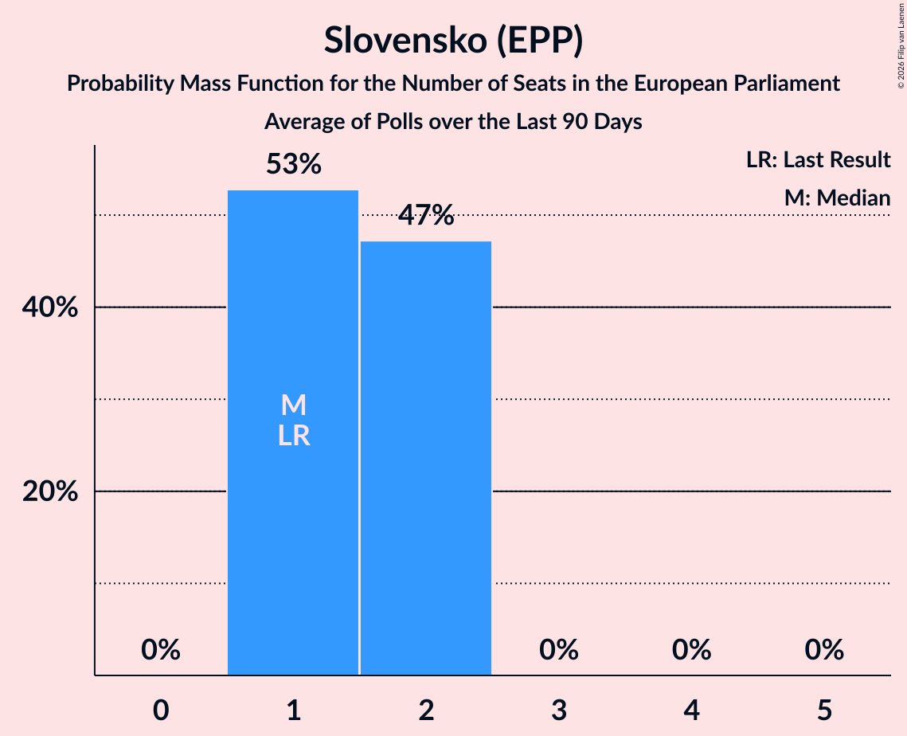

# Slovensko (EPP)

<a href="#voting-intentions">Voting Intentions</a> | <a href="#seats">Seats</a>

## Voting Intentions

Last result: **7.5%** (General Election of 8 June 2024)

### Confidence Intervals

| Period     | Polling firm/Commissioner(s) | Median | 80% Confidence Interval | 90% Confidence Interval | 95% Confidence Interval | 99% Confidence Interval |
|:----------:|:----------------:|:-----------:|:-----------------------:|:-----------------------:|:-----------------------:|:-----------------------:|
| N/A | [Poll Average](average.html) | 7.9% | 6.6–9.4% | 6.2–9.8% | 6.0–10.2% | 5.5–10.8% |
| [8–22 September 2025](2025-09-22-AKO.html) | AKO   TV JOJ | 8.7% | 7.7–10.0% | 7.3–10.3% | 7.1–10.6% | 6.6–11.2% |
| [17–21 September 2025](2025-09-21-Ipsos.html) | Ipsos   Denník N | 7.3% | 6.4–8.4% | 6.1–8.8% | 5.9–9.1% | 5.5–9.6% |
| [10–17 September 2025](2025-09-17-Focus.html) | Focus   360tka.sk | 8.5% | 7.5–9.7% | 7.2–10.0% | 7.0–10.3% | 6.5–10.9% |
| [3–7 September 2025](2025-09-07-NMS.html) | NMS | 7.1% | 6.1–8.2% | 5.9–8.6% | 5.7–8.9% | 5.2–9.4% |
| [15–19 August 2025](2025-08-19-Ipsos.html) | Ipsos   Denník N | 7.5% | 6.5–8.6% | 6.2–8.9% | 6.0–9.2% | 5.6–9.8% |
| [6–19 August 2025](2025-08-19-Focus.html) | Focus   360tka.sk | 8.2% | 7.6–8.9% | 7.4–9.1% | 7.3–9.2% | 7.0–9.5% |
| [5–11 August 2025](2025-08-11-AKO.html) | AKO   TV JOJ | 7.6% | 6.6–8.8% | 6.3–9.1% | 6.1–9.4% | 5.7–10.0% |
| [6–10 August 2025](2025-08-10-NMS.html) | NMS | 8.2% | 7.2–9.4% | 6.9–9.8% | 6.6–10.1% | 6.2–10.7% |
| [8–15 July 2025](2025-07-15-AKO.html) | AKO   TV JOJ | 8.3% | 7.3–9.5% | 7.0–9.9% | 6.7–10.2% | 6.3–10.8% |
| [7–13 July 2025](2025-07-13-Focus.html) | Focus   360tka.sk | 7.5% | 6.5–8.6% | 6.2–8.9% | 6.0–9.2% | 5.6–9.8% |
| [2–7 July 2025](2025-07-07-NMS.html) | NMS | 7.1% | 6.2–8.3% | 5.9–8.6% | 5.7–8.9% | 5.3–9.5% |
| [16–19 June 2025](2025-06-19-Ipsos.html) | Ipsos   Denník N | 7.3% | 6.3–8.4% | 6.1–8.8% | 5.8–9.1% | 5.4–9.6% |
| [11–19 June 2025](2025-06-19-AKO.html) | AKO   TV JOJ | 8.0% | 7.0–9.2% | 6.7–9.6% | 6.5–9.9% | 6.0–10.5% |
| [2–9 June 2025](2025-06-09-Focus.html) | Focus   360tka.sk | 8.5% | N/A | N/A | N/A | N/A |
| [4–8 June 2025](2025-06-08-NMS.html) | NMS | 7.1% | 6.1–8.2% | 5.9–8.6% | 5.6–8.8% | 5.2–9.4% |
| [19–26 May 2025](2025-05-26-AKO.html) | AKO   TV JOJ | 8.8% | 7.7–10.1% | 7.5–10.4% | 7.2–10.7% | 6.7–11.4% |
| [12–18 May 2025](2025-05-18-Focus.html) | Focus   360tka.sk | 7.8% | N/A | N/A | N/A | N/A |
| [12–16 May 2025](2025-05-16-Ipsos.html) | Ipsos   Denník N | 7.3% | 6.4–8.5% | 6.1–8.8% | 5.9–9.1% | 5.4–9.7% |
| [30 April–4 May 2025](2025-05-04-NMS.html) | NMS | 7.7% | 6.8–8.9% | 6.5–9.3% | 6.2–9.6% | 5.8–10.2% |
| [10–17 April 2025](2025-04-17-AKO.html) | AKO   TV JOJ | 8.7% | 7.7–10.0% | 7.3–10.3% | 7.1–10.6% | 6.6–11.2% |
| [1–8 April 2025](2025-04-08-Focus.html) | Focus   360tka.sk | 7.3% | N/A | N/A | N/A | N/A |
| [2–6 April 2025](2025-04-06-NMS.html) | NMS | 6.8% | 5.8–7.9% | 5.6–8.2% | 5.4–8.5% | 5.0–9.1% |
| [11–19 March 2025](2025-03-19-AKO.html) | AKO   TV JOJ | 7.3% | 6.3–8.5% | 6.1–8.8% | 5.8–9.1% | 5.4–9.7% |
| [10–14 March 2025](2025-03-14-Ipsos.html) | Ipsos   Denník N | 5.9% | 5.1–7.0% | 4.8–7.3% | 4.6–7.5% | 4.3–8.1% |
| [5–9 March 2025](2025-03-09-NMS.html) | NMS   TV Markíza | 6.8% | 5.9–7.9% | 5.6–8.2% | 5.4–8.5% | 5.0–9.1% |
| [7–12 February 2025](2025-02-12-Focus.html) | Focus   360tka.sk | 5.6% | 4.8–6.7% | 4.6–7.0% | 4.4–7.3% | 4.0–7.8% |
| [5–12 February 2025](2025-02-12-AKO.html) | AKO   TV JOJ | 6.0% | 5.1–7.1% | 4.9–7.4% | 4.7–7.7% | 4.3–8.2% |
| [5–9 February 2025](2025-02-09-NMS.html) | NMS | 5.8% | 4.9–6.9% | 4.7–7.2% | 4.5–7.4% | 4.1–8.0% |
| [27–31 January 2025](2025-01-31-CSV.html) | CSV | 3.9% | 3.3–4.8% | 3.1–5.0% | 2.9–5.2% | 2.6–5.7% |
| [14–24 January 2025](2025-01-24-AKO.html) | AKO   TV JOJ | 5.4% | 4.6–6.4% | 4.3–6.7% | 4.2–7.0% | 3.8–7.5% |
| [11–17 January 2025](2025-01-17-Ipsos.html) | Ipsos   Denník N | 5.5% | 4.7–6.6% | 4.5–6.8% | 4.3–7.1% | 3.9–7.6% |
| [9–13 January 2025](2025-01-13-NMS.html) | NMS | 6.3% | 5.4–7.4% | 5.2–7.7% | 5.0–8.0% | 4.6–8.5% |
| [16–19 December 2024](2024-12-19-AKO.html) | AKO   TV JOJ | 6.2% | 5.3–7.3% | 5.1–7.6% | 4.9–7.9% | 4.5–8.4% |
| [4–9 December 2024](2024-12-09-NMS.html) | NMS | 6.5% | 5.6–7.6% | 5.3–7.9% | 5.1–8.2% | 4.7–8.8% |
| [2–8 December 2024](2024-12-08-Focus.html) | Focus   360tka | 5.2% | 4.4–6.2% | 4.2–6.5% | 4.0–6.7% | 3.6–7.2% |
| [12–20 November 2024](2024-11-20-AKO.html) | AKO   TV JOJ | 6.6% | 5.7–7.7% | 5.4–8.0% | 5.2–8.3% | 4.8–8.9% |
| [6–13 November 2024](2024-11-13-Focus.html) | Focus   360tka | 3.6% | 3.0–4.5% | 2.8–4.8% | 2.7–5.0% | 2.4–5.4% |
| [7–11 November 2024](2024-11-11-NMS.html) | NMS | 4.7% | 3.9–5.7% | 3.7–6.0% | 3.6–6.2% | 3.2–6.7% |
| [27 October–1 November 2024](2024-11-01-Ipsos.html) | Ipsos   Denník N | 3.6% | 2.9–4.5% | 2.8–4.7% | 2.6–4.9% | 2.3–5.4% |
| [8–17 October 2024](2024-10-17-AKO.html) | AKO   TV JOJ | 0.0% | N/A | N/A | N/A | N/A |
| [2–7 October 2024](2024-10-07-NMS.html) | NMS | 0.0% | N/A | N/A | N/A | N/A |
| [17–26 September 2024](2024-09-26-Focus.html) | Focus | 0.0% | N/A | N/A | N/A | N/A |
| [10–16 September 2024](2024-09-16-AKO.html) | AKO   TV JOJ | 0.0% | N/A | N/A | N/A | N/A |
| [6–10 September 2024](2024-09-10-Ipsos.html) | Ipsos   Denník N | 0.0% | N/A | N/A | N/A | N/A |
| [5–9 September 2024](2024-09-09-NMS.html) | NMS | 0.0% | N/A | N/A | N/A | N/A |
| [8–12 August 2024](2024-08-12-NMS.html) | NMS | 0.0% | N/A | N/A | N/A | N/A |
| [6–12 August 2024](2024-08-12-AKO.html) | AKO   TV JOJ | 0.0% | N/A | N/A | N/A | N/A |
| [9–15 July 2024](2024-07-15-AKO.html) | AKO   TV JOJ | 0.0% | N/A | N/A | N/A | N/A |
| [9–14 July 2024](2024-07-14-Focus.html) | Focus | 0.0% | N/A | N/A | N/A | N/A |
| [4–8 July 2024](2024-07-08-NMS.html) | NMS | 0.0% | N/A | N/A | N/A | N/A |
| [26 June–1 July 2024](2024-07-01-Ipsos.html) | Ipsos   Denník N | 0.0% | N/A | N/A | N/A | N/A |
| [11–18 June 2024](2024-06-18-AKO.html) | AKO   TV JOJ | 0.0% | N/A | N/A | N/A | N/A |
| [5–12 June 2024](2024-06-12-Focus.html) | Focus   TV Markíza | 0.0% | N/A | N/A | N/A | N/A |

### Probability Mass Function

The following table shows the probability mass function per percentage block of voting intentions for the [poll average](average.html) for Slovensko (EPP).

| Voting Intentions | Probability | Accumulated | Special Marks |
|:-----------------:|:-----------:|:-----------:|:-------------:|
| 3.5–4.5% | 0% | 100% |  |
| 4.5–5.5% | 0.6% | 100% |  |
| 5.5–6.5% | 9% | 99.4% |  |
| 6.5–7.5% | 27% | 90% | Last Result |
| 7.5–8.5% | 33% | 63% | Median |
| 8.5–9.5% | 22% | 30% |  |
| 9.5–10.5% | 7% | 8% |  |
| 10.5–11.5% | 1.0% | 1.0% |  |
| 11.5–12.5% | 0.1% | 0.1% |  |
| 12.5–13.5% | 0% | 0% |  |

## Seats

Last result: **1** seats (General Election of 8 June 2024)

### Confidence Intervals

| Period     | Polling firm/Commissioner(s) | Median | 80% Confidence Interval | 90% Confidence Interval | 95% Confidence Interval | 99% Confidence Interval |
|:----------:|:----------------:|:------:|:-----------------------:|:-----------------------:|:-----------------------:|:-----------------------:|
| N/A | [Poll Average](average.html) | 1 | 1–2 | 1–2 | 1–2 | 1–2 |
| [8–22 September 2025](2025-09-22-AKO.html) | AKO   TV JOJ | 2 | 1–2 | 1–2 | 1–2 | 1–2 |
| [17–21 September 2025](2025-09-21-Ipsos.html) | Ipsos   Denník N | 1 | 1–2 | 1–2 | 1–2 | 1–2 |
| [10–17 September 2025](2025-09-17-Focus.html) | Focus   360tka.sk | 1 | 1–2 | 1–2 | 1–2 | 1–2 |
| [3–7 September 2025](2025-09-07-NMS.html) | NMS | 1 | 1 | 1 | 1–2 | 1–2 |
| [15–19 August 2025](2025-08-19-Ipsos.html) | Ipsos   Denník N | 1 | 1 | 1 | 1 | 1–2 |
| [6–19 August 2025](2025-08-19-Focus.html) | Focus   360tka.sk | 1 | 1–2 | 1–2 | 1–2 | 1–2 |
| [5–11 August 2025](2025-08-11-AKO.html) | AKO   TV JOJ | 1 | 1–2 | 1–2 | 1–2 | 1–2 |
| [6–10 August 2025](2025-08-10-NMS.html) | NMS | 1 | 1–2 | 1–2 | 1–2 | 1–2 |
| [8–15 July 2025](2025-07-15-AKO.html) | AKO   TV JOJ | 1 | 1–2 | 1–2 | 1–2 | 1–2 |
| [7–13 July 2025](2025-07-13-Focus.html) | Focus   360tka.sk | 1 | 1 | 1–2 | 1–2 | 1–2 |
| [2–7 July 2025](2025-07-07-NMS.html) | NMS | 1 | 1 | 1 | 1–2 | 1–2 |
| [16–19 June 2025](2025-06-19-Ipsos.html) | Ipsos   Denník N | 1 | 1 | 1–2 | 1–2 | 1–2 |
| [11–19 June 2025](2025-06-19-AKO.html) | AKO   TV JOJ | 1 | 1–2 | 1–2 | 1–2 | 1–2 |
| [2–9 June 2025](2025-06-09-Focus.html) | Focus   360tka.sk |  |  |  |  |  |
| [4–8 June 2025](2025-06-08-NMS.html) | NMS | 1 | 1 | 1 | 1–2 | 1–2 |
| [19–26 May 2025](2025-05-26-AKO.html) | AKO   TV JOJ | 2 | 1–2 | 1–2 | 1–2 | 1–2 |
| [12–18 May 2025](2025-05-18-Focus.html) | Focus   360tka.sk |  |  |  |  |  |
| [12–16 May 2025](2025-05-16-Ipsos.html) | Ipsos   Denník N | 1 | 1 | 1–2 | 1–2 | 1–2 |
| [30 April–4 May 2025](2025-05-04-NMS.html) | NMS | 2 | 1–2 | 1–2 | 1–2 | 1–2 |
| [10–17 April 2025](2025-04-17-AKO.html) | AKO   TV JOJ | 2 | 1–2 | 1–2 | 1–2 | 1–2 |
| [1–8 April 2025](2025-04-08-Focus.html) | Focus   360tka.sk |  |  |  |  |  |
| [2–6 April 2025](2025-04-06-NMS.html) | NMS | 1 | 1 | 1 | 1 | 1–2 |
| [11–19 March 2025](2025-03-19-AKO.html) | AKO   TV JOJ | 1 | 1 | 1 | 1–2 | 1–2 |
| [10–14 March 2025](2025-03-14-Ipsos.html) | Ipsos   Denník N | 1 | 1 | 0–1 | 0–1 | 0–1 |
| [5–9 March 2025](2025-03-09-NMS.html) | NMS   TV Markíza | 1 | 1 | 1–2 | 1–2 | 0–2 |
| [7–12 February 2025](2025-02-12-Focus.html) | Focus   360tka.sk | 1 | 0–1 | 0–1 | 0–1 | 0–1 |
| [5–12 February 2025](2025-02-12-AKO.html) | AKO   TV JOJ | 1 | 0–1 | 0–1 | 0–1 | 0–2 |
| [5–9 February 2025](2025-02-09-NMS.html) | NMS | 1 | 0–1 | 0–1 | 0–1 | 0–2 |
| [27–31 January 2025](2025-01-31-CSV.html) | CSV | 0 | 0 | 0 | 0–1 | 0–1 |
| [14–24 January 2025](2025-01-24-AKO.html) | AKO   TV JOJ | 1 | 0–1 | 0–1 | 0–2 | 0–2 |
| [11–17 January 2025](2025-01-17-Ipsos.html) | Ipsos   Denník N | 1 | 0–1 | 0–1 | 0–1 | 0–2 |
| [9–13 January 2025](2025-01-13-NMS.html) | NMS | 1 | 1 | 1 | 0–1 | 0–2 |
| [16–19 December 2024](2024-12-19-AKO.html) | AKO   TV JOJ | 1 | 1 | 0–1 | 0–2 | 0–2 |
| [4–9 December 2024](2024-12-09-NMS.html) | NMS | 1 | 1 | 1 | 1 | 0–1 |
| [2–8 December 2024](2024-12-08-Focus.html) | Focus   360tka | 1 | 0–1 | 0–1 | 0–1 | 0–1 |
| [12–20 November 2024](2024-11-20-AKO.html) | AKO   TV JOJ | 1 | 1 | 1 | 1 | 0–2 |
| [6–13 November 2024](2024-11-13-Focus.html) | Focus   360tka | 0 | 0 | 0 | 0–1 | 0–1 |
| [7–11 November 2024](2024-11-11-NMS.html) | NMS | 0 | 0–1 | 0–1 | 0–1 | 0–1 |
| [27 October–1 November 2024](2024-11-01-Ipsos.html) | Ipsos   Denník N | 0 | 0 | 0 | 0 | 0–1 |
| [8–17 October 2024](2024-10-17-AKO.html) | AKO   TV JOJ |  |  |  |  |  |
| [2–7 October 2024](2024-10-07-NMS.html) | NMS |  |  |  |  |  |
| [17–26 September 2024](2024-09-26-Focus.html) | Focus |  |  |  |  |  |
| [10–16 September 2024](2024-09-16-AKO.html) | AKO   TV JOJ |  |  |  |  |  |
| [6–10 September 2024](2024-09-10-Ipsos.html) | Ipsos   Denník N |  |  |  |  |  |
| [5–9 September 2024](2024-09-09-NMS.html) | NMS |  |  |  |  |  |
| [8–12 August 2024](2024-08-12-NMS.html) | NMS |  |  |  |  |  |
| [6–12 August 2024](2024-08-12-AKO.html) | AKO   TV JOJ |  |  |  |  |  |
| [9–15 July 2024](2024-07-15-AKO.html) | AKO   TV JOJ |  |  |  |  |  |
| [9–14 July 2024](2024-07-14-Focus.html) | Focus |  |  |  |  |  |
| [4–8 July 2024](2024-07-08-NMS.html) | NMS |  |  |  |  |  |
| [26 June–1 July 2024](2024-07-01-Ipsos.html) | Ipsos   Denník N |  |  |  |  |  |
| [11–18 June 2024](2024-06-18-AKO.html) | AKO   TV JOJ |  |  |  |  |  |
| [5–12 June 2024](2024-06-12-Focus.html) | Focus   TV Markíza |  |  |  |  |  |

### Probability Mass Function

The following table shows the probability mass function per seat for the [poll average](average.html) for Slovensko (EPP).

| Number of Seats | Probability | Accumulated | Special Marks |
|:---------------:|:-----------:|:-----------:|:-------------:|
| 1 | 72% | 100% | Last Result, Median |
| 2 | 28% | 28% |  |
| 3 | 0% | 0% |  |

