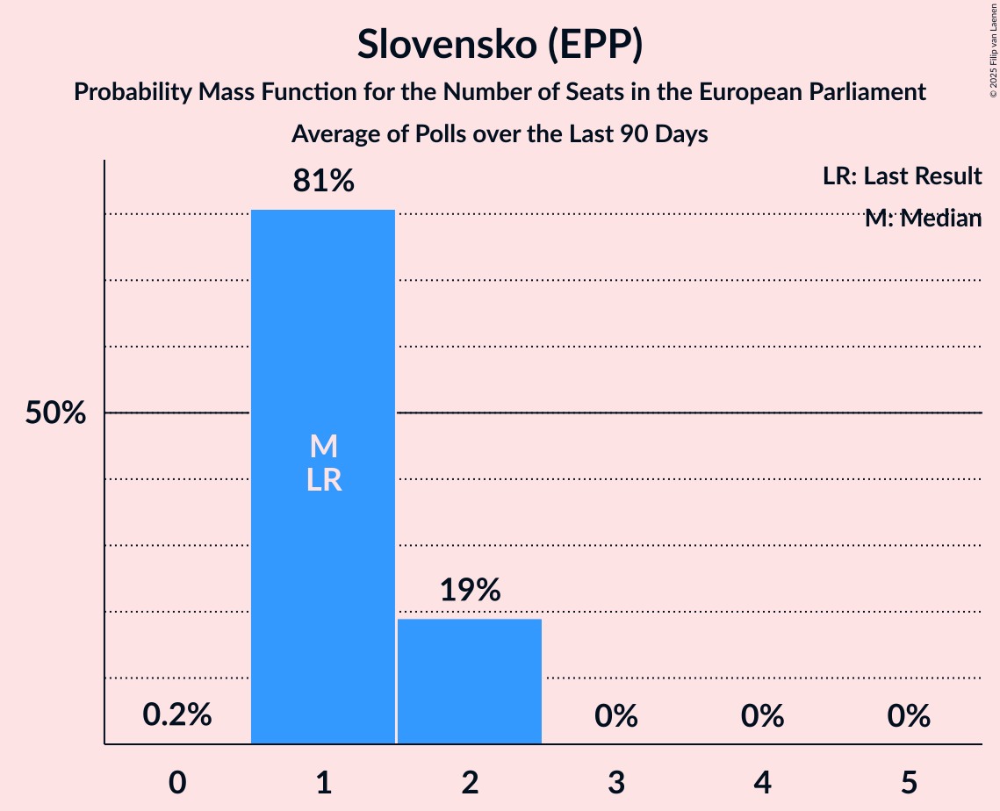

# Slovensko (EPP)

<a href="#voting-intentions">Voting Intentions</a> | <a href="#seats">Seats</a>

## Voting Intentions

Last result: **7.5%** (General Election of 8 June 2024)

### Confidence Intervals

| Period     | Polling firm/Commissioner(s) | Median | 80% Confidence Interval | 90% Confidence Interval | 95% Confidence Interval | 99% Confidence Interval |
|:----------:|:----------------:|:-----------:|:-----------------------:|:-----------------------:|:-----------------------:|:-----------------------:|
| N/A | [Poll Average](average.html) | 5.6% | 3.5–7.1% | 3.2–7.5% | 2.9–7.8% | 2.6–8.4% |
| [16–19 December 2024](2024-12-19-AKO.html) | AKO   TV JOJ | 6.2% | 5.3–7.3% | 5.1–7.6% | 4.9–7.9% | 4.5–8.4% |
| [4–9 December 2024](2024-12-09-NMS.html) | NMS | 6.5% | 5.6–7.6% | 5.3–7.9% | 5.1–8.2% | 4.7–8.8% |
| [2–8 December 2024](2024-12-08-Focus.html) | Focus   360tka | 5.2% | 4.4–6.2% | 4.2–6.5% | 4.0–6.7% | 3.6–7.2% |
| [12–20 November 2024](2024-11-20-AKO.html) | AKO   TV JOJ | 6.6% | 5.7–7.7% | 5.4–8.0% | 5.2–8.3% | 4.8–8.9% |
| [6–13 November 2024](2024-11-13-Focus.html) | Focus   360tka | 3.6% | 3.0–4.5% | 2.8–4.8% | 2.7–5.0% | 2.4–5.4% |
| [7–11 November 2024](2024-11-11-NMS.html) | NMS | 4.7% | 3.9–5.7% | 3.7–6.0% | 3.6–6.2% | 3.2–6.7% |
| [27 October–1 November 2024](2024-11-01-Ipsos.html) | Ipsos   Denník N | 3.6% | 2.9–4.5% | 2.8–4.7% | 2.6–4.9% | 2.3–5.4% |
| [8–17 October 2024](2024-10-17-AKO.html) | AKO   TV JOJ | 0.0% | N/A | N/A | N/A | N/A |
| [2–7 October 2024](2024-10-07-NMS.html) | NMS | 0.0% | N/A | N/A | N/A | N/A |
| [17–26 September 2024](2024-09-26-Focus.html) | Focus | 0.0% | N/A | N/A | N/A | N/A |
| [10–16 September 2024](2024-09-16-AKO.html) | AKO   TV JOJ | 0.0% | N/A | N/A | N/A | N/A |
| [6–10 September 2024](2024-09-10-Ipsos.html) | Ipsos   Denník N | 0.0% | N/A | N/A | N/A | N/A |
| [5–9 September 2024](2024-09-09-NMS.html) | NMS | 0.0% | N/A | N/A | N/A | N/A |
| [8–12 August 2024](2024-08-12-NMS.html) | NMS | 0.0% | N/A | N/A | N/A | N/A |
| [6–12 August 2024](2024-08-12-AKO.html) | AKO   TV JOJ | 0.0% | N/A | N/A | N/A | N/A |
| [9–15 July 2024](2024-07-15-AKO.html) | AKO   TV JOJ | 0.0% | N/A | N/A | N/A | N/A |
| [9–14 July 2024](2024-07-14-Focus.html) | Focus | 0.0% | N/A | N/A | N/A | N/A |
| [4–8 July 2024](2024-07-08-NMS.html) | NMS | 0.0% | N/A | N/A | N/A | N/A |
| [26 June–1 July 2024](2024-07-01-Ipsos.html) | Ipsos   Denník N | 0.0% | N/A | N/A | N/A | N/A |
| [11–18 June 2024](2024-06-18-AKO.html) | AKO   TV JOJ | 0.0% | N/A | N/A | N/A | N/A |
| [5–12 June 2024](2024-06-12-Focus.html) | Focus   TV Markíza | 0.0% | N/A | N/A | N/A | N/A |

### Probability Mass Function

The following table shows the probability mass function per percentage block of voting intentions for the [poll average](average.html) for Slovensko (EPP).

| Voting Intentions | Probability | Accumulated | Special Marks |
|:-----------------:|:-----------:|:-----------:|:-------------:|
| 0.5–1.5% | 0% | 100% |  |
| 1.5–2.5% | 0.5% | 100% |  |
| 2.5–3.5% | 10% | 99.5% |  |
| 3.5–4.5% | 16% | 89% |  |
| 4.5–5.5% | 21% | 73% |  |
| 5.5–6.5% | 30% | 52% | Median |
| 6.5–7.5% | 18% | 22% | Last Result |
| 7.5–8.5% | 4% | 4% |  |
| 8.5–9.5% | 0.3% | 0.3% |  |
| 9.5–10.5% | 0% | 0% |  |

## Seats

Last result: **1** seats (General Election of 8 June 2024)

### Confidence Intervals

| Period     | Polling firm/Commissioner(s) | Median | 80% Confidence Interval | 90% Confidence Interval | 95% Confidence Interval | 99% Confidence Interval |
|:----------:|:----------------:|:------:|:-----------------------:|:-----------------------:|:-----------------------:|:-----------------------:|
| N/A | [Poll Average](average.html) | 1 | 0–1 | 0–1 | 0–1 | 0–2 |
| [16–19 December 2024](2024-12-19-AKO.html) | AKO   TV JOJ | 1 | 1 | 1 | 1 | 0–2 |
| [4–9 December 2024](2024-12-09-NMS.html) | NMS | 1 | 1 | 1 | 1 | 1 |
| [2–8 December 2024](2024-12-08-Focus.html) | Focus   360tka | 1 | 0–1 | 0–1 | 0–1 | 0–1 |
| [12–20 November 2024](2024-11-20-AKO.html) | AKO   TV JOJ | 1 | 1 | 1 | 1 | 0–2 |
| [6–13 November 2024](2024-11-13-Focus.html) | Focus   360tka | 0 | 0 | 0 | 0–1 | 0–1 |
| [7–11 November 2024](2024-11-11-NMS.html) | NMS | 1 | 0–1 | 0–1 | 0–1 | 0–1 |
| [27 October–1 November 2024](2024-11-01-Ipsos.html) | Ipsos   Denník N | 0 | 0 | 0 | 0 | 0–1 |
| [8–17 October 2024](2024-10-17-AKO.html) | AKO   TV JOJ |  |  |  |  |  |
| [2–7 October 2024](2024-10-07-NMS.html) | NMS |  |  |  |  |  |
| [17–26 September 2024](2024-09-26-Focus.html) | Focus |  |  |  |  |  |
| [10–16 September 2024](2024-09-16-AKO.html) | AKO   TV JOJ |  |  |  |  |  |
| [6–10 September 2024](2024-09-10-Ipsos.html) | Ipsos   Denník N |  |  |  |  |  |
| [5–9 September 2024](2024-09-09-NMS.html) | NMS |  |  |  |  |  |
| [8–12 August 2024](2024-08-12-NMS.html) | NMS |  |  |  |  |  |
| [6–12 August 2024](2024-08-12-AKO.html) | AKO   TV JOJ |  |  |  |  |  |
| [9–15 July 2024](2024-07-15-AKO.html) | AKO   TV JOJ |  |  |  |  |  |
| [9–14 July 2024](2024-07-14-Focus.html) | Focus |  |  |  |  |  |
| [4–8 July 2024](2024-07-08-NMS.html) | NMS |  |  |  |  |  |
| [26 June–1 July 2024](2024-07-01-Ipsos.html) | Ipsos   Denník N |  |  |  |  |  |
| [11–18 June 2024](2024-06-18-AKO.html) | AKO   TV JOJ |  |  |  |  |  |
| [5–12 June 2024](2024-06-12-Focus.html) | Focus   TV Markíza |  |  |  |  |  |

### Probability Mass Function

The following table shows the probability mass function per seat for the [poll average](average.html) for Slovensko (EPP).

| Number of Seats | Probability | Accumulated | Special Marks |
|:---------------:|:-----------:|:-----------:|:-------------:|
| 0 | 31% | 100% |  |
| 1 | 68% | 69% | Last Result, Median |
| 2 | 0.6% | 0.6% |  |
| 3 | 0% | 0% |  |

