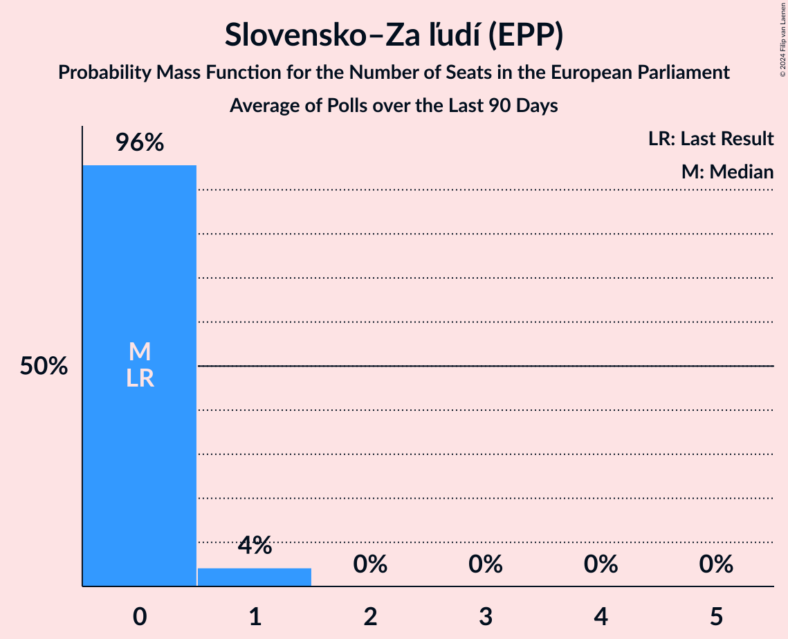

# Slovensko–Za ľudí (EPP)

<a href="#voting-intentions">Voting Intentions</a> | <a href="#seats">Seats</a>

## Voting Intentions

Last result: **0.0%** (General Election of 8 June 2024)

### Confidence Intervals

| Period     | Polling firm/Commissioner(s) | Median | 80% Confidence Interval | 90% Confidence Interval | 95% Confidence Interval | 99% Confidence Interval |
|:----------:|:----------------:|:-----------:|:-----------------------:|:-----------------------:|:-----------------------:|:-----------------------:|
| N/A | [Poll Average](average.html) | 3.3% | 2.4–4.5% | 2.2–4.9% | 2.1–5.1% | 1.8–5.7% |
| [9–15 July 2024](2024-07-15-AKO.html) | AKO   TV JOJ | 2.7% | 2.1–3.5% | 2.0–3.7% | 1.9–3.9% | 1.6–4.3% |
| [4–8 July 2024](2024-07-08-NMS.html) | NMS | 4.2% | 3.5–5.1% | 3.3–5.4% | 3.1–5.6% | 2.8–6.1% |
| [26 June–1 July 2024](2024-07-01-Ipsos.html) | Ipsos   Denník N | 3.1% | 2.5–4.0% | 2.4–4.2% | 2.2–4.4% | 2.0–4.8% |
| [11–18 June 2024](2024-06-18-AKO.html) | AKO   TV JOJ | 3.6% | 2.9–4.5% | 2.8–4.7% | 2.6–5.0% | 2.3–5.4% |
| [5–12 June 2024](2024-06-12-Focus.html) | Focus   TV Markíza | 3.1% | 2.5–3.9% | 2.4–4.2% | 2.2–4.4% | 2.0–4.8% |

### Probability Mass Function

The following table shows the probability mass function per percentage block of voting intentions for the [poll average](average.html) for Slovensko–Za ľudí (EPP).

| Voting Intentions | Probability | Accumulated | Special Marks |
|:-----------------:|:-----------:|:-----------:|:-------------:|
| 0.0–0.5% | 0% | 100% | Last Result |
| 0.5–1.5% | 0.1% | 100% |  |
| 1.5–2.5% | 13% | 99.9% |  |
| 2.5–3.5% | 49% | 87% | Median |
| 3.5–4.5% | 28% | 37% |  |
| 4.5–5.5% | 8% | 9% |  |
| 5.5–6.5% | 0.8% | 0.8% |  |
| 6.5–7.5% | 0% | 0% |  |

## Seats

Last result: **0** seats (General Election of 8 June 2024)

### Confidence Intervals

| Period     | Polling firm/Commissioner(s) | Median | 80% Confidence Interval | 90% Confidence Interval | 95% Confidence Interval | 99% Confidence Interval |
|:----------:|:----------------:|:------:|:-----------------------:|:-----------------------:|:-----------------------:|:-----------------------:|
| N/A | [Poll Average](average.html) | 0 | 0 | 0 | 0 | 0–1 |
| [9–15 July 2024](2024-07-15-AKO.html) | AKO   TV JOJ | 0 | 0 | 0 | 0 | 0 |
| [4–8 July 2024](2024-07-08-NMS.html) | NMS | 0 | 0 | 0–1 | 0–1 | 0–1 |
| [26 June–1 July 2024](2024-07-01-Ipsos.html) | Ipsos   Denník N | 0 | 0 | 0 | 0 | 0 |
| [11–18 June 2024](2024-06-18-AKO.html) | AKO   TV JOJ | 0 | 0 | 0 | 0 | 0–1 |
| [5–12 June 2024](2024-06-12-Focus.html) | Focus   TV Markíza | 0 | 0 | 0 | 0 | 0 |

### Probability Mass Function

The following table shows the probability mass function per seat for the [poll average](average.html) for Slovensko–Za ľudí (EPP).

| Number of Seats | Probability | Accumulated | Special Marks |
|:---------------:|:-----------:|:-----------:|:-------------:|
| 0 | 98% | 100% | Last Result, Median |
| 1 | 2% | 2% |  |
| 2 | 0% | 0% |  |

