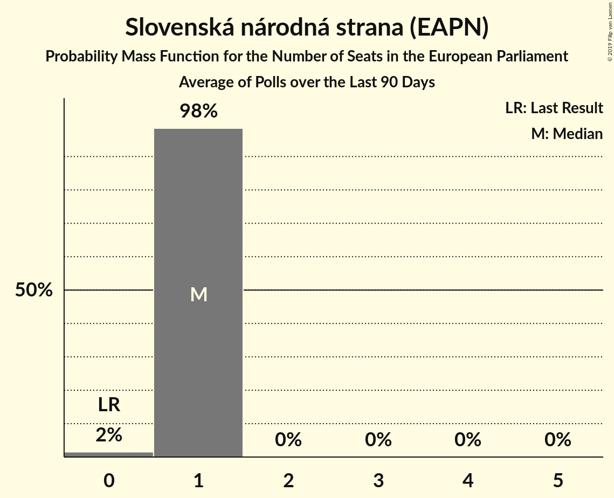

# Slovenská národná strana (EAPN)

<a href="#voting-intentions">Voting Intentions</a> | <a href="#seats">Seats</a>

## Voting Intentions

Last result: **3.6%** (General Election of 24 May 2014)

### Confidence Intervals

| Period     | Polling firm/Commissioner(s) | Median | 80% Confidence Interval | 90% Confidence Interval | 95% Confidence Interval | 99% Confidence Interval |
|:----------:|:----------------:|:-----------:|:-----------------------:|:-----------------------:|:-----------------------:|:-----------------------:|
| N/A | [Poll Average](average.html) | 7.9% | 6.8–9.0% | 6.5–9.4% | 6.3–9.7% | 5.8–10.3% |
| [8–10 May 2019](2019-05-10-AKO.html) | AKO | 8.0% | 7.0–9.2% | 6.7–9.6% | 6.5–9.9% | 6.0–10.5% |
| [29 April–6 May 2019](2019-05-06-AKO.html) | AKO | 8.0% | 7.0–9.2% | 6.7–9.6% | 6.5–9.9% | 6.0–10.5% |
| [8–14 April 2019](2019-04-14-FOCUS.html) | FOCUS | 8.0% | 7.0–9.2% | 6.7–9.5% | 6.5–9.8% | 6.0–10.4% |
| [1–2 April 2019](2019-04-02-AKO.html) | AKO | 7.6% | 6.6–8.8% | 6.3–9.1% | 6.1–9.4% | 5.7–10.0% |
| [1–15 March 2019](2019-03-15-FOCUS.html) | FOCUS | 6.0% | 5.3–6.8% | 5.1–7.0% | 4.9–7.3% | 4.6–7.7% |
| [21–26 February 2019](2019-02-26-FOCUS.html) | FOCUS | 7.5% | N/A | N/A | N/A | N/A |
| [8–12 February 2019](2019-02-12-AKO.html) | AKO | 8.0% | N/A | N/A | N/A | N/A |
| [16–23 January 2019](2019-01-23-FOCUS.html) | FOCUS | 8.0% | N/A | N/A | N/A | N/A |
| [1–9 December 2018](2018-12-09-FOCUS.html) | FOCUS | 9.2% | N/A | N/A | N/A | N/A |
| [27–28 November 2018](2018-11-28-AKO.html) | AKO | 9.3% | N/A | N/A | N/A | N/A |
| [13–15 November 2018](2018-11-15-AKO.html) | AKO | 9.2% | N/A | N/A | N/A | N/A |
| [7–14 November 2018](2018-11-14-FOCUS.html) | FOCUS | 8.0% | N/A | N/A | N/A | N/A |
| [3–8 October 2018](2018-10-08-AKO.html) | AKO | 10.0% | N/A | N/A | N/A | N/A |
| [18–25 September 2018](2018-09-25-FOCUS.html) | FOCUS | 9.2% | N/A | N/A | N/A | N/A |
| [30 August–5 September 2018](2018-09-05-AKO.html) | AKO | 10.9% | N/A | N/A | N/A | N/A |
| [15–17 August 2018](2018-08-17-AKO.html) | AKO | 11.0% | N/A | N/A | N/A | N/A |
| [2–9 August 2018](2018-08-09-FOCUS.html) | FOCUS | 9.4% | N/A | N/A | N/A | N/A |
| [18–21 June 2018](2018-06-21-AKO.html) | AKO | 10.2% | N/A | N/A | N/A | N/A |
| [4–11 June 2018](2018-06-11-FOCUS.html) | FOCUS | 9.8% | N/A | N/A | N/A | N/A |
| [16–21 May 2018](2018-05-21-AKO.html) | AKO | 10.1% | N/A | N/A | N/A | N/A |
| [24–30 April 2018](2018-04-30-FOCUS.html) | FOCUS | 10.1% | N/A | N/A | N/A | N/A |
| [20–24 April 2018](2018-04-24-AKO.html) | AKO | 10.9% | N/A | N/A | N/A | N/A |
| [4–7 April 2018](2018-04-07-AKO.html) | AKO | 10.7% | N/A | N/A | N/A | N/A |
| [7–13 March 2018](2018-03-13-FOCUS.html) | FOCUS | 10.0% | N/A | N/A | N/A | N/A |
| [21–26 February 2018](2018-02-26-AKO.html) | AKO | 9.9% | N/A | N/A | N/A | N/A |
| [23–28 January 2018](2018-01-28-FOCUS.html) | FOCUS | 8.6% | N/A | N/A | N/A | N/A |

### Probability Mass Function

The following table shows the probability mass function per percentage block of voting intentions for the [poll average](average.html) for Slovenská národná strana (EAPN).

| Voting Intentions | Probability | Accumulated | Special Marks |
|:-----------------:|:-----------:|:-----------:|:-------------:|
| 3.5–4.5% | 0% | 100% | Last Result |
| 4.5–5.5% | 0.2% | 100% |  |
| 5.5–6.5% | 6% | 99.8% |  |
| 6.5–7.5% | 30% | 94% |  |
| 7.5–8.5% | 42% | 64% | Median |
| 8.5–9.5% | 18% | 22% |  |
| 9.5–10.5% | 3% | 3% |  |
| 10.5–11.5% | 0.2% | 0.2% |  |
| 11.5–12.5% | 0% | 0% |  |

## Seats

Last result: **0** seats (General Election of 24 May 2014)

### Confidence Intervals

| Period     | Polling firm/Commissioner(s) | Median | 80% Confidence Interval | 90% Confidence Interval | 95% Confidence Interval | 99% Confidence Interval |
|:----------:|:----------------:|:------:|:-----------------------:|:-----------------------:|:-----------------------:|:-----------------------:|
| N/A | [Poll Average](average.html) | 1 | 1 | 1 | 1 | 1 |
| [8–10 May 2019](2019-05-10-AKO.html) | AKO | 1 | 1 | 1 | 1 | 1 |
| [29 April–6 May 2019](2019-05-06-AKO.html) | AKO | 1 | 1 | 1 | 1 | 1 |
| [8–14 April 2019](2019-04-14-FOCUS.html) | FOCUS | 1 | 1 | 1 | 1 | 1 |
| [1–2 April 2019](2019-04-02-AKO.html) | AKO | 1 | 1 | 1 | 1 | 1 |
| [1–15 March 2019](2019-03-15-FOCUS.html) | FOCUS | 1 | 1 | 1 | 0–1 | 0–1 |
| [21–26 February 2019](2019-02-26-FOCUS.html) | FOCUS |  |  |  |  |  |
| [8–12 February 2019](2019-02-12-AKO.html) | AKO |  |  |  |  |  |
| [16–23 January 2019](2019-01-23-FOCUS.html) | FOCUS |  |  |  |  |  |
| [1–9 December 2018](2018-12-09-FOCUS.html) | FOCUS |  |  |  |  |  |
| [27–28 November 2018](2018-11-28-AKO.html) | AKO |  |  |  |  |  |
| [13–15 November 2018](2018-11-15-AKO.html) | AKO |  |  |  |  |  |
| [7–14 November 2018](2018-11-14-FOCUS.html) | FOCUS |  |  |  |  |  |
| [3–8 October 2018](2018-10-08-AKO.html) | AKO |  |  |  |  |  |
| [18–25 September 2018](2018-09-25-FOCUS.html) | FOCUS |  |  |  |  |  |
| [30 August–5 September 2018](2018-09-05-AKO.html) | AKO |  |  |  |  |  |
| [15–17 August 2018](2018-08-17-AKO.html) | AKO |  |  |  |  |  |
| [2–9 August 2018](2018-08-09-FOCUS.html) | FOCUS |  |  |  |  |  |
| [18–21 June 2018](2018-06-21-AKO.html) | AKO |  |  |  |  |  |
| [4–11 June 2018](2018-06-11-FOCUS.html) | FOCUS |  |  |  |  |  |
| [16–21 May 2018](2018-05-21-AKO.html) | AKO |  |  |  |  |  |
| [24–30 April 2018](2018-04-30-FOCUS.html) | FOCUS |  |  |  |  |  |
| [20–24 April 2018](2018-04-24-AKO.html) | AKO |  |  |  |  |  |
| [4–7 April 2018](2018-04-07-AKO.html) | AKO |  |  |  |  |  |
| [7–13 March 2018](2018-03-13-FOCUS.html) | FOCUS |  |  |  |  |  |
| [21–26 February 2018](2018-02-26-AKO.html) | AKO |  |  |  |  |  |
| [23–28 January 2018](2018-01-28-FOCUS.html) | FOCUS |  |  |  |  |  |

### Probability Mass Function

The following table shows the probability mass function per seat for the [poll average](average.html) for Slovenská národná strana (EAPN).

| Number of Seats | Probability | Accumulated | Special Marks |
|:---------------:|:-----------:|:-----------:|:-------------:|
| 0 | 0% | 100% | Last Result |
| 1 | 99.8% | 100% | Median |
| 2 | 0.2% | 0.2% |  |
| 3 | 0% | 0% |  |

