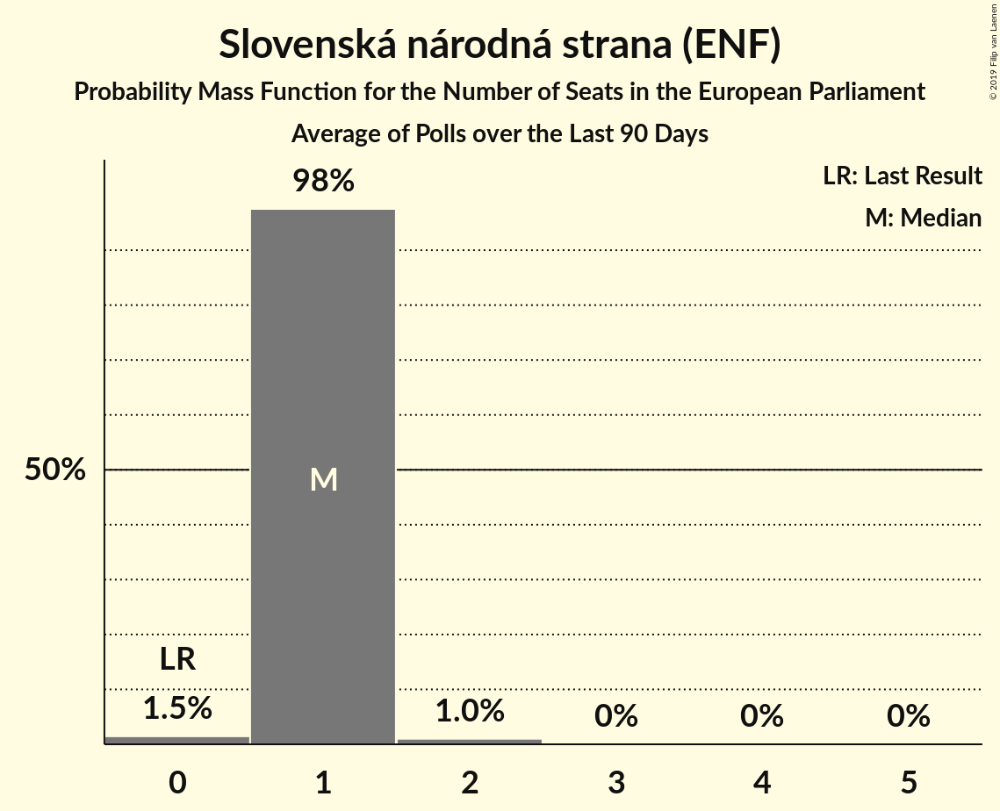

# Slovenská národná strana (ENF)

<a href="#voting-intentions">Voting Intentions</a> | <a href="#seats">Seats</a>

## Voting Intentions

Last result: **3.6%** (General Election of 24 May 2014)

### Confidence Intervals

| Period     | Polling firm/Commissioner(s) | Median | 80% Confidence Interval | 90% Confidence Interval | 95% Confidence Interval | 99% Confidence Interval |
|:----------:|:----------------:|:-----------:|:-----------------------:|:-----------------------:|:-----------------------:|:-----------------------:|
| N/A | [Poll Average](average.html) | 10.0% | 8.8–11.2% | 8.5–11.6% | 8.2–11.9% | 7.7–12.6% |
| [7–13 March 2018](2018-03-13-FOCUS.html) | FOCUS | 10.0% | 8.9–11.3% | 8.6–11.7% | 8.3–12.0% | 7.8–12.6% |
| [21–26 February 2018](2018-02-26-AKO.html) | AKO | 9.9% | 8.8–11.2% | 8.5–11.6% | 8.2–11.9% | 7.7–12.6% |
| [23–28 January 2018](2018-01-28-FOCUS.html) | FOCUS | 8.6% | 7.6–9.8% | 7.3–10.2% | 7.0–10.5% | 6.6–11.1% |

### Probability Mass Function

The following table shows the probability mass function per percentage block of voting intentions for the [poll average](average.html) for Slovenská národná strana (ENF).

| Voting Intentions | Probability | Accumulated | Special Marks |
|:-----------------:|:-----------:|:-----------:|:-------------:|
| 3.5–4.5% | 0% | 100% | Last Result |
| 4.5–5.5% | 0% | 100% |  |
| 5.5–6.5% | 0% | 100% |  |
| 6.5–7.5% | 0.2% | 100% |  |
| 7.5–8.5% | 5% | 99.8% |  |
| 8.5–9.5% | 26% | 95% |  |
| 9.5–10.5% | 40% | 68% | Median |
| 10.5–11.5% | 23% | 28% |  |
| 11.5–12.5% | 5% | 6% |  |
| 12.5–13.5% | 0.6% | 0.6% |  |
| 13.5–14.5% | 0% | 0% |  |

## Seats

Last result: **0** seats (General Election of 24 May 2014)

### Confidence Intervals

| Period     | Polling firm/Commissioner(s) | Median | 80% Confidence Interval | 90% Confidence Interval | 95% Confidence Interval | 99% Confidence Interval |
|:----------:|:----------------:|:------:|:-----------------------:|:-----------------------:|:-----------------------:|:-----------------------:|
| N/A | [Poll Average](average.html) | 1 | 1–2 | 1–2 | 1–2 | 1–2 |
| [7–13 March 2018](2018-03-13-FOCUS.html) | FOCUS | 1 | 1–2 | 1–2 | 1–2 | 1–2 |
| [21–26 February 2018](2018-02-26-AKO.html) | AKO | 1 | 1 | 1 | 1 | 1 |
| [23–28 January 2018](2018-01-28-FOCUS.html) | FOCUS | 1 | 1 | 1 | 1 | 1–2 |

### Probability Mass Function

The following table shows the probability mass function per seat for the [poll average](average.html) for Slovenská národná strana (ENF).

| Number of Seats | Probability | Accumulated | Special Marks |
|:---------------:|:-----------:|:-----------:|:-------------:|
| 0 | 0% | 100% | Last Result |
| 1 | 86% | 100% | Median |
| 2 | 14% | 14% |  |
| 3 | 0% | 0% |  |

