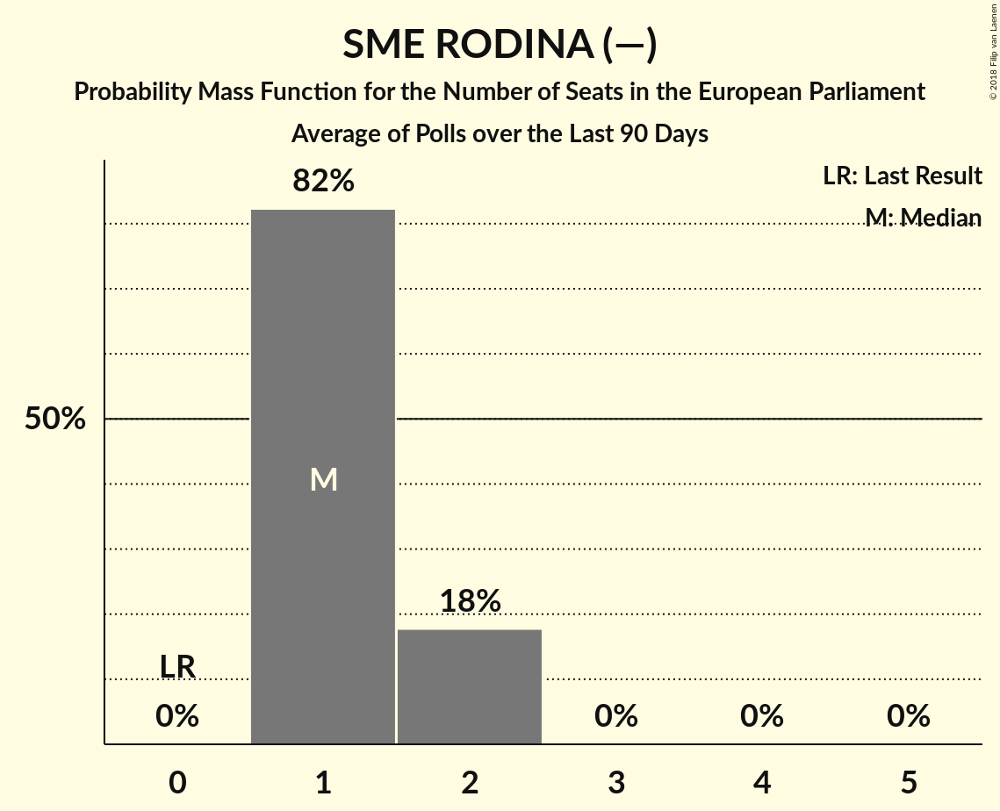

# SME RODINA (—)

<a href="#voting-intentions">Voting Intentions</a> | <a href="#seats">Seats</a>

## Voting Intentions

Last result: **0.0%** (General Election of 24 May 2014)

### Confidence Intervals

| Period     | Polling firm/Commissioner(s) | Median | 80% Confidence Interval | 90% Confidence Interval | 95% Confidence Interval | 99% Confidence Interval |
|:----------:|:----------------:|:-----------:|:-----------------------:|:-----------------------:|:-----------------------:|:-----------------------:|
| N/A | [Poll Average](average.html) | 10.0% | 8.8–11.4% | 8.4–11.8% | 8.1–12.1% | 7.6–12.8% |
| [7–13 March 2018](2018-03-13-FOCUS.html) | FOCUS | 10.4% | 9.2–11.7% | 8.9–12.1% | 8.6–12.4% | 8.1–13.1% |
| [21–26 February 2018](2018-02-26-AKO.html) | AKO | 9.6% | 8.5–10.9% | 8.2–11.3% | 7.9–11.6% | 7.4–12.2% |
| [23–28 January 2018](2018-01-28-FOCUS.html) | FOCUS | 9.0% | N/A | N/A | N/A | N/A |

### Probability Mass Function

The following table shows the probability mass function per percentage block of voting intentions for the [poll average](average.html) for SME RODINA (—).

| Voting Intentions | Probability | Accumulated | Special Marks |
|:-----------------:|:-----------:|:-----------:|:-------------:|
| 0.0–0.5% | 0% | 100% | Last Result |
| 0.5–1.5% | 0% | 100% |  |
| 1.5–2.5% | 0% | 100% |  |
| 2.5–3.5% | 0% | 100% |  |
| 3.5–4.5% | 0% | 100% |  |
| 4.5–5.5% | 0% | 100% |  |
| 5.5–6.5% | 0% | 100% |  |
| 6.5–7.5% | 0.4% | 100% |  |
| 7.5–8.5% | 6% | 99.6% |  |
| 8.5–9.5% | 25% | 94% |  |
| 9.5–10.5% | 37% | 68% | Median |
| 10.5–11.5% | 24% | 31% |  |
| 11.5–12.5% | 7% | 8% |  |
| 12.5–13.5% | 1.0% | 1.0% |  |
| 13.5–14.5% | 0.1% | 0.1% |  |
| 14.5–15.5% | 0% | 0% |  |

## Seats

Last result: **0** seats (General Election of 24 May 2014)

### Confidence Intervals

| Period     | Polling firm/Commissioner(s) | Median | 80% Confidence Interval | 90% Confidence Interval | 95% Confidence Interval | 99% Confidence Interval |
|:----------:|:----------------:|:------:|:-----------------------:|:-----------------------:|:-----------------------:|:-----------------------:|
| N/A | [Poll Average](average.html) | 1 | 1–2 | 1–2 | 1–2 | 1–2 |
| [7–13 March 2018](2018-03-13-FOCUS.html) | FOCUS | 1 | 1–2 | 1–2 | 1–2 | 1–2 |
| [21–26 February 2018](2018-02-26-AKO.html) | AKO | 1 | 1 | 1 | 1 | 1 |
| [23–28 January 2018](2018-01-28-FOCUS.html) | FOCUS |  |  |  |  |  |

### Probability Mass Function

The following table shows the probability mass function per seat for the [poll average](average.html) for SME RODINA (—).

| Number of Seats | Probability | Accumulated | Special Marks |
|:---------------:|:-----------:|:-----------:|:-------------:|
| 0 | 0% | 100% | Last Result |
| 1 | 82% | 100% | Median |
| 2 | 18% | 18% |  |
| 3 | 0% | 0% |  |

