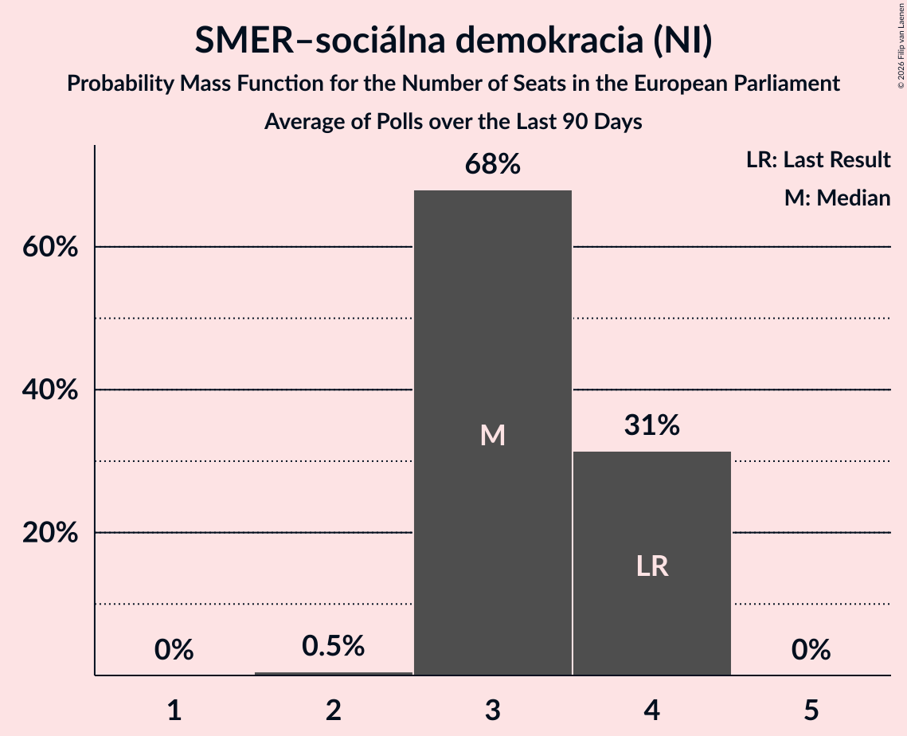

# SMER–sociálna demokracia (NI)

<a href="#voting-intentions">Voting Intentions</a> | <a href="#seats">Seats</a>

## Voting Intentions

Last result: **24.1%** (General Election of 8 June 2024)

### Confidence Intervals

| Period     | Polling firm/Commissioner(s) | Median | 80% Confidence Interval | 90% Confidence Interval | 95% Confidence Interval | 99% Confidence Interval |
|:----------:|:----------------:|:-----------:|:-----------------------:|:-----------------------:|:-----------------------:|:-----------------------:|
| N/A | [Poll Average](average.html) | 18.7% | 17.0–20.7% | 16.6–21.3% | 16.2–21.8% | 15.5–22.8% |
| [17–21 September 2025](2025-09-21-Ipsos.html) | Ipsos   Denník N | 18.4% | 17.0–20.0% | 16.6–20.5% | 16.2–20.9% | 15.5–21.7% |
| [10–17 September 2025](2025-09-17-Focus.html) | Focus   360tka.sk | 18.2% | 16.8–19.8% | 16.4–20.3% | 16.0–20.7% | 15.4–21.4% |
| [3–7 September 2025](2025-09-07-NMS.html) | NMS | 20.1% | 18.5–21.8% | 18.1–22.2% | 17.7–22.7% | 17.0–23.5% |
| [15–19 August 2025](2025-08-19-Ipsos.html) | Ipsos   Denník N | 20.0% | 18.5–21.6% | 18.0–22.1% | 17.7–22.5% | 17.0–23.3% |
| [6–19 August 2025](2025-08-19-Focus.html) | Focus   360tka.sk | 18.7% | 17.8–19.6% | 17.6–19.9% | 17.4–20.1% | 17.0–20.6% |
| [5–11 August 2025](2025-08-11-AKO.html) | AKO   TV JOJ | 18.2% | 16.7–19.8% | 16.3–20.3% | 15.9–20.7% | 15.2–21.5% |
| [6–10 August 2025](2025-08-10-NMS.html) | NMS | 17.4% | 15.9–19.0% | 15.5–19.5% | 15.2–19.9% | 14.5–20.7% |
| [8–15 July 2025](2025-07-15-AKO.html) | AKO   TV JOJ | 19.4% | 17.9–21.1% | 17.4–21.6% | 17.1–22.0% | 16.4–22.8% |
| [7–13 July 2025](2025-07-13-Focus.html) | Focus   360tka.sk | 19.6% | 18.1–21.2% | 17.6–21.7% | 17.3–22.1% | 16.6–22.9% |
| [2–7 July 2025](2025-07-07-NMS.html) | NMS | 18.1% | 16.7–19.8% | 16.2–20.2% | 15.9–20.6% | 15.2–21.4% |
| [16–19 June 2025](2025-06-19-Ipsos.html) | Ipsos   Denník N | 19.7% | 18.2–21.4% | 17.7–21.9% | 17.4–22.3% | 16.7–23.1% |
| [11–19 June 2025](2025-06-19-AKO.html) | AKO   TV JOJ | 19.3% | 17.8–21.0% | 17.3–21.5% | 17.0–21.9% | 16.3–22.7% |
| [2–9 June 2025](2025-06-09-Focus.html) | Focus   360tka.sk | 18.8% | N/A | N/A | N/A | N/A |
| [4–8 June 2025](2025-06-08-NMS.html) | NMS | 19.8% | 18.3–21.5% | 17.9–22.0% | 17.5–22.4% | 16.8–23.3% |
| [19–26 May 2025](2025-05-26-AKO.html) | AKO   TV JOJ | 19.0% | 17.5–20.7% | 17.1–21.1% | 16.7–21.6% | 16.0–22.4% |
| [12–18 May 2025](2025-05-18-Focus.html) | Focus   360tka.sk | 19.1% | N/A | N/A | N/A | N/A |
| [12–16 May 2025](2025-05-16-Ipsos.html) | Ipsos   Denník N | 19.6% | 18.1–21.3% | 17.7–21.8% | 17.3–22.2% | 16.6–23.0% |
| [30 April–4 May 2025](2025-05-04-NMS.html) | NMS | 20.6% | 19.0–22.3% | 18.5–22.7% | 18.2–23.2% | 17.4–24.0% |
| [10–17 April 2025](2025-04-17-AKO.html) | AKO   TV JOJ | 20.5% | 18.9–22.2% | 18.5–22.7% | 18.1–23.1% | 17.4–24.0% |
| [1–8 April 2025](2025-04-08-Focus.html) | Focus   360tka.sk | 19.3% | N/A | N/A | N/A | N/A |
| [2–6 April 2025](2025-04-06-NMS.html) | NMS | 19.9% | 18.4–21.6% | 17.9–22.1% | 17.5–22.5% | 16.8–23.3% |
| [11–19 March 2025](2025-03-19-AKO.html) | AKO   TV JOJ | 21.2% | 19.6–22.9% | 19.2–23.4% | 18.8–23.9% | 18.0–24.7% |
| [10–14 March 2025](2025-03-14-Ipsos.html) | Ipsos   Denník N | 22.1% | 20.5–23.8% | 20.0–24.3% | 19.7–24.7% | 18.9–25.6% |
| [5–9 March 2025](2025-03-09-NMS.html) | NMS   TV Markíza | 21.4% | 19.8–23.1% | 19.3–23.6% | 18.9–24.0% | 18.2–24.9% |
| [7–12 February 2025](2025-02-12-Focus.html) | Focus   360tka.sk | 21.7% | 20.1–23.4% | 19.6–23.9% | 19.3–24.3% | 18.5–25.2% |
| [5–12 February 2025](2025-02-12-AKO.html) | AKO   TV JOJ | 22.1% | 20.5–23.9% | 20.0–24.4% | 19.6–24.8% | 18.9–25.6% |
| [5–9 February 2025](2025-02-09-NMS.html) | NMS | 22.5% | 20.9–24.2% | 20.4–24.7% | 20.0–25.2% | 19.2–26.0% |
| [27–31 January 2025](2025-01-31-CSV.html) | CSV | 22.7% | 21.1–24.4% | 20.7–24.8% | 20.3–25.3% | 19.6–26.1% |
| [14–24 January 2025](2025-01-24-AKO.html) | AKO   TV JOJ | 22.5% | 20.9–24.3% | 20.4–24.8% | 20.0–25.2% | 19.3–26.1% |
| [11–17 January 2025](2025-01-17-Ipsos.html) | Ipsos   Denník N | 22.0% | 20.4–23.7% | 20.0–24.2% | 19.6–24.7% | 18.9–25.5% |
| [9–13 January 2025](2025-01-13-NMS.html) | NMS | 18.4% | 16.9–20.0% | 16.5–20.5% | 16.1–20.9% | 15.4–21.7% |
| [16–19 December 2024](2024-12-19-AKO.html) | AKO   TV JOJ | 20.3% | 18.7–22.0% | 18.3–22.5% | 17.9–22.9% | 17.2–23.7% |
| [4–9 December 2024](2024-12-09-NMS.html) | NMS | 19.1% | 17.6–20.8% | 17.1–21.2% | 16.8–21.7% | 16.1–22.5% |
| [2–8 December 2024](2024-12-08-Focus.html) | Focus   360tka | 20.8% | 19.3–22.5% | 18.8–23.0% | 18.5–23.4% | 17.7–24.3% |
| [12–20 November 2024](2024-11-20-AKO.html) | AKO   TV JOJ | 20.7% | 19.1–22.4% | 18.7–22.9% | 18.3–23.3% | 17.6–24.2% |
| [6–13 November 2024](2024-11-13-Focus.html) | Focus   360tka | 21.9% | 20.3–23.6% | 19.9–24.1% | 19.5–24.6% | 18.7–25.4% |
| [7–11 November 2024](2024-11-11-NMS.html) | NMS | 19.1% | 17.6–20.8% | 17.1–21.2% | 16.8–21.7% | 16.1–22.5% |
| [27 October–1 November 2024](2024-11-01-Ipsos.html) | Ipsos   Denník N | 21.9% | 20.3–23.7% | 19.9–24.2% | 19.5–24.6% | 18.7–25.5% |
| [8–17 October 2024](2024-10-17-AKO.html) | AKO   TV JOJ | 21.3% | 19.7–23.0% | 19.3–23.5% | 18.9–24.0% | 18.1–24.8% |
| [2–7 October 2024](2024-10-07-NMS.html) | NMS | 20.4% | 18.8–22.1% | 18.4–22.6% | 18.0–23.0% | 17.3–23.9% |
| [17–26 September 2024](2024-09-26-Focus.html) | Focus | 23.3% | 21.7–25.1% | 21.2–25.6% | 20.8–26.0% | 20.0–26.9% |
| [10–16 September 2024](2024-09-16-AKO.html) | AKO   TV JOJ | 22.8% | 21.2–24.6% | 20.7–25.1% | 20.3–25.5% | 19.5–26.4% |
| [6–10 September 2024](2024-09-10-Ipsos.html) | Ipsos   Denník N | 25.5% | 23.8–27.3% | 23.3–27.8% | 22.9–28.2% | 22.1–29.1% |
| [5–9 September 2024](2024-09-09-NMS.html) | NMS | 23.9% | 22.2–25.7% | 21.7–26.2% | 21.3–26.6% | 20.6–27.5% |
| [8–12 August 2024](2024-08-12-NMS.html) | NMS | 22.4% | 20.8–24.1% | 20.3–24.6% | 19.9–25.1% | 19.2–25.9% |
| [6–12 August 2024](2024-08-12-AKO.html) | AKO   TV JOJ | 23.6% | 21.9–25.4% | 21.5–25.9% | 21.1–26.3% | 20.3–27.2% |
| [9–15 July 2024](2024-07-15-AKO.html) | AKO   TV JOJ | 23.5% | 21.8–25.3% | 21.4–25.8% | 21.0–26.2% | 20.2–27.1% |
| [9–14 July 2024](2024-07-14-Focus.html) | Focus | 25.7% | 24.0–27.5% | 23.5–28.0% | 23.1–28.5% | 22.3–29.3% |
| [4–8 July 2024](2024-07-08-NMS.html) | NMS | 22.5% | 20.8–24.2% | 20.4–24.7% | 20.0–25.1% | 19.2–26.0% |
| [26 June–1 July 2024](2024-07-01-Ipsos.html) | Ipsos   Denník N | 25.2% | 23.5–27.0% | 23.0–27.5% | 22.6–27.9% | 21.8–28.8% |
| [11–18 June 2024](2024-06-18-AKO.html) | AKO   TV JOJ | 23.8% | N/A | N/A | N/A | N/A |
| [5–12 June 2024](2024-06-12-Focus.html) | Focus   TV Markíza | 24.2% | 22.5–26.0% | 22.1–26.5% | 21.7–26.9% | 20.9–27.8% |

### Probability Mass Function

The following table shows the probability mass function per percentage block of voting intentions for the [poll average](average.html) for SMER–sociálna demokracia (NI).

| Voting Intentions | Probability | Accumulated | Special Marks |
|:-----------------:|:-----------:|:-----------:|:-------------:|
| 13.5–14.5% | 0% | 100% |  |
| 14.5–15.5% | 0.6% | 100% |  |
| 15.5–16.5% | 4% | 99.4% |  |
| 16.5–17.5% | 15% | 95% |  |
| 17.5–18.5% | 26% | 80% |  |
| 18.5–19.5% | 26% | 54% | Median |
| 19.5–20.5% | 17% | 28% |  |
| 20.5–21.5% | 8% | 12% |  |
| 21.5–22.5% | 3% | 4% |  |
| 22.5–23.5% | 0.7% | 0.8% |  |
| 23.5–24.5% | 0.1% | 0.1% | Last Result |
| 24.5–25.5% | 0% | 0% |  |

## Seats

Last result: **4** seats (General Election of 8 June 2024)

### Confidence Intervals

| Period     | Polling firm/Commissioner(s) | Median | 80% Confidence Interval | 90% Confidence Interval | 95% Confidence Interval | 99% Confidence Interval |
|:----------:|:----------------:|:------:|:-----------------------:|:-----------------------:|:-----------------------:|:-----------------------:|
| N/A | [Poll Average](average.html) | 3 | 3–4 | 3–4 | 3–4 | 3–4 |
| [17–21 September 2025](2025-09-21-Ipsos.html) | Ipsos   Denník N | 3 | 3–4 | 3–4 | 3–4 | 3–4 |
| [10–17 September 2025](2025-09-17-Focus.html) | Focus   360tka.sk | 3 | 3–4 | 3–4 | 3–4 | 2–4 |
| [3–7 September 2025](2025-09-07-NMS.html) | NMS | 4 | 3–4 | 3–4 | 3–4 | 3–4 |
| [15–19 August 2025](2025-08-19-Ipsos.html) | Ipsos   Denník N | 3 | 3–4 | 3–4 | 3–4 | 3–4 |
| [6–19 August 2025](2025-08-19-Focus.html) | Focus   360tka.sk | 3 | 3–4 | 3–4 | 3–4 | 3–4 |
| [5–11 August 2025](2025-08-11-AKO.html) | AKO   TV JOJ | 3 | 3–4 | 3–4 | 3–4 | 3–4 |
| [6–10 August 2025](2025-08-10-NMS.html) | NMS | 4 | 3–4 | 3–4 | 3–4 | 3–4 |
| [8–15 July 2025](2025-07-15-AKO.html) | AKO   TV JOJ | 3 | 3–4 | 3–4 | 3–4 | 3–4 |
| [7–13 July 2025](2025-07-13-Focus.html) | Focus   360tka.sk | 4 | 3–4 | 3–4 | 3–4 | 3–4 |
| [2–7 July 2025](2025-07-07-NMS.html) | NMS | 3 | 3–4 | 3–4 | 3–4 | 3–4 |
| [16–19 June 2025](2025-06-19-Ipsos.html) | Ipsos   Denník N | 4 | 3–4 | 3–4 | 3–4 | 3–5 |
| [11–19 June 2025](2025-06-19-AKO.html) | AKO   TV JOJ | 4 | 3–4 | 3–4 | 3–4 | 3–4 |
| [2–9 June 2025](2025-06-09-Focus.html) | Focus   360tka.sk |  |  |  |  |  |
| [4–8 June 2025](2025-06-08-NMS.html) | NMS | 4 | 4 | 3–4 | 3–4 | 3–4 |
| [19–26 May 2025](2025-05-26-AKO.html) | AKO   TV JOJ | 4 | 3–4 | 3–4 | 3–4 | 3–4 |
| [12–18 May 2025](2025-05-18-Focus.html) | Focus   360tka.sk |  |  |  |  |  |
| [12–16 May 2025](2025-05-16-Ipsos.html) | Ipsos   Denník N | 4 | 3–4 | 3–4 | 3–4 | 3–4 |
| [30 April–4 May 2025](2025-05-04-NMS.html) | NMS | 4 | 3–4 | 3–4 | 3–4 | 3–4 |
| [10–17 April 2025](2025-04-17-AKO.html) | AKO   TV JOJ | 4 | 3–4 | 3–4 | 3–4 | 3–4 |
| [1–8 April 2025](2025-04-08-Focus.html) | Focus   360tka.sk |  |  |  |  |  |
| [2–6 April 2025](2025-04-06-NMS.html) | NMS | 4 | 4 | 3–4 | 3–4 | 3–4 |
| [11–19 March 2025](2025-03-19-AKO.html) | AKO   TV JOJ | 4 | 3–4 | 3–4 | 3–4 | 3–4 |
| [10–14 March 2025](2025-03-14-Ipsos.html) | Ipsos   Denník N | 4 | 4–5 | 4–5 | 4–5 | 3–5 |
| [5–9 March 2025](2025-03-09-NMS.html) | NMS   TV Markíza | 4 | 3–4 | 3–4 | 3–4 | 3–5 |
| [7–12 February 2025](2025-02-12-Focus.html) | Focus   360tka.sk | 4 | 4 | 3–4 | 3–4 | 3–5 |
| [5–12 February 2025](2025-02-12-AKO.html) | AKO   TV JOJ | 4 | 4–5 | 4–5 | 3–5 | 3–5 |
| [5–9 February 2025](2025-02-09-NMS.html) | NMS | 4 | 4–5 | 4–5 | 4–5 | 3–5 |
| [27–31 January 2025](2025-01-31-CSV.html) | CSV | 5 | 4–5 | 4–5 | 4–5 | 4–5 |
| [14–24 January 2025](2025-01-24-AKO.html) | AKO   TV JOJ | 4 | 4–5 | 4–5 | 4–5 | 3–5 |
| [11–17 January 2025](2025-01-17-Ipsos.html) | Ipsos   Denník N | 4 | 4–5 | 4–5 | 4–5 | 4–5 |
| [9–13 January 2025](2025-01-13-NMS.html) | NMS | 3 | 3–4 | 3–4 | 3–4 | 3–4 |
| [16–19 December 2024](2024-12-19-AKO.html) | AKO   TV JOJ | 4 | 3–4 | 3–4 | 3–4 | 3–5 |
| [4–9 December 2024](2024-12-09-NMS.html) | NMS | 5 | 4–5 | 4–5 | 4–5 | 3–5 |
| [2–8 December 2024](2024-12-08-Focus.html) | Focus   360tka | 4 | 4 | 3–4 | 3–4 | 3–5 |
| [12–20 November 2024](2024-11-20-AKO.html) | AKO   TV JOJ | 4 | 3–4 | 3–4 | 3–4 | 3–5 |
| [6–13 November 2024](2024-11-13-Focus.html) | Focus   360tka | 4 | 4 | 4–5 | 4–5 | 3–5 |
| [7–11 November 2024](2024-11-11-NMS.html) | NMS | 4 | 3–4 | 3–4 | 3–4 | 3–5 |
| [27 October–1 November 2024](2024-11-01-Ipsos.html) | Ipsos   Denník N | 4 | 4–5 | 4–5 | 4–5 | 4–5 |
| [8–17 October 2024](2024-10-17-AKO.html) | AKO   TV JOJ | 4 | 4 | 4–5 | 4–5 | 3–5 |
| [2–7 October 2024](2024-10-07-NMS.html) | NMS | 4 | 4 | 3–4 | 3–4 | 3–4 |
| [17–26 September 2024](2024-09-26-Focus.html) | Focus | 4 | 4–5 | 4–5 | 4–5 | 4–5 |
| [10–16 September 2024](2024-09-16-AKO.html) | AKO   TV JOJ | 4 | 4–5 | 4–5 | 4–5 | 3–5 |
| [6–10 September 2024](2024-09-10-Ipsos.html) | Ipsos   Denník N | 5 | 4–5 | 4–5 | 4–6 | 4–6 |
| [5–9 September 2024](2024-09-09-NMS.html) | NMS | 5 | 4–5 | 4–6 | 4–6 | 4–6 |
| [8–12 August 2024](2024-08-12-NMS.html) | NMS | 4 | 4–5 | 4–5 | 4–5 | 4–5 |
| [6–12 August 2024](2024-08-12-AKO.html) | AKO   TV JOJ | 4 | 4–5 | 4–5 | 4–5 | 4–5 |
| [9–15 July 2024](2024-07-15-AKO.html) | AKO   TV JOJ | 5 | 4–5 | 4–5 | 4–5 | 4–5 |
| [9–14 July 2024](2024-07-14-Focus.html) | Focus | 5 | 5 | 4–5 | 4–5 | 4–6 |
| [4–8 July 2024](2024-07-08-NMS.html) | NMS | 5 | 4–5 | 4–5 | 4–5 | 4–5 |
| [26 June–1 July 2024](2024-07-01-Ipsos.html) | Ipsos   Denník N | 5 | 5 | 4–5 | 4–5 | 4–6 |
| [11–18 June 2024](2024-06-18-AKO.html) | AKO   TV JOJ |  |  |  |  |  |
| [5–12 June 2024](2024-06-12-Focus.html) | Focus   TV Markíza | 4 | 4–5 | 4–5 | 4–5 | 4–5 |

### Probability Mass Function

The following table shows the probability mass function per seat for the [poll average](average.html) for SMER–sociálna demokracia (NI).

| Number of Seats | Probability | Accumulated | Special Marks |
|:---------------:|:-----------:|:-----------:|:-------------:|
| 2 | 0.2% | 100% |  |
| 3 | 60% | 99.8% | Median |
| 4 | 39% | 39% | Last Result |
| 5 | 0.1% | 0.1% |  |
| 6 | 0% | 0% |  |

