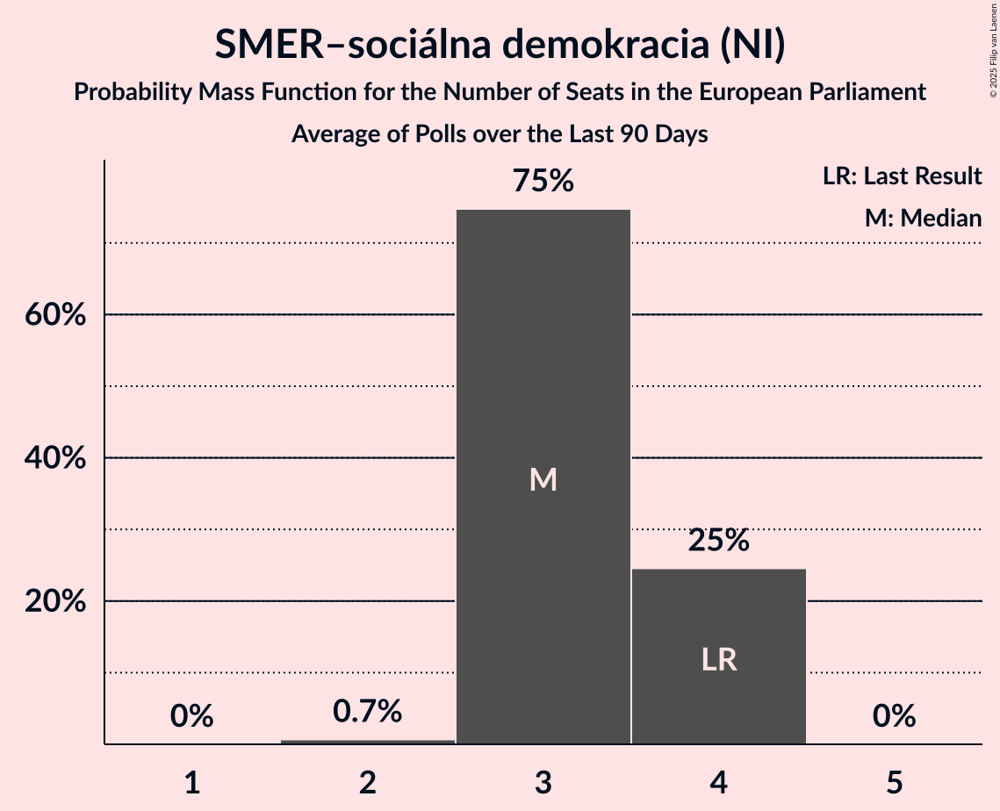

# SMER–sociálna demokracia (NI)

<a href="#voting-intentions">Voting Intentions</a> | <a href="#seats">Seats</a>

## Voting Intentions

Last result: **24.1%** (General Election of 8 June 2024)

### Confidence Intervals

| Period     | Polling firm/Commissioner(s) | Median | 80% Confidence Interval | 90% Confidence Interval | 95% Confidence Interval | 99% Confidence Interval |
|:----------:|:----------------:|:-----------:|:-----------------------:|:-----------------------:|:-----------------------:|:-----------------------:|
| N/A | [Poll Average](average.html) | 24.7% | 22.6–26.8% | 22.0–27.4% | 21.6–27.9% | 20.7–28.9% |
| [6–10 September 2024](2024-09-10-Ipsos.html) | Ipsos   Denník N | 25.5% | 23.8–27.3% | 23.3–27.8% | 22.9–28.2% | 22.1–29.1% |
| [5–9 September 2024](2024-09-09-NMS.html) | NMS | 23.9% | 22.2–25.7% | 21.7–26.2% | 21.3–26.6% | 20.6–27.5% |
| [8–12 August 2024](2024-08-12-NMS.html) | NMS | 22.4% | 20.8–24.1% | 20.3–24.6% | 19.9–25.1% | 19.2–25.9% |
| [6–12 August 2024](2024-08-12-AKO.html) | AKO   TV JOJ | 23.6% | 21.9–25.4% | 21.5–25.9% | 21.1–26.3% | 20.3–27.2% |
| [9–15 July 2024](2024-07-15-AKO.html) | AKO   TV JOJ | 23.5% | 21.8–25.3% | 21.4–25.8% | 21.0–26.2% | 20.2–27.1% |
| [9–14 July 2024](2024-07-14-Focus.html) | Focus | 25.7% | 24.0–27.5% | 23.5–28.0% | 23.1–28.5% | 22.3–29.3% |
| [4–8 July 2024](2024-07-08-NMS.html) | NMS | 22.5% | 20.8–24.2% | 20.4–24.7% | 20.0–25.1% | 19.2–26.0% |
| [26 June–1 July 2024](2024-07-01-Ipsos.html) | Ipsos   Denník N | 25.2% | 23.5–27.0% | 23.0–27.5% | 22.6–27.9% | 21.8–28.8% |
| [11–18 June 2024](2024-06-18-AKO.html) | AKO   TV JOJ | 23.8% | N/A | N/A | N/A | N/A |
| [5–12 June 2024](2024-06-12-Focus.html) | Focus   TV Markíza | 24.2% | 22.5–26.0% | 22.1–26.5% | 21.7–26.9% | 20.9–27.8% |

### Probability Mass Function

The following table shows the probability mass function per percentage block of voting intentions for the [poll average](average.html) for SMER–sociálna demokracia (NI).

| Voting Intentions | Probability | Accumulated | Special Marks |
|:-----------------:|:-----------:|:-----------:|:-------------:|
| 18.5–19.5% | 0% | 100% |  |
| 19.5–20.5% | 0.3% | 100% |  |
| 20.5–21.5% | 2% | 99.7% |  |
| 21.5–22.5% | 7% | 98% |  |
| 22.5–23.5% | 15% | 90% |  |
| 23.5–24.5% | 22% | 75% | Last Result |
| 24.5–25.5% | 22% | 53% | Median |
| 25.5–26.5% | 17% | 31% |  |
| 26.5–27.5% | 9% | 13% |  |
| 27.5–28.5% | 3% | 4% |  |
| 28.5–29.5% | 0.8% | 0.9% |  |
| 29.5–30.5% | 0.1% | 0.1% |  |
| 30.5–31.5% | 0% | 0% |  |

## Seats

Last result: **4** seats (General Election of 8 June 2024)

### Confidence Intervals

| Period     | Polling firm/Commissioner(s) | Median | 80% Confidence Interval | 90% Confidence Interval | 95% Confidence Interval | 99% Confidence Interval |
|:----------:|:----------------:|:------:|:-----------------------:|:-----------------------:|:-----------------------:|:-----------------------:|
| N/A | [Poll Average](average.html) | 5 | 4–5 | 4–5 | 4–6 | 4–6 |
| [6–10 September 2024](2024-09-10-Ipsos.html) | Ipsos   Denník N | 5 | 4–5 | 4–5 | 4–6 | 4–6 |
| [5–9 September 2024](2024-09-09-NMS.html) | NMS | 5 | 4–5 | 4–6 | 4–6 | 4–6 |
| [8–12 August 2024](2024-08-12-NMS.html) | NMS | 4 | 4–5 | 4–5 | 4–5 | 4–5 |
| [6–12 August 2024](2024-08-12-AKO.html) | AKO   TV JOJ | 4 | 4–5 | 4–5 | 4–5 | 4–5 |
| [9–15 July 2024](2024-07-15-AKO.html) | AKO   TV JOJ | 5 | 4–5 | 4–5 | 4–5 | 4–5 |
| [9–14 July 2024](2024-07-14-Focus.html) | Focus | 5 | 5 | 4–5 | 4–5 | 4–6 |
| [4–8 July 2024](2024-07-08-NMS.html) | NMS | 5 | 4–5 | 4–5 | 4–5 | 4–5 |
| [26 June–1 July 2024](2024-07-01-Ipsos.html) | Ipsos   Denník N | 5 | 5 | 4–5 | 4–5 | 4–6 |
| [11–18 June 2024](2024-06-18-AKO.html) | AKO   TV JOJ |  |  |  |  |  |
| [5–12 June 2024](2024-06-12-Focus.html) | Focus   TV Markíza | 4 | 4–5 | 4–5 | 4–5 | 4–5 |

### Probability Mass Function

The following table shows the probability mass function per seat for the [poll average](average.html) for SMER–sociálna demokracia (NI).

| Number of Seats | Probability | Accumulated | Special Marks |
|:---------------:|:-----------:|:-----------:|:-------------:|
| 4 | 27% | 100% | Last Result |
| 5 | 70% | 73% | Median |
| 6 | 3% | 3% |  |
| 7 | 0% | 0% |  |

