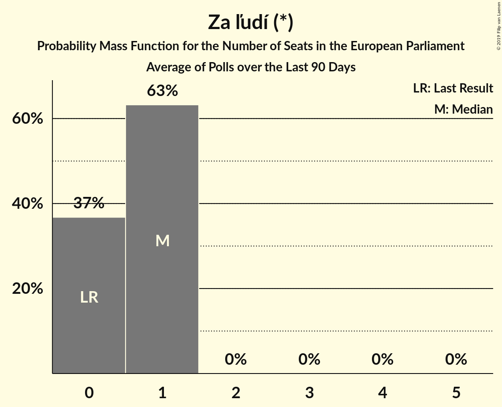

# Za ľudí (*)

<a href="#voting-intentions">Voting Intentions</a> | <a href="#seats">Seats</a>

## Voting Intentions

Last result: **0.0%** (General Election of 25 May 2019)

### Confidence Intervals

| Period     | Polling firm/Commissioner(s) | Median | 80% Confidence Interval | 90% Confidence Interval | 95% Confidence Interval | 99% Confidence Interval |
|:----------:|:----------------:|:-----------:|:-----------------------:|:-----------------------:|:-----------------------:|:-----------------------:|
| N/A | [Poll Average](average.html) | 5.3% | 4.5–6.2% | 4.3–6.4% | 4.1–6.7% | 3.8–7.1% |
| [11–18 June 2019](2019-06-18-Polis.html) | Polis | 5.2% | 4.5–6.2% | 4.3–6.4% | 4.1–6.7% | 3.8–7.1% |
| [1–11 June 2019](2019-06-11-FOCUS.html) | FOCUS | 0.0% | N/A | N/A | N/A | N/A |
| [28–31 May 2019](2019-05-31-AKO.html) | AKO | 0.0% | N/A | N/A | N/A | N/A |

### Probability Mass Function

The following table shows the probability mass function per percentage block of voting intentions for the [poll average](average.html) for Za ľudí (*).

| Voting Intentions | Probability | Accumulated | Special Marks |
|:-----------------:|:-----------:|:-----------:|:-------------:|
| 0.0–0.5% | 0% | 100% | Last Result |
| 0.5–1.5% | 0% | 100% |  |
| 1.5–2.5% | 0% | 100% |  |
| 2.5–3.5% | 0.1% | 100% |  |
| 3.5–4.5% | 12% | 99.9% |  |
| 4.5–5.5% | 53% | 88% | Median |
| 5.5–6.5% | 31% | 35% |  |
| 6.5–7.5% | 3% | 4% |  |
| 7.5–8.5% | 0.1% | 0.1% |  |
| 8.5–9.5% | 0% | 0% |  |

## Seats

Last result: **0** seats (General Election of 25 May 2019)

### Confidence Intervals

| Period     | Polling firm/Commissioner(s) | Median | 80% Confidence Interval | 90% Confidence Interval | 95% Confidence Interval | 99% Confidence Interval |
|:----------:|:----------------:|:------:|:-----------------------:|:-----------------------:|:-----------------------:|:-----------------------:|
| N/A | [Poll Average](average.html) | 1 | 0–1 | 0–1 | 0–1 | 0–1 |
| [11–18 June 2019](2019-06-18-Polis.html) | Polis | 1 | 0–1 | 0–1 | 0–1 | 0–1 |
| [1–11 June 2019](2019-06-11-FOCUS.html) | FOCUS |  |  |  |  |  |
| [28–31 May 2019](2019-05-31-AKO.html) | AKO |  |  |  |  |  |

### Probability Mass Function

The following table shows the probability mass function per seat for the [poll average](average.html) for Za ľudí (*).

| Number of Seats | Probability | Accumulated | Special Marks |
|:---------------:|:-----------:|:-----------:|:-------------:|
| 0 | 37% | 100% | Last Result |
| 1 | 63% | 63% | Median |
| 2 | 0% | 0% |  |

