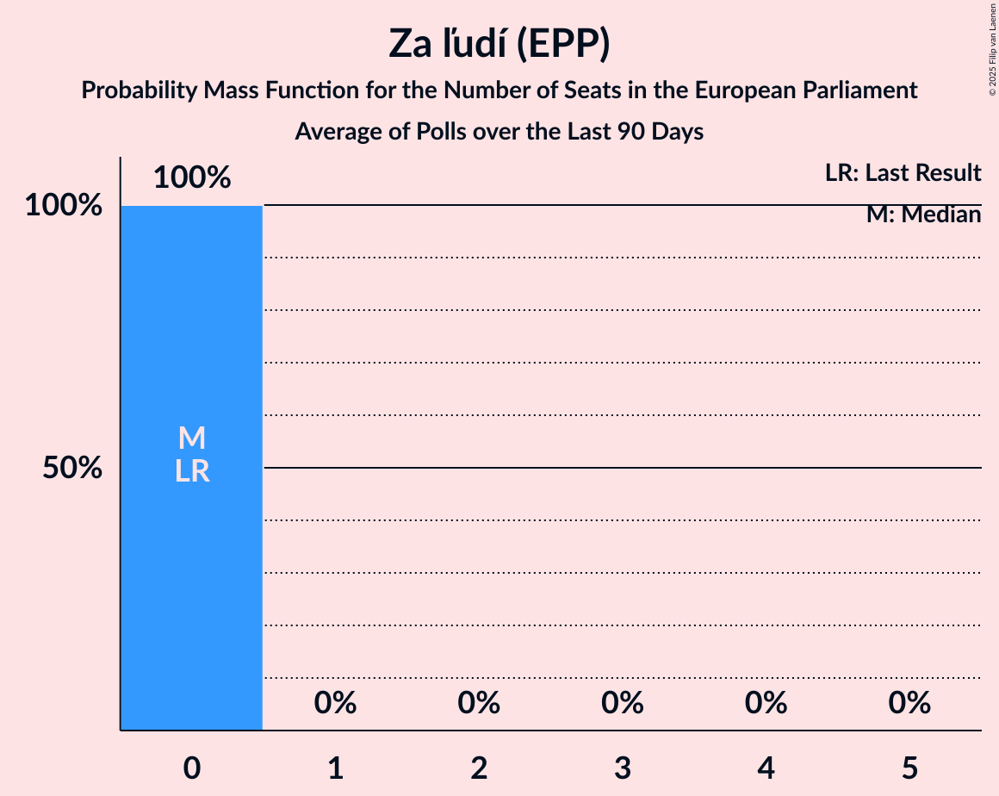

# Za ľudí (EPP)

<a href="#voting-intentions">Voting Intentions</a> | <a href="#seats">Seats</a>

## Voting Intentions

Last result: **0.0%** (General Election of 25 May 2019)

### Confidence Intervals

| Period     | Polling firm/Commissioner(s) | Median | 80% Confidence Interval | 90% Confidence Interval | 95% Confidence Interval | 99% Confidence Interval |
|:----------:|:----------------:|:-----------:|:-----------------------:|:-----------------------:|:-----------------------:|:-----------------------:|
| N/A | [Poll Average](average.html) | 8.8% | 6.3–12.3% | 5.9–12.9% | 5.6–13.4% | 5.1–14.3% |
| [15–22 October 2019](2019-10-22-Focus.html) | Focus | 9.5% | 8.4–10.8% | 8.1–11.1% | 7.8–11.5% | 7.4–12.1% |
| [7–10 October 2019](2019-10-10-AKO.html) | AKO | 12.0% | 10.8–13.4% | 10.4–13.8% | 10.1–14.2% | 9.6–14.9% |
| [18–25 September 2019](2019-09-25-AKO.html) | AKO | 9.1% | 8.0–10.4% | 7.7–10.7% | 7.5–11.1% | 7.0–11.7% |
| [11–17 September 2019](2019-09-17-FOCUS.html) | FOCUS | 6.5% | 5.6–7.6% | 5.4–7.9% | 5.2–8.2% | 4.8–8.8% |
| [26–29 August 2019](2019-08-29-AKO.html) | AKO | 8.8% | 7.7–10.1% | 7.5–10.4% | 7.2–10.7% | 6.7–11.4% |
| [12 August 2019](2019-08-12-MVK.html) | MVK | 7.9% | 6.9–9.1% | 6.6–9.4% | 6.4–9.7% | 5.9–10.3% |
| [1–7 August 2019](2019-08-07-FOCUS.html) | FOCUS | 5.0% | N/A | N/A | N/A | N/A |
| [19–25 June 2019](2019-06-25-FOCUS.html) | FOCUS | 5.2% | N/A | N/A | N/A | N/A |
| [11–18 June 2019](2019-06-18-Polis.html) | Polis | 5.2% | 4.5–6.2% | 4.3–6.4% | 4.1–6.7% | 3.8–7.1% |
| [1–11 June 2019](2019-06-11-FOCUS.html) | FOCUS | 0.0% | N/A | N/A | N/A | N/A |
| [28–31 May 2019](2019-05-31-AKO.html) | AKO | 0.0% | N/A | N/A | N/A | N/A |

### Probability Mass Function

The following table shows the probability mass function per percentage block of voting intentions for the [poll average](average.html) for Za ľudí (EPP).

| Voting Intentions | Probability | Accumulated | Special Marks |
|:-----------------:|:-----------:|:-----------:|:-------------:|
| 0.0–0.5% | 0% | 100% | Last Result |
| 0.5–1.5% | 0% | 100% |  |
| 1.5–2.5% | 0% | 100% |  |
| 2.5–3.5% | 0% | 100% |  |
| 3.5–4.5% | 0% | 100% |  |
| 4.5–5.5% | 2% | 100% |  |
| 5.5–6.5% | 11% | 98% |  |
| 6.5–7.5% | 17% | 87% |  |
| 7.5–8.5% | 17% | 70% |  |
| 8.5–9.5% | 15% | 53% | Median |
| 9.5–10.5% | 11% | 38% |  |
| 10.5–11.5% | 9% | 27% |  |
| 11.5–12.5% | 10% | 18% |  |
| 12.5–13.5% | 6% | 8% |  |
| 13.5–14.5% | 2% | 2% |  |
| 14.5–15.5% | 0.2% | 0.3% |  |
| 15.5–16.5% | 0% | 0% |  |

## Seats

Last result: **0** seats (General Election of 25 May 2019)

### Confidence Intervals

| Period     | Polling firm/Commissioner(s) | Median | 80% Confidence Interval | 90% Confidence Interval | 95% Confidence Interval | 99% Confidence Interval |
|:----------:|:----------------:|:------:|:-----------------------:|:-----------------------:|:-----------------------:|:-----------------------:|
| N/A | [Poll Average](average.html) | 1 | 1–2 | 1–2 | 0–2 | 0–2 |
| [15–22 October 2019](2019-10-22-Focus.html) | Focus | 1 | 1 | 1–2 | 1–2 | 1–2 |
| [7–10 October 2019](2019-10-10-AKO.html) | AKO | 2 | 1–2 | 1–2 | 1–2 | 1–2 |
| [18–25 September 2019](2019-09-25-AKO.html) | AKO | 1 | 1 | 1 | 1 | 1–2 |
| [11–17 September 2019](2019-09-17-FOCUS.html) | FOCUS | 1 | 0–1 | 0–1 | 0–1 | 0–1 |
| [26–29 August 2019](2019-08-29-AKO.html) | AKO | 1 | 1 | 1–2 | 1–2 | 1–2 |
| [12 August 2019](2019-08-12-MVK.html) | MVK | 1 | 1 | 1 | 1–2 | 1–2 |
| [1–7 August 2019](2019-08-07-FOCUS.html) | FOCUS |  |  |  |  |  |
| [19–25 June 2019](2019-06-25-FOCUS.html) | FOCUS |  |  |  |  |  |
| [11–18 June 2019](2019-06-18-Polis.html) | Polis | 1 | 0–1 | 0–1 | 0–1 | 0–1 |
| [1–11 June 2019](2019-06-11-FOCUS.html) | FOCUS |  |  |  |  |  |
| [28–31 May 2019](2019-05-31-AKO.html) | AKO |  |  |  |  |  |

### Probability Mass Function

The following table shows the probability mass function per seat for the [poll average](average.html) for Za ľudí (EPP).

| Number of Seats | Probability | Accumulated | Special Marks |
|:---------------:|:-----------:|:-----------:|:-------------:|
| 0 | 3% | 100% | Last Result |
| 1 | 74% | 97% | Median |
| 2 | 23% | 23% |  |
| 3 | 0% | 0% |  |

